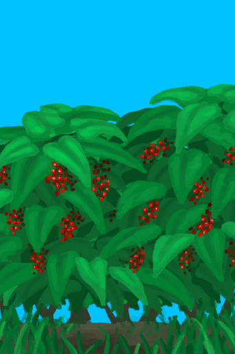

# 咖啡丛  
> 我可以从这里采集咖啡豆。  
   
> 世界上最受欢迎的饮料！  <b>咖啡植株</b>可以在<b>丛林高地</b>中找到，也可以在农田中种植。  收获它们的<b>浆果</b>并从中提取<b>咖啡豆</b>。 然后，直接在火上<b>烘烤咖啡豆</b>，然后<b>将它们浸泡在开水中</b>，为自己冲泡一些香浓又提神的<b>咖啡</b>。  
  
  咖啡丛  |   图片   
 ----  |  ----:   
   |     
  
## 获取来源  
来源  |  操作  
----  |  ----  
[咖啡田](CropPlotCoffee.md)  |  转化  
[丛林高地(区域)](JungleHighlands.md)  |  探索  
## 动作  
动作  |  耗时  |  条件  |  变化  |  状态  
----  |  ----  |  ----  |  ----  |  ----  
采集 [手部动作](HandAction.md)  |  30分  |  [光亮](Light.md): 10-100  |  ** 自身：** 消失 使用次数  -1  ** 获得： ** ** [Coffee] **   [咖啡果](CoffeeBerries.md)(+2～+3) 基础权重：1  |  [药草学(技能)](Skill_Herbology.md)+0.5  

