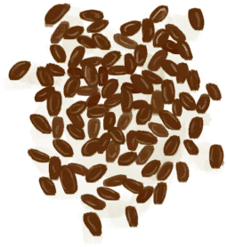

# 烤咖啡豆  
> 倒入热水然后铛啷啷！咖啡！  
   
> 世界上最受欢迎的饮料！  <b>咖啡植株</b>可以在<b>丛林高地</b>中找到，也可以在农田中种植。  收获它们的<b>浆果</b>并从中提取<b>咖啡豆</b>。 然后，直接在火上<b>烘烤咖啡豆</b>，然后<b>将它们浸泡在开水中</b>，为自己冲泡一些香浓又提神的<b>咖啡</b>。  
  
<table class="table table-bordered"><tbody><tr ><td  style="width:80%;text-align:left;vertical-align:top;" >**重量：**100  **标签：**	[“可烹饪的”](tag_Cookable.md)</td><td  style="width:20%;text-align:left;vertical-align:top;" >

</td></tr></tbody></tbody></table>  
  
## 获取来源  
<table class="table table-bordered"><thead><tr ><th  style="text-align:left;vertical-align:top;" >来源</th><th  style="text-align:left;vertical-align:top;" >操作</th></tr></thead><tr ><td  style="text-align:left;vertical-align:top;" >[

[咖啡豆](CoffeeBeans.md)](CoffeeBeans.md) , [

[营火](Campfire.md)](Campfire.md)</td><td  style="text-align:left;vertical-align:top;" >咖啡</td></tr><tr ><td  style="text-align:left;vertical-align:top;" >[

[咖啡豆](CoffeeBeans.md)](CoffeeBeans.md) , [

[粘土火盆](ClayFirePit.md)](ClayFirePit.md)</td><td  style="text-align:left;vertical-align:top;" >咖啡</td></tr><tr ><td  style="text-align:left;vertical-align:top;" >[

[咖啡豆](CoffeeBeans.md)](CoffeeBeans.md) , [

[火堆](Fire.md)](Fire.md)</td><td  style="text-align:left;vertical-align:top;" >咖啡</td></tr><tr ><td  style="text-align:left;vertical-align:top;" >[

[咖啡豆](CoffeeBeans.md)](CoffeeBeans.md) , [

[瓦斯炉(开)](GasCookerOn.md)](GasCookerOn.md)</td><td  style="text-align:left;vertical-align:top;" >咖啡</td></tr><tr ><td  style="text-align:left;vertical-align:top;" >[

[咖啡豆](CoffeeBeans.md)](CoffeeBeans.md) , [

[火炉](Stove.md)](Stove.md)</td><td  style="text-align:left;vertical-align:top;" >咖啡</td></tr></tbody></table>  
  
## 可拖入  
<table class="table table-bordered"><thead><tr ><th  style="text-align:left;vertical-align:top;" >使用</th><th  style="text-align:left;vertical-align:top;" >动作</th><th  style="text-align:left;vertical-align:top;" >耗时</th><th  style="text-align:left;vertical-align:top;" >条件</th><th  style="text-align:left;vertical-align:top;" >变化</th><th  style="text-align:left;vertical-align:top;" >玩家状态</th></tr></thead><tr ><td  style="text-align:left;vertical-align:top;" >[

[开水](LQ_WaterBoiling.md)](LQ_WaterBoiling.md)</td><td  style="text-align:left;vertical-align:top;" >制作咖啡 </td><td  style="text-align:left;vertical-align:top;" >-</td><td  style="text-align:left;vertical-align:top;" ></td><td  style="text-align:left;vertical-align:top;" >** 自身: ** →消失  ** 使用物: ** → [

[咖啡](LQ_Coffee.md)](LQ_Coffee.md)</td><td  style="text-align:left;vertical-align:top;" ></td></tr></tbody></table>  
  

