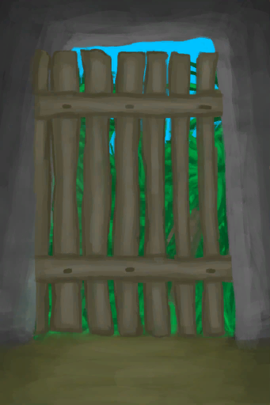

# 一只海鸥！  
> 它在翻你的东西！它可能吃掉任何你没放在容器里的食物！  
  
<table class="table table-bordered" data-toggle="table"  data-show-header="false"><thead style="display:none"><tr ><th  style="width:50%;text-align:left;vertical-align:top;"  >title</th><th  style="width:50%;text-align:left;vertical-align:top;"  ></th></tr></thead><tr ><td  style="width:50%;text-align:left;vertical-align:top;"  >
<b>触发条件: </b>
[海鸥入侵计数器](SeagullRaidCounter.md): <b>192-192</b>, [

[距离](Distance.md)](Distance.md): <b>0-500</b>，[

[遮蔽](Sheltered.md)](Sheltered.md): <b>0-0</b>, ~~[

[门](Imp_Door.md)](Imp_Door.md)存在于手中/面板~~, [“饲料”](tag_Feed.md)存在于面板/不在容器中，[“可能出现海鸥”](tag_Coastal.md)存在于手中/面板 
<b>触发后: </b>
[海鸥入侵计数器](SeagullRaidCounter.md)<b>-192</b> <b>被以下卡牌阻止：</b>[

[门](Imp_Door.md)](Imp_Door.md)</td><td  style="width:50%;text-align:left;vertical-align:top;"  >

<a href="Combat_EventSeagull_1_Raid.md" style="color:black">一只海鸥！</a>

</td></tr></tbody></table>  
  
## 动作  

<table><tr><td rowspan="2" style="width:200px;text-align:center;font-size:1.3em;font-weight:bold">

不管它

15分

</td><td></td></tr><tr><td><b>自身：</b>→消失</td></tr><tr><td colspan="2"><b>相关卡牌变化：</b>地上所有[“饲料”](tag_Feed.md)</td></tr><tr><td colspan="2"><b>状态变化：</b>[

[情绪](Morale.md)](Morale.md)<b>-10</b></td></tr></table>
  

<table><tr><td rowspan="2" style="width:200px;text-align:center;font-size:1.3em;font-weight:bold">

攻击它

</td><td></td></tr><tr><td><b>自身：</b>→消失</td></tr><tr><td colspan="2"><b>状态变化：</b>[

[潜行(技能)](Skill_Stealth.md)](Skill_Stealth.md)<b>+0.5</b></td></tr><tr><td colspan="2">[

[海鸥来袭](CombatRaidingSeagull.md)](CombatRaidingSeagull.md)<b>+1</b></td></tr></table>
  
  
  

