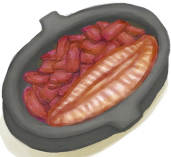

# 烹饪锅  
> 可以用来准备高级料理的烹饪锅  
   
> 用<b>粘土和抗裂剂</b>制作，在<b>窑炉</b>中烧制而成。  非常适合用于烹饪的密封锅，是许多<b>高级烹饪食谱</b>的基础。  也可以用作密闭的<b>液体容器</b>。  
  
<table class="table table-bordered"><tbody><tr ><td  style="width:80%;text-align:left;vertical-align:top;" >**重量：**250  **标签：**	[“储水容器”](tag_WaterContainer.md), [“粘土”](tag_Clay.md), [“可烹饪的”](tag_Cookable.md), [“容器（密封）”](tag_ContainerSealed.md), [“沉重的”](tag_Heavy.md), [“可泼溅的”](tag_Spillable.md)  **储水量：**600</td><td  style="width:20%;text-align:left;vertical-align:top;" >

</td></tr></tbody></tbody></table>  
  
## 获取来源  
<table class="table table-bordered"><thead><tr ><th  style="text-align:left;vertical-align:top;" >来源</th><th  style="text-align:left;vertical-align:top;" >操作</th></tr></thead><tr ><td  style="text-align:left;vertical-align:top;" >[

[未烧制的烹饪锅](CookingPotUnfired.md)](CookingPotUnfired.md) , [

[窑炉](Kiln.md)](Kiln.md)</td><td  style="text-align:left;vertical-align:top;" >烧制烹饪锅</td></tr><tr ><td  style="text-align:left;vertical-align:top;" >[

[未烧制的烹饪锅](CookingPotUnfired.md)](CookingPotUnfired.md) , [

[高级窑炉](KilnAdvanced.md)](KilnAdvanced.md)</td><td  style="text-align:left;vertical-align:top;" >烧制烹饪锅</td></tr><tr ><td  style="text-align:left;vertical-align:top;" >[

[祖父](Grandfather.md)](Grandfather.md)</td><td  style="text-align:left;vertical-align:top;" >喂食 ** 拖入：**[“已烹饪的”](tag_MealCookingpot.md)</td></tr><tr ><td  style="text-align:left;vertical-align:top;" >[

[祖父(健康)](GrandfatherHealthy.md)](GrandfatherHealthy.md)</td><td  style="text-align:left;vertical-align:top;" >喂食 ** 拖入：**[“已烹饪的”](tag_MealCookingpot.md)</td></tr><tr ><td  style="text-align:left;vertical-align:top;" >[

[骨头汤](BoneBroth.md)](BoneBroth.md)</td><td  style="text-align:left;vertical-align:top;" >转化</td></tr><tr ><td  style="text-align:left;vertical-align:top;" >[

[未烹饪的骨头汤](BoneBrothUncooked.md)](BoneBrothUncooked.md)</td><td  style="text-align:left;vertical-align:top;" >丢弃</td></tr><tr ><td  style="text-align:left;vertical-align:top;" >[

[未烹饪的骨头汤](BoneBrothUncooked.md)](BoneBrothUncooked.md)</td><td  style="text-align:left;vertical-align:top;" >转化</td></tr><tr ><td  style="text-align:left;vertical-align:top;" >[

[黄油焗牡蛎](ButterBakedOystersCooked.md)](ButterBakedOystersCooked.md)</td><td  style="text-align:left;vertical-align:top;" >取出牡蛎</td></tr><tr ><td  style="text-align:left;vertical-align:top;" >[

[黄油焗牡蛎](ButterBakedOystersCooked.md)](ButterBakedOystersCooked.md)</td><td  style="text-align:left;vertical-align:top;" >转化</td></tr><tr ><td  style="text-align:left;vertical-align:top;" >[

[未烹饪的黄油牡蛎](ButterBakedOystersUncooked.md)](ButterBakedOystersUncooked.md)</td><td  style="text-align:left;vertical-align:top;" >转化</td></tr><tr ><td  style="text-align:left;vertical-align:top;" >[

[姜糖(做好的)](CandiedGingerCooked.md)](CandiedGingerCooked.md)</td><td  style="text-align:left;vertical-align:top;" >取出</td></tr><tr ><td  style="text-align:left;vertical-align:top;" >[

[姜糖(做好的)](CandiedGingerCooked.md)](CandiedGingerCooked.md)</td><td  style="text-align:left;vertical-align:top;" >转化</td></tr><tr ><td  style="text-align:left;vertical-align:top;" >[

[未烹饪的姜糖](CandiedGingerUncooked.md)](CandiedGingerUncooked.md)</td><td  style="text-align:left;vertical-align:top;" >转化</td></tr><tr ><td  style="text-align:left;vertical-align:top;" >[

[椰子鱼](CoconutFish.md)](CoconutFish.md)</td><td  style="text-align:left;vertical-align:top;" >食用</td></tr><tr ><td  style="text-align:left;vertical-align:top;" >[

[椰子鱼](CoconutFish.md)](CoconutFish.md)</td><td  style="text-align:left;vertical-align:top;" >转化</td></tr><tr ><td  style="text-align:left;vertical-align:top;" >[

[未烹饪的椰子鱼](CoconutFishUncooked.md)](CoconutFishUncooked.md)</td><td  style="text-align:left;vertical-align:top;" >转化</td></tr><tr ><td  style="text-align:left;vertical-align:top;" >[

[醉蟹](DrunkenCrab.md)](DrunkenCrab.md)</td><td  style="text-align:left;vertical-align:top;" >食用</td></tr><tr ><td  style="text-align:left;vertical-align:top;" >[

[醉蟹](DrunkenCrab.md)](DrunkenCrab.md)</td><td  style="text-align:left;vertical-align:top;" >转化</td></tr><tr ><td  style="text-align:left;vertical-align:top;" >[

[未烹饪的醉蟹](DrunkenCrabUncooked.md)](DrunkenCrabUncooked.md)</td><td  style="text-align:left;vertical-align:top;" >转化</td></tr><tr ><td  style="text-align:left;vertical-align:top;" >[

[蛋炒饭](EggFriedRice.md)](EggFriedRice.md)</td><td  style="text-align:left;vertical-align:top;" >转化</td></tr><tr ><td  style="text-align:left;vertical-align:top;" >[

[未烹饪的蛋炒饭](EggFriedRiceUncooked.md)](EggFriedRiceUncooked.md)</td><td  style="text-align:left;vertical-align:top;" >转化</td></tr><tr ><td  style="text-align:left;vertical-align:top;" >[

[炸鱼薯条](FishNChips.md)](FishNChips.md)</td><td  style="text-align:left;vertical-align:top;" >食用</td></tr><tr ><td  style="text-align:left;vertical-align:top;" >[

[炸鱼薯条](FishNChips.md)](FishNChips.md)</td><td  style="text-align:left;vertical-align:top;" >转化</td></tr><tr ><td  style="text-align:left;vertical-align:top;" >[

[未烹饪的炸鱼薯条](FishNChipsUncooked.md)](FishNChipsUncooked.md)</td><td  style="text-align:left;vertical-align:top;" >转化</td></tr><tr ><td  style="text-align:left;vertical-align:top;" >[

[鱼肉蛋饼](FishOmelette.md)](FishOmelette.md)</td><td  style="text-align:left;vertical-align:top;" >食用</td></tr><tr ><td  style="text-align:left;vertical-align:top;" >[

[鱼肉蛋饼](FishOmelette.md)](FishOmelette.md)</td><td  style="text-align:left;vertical-align:top;" >转化</td></tr><tr ><td  style="text-align:left;vertical-align:top;" >[

[未烹饪的鱼肉蛋饼](FishOmeletteUncooked.md)](FishOmeletteUncooked.md)</td><td  style="text-align:left;vertical-align:top;" >转化</td></tr><tr ><td  style="text-align:left;vertical-align:top;" >[

[熟的炸香蕉](FriedBananasCooked.md)](FriedBananasCooked.md)</td><td  style="text-align:left;vertical-align:top;" >取出</td></tr><tr ><td  style="text-align:left;vertical-align:top;" >[

[熟的炸香蕉](FriedBananasCooked.md)](FriedBananasCooked.md)</td><td  style="text-align:left;vertical-align:top;" >转化</td></tr><tr ><td  style="text-align:left;vertical-align:top;" >[

[未烹饪的炸香蕉](FriedBananasUncooked.md)](FriedBananasUncooked.md)</td><td  style="text-align:left;vertical-align:top;" >转化</td></tr><tr ><td  style="text-align:left;vertical-align:top;" >[

[炒菇球](FriedPuffballs.md)](FriedPuffballs.md)</td><td  style="text-align:left;vertical-align:top;" >食用</td></tr><tr ><td  style="text-align:left;vertical-align:top;" >[

[炒菇球](FriedPuffballs.md)](FriedPuffballs.md)</td><td  style="text-align:left;vertical-align:top;" >转化</td></tr><tr ><td  style="text-align:left;vertical-align:top;" >[

[未烹饪的炒菇球](FriedPuffballsUncooked.md)](FriedPuffballsUncooked.md)</td><td  style="text-align:left;vertical-align:top;" >转化</td></tr><tr ><td  style="text-align:left;vertical-align:top;" >[

[熬制好的胶水](GlueCooked.md)](GlueCooked.md)</td><td  style="text-align:left;vertical-align:top;" >取出胶水</td></tr><tr ><td  style="text-align:left;vertical-align:top;" >[

[未熬制的胶水](GlueUncooked.md)](GlueUncooked.md)</td><td  style="text-align:left;vertical-align:top;" >清空</td></tr><tr ><td  style="text-align:left;vertical-align:top;" >[

[炖羊汤](GoatStew.md)](GoatStew.md)</td><td  style="text-align:left;vertical-align:top;" >转化</td></tr><tr ><td  style="text-align:left;vertical-align:top;" >[

[未烹饪的羊汤](GoatStewUncooked.md)](GoatStewUncooked.md)</td><td  style="text-align:left;vertical-align:top;" >丢弃</td></tr><tr ><td  style="text-align:left;vertical-align:top;" >[

[未烹饪的羊汤](GoatStewUncooked.md)](GoatStewUncooked.md)</td><td  style="text-align:left;vertical-align:top;" >转化</td></tr><tr ><td  style="text-align:left;vertical-align:top;" >[

[肉食盛宴](HeartyFeast.md)](HeartyFeast.md)</td><td  style="text-align:left;vertical-align:top;" >食用</td></tr><tr ><td  style="text-align:left;vertical-align:top;" >[

[肉食盛宴](HeartyFeast.md)](HeartyFeast.md)</td><td  style="text-align:left;vertical-align:top;" >转化</td></tr><tr ><td  style="text-align:left;vertical-align:top;" >[

[未烹饪的肉食盛宴](HeartyFeastUncooked.md)](HeartyFeastUncooked.md)</td><td  style="text-align:left;vertical-align:top;" >转化</td></tr><tr ><td  style="text-align:left;vertical-align:top;" >[

[蜜糖(做好的)](HoneyCandyCooked.md)](HoneyCandyCooked.md)</td><td  style="text-align:left;vertical-align:top;" >取出</td></tr><tr ><td  style="text-align:left;vertical-align:top;" >[

[蜜糖(做好的)](HoneyCandyCooked.md)](HoneyCandyCooked.md)</td><td  style="text-align:left;vertical-align:top;" >转化</td></tr><tr ><td  style="text-align:left;vertical-align:top;" >[

[未烹饪的蜜糖](HoneyCandyUncooked.md)](HoneyCandyUncooked.md)</td><td  style="text-align:left;vertical-align:top;" >转化</td></tr><tr ><td  style="text-align:left;vertical-align:top;" >[

[蜜汁火腿](HoneyGlazedPork.md)](HoneyGlazedPork.md)</td><td  style="text-align:left;vertical-align:top;" >食用</td></tr><tr ><td  style="text-align:left;vertical-align:top;" >[

[蜜汁火腿](HoneyGlazedPork.md)](HoneyGlazedPork.md)</td><td  style="text-align:left;vertical-align:top;" >转化</td></tr><tr ><td  style="text-align:left;vertical-align:top;" >[

[未烹饪的蜜汁火腿](HoneyGlazedPorkUncooked.md)](HoneyGlazedPorkUncooked.md)</td><td  style="text-align:left;vertical-align:top;" >转化</td></tr><tr ><td  style="text-align:left;vertical-align:top;" >[

[热带烤鸡](IslandChicken.md)](IslandChicken.md)</td><td  style="text-align:left;vertical-align:top;" >食用</td></tr><tr ><td  style="text-align:left;vertical-align:top;" >[

[热带烤鸡](IslandChicken.md)](IslandChicken.md)</td><td  style="text-align:left;vertical-align:top;" >转化</td></tr><tr ><td  style="text-align:left;vertical-align:top;" >[

[未烹饪的热带烤鸡](IslandChickenUncooked.md)](IslandChickenUncooked.md)</td><td  style="text-align:left;vertical-align:top;" >转化</td></tr><tr ><td  style="text-align:left;vertical-align:top;" >[

[辣炒巨蜥肉](LizardFry.md)](LizardFry.md)</td><td  style="text-align:left;vertical-align:top;" >转化</td></tr><tr ><td  style="text-align:left;vertical-align:top;" >[

[未烹饪的辣炒巨蜥肉](LizardFryUncooked.md)](LizardFryUncooked.md)</td><td  style="text-align:left;vertical-align:top;" >转化</td></tr><tr ><td  style="text-align:left;vertical-align:top;" >[

[猕猴肉串](MacaqueSkewers.md)](MacaqueSkewers.md)</td><td  style="text-align:left;vertical-align:top;" >食用</td></tr><tr ><td  style="text-align:left;vertical-align:top;" >[

[猕猴肉串](MacaqueSkewers.md)](MacaqueSkewers.md)</td><td  style="text-align:left;vertical-align:top;" >转化</td></tr><tr ><td  style="text-align:left;vertical-align:top;" >[

[未烹饪的猕猴肉串](MacaqueSkewersUncooked.md)](MacaqueSkewersUncooked.md)</td><td  style="text-align:left;vertical-align:top;" >转化</td></tr><tr ><td  style="text-align:left;vertical-align:top;" >[

[未烹饪的蛋白棒](ProteinBarUncooked.md)](ProteinBarUncooked.md)</td><td  style="text-align:left;vertical-align:top;" >转化</td></tr><tr ><td  style="text-align:left;vertical-align:top;" >[

[烹饪好的蛋白棒](ProteinBarsCooked.md)](ProteinBarsCooked.md)</td><td  style="text-align:left;vertical-align:top;" >取出</td></tr><tr ><td  style="text-align:left;vertical-align:top;" >[

[烹饪好的蛋白棒](ProteinBarsCooked.md)](ProteinBarsCooked.md)</td><td  style="text-align:left;vertical-align:top;" >转化</td></tr><tr ><td  style="text-align:left;vertical-align:top;" >[

[西米蛋糕](SagoCake.md)](SagoCake.md)</td><td  style="text-align:left;vertical-align:top;" >转化</td></tr><tr ><td  style="text-align:left;vertical-align:top;" >[

[未烹饪的西米蛋糕](SagoCakeUncooked.md)](SagoCakeUncooked.md)</td><td  style="text-align:left;vertical-align:top;" >转化</td></tr><tr ><td  style="text-align:left;vertical-align:top;" >[

[烹饪好的西米糕](SagoSlimeCooked.md)](SagoSlimeCooked.md)</td><td  style="text-align:left;vertical-align:top;" >取出西米糕</td></tr><tr ><td  style="text-align:left;vertical-align:top;" >[

[烹饪好的西米糕](SagoSlimeCooked.md)](SagoSlimeCooked.md)</td><td  style="text-align:left;vertical-align:top;" >转化</td></tr><tr ><td  style="text-align:left;vertical-align:top;" >[

[未烹饪的西米糕](SagoSlimeUncooked.md)](SagoSlimeUncooked.md)</td><td  style="text-align:left;vertical-align:top;" >转化</td></tr><tr ><td  style="text-align:left;vertical-align:top;" >[

[参薯咖喱](YamCurry.md)](YamCurry.md)</td><td  style="text-align:left;vertical-align:top;" >转化</td></tr><tr ><td  style="text-align:left;vertical-align:top;" >[

[未烹饪的参薯咖喱](YamCurryUncooked.md)](YamCurryUncooked.md)</td><td  style="text-align:left;vertical-align:top;" >转化</td></tr><tr ><td  style="text-align:left;vertical-align:top;" >[

[熟参薯酱](YamJamCooked.md)](YamJamCooked.md)</td><td  style="text-align:left;vertical-align:top;" >取出</td></tr><tr ><td  style="text-align:left;vertical-align:top;" >[

[熟参薯酱](YamJamCooked.md)](YamJamCooked.md)</td><td  style="text-align:left;vertical-align:top;" >转化</td></tr><tr ><td  style="text-align:left;vertical-align:top;" >[

[未烹饪的参薯酱](YamJamUncooked.md)](YamJamUncooked.md)</td><td  style="text-align:left;vertical-align:top;" >转化</td></tr></tbody></table>  
  
## 动作  
<table class="table table-bordered"><thead><tr ><th  style="text-align:left;vertical-align:top;" >动作</th><th  style="text-align:left;vertical-align:top;" >耗时</th><th  style="text-align:left;vertical-align:top;" >条件</th><th  style="text-align:left;vertical-align:top;" >变化</th><th  style="text-align:left;vertical-align:top;" >状态</th></tr></thead><tr ><td  style="text-align:left;vertical-align:top;" >收集雨水 </td><td  style="text-align:left;vertical-align:top;" >-</td><td  style="text-align:left;vertical-align:top;" >[

[降水值](RainValue.md)](RainValue.md): 1-5</td><td  style="text-align:left;vertical-align:top;" >** 获得： ** ** [rain]  ** [水](LQ_Water.md)(+50) </td><td  style="text-align:left;vertical-align:top;" ></td></tr></tbody></table>  
  
## 可拖至  

[蜂箱](BeeSkep.md)

[繁殖中的蜂群](BeeSkepSwarming.md)

[中陷阱的猕猴](CageTrapMacaque.md)

[母猪](BoarEnclosureFemale.md)

[公猪](BoarEnclosureMale.md)

[小猪](BoarEnclosurePiglet.md)

[母猪](BoarTiedFemale.md)

[公猪](BoarTiedMale.md)

[小猪](BoarTiedPiglet.md)

[忠犬朋友](DogFriend.md)

[母山羊](GoatEnclosureFemale.md)

[小羊](GoatEnclosureKid.md)

[哺乳期山羊](GoatEnclosureLactating.md)

[哺乳期山羊](GoatEnclosureLactating.md)

[公山羊](GoatEnclosureMale.md)

[母山羊](GoatTiedFemale.md)

[哺乳期山羊](GoatTiedFemaleLactating.md)

[小羊](GoatTiedKid.md)

[公山羊](GoatTiedMale.md)

[祖父](Grandfather.md)

[祖父](Grandfather.md)

[祖父(健康)](GrandfatherHealthy.md)

[猕猴朋友](MacaqueFriend.md)

[受伤的猕猴](MacaqueWounded.md)

[西米饼](SagoFlatbread.md)

[应急水包](WaterRation.md)

[干涸的小水塘(湿地)](Puddle.md)

[蓄水池](WaterReservoir.md)

[蓄水池(满)](WaterReservoirFull.md)

[蓄水池（灌溉中）](WaterReservoirIrrigating.md)

  
  
## 可用于蓝图  

[

[胶水(蓝图)](Bp_Glue.md)](Bp_Glue.md)

[

[骨头汤(蓝图)](Bp_BoneBroth.md)](Bp_BoneBroth.md)

[

[黄油焗牡蛎(蓝图)](Bp_ButterBakedOysters.md)](Bp_ButterBakedOysters.md)

[

[姜糖(蓝图)](Bp_CandiedGinger.md)](Bp_CandiedGinger.md)

[

[椰子鱼(蓝图)](Bp_CoconutFish.md)](Bp_CoconutFish.md)

[

[醉蟹(蓝图)](Bp_DrunkenCrab.md)](Bp_DrunkenCrab.md)

[

[蛋炒饭(蓝图)](Bp_EggFriedRice.md)](Bp_EggFriedRice.md)

[

[炸鱼薯条(蓝图)](Bp_FishNChips.md)](Bp_FishNChips.md)

[

[鱼肉煎蛋饼(蓝图)](Bp_FishOmelette.md)](Bp_FishOmelette.md)

[

[炸香蕉(蓝图)](Bp_FriedBananas.md)](Bp_FriedBananas.md)

[

[炒菇球(蓝图)](Bp_FriedPuffballs.md)](Bp_FriedPuffballs.md)

[

[炖羊肉(蓝图)](Bp_GoatStew.md)](Bp_GoatStew.md)

[

[肉食盛宴(蓝图)](Bp_HeartyFeast.md)](Bp_HeartyFeast.md)

[

[蜜糖(蓝图)](Bp_HoneyCandy.md)](Bp_HoneyCandy.md)

[

[蜜汁火腿(蓝图)](Bp_HoneyGlazedPork.md)](Bp_HoneyGlazedPork.md)

[

[热带烤鸡(蓝图)](Bp_IslandChicken.md)](Bp_IslandChicken.md)

[

[辣炒巨蜥肉(蓝图)](Bp_LizardFry.md)](Bp_LizardFry.md)

[

[猕猴肉串(蓝图)](Bp_MacaqueSkewers.md)](Bp_MacaqueSkewers.md)

[

[蛋白棒(蓝图)](Bp_ProteinBar.md)](Bp_ProteinBar.md)

[

[西米蛋糕(蓝图)](Bp_SagoCake.md)](Bp_SagoCake.md)

[

[西米糕(蓝图)](Bp_SagoSlime.md)](Bp_SagoSlime.md)

[

[参薯咖喱(蓝图)](Bp_YamCurry.md)](Bp_YamCurry.md)

[

[参薯酱(蓝图)](Bp_YamJam.md)](Bp_YamJam.md)

  
  
  

