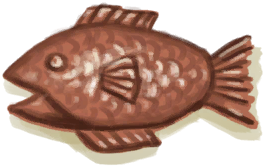

# 铸铜鱼雕  
> 一个小小的铜鱼雕。  
  
  铸铜鱼雕  |   图片   
 ----  |  ----:   
 **重量：**150  **标签：**	[“装饰品”](tag_Decoration.md), [“高级装饰品”](tag_DecorationAdv.md), [“铜制小物件”](tag_CopperSmall.md), [“美丽的/好看的”](tag_Pretty.md)  |     
  
## 获取来源  
来源  |  操作  
----  |  ----  
[铜制装饰品](CopperDecoration_Mold.md) , [“锤”](tag_Hammer.md)  |  敲开  
## 可用于转化  
转化为  |  容器  
----  |  ----  
[铜](Copper.md)  |  [熔炉](Forge.md)  
[铜](Copper.md)  |  [高级窑炉](KilnAdvanced.md)  

