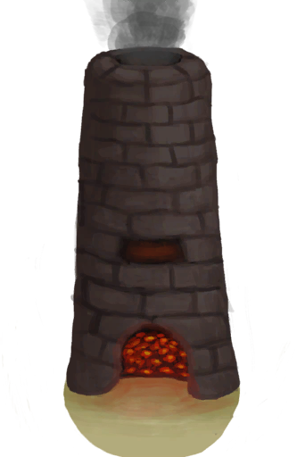

# 铜项链  
> 一条漂亮的铜项链！  
  
<table class="table table-bordered" data-toggle="table"  data-show-header="false"><thead style="display:none"><tr ><th  style="width:50%;text-align:left;vertical-align:top;"  >title</th><th  style="width:50%;text-align:left;vertical-align:top;"  ></th></tr></thead><tr ><td  style="width:50%;text-align:left;vertical-align:top;"  >**重量：**100  **装备时减重：**-100  **标签：**	[“颈部”](tag_Neck.md), [“腿部（内层）”](tag_Clothing.md), [“美丽的/好看的”](tag_Pretty.md), [“铜制小物件”](tag_CopperSmall.md)  **装备：**[“颈部”](eTag_Neck.md)  ** 效果: ** [

[情绪](Morale.md)](Morale.md)加成<b>+0.25</b> [

[压力](Stress.md)](Stress.md)加成<b>-0.25</b> [

[世界观](Structure.md)](Structure.md)加成<b>+0.5</b></td><td  style="width:50%;text-align:left;vertical-align:top;"  >

<a href="CopperNecklace.md" style="color:black">铜项链</a>

</td></tr></tbody></table>  
  
## 获取来源  

蓝图制造

[铜项链(蓝图)](Bp_CopperNecklace.md)

  
  
## 可用于转化  
<table class="table table-bordered" data-toggle="table"  ><thead style=""><tr ><th  style="text-align:left;vertical-align:top;"  >转化为</th><th  style="text-align:left;vertical-align:top;"  >容器</th></tr></thead><tr ><td  style="text-align:left;vertical-align:top;"  >[

[铜](Copper.md)](Copper.md)</td><td  style="text-align:left;vertical-align:top;"  >[

[熔炉](Forge.md)](Forge.md)</td></tr><tr ><td  style="text-align:left;vertical-align:top;"  >[

[铜](Copper.md)](Copper.md)</td><td  style="text-align:left;vertical-align:top;"  >[

[高级窑炉](KilnAdvanced.md)](KilnAdvanced.md)</td></tr></tbody></table>  
  

