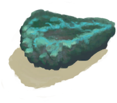

[返回首页](index.md)   |  [查看所有物品](object.md)
# 铜矿石  
> 放入熔炉或者高级窑炉中冶炼。  
  
  属性  |   图片   
 ----  |  ----:   
 **重量：**100  |     
  
## 获取来源  
来源  |  操作  
----  |  ----  
[铜矿脉(狭窄隧道)](CopperVein.md) , [“锤”](tag_Hammer.md)  |  采矿  
[铜矿脉(狭窄隧道)](CopperVein.md) , [炸药(开)](DynamiteOn.md)  |  轰隆！  
[晶洞](Geode.md) , [“锤”](tag_Hammer.md)  |  敲开  
[酸湖](AcidLake.md)  |  探索  
[东部高地](HighlandsEastern.md)  |  探索  
[火山](Volcano.md)  |  探索  
## 可用于转化  
转化为  |  容器  
----  |  ----  
[铜](Copper.md)  |  [熔炉](Forge.md)  
[铜](Copper.md)  |  [高级窑炉](KilnAdvanced.md)  
