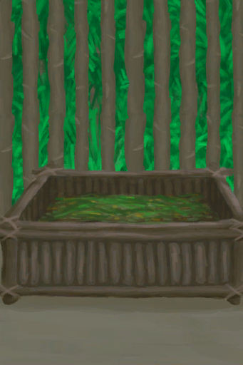
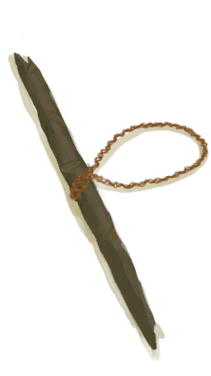
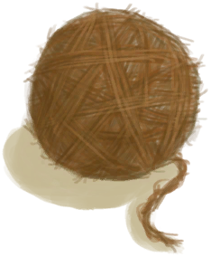
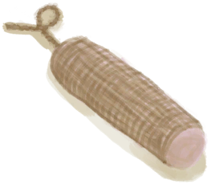
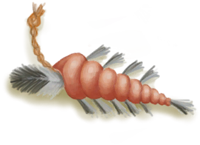

# 细线  
> 我应该用它做点东西，或者多弄点细线，把它纺成线团。  
  
<table class="table table-bordered" data-toggle="table"  data-show-header="false"><thead style="display:none"><tr ><th  style="width:50%;text-align:left;vertical-align:top;"  >title</th><th  style="width:50%;text-align:left;vertical-align:top;"  ></th></tr></thead><tr ><td  style="width:50%;text-align:left;vertical-align:top;"  >**重量：**10  **标签：**	[“细线”](tag_Cord.md)</td><td  style="width:50%;text-align:left;vertical-align:top;"  >

<a href="CordFiber.md" style="color:black">细线</a>

细线是将从<b>椰子皮和蛇草</b>中提取的<b>纤维</b>编织在一起制成的。  将细线纺在一起会产生<b>线团</b>，这些线团可以再次纺在一起制成<b>绳子</b>或在<b>织布机上织布</b>。  细线本身也能用于<b>制作</b>许多东西，比如工具和建筑。 它也是在<b>木筏</b>上进行<b>维修</b>的必要资源。</td></tr></tbody></table>  
  
## 获取来源  
<table class="table table-bordered" data-toggle="table"  ><thead style=""><tr ><th  style="text-align:left;vertical-align:top;"  >来源</th><th  style="text-align:left;vertical-align:top;"  >操作</th></tr></thead><tr ><td  style="text-align:left;vertical-align:top;"  >[

[睡袋](BedRoll.md)](BedRoll.md)</td><td  style="text-align:left;vertical-align:top;"  >拆解</td></tr><tr ><td  style="text-align:left;vertical-align:top;"  >[

[睡袋](BedRoll.md)](BedRoll.md)</td><td  style="text-align:left;vertical-align:top;"  >转化</td></tr><tr ><td  style="text-align:left;vertical-align:top;"  >[

[简易床](BedRustic.md)](BedRustic.md)</td><td  style="text-align:left;vertical-align:top;"  >拆解</td></tr><tr ><td  style="text-align:left;vertical-align:top;"  >[

[窝棚](Shelter.md)](Shelter.md)</td><td  style="text-align:left;vertical-align:top;"  >拆除</td></tr><tr ><td  style="text-align:left;vertical-align:top;"  >[

[窝棚](Shelter.md)](Shelter.md)</td><td  style="text-align:left;vertical-align:top;"  >转化</td></tr><tr ><td  style="text-align:left;vertical-align:top;"  >[

[有遮蔽的叶床](ShelteredLeafBed.md)](ShelteredLeafBed.md)</td><td  style="text-align:left;vertical-align:top;"  >拆除</td></tr><tr ><td  style="text-align:left;vertical-align:top;"  >[

[有遮蔽的叶床](ShelteredLeafBed.md)](ShelteredLeafBed.md)</td><td  style="text-align:left;vertical-align:top;"  >转化</td></tr><tr ><td  style="text-align:left;vertical-align:top;"  >[

[猪食槽](BoarFeeder.md)](BoarFeeder.md)</td><td  style="text-align:left;vertical-align:top;"  >拆解</td></tr><tr ><td  style="text-align:left;vertical-align:top;"  >[

[猪食槽(空)](BoarFeederEmpty.md)](BoarFeederEmpty.md)</td><td  style="text-align:left;vertical-align:top;"  >拆解</td></tr><tr ><td  style="text-align:left;vertical-align:top;"  >[

[诱捕笼](CageTrap.md)](CageTrap.md)</td><td  style="text-align:left;vertical-align:top;"  >拆除</td></tr><tr ><td  style="text-align:left;vertical-align:top;"  >[

[堆肥箱](CompostBin.md)](CompostBin.md)</td><td  style="text-align:left;vertical-align:top;"  >拆解</td></tr><tr ><td  style="text-align:left;vertical-align:top;"  >[

[晾晒架](DryingRack.md)](DryingRack.md)</td><td  style="text-align:left;vertical-align:top;"  >拆解</td></tr><tr ><td  style="text-align:left;vertical-align:top;"  >[

[捕鱼陷阱(未放置)](FishTrap.md)](FishTrap.md)</td><td  style="text-align:left;vertical-align:top;"  >拆除</td></tr><tr ><td  style="text-align:left;vertical-align:top;"  >[

[羊食槽](GoatFeeder.md)](GoatFeeder.md)</td><td  style="text-align:left;vertical-align:top;"  >拆解</td></tr><tr ><td  style="text-align:left;vertical-align:top;"  >[

[羊食槽(空)](GoatFeederEmpty.md)](GoatFeederEmpty.md)</td><td  style="text-align:left;vertical-align:top;"  >拆解</td></tr><tr ><td  style="text-align:left;vertical-align:top;"  >[

[织布机（空）](LoomEmpty.md)](LoomEmpty.md)</td><td  style="text-align:left;vertical-align:top;"  >拆卸织布机</td></tr><tr ><td  style="text-align:left;vertical-align:top;"  >[

[织布机（空）](LoomEmpty.md)](LoomEmpty.md)</td><td  style="text-align:left;vertical-align:top;"  >解编布匹 ** 拖入：**[布片](ClothSmall.md)</td></tr><tr ><td  style="text-align:left;vertical-align:top;"  >[

[织布机（空）](LoomEmpty.md)](LoomEmpty.md)</td><td  style="text-align:left;vertical-align:top;"  >解编布匹 ** 拖入：**[布](Cloth.md)</td></tr><tr ><td  style="text-align:left;vertical-align:top;"  >[

[织布机（空）](LoomEmpty.md)](LoomEmpty.md)</td><td  style="text-align:left;vertical-align:top;"  >解编布匹 ** 拖入：**[大块的布](ClothLarge.md)</td></tr><tr ><td  style="text-align:left;vertical-align:top;"  >[

[打开的降落伞](ParachuteDeployed.md)](ParachuteDeployed.md)</td><td  style="text-align:left;vertical-align:top;"  >切下塑料布 ** 拖入：**[“切割工具”](tag_Cutter.md)</td></tr><tr ><td  style="text-align:left;vertical-align:top;"  >[

[灰山鹑喂食器](PartridgeFeeder.md)](PartridgeFeeder.md)</td><td  style="text-align:left;vertical-align:top;"  >拆解</td></tr><tr ><td  style="text-align:left;vertical-align:top;"  >[

[灰山鹑喂食器(空)](PartridgeFeederEmpty.md)](PartridgeFeederEmpty.md)</td><td  style="text-align:left;vertical-align:top;"  >拆解</td></tr><tr ><td  style="text-align:left;vertical-align:top;"  >[

[稻草人](Scarecrow.md)](Scarecrow.md)</td><td  style="text-align:left;vertical-align:top;"  >拆除</td></tr><tr ><td  style="text-align:left;vertical-align:top;"  >[

[稻草人](Scarecrow.md)](Scarecrow.md)</td><td  style="text-align:left;vertical-align:top;"  >转化</td></tr><tr ><td  style="text-align:left;vertical-align:top;"  >[

[套索陷阱](SnareTrap.md)](SnareTrap.md)</td><td  style="text-align:left;vertical-align:top;"  >拆除陷阱</td></tr><tr ><td  style="text-align:left;vertical-align:top;"  >[

[套索陷阱(未重置)](SnareTrapTriggered.md)](SnareTrapTriggered.md)</td><td  style="text-align:left;vertical-align:top;"  >拆除陷阱</td></tr><tr ><td  style="text-align:left;vertical-align:top;"  >[

[针线(骨针)](BoneNeedleThreaded.md)](BoneNeedleThreaded.md)</td><td  style="text-align:left;vertical-align:top;"  >取下细线</td></tr><tr ><td  style="text-align:left;vertical-align:top;"  >[

[简易的弓](BowRustic.md)](BowRustic.md)</td><td  style="text-align:left;vertical-align:top;"  >拆解</td></tr><tr ><td  style="text-align:left;vertical-align:top;"  >[

[简易的弓](BowRustic.md)](BowRustic.md)</td><td  style="text-align:left;vertical-align:top;"  >转化</td></tr><tr ><td  style="text-align:left;vertical-align:top;"  >[

[防蜂服](BeeSuit.md)](BeeSuit.md)</td><td  style="text-align:left;vertical-align:top;"  >拆解</td></tr><tr ><td  style="text-align:left;vertical-align:top;"  >[

[防蜂服](BeeSuit.md)](BeeSuit.md)</td><td  style="text-align:left;vertical-align:top;"  >转化</td></tr><tr ><td  style="text-align:left;vertical-align:top;"  >[

[椰子凉鞋](CoconutSandals.md)](CoconutSandals.md)</td><td  style="text-align:left;vertical-align:top;"  >转化</td></tr><tr ><td  style="text-align:left;vertical-align:top;"  >[

[鲜花项链](FlowerNecklace.md)](FlowerNecklace.md)</td><td  style="text-align:left;vertical-align:top;"  >拆解</td></tr><tr ><td  style="text-align:left;vertical-align:top;"  >[

[鲜花项链](FlowerNecklace.md)](FlowerNecklace.md)</td><td  style="text-align:left;vertical-align:top;"  >转化</td></tr><tr ><td  style="text-align:left;vertical-align:top;"  >[

[草裙](LeafSKirt.md)](LeafSKirt.md)</td><td  style="text-align:left;vertical-align:top;"  >拆解</td></tr><tr ><td  style="text-align:left;vertical-align:top;"  >[

[草裙](LeafSKirt.md)](LeafSKirt.md)</td><td  style="text-align:left;vertical-align:top;"  >转化</td></tr><tr ><td  style="text-align:left;vertical-align:top;"  >[

[皮裤](LeatherPants.md)](LeatherPants.md)</td><td  style="text-align:left;vertical-align:top;"  >拆解</td></tr><tr ><td  style="text-align:left;vertical-align:top;"  >[

[皮裤](LeatherPants.md)](LeatherPants.md)</td><td  style="text-align:left;vertical-align:top;"  >转化</td></tr><tr ><td  style="text-align:left;vertical-align:top;"  >[

[皮革鞋子](LeatherShoes.md)](LeatherShoes.md)</td><td  style="text-align:left;vertical-align:top;"  >拆解</td></tr><tr ><td  style="text-align:left;vertical-align:top;"  >[

[皮革鞋子](LeatherShoes.md)](LeatherShoes.md)</td><td  style="text-align:left;vertical-align:top;"  >转化</td></tr><tr ><td  style="text-align:left;vertical-align:top;"  >[

[珍珠项链](PearlNecklace.md)](PearlNecklace.md)</td><td  style="text-align:left;vertical-align:top;"  >拆解</td></tr><tr ><td  style="text-align:left;vertical-align:top;"  >[

[珍珠项链](PearlNecklace.md)](PearlNecklace.md)</td><td  style="text-align:left;vertical-align:top;"  >转化</td></tr><tr ><td  style="text-align:left;vertical-align:top;"  >[

[雨衣](Raincoat.md)](Raincoat.md)</td><td  style="text-align:left;vertical-align:top;"  >拆解</td></tr><tr ><td  style="text-align:left;vertical-align:top;"  >[

[雨衣](Raincoat.md)](Raincoat.md)</td><td  style="text-align:left;vertical-align:top;"  >转化</td></tr><tr ><td  style="text-align:left;vertical-align:top;"  >[

[海鸥护符](SeagullCharm.md)](SeagullCharm.md)</td><td  style="text-align:left;vertical-align:top;"  >转化</td></tr><tr ><td  style="text-align:left;vertical-align:top;"  >[

[贝壳项链](SeashellNecklace.md)](SeashellNecklace.md)</td><td  style="text-align:left;vertical-align:top;"  >拆解</td></tr><tr ><td  style="text-align:left;vertical-align:top;"  >[

[贝壳项链](SeashellNecklace.md)](SeashellNecklace.md)</td><td  style="text-align:left;vertical-align:top;"  >转化</td></tr><tr ><td  style="text-align:left;vertical-align:top;"  >[

[鲨鱼头饰](SharkHeadpiece.md)](SharkHeadpiece.md)</td><td  style="text-align:left;vertical-align:top;"  >拆解</td></tr><tr ><td  style="text-align:left;vertical-align:top;"  >[

[衬衫](ShirtFiber.md)](ShirtFiber.md)</td><td  style="text-align:left;vertical-align:top;"  >转化</td></tr><tr ><td  style="text-align:left;vertical-align:top;"  >[

[夹板](Splint.md)](Splint.md)</td><td  style="text-align:left;vertical-align:top;"  >转化</td></tr><tr ><td  style="text-align:left;vertical-align:top;"  >[

[蓑衣](StrawCape.md)](StrawCape.md)</td><td  style="text-align:left;vertical-align:top;"  >拆解</td></tr><tr ><td  style="text-align:left;vertical-align:top;"  >[

[蓑衣](StrawCape.md)](StrawCape.md)</td><td  style="text-align:left;vertical-align:top;"  >转化</td></tr><tr ><td  style="text-align:left;vertical-align:top;"  >[

[简易止血带](TourniquetRustic.md)](TourniquetRustic.md)</td><td  style="text-align:left;vertical-align:top;"  >转化</td></tr><tr ><td  style="text-align:left;vertical-align:top;"  >[

[风箱](Bellows.md)](Bellows.md)</td><td  style="text-align:left;vertical-align:top;"  >转化</td></tr><tr ><td  style="text-align:left;vertical-align:top;"  >[

[针线(铜针)](CopperNeedleThreaded.md)](CopperNeedleThreaded.md)</td><td  style="text-align:left;vertical-align:top;"  >取下细线</td></tr><tr ><td  style="text-align:left;vertical-align:top;"  >[

[纤维](Fibers.md)](Fibers.md)</td><td  style="text-align:left;vertical-align:top;"  >缠起来 ** 拖入：**[纤维](Fibers.md)</td></tr><tr ><td  style="text-align:left;vertical-align:top;"  >[

[挎包](Satchel.md)](Satchel.md)</td><td  style="text-align:left;vertical-align:top;"  >拆解</td></tr><tr ><td  style="text-align:left;vertical-align:top;"  >[

[挎包(猎人专有)](SatchelHunter.md)](SatchelHunter.md)</td><td  style="text-align:left;vertical-align:top;"  >拆解</td></tr><tr ><td  style="text-align:left;vertical-align:top;"  >[

[补给箱](SupplyChestRaft.md)](SupplyChestRaft.md)</td><td  style="text-align:left;vertical-align:top;"  >拆解</td></tr><tr ><td  style="text-align:left;vertical-align:top;"  >[

[小拉车](Travois.md)](Travois.md)</td><td  style="text-align:left;vertical-align:top;"  >Dismantle</td></tr><tr ><td  style="text-align:left;vertical-align:top;"  >[

[铜斧](AxeCopper.md)](AxeCopper.md)</td><td  style="text-align:left;vertical-align:top;"  >拆解</td></tr><tr ><td  style="text-align:left;vertical-align:top;"  >[

[铜斧](AxeCopper.md)](AxeCopper.md)</td><td  style="text-align:left;vertical-align:top;"  >转化</td></tr><tr ><td  style="text-align:left;vertical-align:top;"  >[

[燧石斧](AxeFlint.md)](AxeFlint.md)</td><td  style="text-align:left;vertical-align:top;"  >转化</td></tr><tr ><td  style="text-align:left;vertical-align:top;"  >[

[废金属斧](AxeScrap.md)](AxeScrap.md)</td><td  style="text-align:left;vertical-align:top;"  >拆解</td></tr><tr ><td  style="text-align:left;vertical-align:top;"  >[

[废金属斧](AxeScrap.md)](AxeScrap.md)</td><td  style="text-align:left;vertical-align:top;"  >转化</td></tr><tr ><td  style="text-align:left;vertical-align:top;"  >[

[扫帚](Broom.md)](Broom.md)</td><td  style="text-align:left;vertical-align:top;"  >拆解</td></tr><tr ><td  style="text-align:left;vertical-align:top;"  >[

[钓鱼线](FishingLine.md)](FishingLine.md)</td><td  style="text-align:left;vertical-align:top;"  >转化</td></tr><tr ><td  style="text-align:left;vertical-align:top;"  >[

[钓鱼线（已添加诱饵）](FishingLineBait.md)](FishingLineBait.md)</td><td  style="text-align:left;vertical-align:top;"  >转化</td></tr><tr ><td  style="text-align:left;vertical-align:top;"  >[

[钓鱼线](FishingLineRustic.md)](FishingLineRustic.md)</td><td  style="text-align:left;vertical-align:top;"  >转化</td></tr><tr ><td  style="text-align:left;vertical-align:top;"  >[

[钓鱼线（已添加诱饵）](FishingLineRusticBait.md)](FishingLineRusticBait.md)</td><td  style="text-align:left;vertical-align:top;"  >转化</td></tr><tr ><td  style="text-align:left;vertical-align:top;"  >[

[钓鱼竿](FishingRod.md)](FishingRod.md)</td><td  style="text-align:left;vertical-align:top;"  >转化</td></tr><tr ><td  style="text-align:left;vertical-align:top;"  >[

[钓鱼竿（已添加诱饵）](FishingRodBait.md)](FishingRodBait.md)</td><td  style="text-align:left;vertical-align:top;"  >转化</td></tr><tr ><td  style="text-align:left;vertical-align:top;"  >[

[铜铲](ShovelCopper.md)](ShovelCopper.md)</td><td  style="text-align:left;vertical-align:top;"  >拆解</td></tr><tr ><td  style="text-align:left;vertical-align:top;"  >[

[铜铲](ShovelCopper.md)](ShovelCopper.md)</td><td  style="text-align:left;vertical-align:top;"  >转化</td></tr><tr ><td  style="text-align:left;vertical-align:top;"  >[

[废金属铲](ShovelScrap.md)](ShovelScrap.md)</td><td  style="text-align:left;vertical-align:top;"  >拆解</td></tr><tr ><td  style="text-align:left;vertical-align:top;"  >[

[废金属铲](ShovelScrap.md)](ShovelScrap.md)</td><td  style="text-align:left;vertical-align:top;"  >转化</td></tr><tr ><td  style="text-align:left;vertical-align:top;"  >[

[木铲](ShovelWooden.md)](ShovelWooden.md)</td><td  style="text-align:left;vertical-align:top;"  >转化</td></tr><tr ><td  style="text-align:left;vertical-align:top;"  >[

[缠好的纺锤](SpindleFiber.md)](SpindleFiber.md)</td><td  style="text-align:left;vertical-align:top;"  >纺细线</td></tr><tr ><td  style="text-align:left;vertical-align:top;"  >[

[针线(木针)](WoodenNeedleThreaded.md)](WoodenNeedleThreaded.md)</td><td  style="text-align:left;vertical-align:top;"  >取下细线</td></tr><tr ><td  style="text-align:left;vertical-align:top;"  >[

[线团](YarnFiber.md)](YarnFiber.md)</td><td  style="text-align:left;vertical-align:top;"  >拆成细线</td></tr><tr ><td  style="text-align:left;vertical-align:top;"  >[

[废墟(泥屋)](Debris.md)](Debris.md)</td><td  style="text-align:left;vertical-align:top;"  >清理</td></tr><tr ><td  style="text-align:left;vertical-align:top;"  >[

[漂浮的残骸](FloatingDebris.md)](FloatingDebris.md)</td><td  style="text-align:left;vertical-align:top;"  >采集</td></tr><tr ><td  style="text-align:left;vertical-align:top;"  >[

[树液收集处](PalmTreeSapStation.md)](PalmTreeSapStation.md)</td><td  style="text-align:left;vertical-align:top;"  >砍倒 ** 拖入：**[石斧](StoneAxe.md)</td></tr><tr ><td  style="text-align:left;vertical-align:top;"  >[

[树液收集处](PalmTreeSapStation.md)](PalmTreeSapStation.md)</td><td  style="text-align:left;vertical-align:top;"  >砍倒 ** 拖入：**[“斧”](tag_Axe.md)</td></tr><tr ><td  style="text-align:left;vertical-align:top;"  >[

[树液补给点(空)](PalmTreeSapStationEmpty.md)](PalmTreeSapStationEmpty.md)</td><td  style="text-align:left;vertical-align:top;"  >砍倒 ** 拖入：**[石斧](StoneAxe.md)</td></tr><tr ><td  style="text-align:left;vertical-align:top;"  >[

[树液补给点(空)](PalmTreeSapStationEmpty.md)](PalmTreeSapStationEmpty.md)</td><td  style="text-align:left;vertical-align:top;"  >砍倒 ** 拖入：**[“斧”](tag_Axe.md)</td></tr></tbody></table>  
  
## 可拖入  
<table class="table table-bordered" data-toggle="table"  ><thead style=""><tr ><th  style="text-align:left;vertical-align:top;"  >使用</th><th  style="text-align:left;vertical-align:top;"  >动作</th><th  style="text-align:left;vertical-align:top;"  >耗时</th><th  style="text-align:left;vertical-align:top;"  >条件</th><th  style="text-align:left;vertical-align:top;"  >变化</th><th  style="text-align:left;vertical-align:top;"  >玩家状态</th></tr></thead><tr ><td  style="text-align:left;vertical-align:top;"  >[

[细线](CordFiber.md)](CordFiber.md)</td><td  style="text-align:left;vertical-align:top;"  >制作线团 [“手部动作(组)”](HandAction.md)</td><td  style="text-align:left;vertical-align:top;"  >15分</td><td  style="text-align:left;vertical-align:top;"  >[

[光亮](Light.md)](Light.md): 10-100</td><td  style="text-align:left;vertical-align:top;"  >** 自身: ** → [

[线团](YarnFiber.md)](YarnFiber.md)  ** 使用物: ** →消失</td><td  style="text-align:left;vertical-align:top;"  >[

[纺织(技能)](Skill_Tailoring.md)](Skill_Tailoring.md)+0.5</td></tr></tbody></table>  
  
## 可拖至  

[捕捞拖网](RaftFishTrap.md)

[稻草人](Scarecrow.md)

[骨针](BoneNeedle.md)

[铜针](CopperNeedle.md)

[细线](CordFiber.md)

[补给箱](SupplyChestRaft.md)

[小树枝](Sticks.md)

[木针](WoodenNeedle.md)

[损坏的帆](SailBroken_Raft.md)

[收起的帆](SailDown_Raft.md)

  
  
## 可用于蓝图  

[

[简易床(蓝图)](Bp_BedRustic.md)](Bp_BedRustic.md)

[

[木床(蓝图)](Bp_BedWooden.md)](Bp_BedWooden.md)

[

[熏蜂器(蓝图)](Bp_BeeSmoker.md)](Bp_BeeSmoker.md)

[

[骨刀(蓝图)](Bp_BoneKnife.md)](Bp_BoneKnife.md)

[

[弓(蓝图)](Bp_Bow.md)](Bp_Bow.md)

[

[弓钻(蓝图)](Bp_BowDrill.md)](Bp_BowDrill.md)

[

[扫帚(蓝图)](Bp_Broom.md)](Bp_Broom.md)

[

[诱捕笼(蓝图)](Bp_CageTrap.md)](Bp_CageTrap.md)

[

[蜡烛(蓝图)](Bp_Candles.md)](Bp_Candles.md)

[

[香茅蜡烛(蓝图)](Bp_CandlesCitronella.md)](Bp_CandlesCitronella.md)

[

[茉莉蜡烛(蓝图)](Bp_CandlesJasmine.md)](Bp_CandlesJasmine.md)

[

[地窖(蓝图)](Bp_Cellar.md)](Bp_Cellar.md)

[

[仪式匕首(蓝图)](Bp_CeremonialDagger.md)](Bp_CeremonialDagger.md)

[

[储物箱(蓝图)](Bp_Chest.md)](Bp_Chest.md)

[

[水窖(蓝图)](Bp_Cistern.md)](Bp_Cistern.md)

[

[堆肥箱(蓝图)](Bp_CompostBin.md)](Bp_CompostBin.md)

[

[铜斧(蓝图)](Bp_CopperAxe.md)](Bp_CopperAxe.md)

[

[铜铲(蓝图)](Bp_CopperShovel.md)](Bp_CopperShovel.md)

[

[铜长矛(蓝图)](Bp_CopperSpear.md)](Bp_CopperSpear.md)

[

[鼓(蓝图)](Bp_Drum.md)](Bp_Drum.md)

[

[晾晒架(蓝图)](Bp_DryingRack.md)](Bp_DryingRack.md)

[

[炸‍葯(蓝图)](Bp_Dynamite.md)](Bp_Dynamite.md)

[

[畜栏(蓝图)](Bp_Enclosure.md)](Bp_Enclosure.md)

[

[鱼饵(蓝图)](Bp_FishBait.md)](Bp_FishBait.md)

[

[捕鱼陷阱(蓝图)](Bp_FishTrap.md)](Bp_FishTrap.md)

[

[钓鱼线(蓝图)](Bp_FishingLine.md)](Bp_FishingLine.md)

[

[钓鱼竿(蓝图)](Bp_FishingRod.md)](Bp_FishingRod.md)

[

[鱼叉(蓝图)](Bp_FishingSpear.md)](Bp_FishingSpear.md)

[

[燧石斧(蓝图)](Bp_FlintAxe.md)](Bp_FlintAxe.md)

[

[燧石刀(蓝图)](Bp_FlintKnife.md)](Bp_FlintKnife.md)

[

[燧石长矛(蓝图)](Bp_FlintSpear.md)](Bp_FlintSpear.md)

[

[羊食槽(蓝图)](Bp_GoatFeeder.md)](Bp_GoatFeeder.md)

[

[鱼镖(蓝图)](Bp_Harpoon.md)](Bp_Harpoon.md)

[

[蜥蜴皮手鼓(蓝图)](Bp_LizardDrum.md)](Bp_LizardDrum.md)

[

[织布机(蓝图)](Bp_Loom.md)](Bp_Loom.md)

[

[泥屋(蓝图)](Bp_MudHut.md)](Bp_MudHut.md)

[

[黑曜石刀(蓝图)](Bp_ObsidianKnife.md)](Bp_ObsidianKnife.md)

[

[黑曜石长矛(蓝图)](Bp_ObsidianSpear.md)](Bp_ObsidianSpear.md)

[

[灰山鹑喂食器(蓝图)](Bp_PartridgeFeeder.md)](Bp_PartridgeFeeder.md)

[

[木筏(蓝图)](Bp_Raft.md)](Bp_Raft.md)

[

[捕捞拖网(蓝图)](Bp_RaftFishTrap.md)](Bp_RaftFishTrap.md)

[

[木筏庇护所(蓝图)](Bp_RaftShelter.md)](Bp_RaftShelter.md)

[

[稻草人(蓝图)](Bp_Scarecrow.md)](Bp_Scarecrow.md)

[

[废金属斧(蓝图)](Bp_ScrapAxe.md)](Bp_ScrapAxe.md)

[

[废金属刀(蓝图)](Bp_ScrapKnife.md)](Bp_ScrapKnife.md)

[

[废金属铲(蓝图)](Bp_ScrapShovel.md)](Bp_ScrapShovel.md)

[

[废金属长矛(蓝图)](Bp_ScrapSpear.md)](Bp_ScrapSpear.md)

[

[棚屋(蓝图)](Bp_Shed.md)](Bp_Shed.md)

[

[窝棚(蓝图)](Bp_Shelter.md)](Bp_Shelter.md)

[

[投石索(蓝图)](Bp_Sling.md)](Bp_Sling.md)

[

[套索陷阱(蓝图)](Bp_SnareTrap.md)](Bp_SnareTrap.md)

[

[夹板(蓝图)](Bp_Splint.md)](Bp_Splint.md)

[

[补给箱(蓝图)](Bp_SupplyChest.md)](Bp_SupplyChest.md)

[

[简易止血带(蓝图)](Bp_TourniquetRustic.md)](Bp_TourniquetRustic.md)

[

[小拉车(蓝图)](Bp_Travois.md)](Bp_Travois.md)

[

[水井(蓝图)](Bp_Well.md)](Bp_Well.md)

[

[木铲(蓝图)](Bp_WoodenShovel.md)](Bp_WoodenShovel.md)

[

[睡袋(蓝图)](Bp_Bedroll.md)](Bp_Bedroll.md)

[

[防蜂服(蓝图)](Bp_BeeSuit.md)](Bp_BeeSuit.md)

[

[风箱(蓝图)](Bp_Bellows.md)](Bp_Bellows.md)

[

[椰子凉鞋(蓝图)](Bp_CoconutSandals.md)](Bp_CoconutSandals.md)

[

[铜瓶(蓝图)](Bp_CopperBottle.md)](Bp_CopperBottle.md)

[

[铜罐(蓝图)](Bp_CopperJar.md)](Bp_CopperJar.md)

[

[鲜花项链(蓝图)](Bp_FlowerNecklace.md)](Bp_FlowerNecklace.md)

[

[防毒面具(蓝图)](Bp_GasMask.md)](Bp_GasMask.md)

[

[草裙(蓝图)](Bp_LeafSkirt.md)](Bp_LeafSkirt.md)

[

[皮革背包(蓝图)](Bp_LeatherBackpack.md)](Bp_LeatherBackpack.md)

[

[皮革手套(蓝图)](Bp_LeatherGloves.md)](Bp_LeatherGloves.md)

[

[皮裤(蓝图)](Bp_LeatherPants.md)](Bp_LeatherPants.md)

[

[皮革鞋子(蓝图)](Bp_LeatherShoes.md)](Bp_LeatherShoes.md)

[

[珍珠项链(蓝图)](Bp_PearlNecklace.md)](Bp_PearlNecklace.md)

[

[箭筒(蓝图)](Bp_Quiver.md)](Bp_Quiver.md)

[

[雨衣(蓝图)](Bp_Raincoat.md)](Bp_Raincoat.md)

[

[布袋(蓝图)](Bp_Sack.md)](Bp_Sack.md)

[

[挎包(蓝图)](Bp_Satchel.md)](Bp_Satchel.md)

[

[海鸥护符(蓝图)](Bp_SeagullCharm.md)](Bp_SeagullCharm.md)

[

[贝壳项链(蓝图)](Bp_SeashellNecklace.md)](Bp_SeashellNecklace.md)

[

[鲨鱼头饰(蓝图)](Bp_SharkHeadpiece.md)](Bp_SharkHeadpiece.md)

[

[衬衫(蓝图)](Bp_Shirt.md)](Bp_Shirt.md)

[

[蓑衣(蓝图)](Bp_StrawCape.md)](Bp_StrawCape.md)

[

[水袋(蓝图)](Bp_Waterskin.md)](Bp_Waterskin.md)

  
  
  

