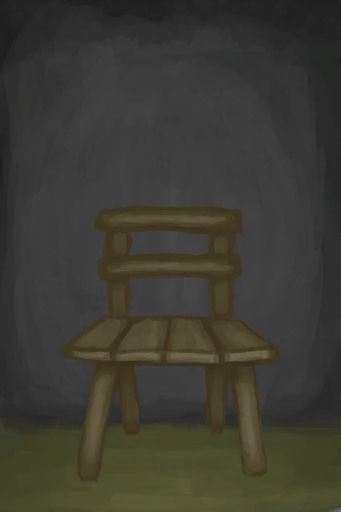
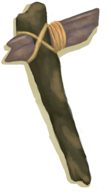
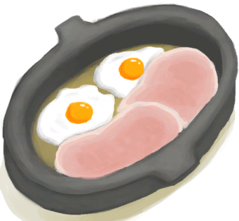
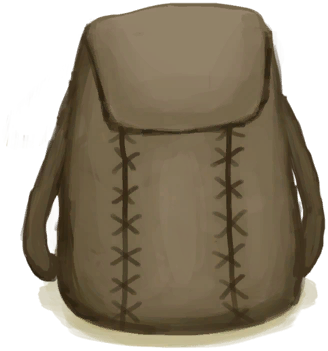
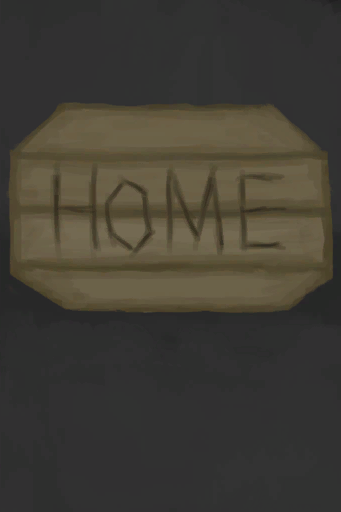
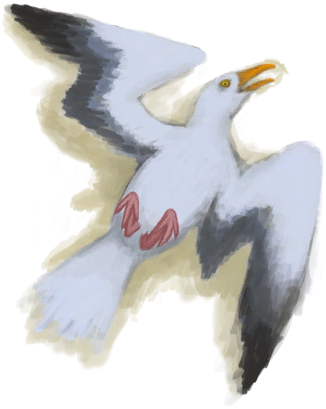
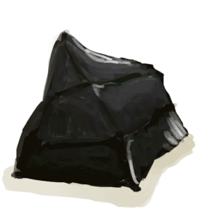

# “制造动作(组)”  

蓝图制造 [

[芦荟膏(蓝图)](Bp_AloeGel.md)](Bp_AloeGel.md)

蓝图制造 [

[箭矢(蓝图)](Bp_Arrow.md)](Bp_Arrow.md)

蓝图制造 [

[草木灰敷料(蓝图)](Bp_AshDressing.md)](Bp_AshDressing.md)

蓝图制造 [

[木床(蓝图)](Bp_BedWooden.md)](Bp_BedWooden.md)

蓝图制造 [

[蜂箱(蓝图)](Bp_BeeSkep.md)](Bp_BeeSkep.md)

蓝图制造 [

[空蜂箱(蓝图)](Bp_BeeSkepEmpty.md)](Bp_BeeSkepEmpty.md)

蓝图制造 [

[熏蜂器(蓝图)](Bp_BeeSmoker.md)](Bp_BeeSmoker.md)

蓝图制造 [

[骨刀(蓝图)](Bp_BoneKnife.md)](Bp_BoneKnife.md)

蓝图制造 [

[弓(蓝图)](Bp_Bow.md)](Bp_Bow.md)

蓝图制造 [

[弓钻(蓝图)](Bp_BowDrill.md)](Bp_BowDrill.md)

蓝图制造 [

[硫磺膏(蓝图)](Bp_BrimstoneGel.md)](Bp_BrimstoneGel.md)

蓝图制造 [

[扫帚(蓝图)](Bp_Broom.md)](Bp_Broom.md)

蓝图制造 [

[诱捕笼(蓝图)](Bp_CageTrap.md)](Bp_CageTrap.md)

蓝图制造 [

[蜡烛(蓝图)](Bp_Candles.md)](Bp_Candles.md)

蓝图制造 [

[香茅蜡烛(蓝图)](Bp_CandlesCitronella.md)](Bp_CandlesCitronella.md)

蓝图制造 [

[茉莉蜡烛(蓝图)](Bp_CandlesJasmine.md)](Bp_CandlesJasmine.md)

蓝图制造 [

[仪式匕首(蓝图)](Bp_CeremonialDagger.md)](Bp_CeremonialDagger.md)

蓝图制造 [

[椅子(蓝图)](Bp_Chair.md)](Bp_Chair.md)

蓝图制造 [

[储物箱(蓝图)](Bp_Chest.md)](Bp_Chest.md)

蓝图制造 [

[铜斧(蓝图)](Bp_CopperAxe.md)](Bp_CopperAxe.md)

蓝图制造 [

[铜铲(蓝图)](Bp_CopperShovel.md)](Bp_CopperShovel.md)

蓝图制造 [

[铜长矛(蓝图)](Bp_CopperSpear.md)](Bp_CopperSpear.md)

蓝图制造 [

[鼓(蓝图)](Bp_Drum.md)](Bp_Drum.md)

蓝图制造 [

[炸‍葯(蓝图)](Bp_Dynamite.md)](Bp_Dynamite.md)

蓝图制造 [

[木质餐具(蓝图)](Bp_EatingUtensilsWooden.md)](Bp_EatingUtensilsWooden.md)

蓝图制造 [

[鱼饵(蓝图)](Bp_FishBait.md)](Bp_FishBait.md)

蓝图制造 [

[捕鱼陷阱(蓝图)](Bp_FishTrap.md)](Bp_FishTrap.md)

蓝图制造 [

[钓鱼线(蓝图)](Bp_FishingLine.md)](Bp_FishingLine.md)

蓝图制造 [

[钓鱼竿(蓝图)](Bp_FishingRod.md)](Bp_FishingRod.md)

蓝图制造 [

[鱼叉(蓝图)](Bp_FishingSpear.md)](Bp_FishingSpear.md)

蓝图制造 [

[燧石斧(蓝图)](Bp_FlintAxe.md)](Bp_FlintAxe.md)

蓝图制造 [

[燧石刀(蓝图)](Bp_FlintKnife.md)](Bp_FlintKnife.md)

蓝图制造 [

[燧石长矛(蓝图)](Bp_FlintSpear.md)](Bp_FlintSpear.md)

蓝图制造 [

[胶水(蓝图)](Bp_Glue.md)](Bp_Glue.md)

蓝图制造 [

[手钻(蓝图)](Bp_HandDrill.md)](Bp_HandDrill.md)

蓝图制造 [

[鱼镖(蓝图)](Bp_Harpoon.md)](Bp_Harpoon.md)

蓝图制造 [

[蜥蜴皮手鼓(蓝图)](Bp_LizardDrum.md)](Bp_LizardDrum.md)

蓝图制造 [

[原木陷阱(蓝图)](Bp_LogTrap.md)](Bp_LogTrap.md)

蓝图制造 [

[织布机(蓝图)](Bp_Loom.md)](Bp_Loom.md)

蓝图制造 [

[斧头模具(蓝图)](Bp_MoldAxe.md)](Bp_MoldAxe.md)

蓝图制造 [

[装饰品模具(蓝图)](Bp_MoldDecoration.md)](Bp_MoldDecoration.md)

蓝图制造 [

[刀模具(蓝图)](Bp_MoldKnife.md)](Bp_MoldKnife.md)

蓝图制造 [

[铲头模具(蓝图)](Bp_MoldShovel.md)](Bp_MoldShovel.md)

蓝图制造 [

[矛头模具(蓝图)](Bp_MoldSpear.md)](Bp_MoldSpear.md)

蓝图制造 [

[黑曜石刀(蓝图)](Bp_ObsidianKnife.md)](Bp_ObsidianKnife.md)

蓝图制造 [

[黑曜石长矛(蓝图)](Bp_ObsidianSpear.md)](Bp_ObsidianSpear.md)

蓝图制造 [

[陶轮(蓝图)](Bp_PotteryWheel.md)](Bp_PotteryWheel.md)

蓝图制造 [

[金鸡纳树皮粉(蓝图)](Bp_Quinine.md)](Bp_Quinine.md)

蓝图制造 [

[硫酸奎宁(蓝图)](Bp_QuinineSulfate.md)](Bp_QuinineSulfate.md)

蓝图制造 [

[捕捞拖网(蓝图)](Bp_RaftFishTrap.md)](Bp_RaftFishTrap.md)

蓝图制造 [

[简易长矛(蓝图)](Bp_RusticSpear.md)](Bp_RusticSpear.md)

蓝图制造 [

[废金属斧(蓝图)](Bp_ScrapAxe.md)](Bp_ScrapAxe.md)

蓝图制造 [

[废金属刀(蓝图)](Bp_ScrapKnife.md)](Bp_ScrapKnife.md)

蓝图制造 [

[废金属铲(蓝图)](Bp_ScrapShovel.md)](Bp_ScrapShovel.md)

蓝图制造 [

[废金属长矛(蓝图)](Bp_ScrapSpear.md)](Bp_ScrapSpear.md)

蓝图制造 [

[石刀(蓝图)](Bp_SharpenedStone.md)](Bp_SharpenedStone.md)

蓝图制造 [

[盾牌(蓝图)](Bp_Shield.md)](Bp_Shield.md)

蓝图制造 [

[投石索(蓝图)](Bp_Sling.md)](Bp_Sling.md)

蓝图制造 [

[肥皂(蓝图)](Bp_Soap.md)](Bp_Soap.md)

蓝图制造 [

[纺锤(蓝图)](Bp_Spindle.md)](Bp_Spindle.md)

蓝图制造 [

[夹板(蓝图)](Bp_Splint.md)](Bp_Splint.md)

蓝图制造 [

[石斧(蓝图)](Bp_StoneAxe.md)](Bp_StoneAxe.md)

蓝图制造 [

[木桌(蓝图)](Bp_Table.md)](Bp_Table.md)

蓝图制造 [

[火把(蓝图)](Bp_Torch.md)](Bp_Torch.md)

蓝图制造 [

[止血带(蓝图)](Bp_Tourniquet.md)](Bp_Tourniquet.md)

蓝图制造 [

[简易止血带(蓝图)](Bp_TourniquetRustic.md)](Bp_TourniquetRustic.md)

蓝图制造 [

[小拉车(蓝图)](Bp_Travois.md)](Bp_Travois.md)

蓝图制造 [

[木钉(蓝图)](Bp_Treenails.md)](Bp_Treenails.md)

蓝图制造 [

[硫酸(蓝图)](Bp_Vitriol.md)](Bp_Vitriol.md)

蓝图制造 [

[木雕(蓝图)](Bp_WoodCarvings.md)](Bp_WoodCarvings.md)

蓝图制造 [

[木铲(蓝图)](Bp_WoodenShovel.md)](Bp_WoodenShovel.md)

蓝图制造 [

[背篓(蓝图)](Bp_WovenBackpack.md)](Bp_WovenBackpack.md)

蓝图制造 [

[编织篓(蓝图)](Bp_WovenBasket.md)](Bp_WovenBasket.md)

蓝图制造 [

[棕榈编织帽(蓝图)](Bp_WovenHat.md)](Bp_WovenHat.md)

蓝图制造 [

[睡袋(蓝图)](Bp_Bedroll.md)](Bp_Bedroll.md)

蓝图制造 [

[骨头汤(蓝图)](Bp_BoneBroth.md)](Bp_BoneBroth.md)

蓝图制造 [

[黄油(蓝图)](Bp_Butter.md)](Bp_Butter.md)

蓝图制造 [

[黄油焗牡蛎(蓝图)](Bp_ButterBakedOysters.md)](Bp_ButterBakedOysters.md)

蓝图制造 [

[姜糖(蓝图)](Bp_CandiedGinger.md)](Bp_CandiedGinger.md)

蓝图制造 [

[奶酪(蓝图)](Bp_Cheese.md)](Bp_Cheese.md)

蓝图制造 [

[鸡肉三明治(蓝图)](Bp_ChickenSandwich.md)](Bp_ChickenSandwich.md)

蓝图制造 [

[椰子鱼(蓝图)](Bp_CoconutFish.md)](Bp_CoconutFish.md)

蓝图制造 [

[醉蟹(蓝图)](Bp_DrunkenCrab.md)](Bp_DrunkenCrab.md)

蓝图制造 [

[蛋炒饭(蓝图)](Bp_EggFriedRice.md)](Bp_EggFriedRice.md)

蓝图制造 [

[炸鱼薯条(蓝图)](Bp_FishNChips.md)](Bp_FishNChips.md)

蓝图制造 [

[鱼肉煎蛋饼(蓝图)](Bp_FishOmelette.md)](Bp_FishOmelette.md)

蓝图制造 [

[鱼肉塔可(蓝图)](Bp_FishTaco.md)](Bp_FishTaco.md)

蓝图制造 [

[炸香蕉(蓝图)](Bp_FriedBananas.md)](Bp_FriedBananas.md)

蓝图制造 [

[炒菇球(蓝图)](Bp_FriedPuffballs.md)](Bp_FriedPuffballs.md)

蓝图制造 [

[炖羊肉(蓝图)](Bp_GoatStew.md)](Bp_GoatStew.md)

蓝图制造 [

[肉食盛宴(蓝图)](Bp_HeartyFeast.md)](Bp_HeartyFeast.md)

蓝图制造 [

[蜜糖(蓝图)](Bp_HoneyCandy.md)](Bp_HoneyCandy.md)

蓝图制造 [

[蜜汁火腿(蓝图)](Bp_HoneyGlazedPork.md)](Bp_HoneyGlazedPork.md)

蓝图制造 [

[热带烤鸡(蓝图)](Bp_IslandChicken.md)](Bp_IslandChicken.md)

蓝图制造 [

[丛林沙拉(蓝图)](Bp_JungleSalad.md)](Bp_JungleSalad.md)

蓝图制造 [

[辣炒巨蜥肉(蓝图)](Bp_LizardFry.md)](Bp_LizardFry.md)

蓝图制造 [

[猕猴肉串(蓝图)](Bp_MacaqueSkewers.md)](Bp_MacaqueSkewers.md)

蓝图制造 [

[蛋白棒(蓝图)](Bp_ProteinBar.md)](Bp_ProteinBar.md)

蓝图制造 [

[西米蛋糕(蓝图)](Bp_SagoCake.md)](Bp_SagoCake.md)

蓝图制造 [

[西米糕(蓝图)](Bp_SagoSlime.md)](Bp_SagoSlime.md)

蓝图制造 [

[海鲜杂烩(蓝图)](Bp_SeafoodCup.md)](Bp_SeafoodCup.md)

蓝图制造 [

[寿司(蓝图)](Bp_Sushi.md)](Bp_Sushi.md)

蓝图制造 [

[参薯咖喱(蓝图)](Bp_YamCurry.md)](Bp_YamCurry.md)

蓝图制造 [

[参薯酱(蓝图)](Bp_YamJam.md)](Bp_YamJam.md)

蓝图制造 [

[蒸馏器(蓝图)](Bp_Alembic.md)](Bp_Alembic.md)

蓝图制造 [

[粘土火盆(蓝图)](Bp_ClayFirePit.md)](Bp_ClayFirePit.md)

蓝图制造 [

[小陶罐(蓝图)](Bp_ClayJar.md)](Bp_ClayJar.md)

蓝图制造 [

[保鲜罐(蓝图)](Bp_ClayPotCooler.md)](Bp_ClayPotCooler.md)

蓝图制造 [

[防蜂服(蓝图)](Bp_BeeSuit.md)](Bp_BeeSuit.md)

蓝图制造 [

[风箱(蓝图)](Bp_Bellows.md)](Bp_Bellows.md)

蓝图制造 [

[椰子凉鞋(蓝图)](Bp_CoconutSandals.md)](Bp_CoconutSandals.md)

蓝图制造 [

[铜瓶(蓝图)](Bp_CopperBottle.md)](Bp_CopperBottle.md)

蓝图制造 [

[铜罐(蓝图)](Bp_CopperJar.md)](Bp_CopperJar.md)

蓝图制造 [

[铜项链(蓝图)](Bp_CopperNecklace.md)](Bp_CopperNecklace.md)

蓝图制造 [

[铜针(蓝图)](Bp_CopperNeedles.md)](Bp_CopperNeedles.md)

蓝图制造 [

[铜制餐具(蓝图)](Bp_EatingUtensilsCopper.md)](Bp_EatingUtensilsCopper.md)

蓝图制造 [

[鲜花项链(蓝图)](Bp_FlowerNecklace.md)](Bp_FlowerNecklace.md)

蓝图制造 [

[防毒面具(蓝图)](Bp_GasMask.md)](Bp_GasMask.md)

蓝图制造 [

[草裙(蓝图)](Bp_LeafSkirt.md)](Bp_LeafSkirt.md)

蓝图制造 [

[皮革背包(蓝图)](Bp_LeatherBackpack.md)](Bp_LeatherBackpack.md)

蓝图制造 [

[皮革手套(蓝图)](Bp_LeatherGloves.md)](Bp_LeatherGloves.md)

蓝图制造 [

[皮裤(蓝图)](Bp_LeatherPants.md)](Bp_LeatherPants.md)

蓝图制造 [

[皮革鞋子(蓝图)](Bp_LeatherShoes.md)](Bp_LeatherShoes.md)

蓝图制造 [

[珍珠项链(蓝图)](Bp_PearlNecklace.md)](Bp_PearlNecklace.md)

蓝图制造 [

[箭筒(蓝图)](Bp_Quiver.md)](Bp_Quiver.md)

蓝图制造 [

[雨衣(蓝图)](Bp_Raincoat.md)](Bp_Raincoat.md)

蓝图制造 [

[布袋(蓝图)](Bp_Sack.md)](Bp_Sack.md)

蓝图制造 [

[挎包(蓝图)](Bp_Satchel.md)](Bp_Satchel.md)

蓝图制造 [

[海鸥护符(蓝图)](Bp_SeagullCharm.md)](Bp_SeagullCharm.md)

蓝图制造 [

[贝壳项链(蓝图)](Bp_SeashellNecklace.md)](Bp_SeashellNecklace.md)

蓝图制造 [

[鲨鱼头饰(蓝图)](Bp_SharkHeadpiece.md)](Bp_SharkHeadpiece.md)

蓝图制造 [

[衬衫(蓝图)](Bp_Shirt.md)](Bp_Shirt.md)

蓝图制造 [

[蓑衣(蓝图)](Bp_StrawCape.md)](Bp_StrawCape.md)

蓝图制造 [

[水袋(蓝图)](Bp_Waterskin.md)](Bp_Waterskin.md)

蓝图制造 [

[木针(蓝图)](Bp_WoodenNeedles.md)](Bp_WoodenNeedles.md)

蓝图制造 [

[家园标志](Imp_HomeSign.md)](Imp_HomeSign.md)

拆解 [

[晾晒架](DryingRack.md)](DryingRack.md)

修复 [

[防蜂服](BeeSuit.md)](BeeSuit.md)

修复 [

[求生帽](HatSurvival.md)](HatSurvival.md)

修复 [

[夏威夷衬衫](HawaiianShirt.md)](HawaiianShirt.md)

修复 [

[卫衣](HoodieRetromation.md)](HoodieRetromation.md)

修理 [

[皮革手套](LeatherGloves.md)](LeatherGloves.md)

修复 [

[皮裤](LeatherPants.md)](LeatherPants.md)

修复 [

[皮革鞋子](LeatherShoes.md)](LeatherShoes.md)

修复 [

[军靴](MilitaryBoots.md)](MilitaryBoots.md)

修复 [

[军裤](MilitaryPants.md)](MilitaryPants.md)

修复 [布制裤子](PantsCloth.md)

修复 [

[珍珠项链](PearlNecklace.md)](PearlNecklace.md)

修复 [

[雨衣](Raincoat.md)](Raincoat.md)

修复 [

[鲨鱼头饰](SharkHeadpiece.md)](SharkHeadpiece.md)

修复 [

[衬衫](ShirtFiber.md)](ShirtFiber.md)

修复 [

[短裤](Shorts.md)](Shorts.md)

修复 [

[运动鞋](Sneakers.md)](Sneakers.md)

修复 [

[袜子](Socks.md)](Socks.md)

修复 [

[T恤](T-Shirt.md)](T-Shirt.md)

修复 [

[内裤](Underwear.md)](Underwear.md)

敲开 [

[铜制装饰品](CopperDecoration_Mold.md)](CopperDecoration_Mold.md)

缠起来 [

[纤维](Fibers.md)](Fibers.md)

练习石工 [

[燧石](Flint.md)](Flint.md)

剖开 [

[北梭鱼](Bonefish.md)](Bonefish.md)

切割 [

[大马鲅鱼](KingThreadfin.md)](KingThreadfin.md)

剥皮 [

[野猪尸体](BoarCarcass.md)](BoarCarcass.md)

剥皮 [

[小猪尸体](BoarCarcassPiglet.md)](BoarCarcassPiglet.md)

剔肉 [

[剥皮的野猪](BoarSkinned.md)](BoarSkinned.md)

剔肉 [

[剥皮的猪](BoarSkinnedPiglet.md)](BoarSkinnedPiglet.md)

剥皮 [

[山羊尸体(母)](GoatCarcassFemale.md)](GoatCarcassFemale.md)

剥皮 [

[小羊尸体](GoatCarcassKid.md)](GoatCarcassKid.md)

剥皮 [

[山羊尸体(公)](GoatCarcassMale.md)](GoatCarcassMale.md)

剔肉 [

[剥皮的山羊](GoatSkinned.md)](GoatSkinned.md)

剔肉 [

[剥皮的小羊](GoatSkinnedKid.md)](GoatSkinnedKid.md)

采集 [

[灰山鹑遗骸](PartridgeCarcass.md)](PartridgeCarcass.md)

剖开 [

[灰山鹑尸体](PartridgeDead.md)](PartridgeDead.md)

处理 [

[海鸥遗骸](SeagullCarcass.md)](SeagullCarcass.md)

剖开 [

[海鸥尸体](SeagullDead.md)](SeagullDead.md)

切割 [

[海怪尸体](SeahoundCarcass.md)](SeahoundCarcass.md)

切割 [

[鲨鱼尸体](SharkCarcass.md)](SharkCarcass.md)

去皮并切开 [

[参薯](Yam.md)](Yam.md)

拆解 [

[挎包](Satchel.md)](Satchel.md)

拆解 [

[挎包(猎人专有)](SatchelHunter.md)](SatchelHunter.md)

剥皮 [

[巨蜥尸体](MonitorCarcass.md)](MonitorCarcass.md)

剔肉 [

[剥皮的巨蜥](MonitorSkinned.md)](MonitorSkinned.md)

敲碎 [

[煅烧后的砂浆](MortarBurnt.md)](MortarBurnt.md)

研磨 [

[硝石晶体](NiterCrystals.md)](NiterCrystals.md)

练习石工 [

[黑曜石](Obsidian.md)](Obsidian.md)

打开 [

[牡蛎](Oyster.md)](Oyster.md)

编织 [

[棕榈叶](PalmFronds.md)](PalmFronds.md)

刮皮 [

[新鲜兽皮](SkinFresh.md)](SkinFresh.md)

刮皮 [

[蜥蜴生皮](SkinFreshReptile.md)](SkinFreshReptile.md)

制作手钻 [

[小树枝](Sticks.md)](Sticks.md)

打磨石头 [

[石头](Stone.md)](Stone.md)

敲碎 [

[煅烧后的石头](StoneBurnt.md)](StoneBurnt.md)

敲碎 [

[煅烧后的大石块](StoneHeavyBurnt.md)](StoneHeavyBurnt.md)

雕刻 [

[野猪牙](Tusk.md)](Tusk.md)

雕刻 [

[未完成的木雕](WoodCarving_Unfinished.md)](WoodCarving_Unfinished.md)

  
  

