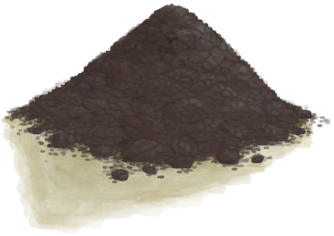

[返回首页](index.md)   |  [查看所有建筑](building.md)
# 杏仁树田  
> 我应该让田地保持水分，等它成熟。  
  
  属性  |   图片   
 ----  |  ----:   
 **标签：**	[“农作物”](tag_Crop.md)  **可使用次数：**384  |     
  
## 获取来源  
来源  |  操作  
----  |  ----  
[杏仁树田](CropPlotAlmondTree.md) , [椰子水](LQ_CoconutWater.md)  |  浇水  
[杏仁树田](CropPlotAlmondTree.md) , [“肥料”](tag_Fertilizer.md)  |  施肥  
[杏仁树田](CropPlotAlmondTree.md) , [“低效肥料”](tag_FertilizerWeak.md)  |  施肥  
[芦荟田](CropPlotAloeVera.md) , [椰子水](LQ_CoconutWater.md)  |  浇水  
[芦荟田](CropPlotAloeVera.md) , [“肥料”](tag_Fertilizer.md)  |  施肥  
[芦荟田](CropPlotAloeVera.md) , [“低效肥料”](tag_FertilizerWeak.md)  |  施肥  
[香蕉树田](CropPlotBananaTree.md) , [椰子水](LQ_CoconutWater.md)  |  浇水  
[香蕉树田](CropPlotBananaTree.md) , [“肥料”](tag_Fertilizer.md)  |  施肥  
[香蕉树田](CropPlotBananaTree.md) , [“低效肥料”](tag_FertilizerWeak.md)  |  施肥  
[辣椒田](CropPlotChilies.md) , [椰子水](LQ_CoconutWater.md)  |  浇水  
[辣椒田](CropPlotChilies.md) , [“肥料”](tag_Fertilizer.md)  |  施肥  
[辣椒田](CropPlotChilies.md) , [“低效肥料”](tag_FertilizerWeak.md)  |  施肥  
[月季田](CropPlotChinaRose.md) , [椰子水](LQ_CoconutWater.md)  |  浇水  
[月季田](CropPlotChinaRose.md) , [“肥料”](tag_Fertilizer.md)  |  施肥  
[月季田](CropPlotChinaRose.md) , [“低效肥料”](tag_FertilizerWeak.md)  |  施肥  
[咖啡田](CropPlotCoffee.md) , [椰子水](LQ_CoconutWater.md)  |  浇水  
[咖啡田](CropPlotCoffee.md) , [“肥料”](tag_Fertilizer.md)  |  施肥  
[咖啡田](CropPlotCoffee.md) , [“低效肥料”](tag_FertilizerWeak.md)  |  施肥  
[未浇灌的农田](CropPlotDry.md) , [“肥料”](tag_Fertilizer.md)  |  施肥  
[未浇灌的农田](CropPlotDry.md) , [“低效肥料”](tag_FertilizerWeak.md)  |  施肥  
[未栽种的农田(空)](CropPlotEmpty.md) , [热带杏仁](TropicalAlmonds.md)  |  种植热带杏仁  
[未栽种的农田(空)](CropPlotEmpty.md) , [椰子水](LQ_CoconutWater.md)  |  浇水  
[未栽种的农田(空)](CropPlotEmpty.md) , [“肥料”](tag_Fertilizer.md)  |  施肥  
[未栽种的农田(空)](CropPlotEmpty.md) , [“低效肥料”](tag_FertilizerWeak.md)  |  施肥  
[姜田](CropPlotGinger.md) , [椰子水](LQ_CoconutWater.md)  |  浇水  
[姜田](CropPlotGinger.md) , [“肥料”](tag_Fertilizer.md)  |  施肥  
[姜田](CropPlotGinger.md) , [“低效肥料”](tag_FertilizerWeak.md)  |  施肥  
[茉莉花田](CropPlotJasmine.md) , [椰子水](LQ_CoconutWater.md)  |  浇水  
[茉莉花田](CropPlotJasmine.md) , [“肥料”](tag_Fertilizer.md)  |  施肥  
[茉莉花田](CropPlotJasmine.md) , [“低效肥料”](tag_FertilizerWeak.md)  |  施肥  
[卡瓦胡椒田](CropPlotKava.md) , [椰子水](LQ_CoconutWater.md)  |  浇水  
[卡瓦胡椒田](CropPlotKava.md) , [“肥料”](tag_Fertilizer.md)  |  施肥  
[卡瓦胡椒田](CropPlotKava.md) , [“低效肥料”](tag_FertilizerWeak.md)  |  施肥  
[柠檬草田](CropPlotLemonGrass.md) , [椰子水](LQ_CoconutWater.md)  |  浇水  
[柠檬草田](CropPlotLemonGrass.md) , [“肥料”](tag_Fertilizer.md)  |  施肥  
[柠檬草田](CropPlotLemonGrass.md) , [“低效肥料”](tag_FertilizerWeak.md)  |  施肥  
[水椰树田](CropPlotNipaPalm.md) , [椰子水](LQ_CoconutWater.md)  |  浇水  
[水椰树田](CropPlotNipaPalm.md) , [“肥料”](tag_Fertilizer.md)  |  施肥  
[水椰树田](CropPlotNipaPalm.md) , [“低效肥料”](tag_FertilizerWeak.md)  |  施肥  
[稻田](CropPlotRice.md) , [椰子水](LQ_CoconutWater.md)  |  浇水  
[稻田](CropPlotRice.md) , [“肥料”](tag_Fertilizer.md)  |  施肥  
[稻田](CropPlotRice.md) , [“低效肥料”](tag_FertilizerWeak.md)  |  施肥  
[毁坏的田地](CropPlotRuined.md) , [椰子水](LQ_CoconutWater.md)  |  浇水  
[毁坏的田地](CropPlotRuined.md) , [“肥料”](tag_Fertilizer.md)  |  施肥  
[毁坏的田地](CropPlotRuined.md) , [“低效肥料”](tag_FertilizerWeak.md)  |  施肥  
[西米树田](CropPlotSagoPalm.md) , [椰子水](LQ_CoconutWater.md)  |  浇水  
[西米树田](CropPlotSagoPalm.md) , [“肥料”](tag_Fertilizer.md)  |  施肥  
[西米树田](CropPlotSagoPalm.md) , [“低效肥料”](tag_FertilizerWeak.md)  |  施肥  
[蛇草田](CropPlotSnakeGrass.md) , [椰子水](LQ_CoconutWater.md)  |  浇水  
[蛇草田](CropPlotSnakeGrass.md) , [“肥料”](tag_Fertilizer.md)  |  施肥  
[蛇草田](CropPlotSnakeGrass.md) , [“低效肥料”](tag_FertilizerWeak.md)  |  施肥  
[蜘蛛兰田](CropPlotSpiderLily.md) , [椰子水](LQ_CoconutWater.md)  |  浇水  
[蜘蛛兰田](CropPlotSpiderLily.md) , [“肥料”](tag_Fertilizer.md)  |  施肥  
[蜘蛛兰田](CropPlotSpiderLily.md) , [“低效肥料”](tag_FertilizerWeak.md)  |  施肥  
[大叶仙茅田](CropPlotWeevilLily.md) , [椰子水](LQ_CoconutWater.md)  |  浇水  
[大叶仙茅田](CropPlotWeevilLily.md) , [“肥料”](tag_Fertilizer.md)  |  施肥  
[大叶仙茅田](CropPlotWeevilLily.md) , [“低效肥料”](tag_FertilizerWeak.md)  |  施肥  
[野枣田](CropPlotWildJujube.md) , [椰子水](LQ_CoconutWater.md)  |  浇水  
[野枣田](CropPlotWildJujube.md) , [“肥料”](tag_Fertilizer.md)  |  施肥  
[野枣田](CropPlotWildJujube.md) , [“低效肥料”](tag_FertilizerWeak.md)  |  施肥  
[参薯田](CropPlotYam.md) , [椰子水](LQ_CoconutWater.md)  |  浇水  
[参薯田](CropPlotYam.md) , [“肥料”](tag_Fertilizer.md)  |  施肥  
[参薯田](CropPlotYam.md) , [“低效肥料”](tag_FertilizerWeak.md)  |  施肥  
[杂菌菌床](MushroomBedAssorted.md) , [椰子水](LQ_CoconutWater.md)  |  浇水  
[杂菌菌床](MushroomBedAssorted.md) , [“肥料”](tag_Fertilizer.md)  |  施肥  
[杂菌菌床](MushroomBedAssorted.md) , [“低效肥料”](tag_FertilizerWeak.md)  |  施肥  
[未浇灌的菌床](MushroomBedDry.md) , [“肥料”](tag_Fertilizer.md)  |  施肥  
[未浇灌的菌床](MushroomBedDry.md) , [“低效肥料”](tag_FertilizerWeak.md)  |  施肥  
[未种植的菌床(空)](MushroomBedEmpty.md) , [椰子水](LQ_CoconutWater.md)  |  浇水  
[未种植的菌床(空)](MushroomBedEmpty.md) , [“肥料”](tag_Fertilizer.md)  |  施肥  
[未种植的菌床(空)](MushroomBedEmpty.md) , [“低效肥料”](tag_FertilizerWeak.md)  |  施肥  
[迷幻菇菌床](MushroomBedMagic.md) , [椰子水](LQ_CoconutWater.md)  |  浇水  
[迷幻菇菌床](MushroomBedMagic.md) , [“肥料”](tag_Fertilizer.md)  |  施肥  
[迷幻菇菌床](MushroomBedMagic.md) , [“低效肥料”](tag_FertilizerWeak.md)  |  施肥  
[马勃菌菌床](MushroomBedPuffballs.md) , [椰子水](LQ_CoconutWater.md)  |  浇水  
[马勃菌菌床](MushroomBedPuffballs.md) , [“肥料”](tag_Fertilizer.md)  |  施肥  
[马勃菌菌床](MushroomBedPuffballs.md) , [“低效肥料”](tag_FertilizerWeak.md)  |  施肥  
[硝石矿床](NiterBed.md) , [碱液](LQ_Lye.md)  |  倒入碱液  
## 动作  
动作  |  时间  |  条件  |  变化  |  状态  
----  |  ----  |  ----  |  ----  |  ----  
摧毁  |  30分  |    |  → [未栽种的农田(空)](CropPlotEmpty.md)   |  [药草学(技能)](Skill_Herbology.md)+0.5 [污垢](Filth.md)+25  
## 可拖入  
使用  |  动作  |  时间  |  条件  |  变化  |  状态  
----  |  ----  |  ----  |  ----  |  ----  |  ----  
[椰子水](LQ_CoconutWater.md)  |  浇水  |  -  |    |  自身: → [杏仁树田](CropPlotAlmondTree.md) 燃料 + 96  使用物: → [椰壶](CoconutFlask.md) 含水量  -300    |    
[“肥料”](tag_Fertilizer.md)  |  施肥  |  15分  |    |  自身: → [杏仁树田](CropPlotAlmondTree.md) 耐久 + 384  使用物: → [陶碗](ClayBowl.md) 可用次数  -1    |    
[“低效肥料”](tag_FertilizerWeak.md)  |  施肥  |  15分  |    |  自身: → [杏仁树田](CropPlotAlmondTree.md) 耐久 + 96  使用物: → [陶碗](ClayBowl.md) 可用次数  -1    |    
## 可拖至  
[硫磺农药](LQ_PesticideBrimstone.md), [辣椒农药](LQ_PesticideChilli.md)  
## 变化  
操作  |  值  |  时间  |  变化  
----  |  ----  |  ----  |  ----  
肥力  |  初始：0 最大：384  |  每15分钟-1 最多需要：4天  |    
健康度  |  初始：384 最大：384  |  每15分钟+1 最多需要：4天  |  → [毁坏的田地](CropPlotRuined.md)  
水分  |  初始：192 最大：288  |  每15分钟-1 最多需要：3天  |  → [未浇灌的农田](CropPlotDry.md)  
成熟度  |  初始：0 最大：672  |  每15分钟+0.5 最多需要：14天  |  [小杏仁树](TropicalAlmondTreeYoung.md)+1   → [西米粉](SagoFlour.md)  
农药 — 螨虫  |  初始：0 最大：288  |  每15分钟-1 最多需要：3天  |    
农药 — 真菌  |  初始：0 最大：288  |  每15分钟-1 最多需要：3天  |    
螨虫侵害  |  初始：0 最大：100  |  每15分钟-1 最多需要：1天1小时  |    
真菌感染  |  初始：0 最大：288  |  每15分钟-1 最多需要：3天  |    
