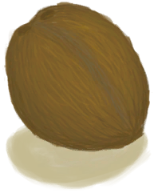

# 未栽种的农田  
> 我应该在这儿种点什么。  
  
<table class="table table-bordered table2333" data-toggle="table"  data-show-header="false"><thead style="display:none"><tr ><th  style="width:50%;"  >title</th><th  style="width:50%;"  ></th></tr></thead><tr ><td  style="width:50%;"  >**标签：**	[“农作物”](tag_Crop.md)</td><td  style="width:50%;"  >

<a href="CropPlotEmpty.md" style="color:black">未栽种的农田</a>

</td></tr></tbody></table>  
  
## 获取来源  

摧毁

[杏仁树田](CropPlotAlmondTree.md)

摧毁

[芦荟田](CropPlotAloeVera.md)

摧毁

[香蕉树田](CropPlotBananaTree.md)

摧毁

[辣椒田](CropPlotChilies.md)

摧毁

[月季田](CropPlotChinaRose.md)

摧毁

[金鸡纳树田](CropPlotCinchonaTree.md)

摧毁

[咖啡田](CropPlotCoffee.md)

** 使用**[椰子水](LQ_CoconutWater.md) , [“灌溉用水”](tag_WaterFresh.md)浇水

[未浇灌的农田](CropPlotDry.md)

雨水

[未浇灌的农田](CropPlotDry.md)

摧毁

[姜田](CropPlotGinger.md)

摧毁

[茉莉花田](CropPlotJasmine.md)

摧毁

[卡瓦胡椒田](CropPlotKava.md)

摧毁

[柠檬草田](CropPlotLemonGrass.md)

摧毁

[芒果树田](CropPlotMangoTree.md)

摧毁

[水椰树田](CropPlotNipaPalm.md)

摧毁

[棕榈丛田](CropPlotPalmBush.md)

摧毁

[椰子树田](CropPlotPalmTree.md)

摧毁

[稻田](CropPlotRice.md)

摧毁

[毁坏的田地](CropPlotRuined.md)

摧毁

[西米树田](CropPlotSagoPalm.md)

摧毁

[蛇草田](CropPlotSnakeGrass.md)

摧毁

[蜘蛛兰田](CropPlotSpiderLily.md)

摧毁

[大叶仙茅田](CropPlotWeevilLily.md)

摧毁

[野枣田](CropPlotWildJujube.md)

摧毁

[参薯田](CropPlotYam.md)

  
  
## 可拖入  

<table style="margin-bottom:0px;"><tr><td style="width:40%;text-align:left; background-color:#FEFEFE"><b>拖入：</b>[

[金鸡纳树皮](BarkCinchona.md)](BarkCinchona.md)</td><td style="width:40%;font-size:1em;font-weight:bold;background-color:#FEFEFE">种植金鸡纳树 (30分) </td></tr><tr style="background-color:#FFFFFF"><td style=""><b>使用物：</b>→消失</td><td style=""><b>自身：</b>→ [

[金鸡纳树田](CropPlotCinchonaTree.md)](CropPlotCinchonaTree.md)</td></tr><tr><td colspan="2"><b>状态变化：</b>[

[污垢](Filth.md)](Filth.md)<b>+10</b></td></tr></table>
  

<table style="margin-bottom:0px;"><tr><td style="width:40%;text-align:left; background-color:#FEFEFE"><b>拖入：</b>[

[野枣](JujubeFruits.md)](JujubeFruits.md)</td><td style="width:40%;font-size:1em;font-weight:bold;background-color:#FEFEFE">种植野枣 (30分) </td></tr><tr style="background-color:#FFFFFF"><td style=""><b>使用物：</b>→消失</td><td style=""><b>自身：</b>→ [

[野枣田](CropPlotWildJujube.md)](CropPlotWildJujube.md)</td></tr><tr><td colspan="2"><b>状态变化：</b>[

[污垢](Filth.md)](Filth.md)<b>+10</b></td></tr></table>
  

<table style="margin-bottom:0px;"><tr><td style="width:40%;text-align:left; background-color:#FEFEFE"><b>拖入：</b>[

[稻米](RiceGrains.md)](RiceGrains.md)</td><td style="width:40%;font-size:1em;font-weight:bold;background-color:#FEFEFE">种植水稻 (30分) </td></tr><tr style="background-color:#FFFFFF"><td style=""><b>使用物：</b>→消失</td><td style=""><b>自身：</b>→ [

[稻田](CropPlotRice.md)](CropPlotRice.md)</td></tr><tr><td colspan="2"><b>状态变化：</b>[

[污垢](Filth.md)](Filth.md)<b>+10</b></td></tr></table>
  

<table style="margin-bottom:0px;"><tr><td style="width:40%;text-align:left; background-color:#FEFEFE"><b>拖入：</b>[

[咖啡豆](CoffeeBeans.md)](CoffeeBeans.md)</td><td style="width:40%;font-size:1em;font-weight:bold;background-color:#FEFEFE">种植咖啡 (30分) </td></tr><tr style="background-color:#FFFFFF"><td style=""><b>使用物：</b>→消失</td><td style=""><b>自身：</b>→ [

[咖啡田](CropPlotCoffee.md)](CropPlotCoffee.md)</td></tr><tr><td colspan="2"><b>状态变化：</b>[

[污垢](Filth.md)](Filth.md)<b>+10</b></td></tr></table>
  

<table style="margin-bottom:0px;"><tr><td style="width:40%;text-align:left; background-color:#FEFEFE"><b>拖入：</b>[

[柠檬草](LemongrassStalks.md)](LemongrassStalks.md)</td><td style="width:40%;font-size:1em;font-weight:bold;background-color:#FEFEFE">种植柠檬草 (30分) </td></tr><tr style="background-color:#FFFFFF"><td style=""><b>使用物：</b>→消失</td><td style=""><b>自身：</b>→ [

[柠檬草田](CropPlotLemonGrass.md)](CropPlotLemonGrass.md)</td></tr><tr><td colspan="2"><b>状态变化：</b>[

[污垢](Filth.md)](Filth.md)<b>+10</b></td></tr></table>
  

<table style="margin-bottom:0px;"><tr><td style="width:40%;text-align:left; background-color:#FEFEFE"><b>拖入：</b>[

[蛇草](SnakeGrass.md)](SnakeGrass.md)</td><td style="width:40%;font-size:1em;font-weight:bold;background-color:#FEFEFE">种植蛇草 (30分) </td></tr><tr style="background-color:#FFFFFF"><td style=""><b>使用物：</b>→消失</td><td style=""><b>自身：</b>→ [

[蛇草田](CropPlotSnakeGrass.md)](CropPlotSnakeGrass.md)</td></tr><tr><td colspan="2"><b>状态变化：</b>[

[污垢](Filth.md)](Filth.md)<b>+10</b></td></tr></table>
  

<table style="margin-bottom:0px;"><tr><td style="width:40%;text-align:left; background-color:#FEFEFE"><b>拖入：</b>[

[芦荟叶](AloeVeraLeaf.md)](AloeVeraLeaf.md)</td><td style="width:40%;font-size:1em;font-weight:bold;background-color:#FEFEFE">种植芦荟 (30分) </td></tr><tr style="background-color:#FFFFFF"><td style=""><b>使用物：</b>→消失</td><td style=""><b>自身：</b>→ [

[芦荟田](CropPlotAloeVera.md)](CropPlotAloeVera.md)</td></tr><tr><td colspan="2"><b>状态变化：</b>[

[污垢](Filth.md)](Filth.md)<b>+10</b></td></tr></table>
  

<table style="margin-bottom:0px;"><tr><td style="width:40%;text-align:left; background-color:#FEFEFE"><b>拖入：</b>[

[卡瓦根](KavaRoot.md)](KavaRoot.md)</td><td style="width:40%;font-size:1em;font-weight:bold;background-color:#FEFEFE">种植卡瓦胡椒 (30分) </td></tr><tr style="background-color:#FFFFFF"><td style=""><b>使用物：</b>→消失</td><td style=""><b>自身：</b>→ [

[卡瓦胡椒田](CropPlotKava.md)](CropPlotKava.md)</td></tr><tr><td colspan="2"><b>状态变化：</b>[

[污垢](Filth.md)](Filth.md)<b>+10</b></td></tr></table>
  

<table style="margin-bottom:0px;"><tr><td style="width:40%;text-align:left; background-color:#FEFEFE"><b>拖入：</b>[

[蜘蛛兰叶](SpiderLilyLeaves.md)](SpiderLilyLeaves.md)</td><td style="width:40%;font-size:1em;font-weight:bold;background-color:#FEFEFE">种植蜘蛛兰 (30分) </td></tr><tr style="background-color:#FFFFFF"><td style=""><b>使用物：</b>→消失</td><td style=""><b>自身：</b>→ [

[蜘蛛兰田](CropPlotSpiderLily.md)](CropPlotSpiderLily.md)</td></tr><tr><td colspan="2"><b>状态变化：</b>[

[污垢](Filth.md)](Filth.md)<b>+10</b></td></tr></table>
  

<table style="margin-bottom:0px;"><tr><td style="width:40%;text-align:left; background-color:#FEFEFE"><b>拖入：</b>[

[姜](Ginger.md)](Ginger.md)</td><td style="width:40%;font-size:1em;font-weight:bold;background-color:#FEFEFE">种植姜 (30分) </td></tr><tr style="background-color:#FFFFFF"><td style=""><b>使用物：</b>→消失</td><td style=""><b>自身：</b>→ [

[姜田](CropPlotGinger.md)](CropPlotGinger.md)</td></tr><tr><td colspan="2"><b>状态变化：</b>[

[污垢](Filth.md)](Filth.md)<b>+10</b></td></tr></table>
  

<table style="margin-bottom:0px;"><tr><td style="width:40%;text-align:left; background-color:#FEFEFE"><b>拖入：</b>[

[参薯](Yam.md)](Yam.md)</td><td style="width:40%;font-size:1em;font-weight:bold;background-color:#FEFEFE">种植参薯 (30分) </td></tr><tr style="background-color:#FFFFFF"><td style=""><b>使用物：</b>→消失</td><td style=""><b>自身：</b>→ [

[参薯田](CropPlotYam.md)](CropPlotYam.md)</td></tr><tr><td colspan="2"><b>状态变化：</b>[

[污垢](Filth.md)](Filth.md)<b>+10</b></td></tr></table>
  

<table style="margin-bottom:0px;"><tr><td style="width:40%;text-align:left; background-color:#FEFEFE"><b>拖入：</b>[

[大叶仙茅叶片](WeevilLilyLeaves.md)](WeevilLilyLeaves.md)</td><td style="width:40%;font-size:1em;font-weight:bold;background-color:#FEFEFE">种植大叶仙茅 (30分) </td></tr><tr style="background-color:#FFFFFF"><td style=""><b>使用物：</b>→消失</td><td style=""><b>自身：</b>→ [

[大叶仙茅田](CropPlotWeevilLily.md)](CropPlotWeevilLily.md)</td></tr><tr><td colspan="2"><b>状态变化：</b>[

[污垢](Filth.md)](Filth.md)<b>+10</b></td></tr></table>
  

<table style="margin-bottom:0px;"><tr><td style="width:40%;text-align:left; background-color:#FEFEFE"><b>拖入：</b>[

[辣椒](Chilies.md)](Chilies.md)</td><td style="width:40%;font-size:1em;font-weight:bold;background-color:#FEFEFE">种植辣椒 (30分) </td></tr><tr style="background-color:#FFFFFF"><td style=""><b>使用物：</b>→消失</td><td style=""><b>自身：</b>→ [

[辣椒田](CropPlotChilies.md)](CropPlotChilies.md)</td></tr><tr><td colspan="2"><b>状态变化：</b>[

[污垢](Filth.md)](Filth.md)<b>+10</b></td></tr></table>
  

<table style="margin-bottom:0px;"><tr><td style="width:40%;text-align:left; background-color:#FEFEFE"><b>拖入：</b>[

[茉莉花](JasmineFlowers.md)](JasmineFlowers.md)</td><td style="width:40%;font-size:1em;font-weight:bold;background-color:#FEFEFE">种植茉莉花 (30分) </td></tr><tr style="background-color:#FFFFFF"><td style=""><b>使用物：</b>→消失</td><td style=""><b>自身：</b>→ [

[茉莉花田](CropPlotJasmine.md)](CropPlotJasmine.md)</td></tr><tr><td colspan="2"><b>状态变化：</b>[

[污垢](Filth.md)](Filth.md)<b>+10</b></td></tr></table>
  

<table style="margin-bottom:0px;"><tr><td style="width:40%;text-align:left; background-color:#FEFEFE"><b>拖入：</b>[

[月季](ChinaRoseFlowers.md)](ChinaRoseFlowers.md)</td><td style="width:40%;font-size:1em;font-weight:bold;background-color:#FEFEFE">种植月季花 (30分) </td></tr><tr style="background-color:#FFFFFF"><td style=""><b>使用物：</b>→消失</td><td style=""><b>自身：</b>→ [

[月季田](CropPlotChinaRose.md)](CropPlotChinaRose.md)</td></tr><tr><td colspan="2"><b>状态变化：</b>[

[污垢](Filth.md)](Filth.md)<b>+10</b></td></tr></table>
  

<table style="margin-bottom:0px;"><tr><td style="width:40%;text-align:left; background-color:#FEFEFE"><b>拖入：</b>[

[热带杏仁](TropicalAlmonds.md)](TropicalAlmonds.md)</td><td style="width:40%;font-size:1em;font-weight:bold;background-color:#FEFEFE">种植热带杏仁 (30分) </td></tr><tr style="background-color:#FFFFFF"><td style=""><b>使用物：</b>→消失</td><td style=""><b>自身：</b>→ [

[杏仁树田](CropPlotAlmondTree.md)](CropPlotAlmondTree.md)</td></tr><tr><td colspan="2"><b>状态变化：</b>[

[污垢](Filth.md)](Filth.md)<b>+10</b></td></tr></table>
  

<table style="margin-bottom:0px;"><tr><td style="width:40%;text-align:left; background-color:#FEFEFE"><b>拖入：</b>[

[香蕉](Banana.md)](Banana.md)</td><td style="width:40%;font-size:1em;font-weight:bold;background-color:#FEFEFE">种植香蕉树 (30分) </td></tr><tr style="background-color:#FFFFFF"><td style=""><b>使用物：</b>→消失</td><td style=""><b>自身：</b>→ [

[香蕉树田](CropPlotBananaTree.md)](CropPlotBananaTree.md)</td></tr><tr><td colspan="2"><b>状态变化：</b>[

[污垢](Filth.md)](Filth.md)<b>+10</b></td></tr></table>
  

<table style="margin-bottom:0px;"><tr><td style="width:40%;text-align:left; background-color:#FEFEFE"><b>拖入：</b>[

[水椰籽](NipaSeeds.md)](NipaSeeds.md)</td><td style="width:40%;font-size:1em;font-weight:bold;background-color:#FEFEFE">种植水椰 (30分) </td></tr><tr style="background-color:#FFFFFF"><td style=""><b>使用物：</b>→消失</td><td style=""><b>自身：</b>→ [

[水椰树田](CropPlotNipaPalm.md)](CropPlotNipaPalm.md)</td></tr><tr><td colspan="2"><b>状态变化：</b>[

[污垢](Filth.md)](Filth.md)<b>+10</b></td></tr></table>
  

<table style="margin-bottom:0px;"><tr><td style="width:40%;text-align:left; background-color:#FEFEFE"><b>拖入：</b>[

[西米树种](SagoSeeds.md)](SagoSeeds.md)</td><td style="width:40%;font-size:1em;font-weight:bold;background-color:#FEFEFE">种植西米树 (30分) </td></tr><tr style="background-color:#FFFFFF"><td style=""><b>使用物：</b>→消失</td><td style=""><b>自身：</b>→ [

[西米树田](CropPlotSagoPalm.md)](CropPlotSagoPalm.md)</td></tr><tr><td colspan="2"><b>状态变化：</b>[

[污垢](Filth.md)](Filth.md)<b>+10</b></td></tr></table>
  

<table style="margin-bottom:0px;"><tr><td style="width:40%;text-align:left; background-color:#FEFEFE"><b>拖入：</b>[

[椰子](Coconut.md)](Coconut.md) | [

[青椰子](CoconutHusked.md)](CoconutHusked.md)</td><td style="width:40%;font-size:1em;font-weight:bold;background-color:#FEFEFE">种植椰子树 (30分) </td></tr><tr style="background-color:#FFFFFF"><td style=""><b>使用物：</b>→消失</td><td style=""><b>自身：</b>→ [

[椰子树田](CropPlotPalmTree.md)](CropPlotPalmTree.md)</td></tr><tr><td colspan="2"><b>状态变化：</b>[

[污垢](Filth.md)](Filth.md)<b>+10</b></td></tr></table>
  

<table style="margin-bottom:0px;"><tr><td style="width:40%;text-align:left; background-color:#FEFEFE"><b>拖入：</b>[

[芒果](Mango.md)](Mango.md)</td><td style="width:40%;font-size:1em;font-weight:bold;background-color:#FEFEFE">种植芒果树 (30分) </td></tr><tr style="background-color:#FFFFFF"><td style=""><b>使用物：</b>→消失</td><td style=""><b>自身：</b>→ [

[芒果树田](CropPlotMangoTree.md)](CropPlotMangoTree.md)</td></tr><tr><td colspan="2"><b>状态变化：</b>[

[污垢](Filth.md)](Filth.md)<b>+10</b></td></tr></table>
  

<table style="margin-bottom:0px;"><tr><td style="width:40%;text-align:left; background-color:#FEFEFE"><b>拖入：</b>[

[棕榈丛种子](PalmBushSeeds.md)](PalmBushSeeds.md)</td><td style="width:40%;font-size:1em;font-weight:bold;background-color:#FEFEFE">种植棕榈丛 (30分) </td></tr><tr style="background-color:#FFFFFF"><td style=""><b>使用物：</b>→消失</td><td style=""><b>自身：</b>→ [

[棕榈丛田](CropPlotPalmBush.md)](CropPlotPalmBush.md)</td></tr><tr><td colspan="2"><b>状态变化：</b>[

[污垢](Filth.md)](Filth.md)<b>+10</b></td></tr></table>
  

<table style="margin-bottom:0px;"><tr><td style="width:40%;text-align:left; background-color:#FEFEFE"><b>拖入：</b>[

[椰子水](LQ_CoconutWater.md)](LQ_CoconutWater.md) | [“灌溉用水”](tag_WaterFresh.md)</td><td style="width:40%;font-size:1em;font-weight:bold;background-color:#FEFEFE">浇水  </td></tr><tr style="background-color:#FFFFFF"><td style=""><b>使用物：</b>含水量  <b>-300</b></td><td style=""><b>自身：</b>水分

  <b>+96(33.33%)</b></td></tr></table>
  

<table style="margin-bottom:0px;"><tr><td style="width:40%;text-align:left; background-color:#FEFEFE"><b>拖入：</b>[“肥料”](tag_Fertilizer.md)</td><td style="width:40%;font-size:1em;font-weight:bold;background-color:#FEFEFE">施肥 (15分) </td></tr><tr style="background-color:#FFFFFF"><td style=""><b>使用物：</b>→消失, 可用次数  <b>-1</b></td><td style=""><b>自身：</b>肥力

  <b>+384(100%)</b></td></tr></table>
  

<table style="margin-bottom:0px;"><tr><td style="width:40%;text-align:left; background-color:#FEFEFE"><b>拖入：</b>[“低效肥料”](tag_FertilizerWeak.md)</td><td style="width:40%;font-size:1em;font-weight:bold;background-color:#FEFEFE">施肥 (15分) </td></tr><tr style="background-color:#FFFFFF"><td style=""><b>使用物：</b>→消失, 可用次数  <b>-1</b></td><td style=""><b>自身：</b>肥力

  <b>+96(25%)</b></td></tr></table>
  
  
## 可拖至  

[硫磺农薬](LQ_PesticideBrimstone.md)

[辣椒农薬](LQ_PesticideChilli.md)

  
  
## 属性   

<table style="margin-bottom:0px;"><tr><td style="width:30%;text-align:left; background-color:#FEFEFE;font-size:1.3em;font-weight:bold;">

肥力</td><td style="font-size:1em;background-color:#FEFEFE">初始：0 , 最大：384 每15分钟-1 , 最多需要：4天</td></tr><tr style="background-color:#FFFFFF"><td colspan=2></td></tr></table>
  

<table style="margin-bottom:0px;"><tr><td style="width:30%;text-align:left; background-color:#FEFEFE;font-size:1.3em;font-weight:bold;">

水分</td><td style="font-size:1em;background-color:#FEFEFE">初始：192 , 最大：288 每15分钟-1 , 最多需要：3天</td></tr><tr style="background-color:#FFFFFF"><td colspan=2>** 到达0时： ** 自身: → [

[未浇灌的农田](CropPlotDry.md)](CropPlotDry.md)</td></tr></table>
  
## 被动效果  
<table class="table table-bordered table6569" data-toggle="table"  ><thead style=""><tr ><th  style=""  >名称</th><th  style=""  >条件</th><th  style=""  >变化(每15分钟)</th><th  style=""  data-sortable="true"  >玩家状态</th></tr></thead><tr ><td  style=""  >Rain</td><td  style=""  >** 需要状态：** [

[降水值](RainValue.md)](RainValue.md): <b>1-5</b></td><td  style=""  >水分

 +25(8.68%)</td><td  style=""  ></td></tr></tbody></table>  
  

