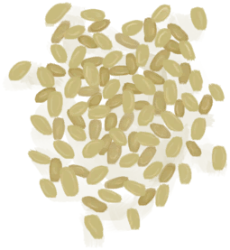

# 未栽种的农田  
> 我应该在这儿种点什么。  
   
>   
  
<table class="table table-bordered" data-toggle="table" ><tbody><tr ><td  style="width:80%;text-align:left;vertical-align:top;"  >**标签：**	[“农作物”](tag_Crop.md)</td><td  style="width:20%;text-align:left;vertical-align:top;"  >

</td></tr></tbody></tbody></table>  
  
## 获取来源  
<table class="table table-bordered" data-toggle="table" ><thead><tr ><th  style="text-align:left;vertical-align:top;"  >来源</th><th  style="text-align:left;vertical-align:top;"  >操作</th></tr></thead><tr ><td  style="text-align:left;vertical-align:top;"  >[

[杏仁树田](CropPlotAlmondTree.md)](CropPlotAlmondTree.md)</td><td  style="text-align:left;vertical-align:top;"  >摧毁</td></tr><tr ><td  style="text-align:left;vertical-align:top;"  >[

[芦荟田](CropPlotAloeVera.md)](CropPlotAloeVera.md)</td><td  style="text-align:left;vertical-align:top;"  >摧毁</td></tr><tr ><td  style="text-align:left;vertical-align:top;"  >[

[香蕉树田](CropPlotBananaTree.md)](CropPlotBananaTree.md)</td><td  style="text-align:left;vertical-align:top;"  >摧毁</td></tr><tr ><td  style="text-align:left;vertical-align:top;"  >[

[辣椒田](CropPlotChilies.md)](CropPlotChilies.md)</td><td  style="text-align:left;vertical-align:top;"  >摧毁</td></tr><tr ><td  style="text-align:left;vertical-align:top;"  >[

[月季田](CropPlotChinaRose.md)](CropPlotChinaRose.md)</td><td  style="text-align:left;vertical-align:top;"  >摧毁</td></tr><tr ><td  style="text-align:left;vertical-align:top;"  >[

[金鸡纳树田](CropPlotCinchonaTree.md)](CropPlotCinchonaTree.md)</td><td  style="text-align:left;vertical-align:top;"  >摧毁</td></tr><tr ><td  style="text-align:left;vertical-align:top;"  >[

[咖啡田](CropPlotCoffee.md)](CropPlotCoffee.md)</td><td  style="text-align:left;vertical-align:top;"  >摧毁</td></tr><tr ><td  style="text-align:left;vertical-align:top;"  >[

[未浇灌的农田](CropPlotDry.md)](CropPlotDry.md)</td><td  style="text-align:left;vertical-align:top;"  >浇水 ** 拖入：**[椰子水](LQ_CoconutWater.md) , [“灌溉用水”](tag_WaterFresh.md)</td></tr><tr ><td  style="text-align:left;vertical-align:top;"  >[

[未浇灌的农田](CropPlotDry.md)](CropPlotDry.md)</td><td  style="text-align:left;vertical-align:top;"  >雨水</td></tr><tr ><td  style="text-align:left;vertical-align:top;"  >[

[姜田](CropPlotGinger.md)](CropPlotGinger.md)</td><td  style="text-align:left;vertical-align:top;"  >摧毁</td></tr><tr ><td  style="text-align:left;vertical-align:top;"  >[

[茉莉花田](CropPlotJasmine.md)](CropPlotJasmine.md)</td><td  style="text-align:left;vertical-align:top;"  >摧毁</td></tr><tr ><td  style="text-align:left;vertical-align:top;"  >[

[卡瓦胡椒田](CropPlotKava.md)](CropPlotKava.md)</td><td  style="text-align:left;vertical-align:top;"  >摧毁</td></tr><tr ><td  style="text-align:left;vertical-align:top;"  >[

[柠檬草田](CropPlotLemonGrass.md)](CropPlotLemonGrass.md)</td><td  style="text-align:left;vertical-align:top;"  >摧毁</td></tr><tr ><td  style="text-align:left;vertical-align:top;"  >[

[芒果树田](CropPlotMangoTree.md)](CropPlotMangoTree.md)</td><td  style="text-align:left;vertical-align:top;"  >摧毁</td></tr><tr ><td  style="text-align:left;vertical-align:top;"  >[

[水椰树田](CropPlotNipaPalm.md)](CropPlotNipaPalm.md)</td><td  style="text-align:left;vertical-align:top;"  >摧毁</td></tr><tr ><td  style="text-align:left;vertical-align:top;"  >[

[棕榈丛田](CropPlotPalmBush.md)](CropPlotPalmBush.md)</td><td  style="text-align:left;vertical-align:top;"  >摧毁</td></tr><tr ><td  style="text-align:left;vertical-align:top;"  >[

[椰子树田](CropPlotPalmTree.md)](CropPlotPalmTree.md)</td><td  style="text-align:left;vertical-align:top;"  >摧毁</td></tr><tr ><td  style="text-align:left;vertical-align:top;"  >[

[稻田](CropPlotRice.md)](CropPlotRice.md)</td><td  style="text-align:left;vertical-align:top;"  >摧毁</td></tr><tr ><td  style="text-align:left;vertical-align:top;"  >[

[毁坏的田地](CropPlotRuined.md)](CropPlotRuined.md)</td><td  style="text-align:left;vertical-align:top;"  >摧毁</td></tr><tr ><td  style="text-align:left;vertical-align:top;"  >[

[西米树田](CropPlotSagoPalm.md)](CropPlotSagoPalm.md)</td><td  style="text-align:left;vertical-align:top;"  >摧毁</td></tr><tr ><td  style="text-align:left;vertical-align:top;"  >[

[蛇草田](CropPlotSnakeGrass.md)](CropPlotSnakeGrass.md)</td><td  style="text-align:left;vertical-align:top;"  >摧毁</td></tr><tr ><td  style="text-align:left;vertical-align:top;"  >[

[蜘蛛兰田](CropPlotSpiderLily.md)](CropPlotSpiderLily.md)</td><td  style="text-align:left;vertical-align:top;"  >摧毁</td></tr><tr ><td  style="text-align:left;vertical-align:top;"  >[

[大叶仙茅田](CropPlotWeevilLily.md)](CropPlotWeevilLily.md)</td><td  style="text-align:left;vertical-align:top;"  >摧毁</td></tr><tr ><td  style="text-align:left;vertical-align:top;"  >[

[野枣田](CropPlotWildJujube.md)](CropPlotWildJujube.md)</td><td  style="text-align:left;vertical-align:top;"  >摧毁</td></tr><tr ><td  style="text-align:left;vertical-align:top;"  >[

[参薯田](CropPlotYam.md)](CropPlotYam.md)</td><td  style="text-align:left;vertical-align:top;"  >摧毁</td></tr></tbody></table>  
  
## 可拖入  
<table class="table table-bordered" data-toggle="table" ><thead><tr ><th  style="text-align:left;vertical-align:top;"  >使用</th><th  style="text-align:left;vertical-align:top;"  >动作</th><th  style="text-align:left;vertical-align:top;"  >耗时</th><th  style="text-align:left;vertical-align:top;"  data-sortable="true"  >条件</th><th  style="text-align:left;vertical-align:top;"  >变化</th><th  style="text-align:left;vertical-align:top;"  >玩家状态</th></tr></thead><tr ><td  style="text-align:left;vertical-align:top;"  >[

[金鸡纳树皮](BarkCinchona.md)](BarkCinchona.md)</td><td  style="text-align:left;vertical-align:top;"  >种植金鸡纳树 </td><td  style="text-align:left;vertical-align:top;"  >2TP</td><td  style="text-align:left;vertical-align:top;"  ></td><td  style="text-align:left;vertical-align:top;"  >** 自身: ** → [

[金鸡纳树田](CropPlotCinchonaTree.md)](CropPlotCinchonaTree.md)  ** 使用物: ** →消失</td><td  style="text-align:left;vertical-align:top;"  >[

[污垢](Filth.md)](Filth.md)+10</td></tr><tr ><td  style="text-align:left;vertical-align:top;"  >[

[野枣](JujubeFruits.md)](JujubeFruits.md)</td><td  style="text-align:left;vertical-align:top;"  >种植野枣 </td><td  style="text-align:left;vertical-align:top;"  >2TP</td><td  style="text-align:left;vertical-align:top;"  ></td><td  style="text-align:left;vertical-align:top;"  >** 自身: ** → [

[野枣田](CropPlotWildJujube.md)](CropPlotWildJujube.md)  ** 使用物: ** →消失</td><td  style="text-align:left;vertical-align:top;"  >[

[污垢](Filth.md)](Filth.md)+10</td></tr><tr ><td  style="text-align:left;vertical-align:top;"  >[

[稻米](RiceGrains.md)](RiceGrains.md)</td><td  style="text-align:left;vertical-align:top;"  >种植水稻 </td><td  style="text-align:left;vertical-align:top;"  >2TP</td><td  style="text-align:left;vertical-align:top;"  ></td><td  style="text-align:left;vertical-align:top;"  >** 自身: ** → [

[稻田](CropPlotRice.md)](CropPlotRice.md)  ** 使用物: ** →消失</td><td  style="text-align:left;vertical-align:top;"  >[

[污垢](Filth.md)](Filth.md)+10</td></tr><tr ><td  style="text-align:left;vertical-align:top;"  >[

[咖啡豆](CoffeeBeans.md)](CoffeeBeans.md)</td><td  style="text-align:left;vertical-align:top;"  >种植咖啡 </td><td  style="text-align:left;vertical-align:top;"  >2TP</td><td  style="text-align:left;vertical-align:top;"  ></td><td  style="text-align:left;vertical-align:top;"  >** 自身: ** → [

[咖啡田](CropPlotCoffee.md)](CropPlotCoffee.md)  ** 使用物: ** →消失</td><td  style="text-align:left;vertical-align:top;"  >[

[污垢](Filth.md)](Filth.md)+10</td></tr><tr ><td  style="text-align:left;vertical-align:top;"  >[

[柠檬草](LemongrassStalks.md)](LemongrassStalks.md)</td><td  style="text-align:left;vertical-align:top;"  >种植柠檬草 </td><td  style="text-align:left;vertical-align:top;"  >2TP</td><td  style="text-align:left;vertical-align:top;"  ></td><td  style="text-align:left;vertical-align:top;"  >** 自身: ** → [

[柠檬草田](CropPlotLemonGrass.md)](CropPlotLemonGrass.md)  ** 使用物: ** →消失</td><td  style="text-align:left;vertical-align:top;"  >[

[污垢](Filth.md)](Filth.md)+10</td></tr><tr ><td  style="text-align:left;vertical-align:top;"  >[

[蛇草](SnakeGrass.md)](SnakeGrass.md)</td><td  style="text-align:left;vertical-align:top;"  >种植蛇草 </td><td  style="text-align:left;vertical-align:top;"  >2TP</td><td  style="text-align:left;vertical-align:top;"  ></td><td  style="text-align:left;vertical-align:top;"  >** 自身: ** → [

[蛇草田](CropPlotSnakeGrass.md)](CropPlotSnakeGrass.md)  ** 使用物: ** →消失</td><td  style="text-align:left;vertical-align:top;"  >[

[污垢](Filth.md)](Filth.md)+10</td></tr><tr ><td  style="text-align:left;vertical-align:top;"  >[

[芦荟叶](AloeVeraLeaf.md)](AloeVeraLeaf.md)</td><td  style="text-align:left;vertical-align:top;"  >种植芦荟 </td><td  style="text-align:left;vertical-align:top;"  >2TP</td><td  style="text-align:left;vertical-align:top;"  ></td><td  style="text-align:left;vertical-align:top;"  >** 自身: ** → [

[芦荟田](CropPlotAloeVera.md)](CropPlotAloeVera.md)  ** 使用物: ** →消失</td><td  style="text-align:left;vertical-align:top;"  >[

[污垢](Filth.md)](Filth.md)+10</td></tr><tr ><td  style="text-align:left;vertical-align:top;"  >[

[卡瓦根](KavaRoot.md)](KavaRoot.md)</td><td  style="text-align:left;vertical-align:top;"  >种植卡瓦胡椒 </td><td  style="text-align:left;vertical-align:top;"  >2TP</td><td  style="text-align:left;vertical-align:top;"  ></td><td  style="text-align:left;vertical-align:top;"  >** 自身: ** → [

[卡瓦胡椒田](CropPlotKava.md)](CropPlotKava.md)  ** 使用物: ** →消失</td><td  style="text-align:left;vertical-align:top;"  >[

[污垢](Filth.md)](Filth.md)+10</td></tr><tr ><td  style="text-align:left;vertical-align:top;"  >[

[蜘蛛兰叶](SpiderLilyLeaves.md)](SpiderLilyLeaves.md)</td><td  style="text-align:left;vertical-align:top;"  >种植蜘蛛兰 </td><td  style="text-align:left;vertical-align:top;"  >2TP</td><td  style="text-align:left;vertical-align:top;"  ></td><td  style="text-align:left;vertical-align:top;"  >** 自身: ** → [

[蜘蛛兰田](CropPlotSpiderLily.md)](CropPlotSpiderLily.md)  ** 使用物: ** →消失</td><td  style="text-align:left;vertical-align:top;"  >[

[污垢](Filth.md)](Filth.md)+10</td></tr><tr ><td  style="text-align:left;vertical-align:top;"  >[

[姜](Ginger.md)](Ginger.md)</td><td  style="text-align:left;vertical-align:top;"  >种植姜 </td><td  style="text-align:left;vertical-align:top;"  >2TP</td><td  style="text-align:left;vertical-align:top;"  ></td><td  style="text-align:left;vertical-align:top;"  >** 自身: ** → [

[姜田](CropPlotGinger.md)](CropPlotGinger.md)  ** 使用物: ** →消失</td><td  style="text-align:left;vertical-align:top;"  >[

[污垢](Filth.md)](Filth.md)+10</td></tr><tr ><td  style="text-align:left;vertical-align:top;"  >[

[参薯](Yam.md)](Yam.md)</td><td  style="text-align:left;vertical-align:top;"  >种植参薯 </td><td  style="text-align:left;vertical-align:top;"  >2TP</td><td  style="text-align:left;vertical-align:top;"  ></td><td  style="text-align:left;vertical-align:top;"  >** 自身: ** → [

[参薯田](CropPlotYam.md)](CropPlotYam.md)  ** 使用物: ** →消失</td><td  style="text-align:left;vertical-align:top;"  >[

[污垢](Filth.md)](Filth.md)+10</td></tr><tr ><td  style="text-align:left;vertical-align:top;"  >[

[大叶仙茅叶片](WeevilLilyLeaves.md)](WeevilLilyLeaves.md)</td><td  style="text-align:left;vertical-align:top;"  >种植大叶仙茅 </td><td  style="text-align:left;vertical-align:top;"  >2TP</td><td  style="text-align:left;vertical-align:top;"  ></td><td  style="text-align:left;vertical-align:top;"  >** 自身: ** → [

[大叶仙茅田](CropPlotWeevilLily.md)](CropPlotWeevilLily.md)  ** 使用物: ** →消失</td><td  style="text-align:left;vertical-align:top;"  >[

[污垢](Filth.md)](Filth.md)+10</td></tr><tr ><td  style="text-align:left;vertical-align:top;"  >[

[辣椒](Chilies.md)](Chilies.md)</td><td  style="text-align:left;vertical-align:top;"  >种植辣椒 </td><td  style="text-align:left;vertical-align:top;"  >2TP</td><td  style="text-align:left;vertical-align:top;"  ></td><td  style="text-align:left;vertical-align:top;"  >** 自身: ** → [

[辣椒田](CropPlotChilies.md)](CropPlotChilies.md)  ** 使用物: ** →消失</td><td  style="text-align:left;vertical-align:top;"  >[

[污垢](Filth.md)](Filth.md)+10</td></tr><tr ><td  style="text-align:left;vertical-align:top;"  >[

[茉莉花](JasmineFlowers.md)](JasmineFlowers.md)</td><td  style="text-align:left;vertical-align:top;"  >种植茉莉花 </td><td  style="text-align:left;vertical-align:top;"  >2TP</td><td  style="text-align:left;vertical-align:top;"  ></td><td  style="text-align:left;vertical-align:top;"  >** 自身: ** → [

[茉莉花田](CropPlotJasmine.md)](CropPlotJasmine.md)  ** 使用物: ** →消失</td><td  style="text-align:left;vertical-align:top;"  >[

[污垢](Filth.md)](Filth.md)+10</td></tr><tr ><td  style="text-align:left;vertical-align:top;"  >[

[月季](ChinaRoseFlowers.md)](ChinaRoseFlowers.md)</td><td  style="text-align:left;vertical-align:top;"  >种植月季花 </td><td  style="text-align:left;vertical-align:top;"  >2TP</td><td  style="text-align:left;vertical-align:top;"  ></td><td  style="text-align:left;vertical-align:top;"  >** 自身: ** → [

[月季田](CropPlotChinaRose.md)](CropPlotChinaRose.md)  ** 使用物: ** →消失</td><td  style="text-align:left;vertical-align:top;"  >[

[污垢](Filth.md)](Filth.md)+10</td></tr><tr ><td  style="text-align:left;vertical-align:top;"  >[

[热带杏仁](TropicalAlmonds.md)](TropicalAlmonds.md)</td><td  style="text-align:left;vertical-align:top;"  >种植热带杏仁 </td><td  style="text-align:left;vertical-align:top;"  >2TP</td><td  style="text-align:left;vertical-align:top;"  ></td><td  style="text-align:left;vertical-align:top;"  >** 自身: ** → [

[杏仁树田](CropPlotAlmondTree.md)](CropPlotAlmondTree.md)  ** 使用物: ** →消失</td><td  style="text-align:left;vertical-align:top;"  >[

[污垢](Filth.md)](Filth.md)+10</td></tr><tr ><td  style="text-align:left;vertical-align:top;"  >[

[香蕉](Banana.md)](Banana.md)</td><td  style="text-align:left;vertical-align:top;"  >种植香蕉树 </td><td  style="text-align:left;vertical-align:top;"  >2TP</td><td  style="text-align:left;vertical-align:top;"  ></td><td  style="text-align:left;vertical-align:top;"  >** 自身: ** → [

[香蕉树田](CropPlotBananaTree.md)](CropPlotBananaTree.md)  ** 使用物: ** →消失</td><td  style="text-align:left;vertical-align:top;"  >[

[污垢](Filth.md)](Filth.md)+10</td></tr><tr ><td  style="text-align:left;vertical-align:top;"  >[

[水椰籽](NipaSeeds.md)](NipaSeeds.md)</td><td  style="text-align:left;vertical-align:top;"  >种植水椰 </td><td  style="text-align:left;vertical-align:top;"  >2TP</td><td  style="text-align:left;vertical-align:top;"  ></td><td  style="text-align:left;vertical-align:top;"  >** 自身: ** → [

[水椰树田](CropPlotNipaPalm.md)](CropPlotNipaPalm.md)  ** 使用物: ** →消失</td><td  style="text-align:left;vertical-align:top;"  >[

[污垢](Filth.md)](Filth.md)+10</td></tr><tr ><td  style="text-align:left;vertical-align:top;"  >[

[西米树种](SagoSeeds.md)](SagoSeeds.md)</td><td  style="text-align:left;vertical-align:top;"  >种植西米树 </td><td  style="text-align:left;vertical-align:top;"  >2TP</td><td  style="text-align:left;vertical-align:top;"  ></td><td  style="text-align:left;vertical-align:top;"  >** 自身: ** → [

[西米树田](CropPlotSagoPalm.md)](CropPlotSagoPalm.md)  ** 使用物: ** →消失</td><td  style="text-align:left;vertical-align:top;"  >[

[污垢](Filth.md)](Filth.md)+10</td></tr><tr ><td  style="text-align:left;vertical-align:top;"  >[

[椰子](Coconut.md)](Coconut.md) [

[青椰子](CoconutHusked.md)](CoconutHusked.md)</td><td  style="text-align:left;vertical-align:top;"  >种植椰子树 </td><td  style="text-align:left;vertical-align:top;"  >2TP</td><td  style="text-align:left;vertical-align:top;"  ></td><td  style="text-align:left;vertical-align:top;"  >** 自身: ** → [

[椰子树田](CropPlotPalmTree.md)](CropPlotPalmTree.md)  ** 使用物: ** →消失</td><td  style="text-align:left;vertical-align:top;"  >[

[污垢](Filth.md)](Filth.md)+10</td></tr><tr ><td  style="text-align:left;vertical-align:top;"  >[

[芒果](Mango.md)](Mango.md)</td><td  style="text-align:left;vertical-align:top;"  >种植芒果树 </td><td  style="text-align:left;vertical-align:top;"  >2TP</td><td  style="text-align:left;vertical-align:top;"  ></td><td  style="text-align:left;vertical-align:top;"  >** 自身: ** → [

[芒果树田](CropPlotMangoTree.md)](CropPlotMangoTree.md)  ** 使用物: ** →消失</td><td  style="text-align:left;vertical-align:top;"  >[

[污垢](Filth.md)](Filth.md)+10</td></tr><tr ><td  style="text-align:left;vertical-align:top;"  >[

[棕榈丛种子](PalmBushSeeds.md)](PalmBushSeeds.md)</td><td  style="text-align:left;vertical-align:top;"  >种植棕榈丛 </td><td  style="text-align:left;vertical-align:top;"  >2TP</td><td  style="text-align:left;vertical-align:top;"  ></td><td  style="text-align:left;vertical-align:top;"  >** 自身: ** → [

[棕榈丛田](CropPlotPalmBush.md)](CropPlotPalmBush.md)  ** 使用物: ** →消失</td><td  style="text-align:left;vertical-align:top;"  >[

[污垢](Filth.md)](Filth.md)+10</td></tr><tr ><td  style="text-align:left;vertical-align:top;"  >[

[椰子水](LQ_CoconutWater.md)](LQ_CoconutWater.md) [“灌溉用水”](tag_WaterFresh.md)</td><td  style="text-align:left;vertical-align:top;"  >浇水 </td><td  style="text-align:left;vertical-align:top;"  >-</td><td  style="text-align:left;vertical-align:top;"  ></td><td  style="text-align:left;vertical-align:top;"  >** 自身: ** 水分

  +96(33.33%)  ** 使用物: ** 含水量  -300</td><td  style="text-align:left;vertical-align:top;"  ></td></tr><tr ><td  style="text-align:left;vertical-align:top;"  >[“肥料”](tag_Fertilizer.md)</td><td  style="text-align:left;vertical-align:top;"  >施肥 </td><td  style="text-align:left;vertical-align:top;"  >1TP</td><td  style="text-align:left;vertical-align:top;"  ></td><td  style="text-align:left;vertical-align:top;"  >** 自身: ** 肥力

  +384(100%)  ** 使用物: ** →消失 可用次数  -1</td><td  style="text-align:left;vertical-align:top;"  ></td></tr><tr ><td  style="text-align:left;vertical-align:top;"  >[“低效肥料”](tag_FertilizerWeak.md)</td><td  style="text-align:left;vertical-align:top;"  >施肥 </td><td  style="text-align:left;vertical-align:top;"  >1TP</td><td  style="text-align:left;vertical-align:top;"  ></td><td  style="text-align:left;vertical-align:top;"  >** 自身: ** 肥力

  +96(25%)  ** 使用物: ** →消失 可用次数  -1</td><td  style="text-align:left;vertical-align:top;"  ></td></tr></tbody></table>  
  
## 可拖至  

[硫磺农药](LQ_PesticideBrimstone.md)

[辣椒农药](LQ_PesticideChilli.md)

  
  
## 属性   
<table class="table table-bordered" data-toggle="table" ><thead><tr ><th  style="text-align:left;vertical-align:top;"  >属性</th><th  style="text-align:left;vertical-align:top;"  >值</th><th  style="text-align:left;vertical-align:top;"  >耗时</th><th  style="text-align:left;vertical-align:top;"  >变化</th></tr></thead><tr ><td  style="text-align:left;vertical-align:top;"  >肥力

</td><td  style="text-align:left;vertical-align:top;"  >初始：0 最大：384</td><td  style="text-align:left;vertical-align:top;"  >每15分钟-1 最多需要：384TP</td><td  style="text-align:left;vertical-align:top;"  ></td></tr><tr ><td  style="text-align:left;vertical-align:top;"  >水分

</td><td  style="text-align:left;vertical-align:top;"  >初始：192 最大：288</td><td  style="text-align:left;vertical-align:top;"  >每15分钟-1 最多需要：288TP</td><td  style="text-align:left;vertical-align:top;"  >** 到达0时： **  ** 自身 ** → [

[未浇灌的农田](CropPlotDry.md)](CropPlotDry.md)</td></tr></tbody></table>  
  
## 被动效果  
<table class="table table-bordered" data-toggle="table" ><thead><tr ><th  style="text-align:left;vertical-align:top;"  >名称</th><th  style="text-align:left;vertical-align:top;"  >条件</th><th  style="text-align:left;vertical-align:top;"  >变化(每15分钟)</th><th  style="text-align:left;vertical-align:top;"  data-sortable="true"  >玩家状态</th></tr></thead><tr ><td  style="text-align:left;vertical-align:top;"  >Rain</td><td  style="text-align:left;vertical-align:top;"  >** 需要状态：** [

[降水值](RainValue.md)](RainValue.md): 1-5</td><td  style="text-align:left;vertical-align:top;"  >水分

 +25(8.68%)</td><td  style="text-align:left;vertical-align:top;"  ></td></tr></tbody></table>  
  

