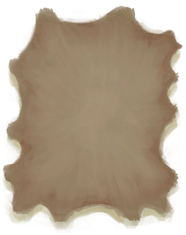

# 鞣制兽皮  
> 用于制作皮革制品。  
   
> 皮革可以通过剥大型动物（如野猪、山羊或巨蜥）的皮获得。 在能使用之前，新鲜兽皮需要用切割工具剔除残留的肉后晾干一段时间。  
  
  鞣制兽皮  |   图片   
 ----  |  ----:   
 ** 不可删除 **  **重量：**250  |     
  
## 获取来源  
来源  |  操作  
----  |  ----  
[睡袋](BedRoll.md)  |  拆解  
[睡袋](BedRoll.md)  |  转化  
[皮革手套](LeatherGloves.md)  |  转化  
[皮裤](LeatherPants.md)  |  拆解  
[皮裤](LeatherPants.md)  |  转化  
[皮革鞋子](LeatherShoes.md)  |  拆解  
[皮革鞋子](LeatherShoes.md)  |  转化  
[风箱](Bellows.md)  |  转化  
[挎包](Satchel.md)  |  拆解  
[挎包(猎人专有)](SatchelHunter.md)  |  拆解  
[刮净的皮](SkinFleshed.md)  |  皮鞣制好了！  
## 可用于蓝图  
- [地窖(蓝图)](Bp_Cellar.md)  
- [鼓(蓝图)](Bp_Drum.md)  
- [胶水(蓝图)](Bp_Glue.md)  
- [木筏(蓝图)](Bp_Raft.md)  
- [木筏庇护所(蓝图)](Bp_RaftShelter.md)  
- [盾牌(蓝图)](Bp_Shield.md)  
- [睡袋(蓝图)](Bp_Bedroll.md)  
- [风箱(蓝图)](Bp_Bellows.md)  
- [防毒面具(蓝图)](Bp_GasMask.md)  
- [皮革背包(蓝图)](Bp_LeatherBackpack.md)  
- [皮革手套(蓝图)](Bp_LeatherGloves.md)  
- [皮裤(蓝图)](Bp_LeatherPants.md)  
- [皮革鞋子(蓝图)](Bp_LeatherShoes.md)  
- [箭筒(蓝图)](Bp_Quiver.md)  
- [挎包(蓝图)](Bp_Satchel.md)  
- [水袋(蓝图)](Bp_Waterskin.md)  
  
  
