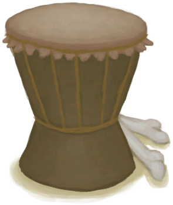

# 鞣制兽皮  
> 用于制作皮革制品。  
  
<table class="table table-bordered" data-toggle="table"  data-show-header="false"><thead style="display:none"><tr ><th  style="width:50%;text-align:left;vertical-align:top;"  >title</th><th  style="width:50%;text-align:left;vertical-align:top;"  ></th></tr></thead><tr ><td  style="width:50%;text-align:left;vertical-align:top;"  >** 不可删除 **  **重量：**250</td><td  style="width:50%;text-align:left;vertical-align:top;"  >

<a href="CuredSkin.md" style="color:black">鞣制兽皮</a>

皮革可以通过剥大型动物（如野猪、山羊或巨蜥）的皮获得。 在能使用之前，新鲜兽皮需要用切割工具剔除残留的肉后晾干一段时间。</td></tr></tbody></table>  
  
## 获取来源  
<table class="table table-bordered" data-toggle="table"  ><thead style=""><tr ><th  style="text-align:left;vertical-align:top;"  >来源</th><th  style="text-align:left;vertical-align:top;"  >操作</th></tr></thead><tr ><td  style="text-align:left;vertical-align:top;"  >[

[睡袋](BedRoll.md)](BedRoll.md)</td><td  style="text-align:left;vertical-align:top;"  >拆解</td></tr><tr ><td  style="text-align:left;vertical-align:top;"  >[

[睡袋](BedRoll.md)](BedRoll.md)</td><td  style="text-align:left;vertical-align:top;"  >转化</td></tr><tr ><td  style="text-align:left;vertical-align:top;"  >[

[皮革手套](LeatherGloves.md)](LeatherGloves.md)</td><td  style="text-align:left;vertical-align:top;"  >转化</td></tr><tr ><td  style="text-align:left;vertical-align:top;"  >[

[皮裤](LeatherPants.md)](LeatherPants.md)</td><td  style="text-align:left;vertical-align:top;"  >拆解</td></tr><tr ><td  style="text-align:left;vertical-align:top;"  >[

[皮裤](LeatherPants.md)](LeatherPants.md)</td><td  style="text-align:left;vertical-align:top;"  >转化</td></tr><tr ><td  style="text-align:left;vertical-align:top;"  >[

[皮革鞋子](LeatherShoes.md)](LeatherShoes.md)</td><td  style="text-align:left;vertical-align:top;"  >拆解</td></tr><tr ><td  style="text-align:left;vertical-align:top;"  >[

[皮革鞋子](LeatherShoes.md)](LeatherShoes.md)</td><td  style="text-align:left;vertical-align:top;"  >转化</td></tr><tr ><td  style="text-align:left;vertical-align:top;"  >[

[风箱](Bellows.md)](Bellows.md)</td><td  style="text-align:left;vertical-align:top;"  >转化</td></tr><tr ><td  style="text-align:left;vertical-align:top;"  >[

[挎包](Satchel.md)](Satchel.md)</td><td  style="text-align:left;vertical-align:top;"  >拆解</td></tr><tr ><td  style="text-align:left;vertical-align:top;"  >[

[挎包(猎人专有)](SatchelHunter.md)](SatchelHunter.md)</td><td  style="text-align:left;vertical-align:top;"  >拆解</td></tr><tr ><td  style="text-align:left;vertical-align:top;"  >[

[刮净的皮](SkinFleshed.md)](SkinFleshed.md)</td><td  style="text-align:left;vertical-align:top;"  >皮鞣制好了！</td></tr></tbody></table>  
  
## 可用于蓝图  

[

[地窖(蓝图)](Bp_Cellar.md)](Bp_Cellar.md)

[

[鼓(蓝图)](Bp_Drum.md)](Bp_Drum.md)

[

[胶水(蓝图)](Bp_Glue.md)](Bp_Glue.md)

[

[木筏(蓝图)](Bp_Raft.md)](Bp_Raft.md)

[

[木筏庇护所(蓝图)](Bp_RaftShelter.md)](Bp_RaftShelter.md)

[

[盾牌(蓝图)](Bp_Shield.md)](Bp_Shield.md)

[

[睡袋(蓝图)](Bp_Bedroll.md)](Bp_Bedroll.md)

[

[风箱(蓝图)](Bp_Bellows.md)](Bp_Bellows.md)

[

[防毒面具(蓝图)](Bp_GasMask.md)](Bp_GasMask.md)

[

[皮革背包(蓝图)](Bp_LeatherBackpack.md)](Bp_LeatherBackpack.md)

[

[皮革手套(蓝图)](Bp_LeatherGloves.md)](Bp_LeatherGloves.md)

[

[皮裤(蓝图)](Bp_LeatherPants.md)](Bp_LeatherPants.md)

[

[皮革鞋子(蓝图)](Bp_LeatherShoes.md)](Bp_LeatherShoes.md)

[

[箭筒(蓝图)](Bp_Quiver.md)](Bp_Quiver.md)

[

[挎包(蓝图)](Bp_Satchel.md)](Bp_Satchel.md)

[

[水袋(蓝图)](Bp_Waterskin.md)](Bp_Waterskin.md)

  
  
  

