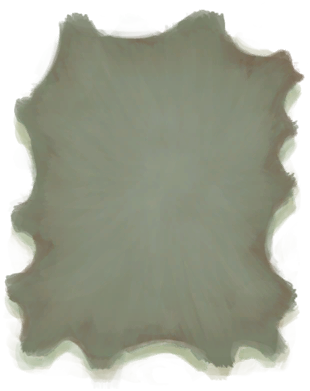

# 鞣制巨蜥皮  
> 用于制作皮革制品。  
  
<table class="table table-bordered" data-toggle="table"  data-show-header="false"><thead style="display:none"><tr ><th  style="width:50%;text-align:left;vertical-align:top;"  >title</th><th  style="width:50%;text-align:left;vertical-align:top;"  ></th></tr></thead><tr ><td  style="width:50%;text-align:left;vertical-align:top;"  >** 不可删除 **  **重量：**250</td><td  style="width:50%;text-align:left;vertical-align:top;"  >

<a href="CuredSkinReptile.md" style="color:black">鞣制巨蜥皮</a>

皮革可以通过剥大型动物（如野猪、山羊或巨蜥）的皮获得。 在能使用之前，新鲜兽皮需要用切割工具剔除残留的肉后晾干一段时间。</td></tr></tbody></table>  
  
## 获取来源  

皮鞣制好了！

[刮净的蜥蜴皮](SkinFleshedReptile.md)

  
  
## 可用于蓝图  

<a href="Bp_Cellar.md" style="color:black">地窖</a>

<a href="Bp_Drum.md" style="color:black">鼓</a>

<a href="Bp_LizardDrum.md" style="color:black">蜥蜴皮手鼓</a>

<a href="Bp_Raft.md" style="color:black">木筏</a>

<a href="Bp_Shield.md" style="color:black">盾牌</a>

<a href="Bp_Bedroll.md" style="color:black">睡袋</a>

<a href="Bp_Bellows.md" style="color:black">风箱</a>

<a href="Bp_GasMask.md" style="color:black">防毒面具</a>

<a href="Bp_LeatherBackpack.md" style="color:black">皮革背包</a>

<a href="Bp_LeatherGloves.md" style="color:black">皮革手套</a>

<a href="Bp_LeatherPants.md" style="color:black">皮裤</a>

<a href="Bp_LeatherShoes.md" style="color:black">皮革鞋子</a>

<a href="Bp_Quiver.md" style="color:black">箭筒</a>

<a href="Bp_Satchel.md" style="color:black">挎包</a>

<a href="Bp_Waterskin.md" style="color:black">水袋</a>

  
  
  

