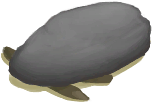

# 落石陷阱  
> 我需要在里面放上诱饵，然后过段时间再来看看。<b>（更换诱饵会重置陷阱）</b>  
  
<table class="table table-bordered" data-toggle="table"  data-show-header="false"><thead style="display:none"><tr ><th  style="width:50%;text-align:left;vertical-align:top;"  >title</th><th  style="width:50%;text-align:left;vertical-align:top;"  ></th></tr></thead><tr ><td  style="width:50%;text-align:left;vertical-align:top;"  >** 不可删除 **  ** 不可堆叠 **  **槽位：**1</td><td  style="width:50%;text-align:left;vertical-align:top;"  >

<a href="DeadfallTrap.md" style="color:black">落石陷阱</a>

所有陷阱中最简单的一种，由<b>大石块</b>和一些<b>树枝</b>制成。  它可以捕捉小动物，如<b>老鼠、蜥蜴、螃蟹、灰山鹑和海鸥</b>。  这些陷阱需要<b>诱饵</b>才能用，并且每次触发后必须<b>重置</b>。 除非真的有必要，否则不要更换诱饵，不然会重置陷阱的计时器。</td></tr></tbody></table>  
  
## 获取来源  

重置陷阱

[落石陷阱(未重置)](DeadfallTrapTriggered.md)

蓝图制造

[落石陷阱(蓝图)](Bp_DeadfallTrap.md)

  
  
## 动作  

<table><tr><td rowspan="2" style="width:200px;text-align:center;font-size:1.3em;font-weight:bold">

拆除陷阱

15分

</td><td>[“手部动作(组)”](HandAction.md)</td></tr><tr><td><b>自身：</b>→消失</td></tr><tr><td colspan="2"><b>需求：</b>[

[光亮](Light.md)](Light.md): <b>10-100</b></td></tr><tr><td colspan="2">[

[小树枝](Sticks.md)](Sticks.md)(<b>+1</b>), [

[大石块](StoneHeavy.md)](StoneHeavy.md)(<b>+1</b>)</td></tr></table>
  
  
  
## 转化  

<table style="margin-bottom:0px;"><tr><td  colspan=2 style="font-size:1em;font-weight:bold;background-color:#FEFEFE">捕捉猎物</td><td style="text-align:right; background-color:#FEFEFE">[

[陷阱(技能)](Skill_Trapping.md)](Skill_Trapping.md)<b>+0.5</b></td></tr><tr style="background-color:#FFFFFF"><td style="width:30%;font-size:1em;text-align:right;vertical-align:middle;">[“诱饵”](tag_Bait.md) [“饲料”](tag_Feed.md)</td><td style="text-align:center;width:20%;vertical-align:middle;">
18小时45分 ～ 2天8小时15分

捕捉猎物
</td><td style="text-align:left;vertical-align:middle;"></td></tr><tr><td colspan="3"><b>自身：</b>→ [

[落石陷阱(未重置)](DeadfallTrapTriggered.md)](DeadfallTrapTriggered.md)</td></tr><tr><td colspan="3">

<table style="margin-bottom:3px;"><tr><td rowspan=2 style="text-align:center" width="80px">
基础权重

100
</td><td style="font-size:0.6em;line-height:0.6em;font-weight:bold">Fail</td></tr><tr><td></td></tr><tr><td colspan=2><li>[

[陷阱(技能)](Skill_Trapping.md)](Skill_Trapping.md)为<b>0～150(0%～100%)</b>时权重<b>+0～-50</b></li><li>[

[陷阱栅栏](Imp_TrappingFences.md)](Imp_TrappingFences.md)存在于*手中/面板*，权重<b>-20</b>(可叠加),</li></td></tr></table>

<table style="margin-bottom:3px;"><tr><td rowspan=2 style="text-align:center" width="80px">
基础权重

0
</td><td style="font-size:0.6em;line-height:0.6em;font-weight:bold">Crab</td></tr><tr><td>[

[螃蟹](Crab.md)](Crab.md)(<b>+1</b>)[螃蟹种群数量](Pop_Crab.md)<b>-1000</b></td></tr><tr><td colspan=2><li>位于[

[沙滩(环境)](Env_Beach.md)](Env_Beach.md),[螃蟹种群数量](Pop_Crab.md)为<b>1000～60000</b>时权重限定为<b>+1～+20</b></li><li>位于[

[海湾(环境)](Env_Bay.md)](Env_Bay.md),[螃蟹种群数量](Pop_Crab.md)为<b>1000～60000</b>时权重限定为<b>+1～+20</b></li><li>位于[

[荒芜沙滩(环境)](Env_DesolateBeach.md)](Env_DesolateBeach.md),[螃蟹种群数量](Pop_Crab.md)为<b>1000～60000</b>时权重限定为<b>+1～+20</b></li><li>位于[

[岩滩(环境)](Env_Rocks.md)](Env_Rocks.md),[螃蟹种群数量](Pop_Crab.md)为<b>1000～60000</b>时权重限定为<b>+1～+40</b></li><li>位于[

[鸟岩岛(环境)](Env_BirdRock.md)](Env_BirdRock.md),[螃蟹种群数量](Pop_Crab.md)为<b>1000～60000</b>时权重限定为<b>+1～+40</b></li><li>位于[

[红树林(环境)](Env_Mangroves.md)](Env_Mangroves.md),[螃蟹种群数量](Pop_Crab.md)为<b>1000～60000</b>时权重限定为<b>+1～+40</b></li></td></tr></table>

<table style="margin-bottom:3px;"><tr><td rowspan=2 style="text-align:center" width="80px">
基础权重

0
</td><td style="font-size:0.6em;line-height:0.6em;font-weight:bold">Seagull</td></tr><tr><td>[

[海鸥尸体](SeagullDead.md)](SeagullDead.md)(<b>+1</b>)[海鸥种群数量](Pop_Seagull.md)<b>-1000</b> [海鸥之惧](SeagullFear.md)<b>+100</b></td></tr><tr><td colspan=2><li>位于[

[沙滩(环境)](Env_Beach.md)](Env_Beach.md),[海鸥种群数量](Pop_Seagull.md)为<b>1000～45000</b>时权重<b>+1～+10</b></li><li>位于[

[海湾(环境)](Env_Bay.md)](Env_Bay.md),[海鸥种群数量](Pop_Seagull.md)为<b>1000～45000</b>时权重<b>+1～+10</b></li><li>位于[

[鸟岩岛(环境)](Env_BirdRock.md)](Env_BirdRock.md),[海鸥种群数量](Pop_Seagull.md)为<b>1000～45000</b>时权重<b>+1～+20</b></li><li>位于[

[岩滩(环境)](Env_Rocks.md)](Env_Rocks.md),[海鸥种群数量](Pop_Seagull.md)为<b>1000～45000</b>时权重<b>+1～+15</b></li><li>位于[

[荒芜沙滩(环境)](Env_DesolateBeach.md)](Env_DesolateBeach.md),[海鸥种群数量](Pop_Seagull.md)为<b>1000～45000</b>时权重<b>+1～+15</b></li></td></tr></table>

<table style="margin-bottom:3px;"><tr><td rowspan=2 style="text-align:center" width="80px">
基础权重

0
</td><td style="font-size:0.6em;line-height:0.6em;font-weight:bold">Lizard</td></tr><tr><td>[

[蜥蜴](Lizard.md)](Lizard.md)(<b>+1</b>)[蜥蜴种群数量](Pop_Lizard.md)<b>-1000</b></td></tr><tr><td colspan=2><li>位于[

[丛林边缘(环境)](Env_Outskirts.md)](Env_Outskirts.md),[蜥蜴种群数量](Pop_Lizard.md)为<b>1000～60000</b>时权重限定为<b>+0～+20</b></li><li>位于[

[西部高地(环境)](Env_HighlandsWestern.md)](Env_HighlandsWestern.md),[蜥蜴种群数量](Pop_Lizard.md)为<b>1000～60000</b>时权重限定为<b>+0～+20</b></li><li>位于[

[沙滩(环境)](Env_Beach.md)](Env_Beach.md),[蜥蜴种群数量](Pop_Lizard.md)为<b>1000～60000</b>时权重限定为<b>+0～+10</b></li><li>位于[

[海湾(环境)](Env_Bay.md)](Env_Bay.md),[蜥蜴种群数量](Pop_Lizard.md)为<b>1000～60000</b>时权重限定为<b>+0～+10</b></li><li>位于[

[丛林(环境)](Env_Jungle.md)](Env_Jungle.md),[蜥蜴种群数量](Pop_Lizard.md)为<b>1000～60000</b>时权重限定为<b>+0～+5</b></li><li>位于[

[西部草原(环境)](Env_GrasslandsW.md)](Env_GrasslandsW.md),[蜥蜴种群数量](Pop_Lizard.md)为<b>1000～60000</b>时权重限定为<b>+0～+5</b></li><li>位于[

[东部草原(环境)](Env_GrasslandsE.md)](Env_GrasslandsE.md),[蜥蜴种群数量](Pop_Lizard.md)为<b>1000～60000</b>时权重限定为<b>+0～+5</b></li><li>位于[

[荒芜沙滩(环境)](Env_DesolateBeach.md)](Env_DesolateBeach.md),[蜥蜴种群数量](Pop_Lizard.md)为<b>1000～60000</b>时权重限定为<b>+0～+5</b></li></td></tr></table>

<table style="margin-bottom:3px;"><tr><td rowspan=2 style="text-align:center" width="80px">
基础权重

0
</td><td style="font-size:0.6em;line-height:0.6em;font-weight:bold">Mudskipper</td></tr><tr><td>[

[弹涂鱼](Mudskipper.md)](Mudskipper.md)(<b>+1</b>)[弹涂鱼种群数量](Pop_Mudskipper.md)<b>-1000</b></td></tr><tr><td colspan=2><li>位于[

[红树林(环境)](Env_Mangroves.md)](Env_Mangroves.md),[弹涂鱼种群数量](Pop_Mudskipper.md)为<b>1000～15000</b>时权重限定为<b>+0～+20</b></li></td></tr></table>

<table style="margin-bottom:3px;"><tr><td rowspan=2 style="text-align:center" width="80px">
基础权重

0
</td><td style="font-size:0.6em;line-height:0.6em;font-weight:bold">Mouse</td></tr><tr><td>[

[老鼠尸体](Mouse.md)](Mouse.md)(<b>+1</b>)[老鼠种群数量](Pop_Mouse.md)<b>-1000</b></td></tr><tr><td colspan=2><li>位于[

[沙滩(环境)](Env_Beach.md)](Env_Beach.md),[老鼠种群数量](Pop_Mouse.md)为<b>1000～100000</b>时权重限定为<b>+0～+5</b></li><li>位于[

[海湾(环境)](Env_Bay.md)](Env_Bay.md),[老鼠种群数量](Pop_Mouse.md)为<b>1000～100000</b>时权重限定为<b>+0～+5</b></li><li>位于[

[丛林边缘(环境)](Env_Outskirts.md)](Env_Outskirts.md),[老鼠种群数量](Pop_Mouse.md)为<b>1000～100000</b>时权重限定为<b>+0～+20</b></li><li>位于[

[西部草原(环境)](Env_GrasslandsW.md)](Env_GrasslandsW.md),[老鼠种群数量](Pop_Mouse.md)为<b>1000～100000</b>时权重限定为<b>+0～+20</b>[巨蜥种群数量](Pop_Monitor.md)为<b>1000～14000</b>时权重限定为<b>+0～-15</b></li><li>位于[

[东部草原(环境)](Env_GrasslandsE.md)](Env_GrasslandsE.md),[老鼠种群数量](Pop_Mouse.md)为<b>1000～100000</b>时权重限定为<b>+0～+20</b>[巨蜥种群数量](Pop_Monitor.md)为<b>1000～14000</b>时权重限定为<b>+0～-15</b></li><li>位于[

[神秘谷(环境)](Env_SecretValley.md)](Env_SecretValley.md),[老鼠种群数量](Pop_Mouse.md)为<b>1000～100000</b>时权重限定为<b>+0～+20</b>[巨蜥种群数量](Pop_Monitor.md)为<b>1000～14000</b>时权重限定为<b>+0～-15</b></li><li>位于[

[西部高地(环境)](Env_HighlandsWestern.md)](Env_HighlandsWestern.md),[老鼠种群数量](Pop_Mouse.md)为<b>1000～100000</b>时权重限定为<b>+0～+20</b></li><li>位于[

[丛林高地(环境)](Env_JungleHighlands.md)](Env_JungleHighlands.md),[老鼠种群数量](Pop_Mouse.md)为<b>1000～100000</b>时权重限定为<b>+0～+20</b></li><li>位于[

[丛林(环境)](Env_Jungle.md)](Env_Jungle.md),[老鼠种群数量](Pop_Mouse.md)为<b>1000～100000</b>时权重限定为<b>+0～+25</b></li><li>位于[

[丛林深处(环境)](Env_DeepJungle.md)](Env_DeepJungle.md),[老鼠种群数量](Pop_Mouse.md)为<b>1000～100000</b>时权重限定为<b>+0～+25</b></li><li>位于[

[湿地(环境)](Env_Wetlands.md)](Env_Wetlands.md),[老鼠种群数量](Pop_Mouse.md)为<b>1000～100000</b>时权重限定为<b>+0～+25</b></li><li>位于[

[红树林(环境)](Env_Mangroves.md)](Env_Mangroves.md),[老鼠种群数量](Pop_Mouse.md)为<b>1000～100000</b>时权重限定为<b>+0～+5</b></li></td></tr></table>

<table style="margin-bottom:3px;"><tr><td rowspan=2 style="text-align:center" width="80px">
基础权重

0
</td><td style="font-size:0.6em;line-height:0.6em;font-weight:bold">Partridge</td></tr><tr><td>[

[灰山鹑尸体](PartridgeDead.md)](PartridgeDead.md)(<b>+1</b>)[灰山鹑种群数量](Pop_Partridge.md)<b>-1000</b></td></tr><tr><td colspan=2><li>位于[

[丛林(环境)](Env_Jungle.md)](Env_Jungle.md),[灰山鹑种群数量](Pop_Partridge.md)为<b>1000～40000</b>时权重限定为<b>+0～+15</b></li><li>位于[

[丛林深处(环境)](Env_DeepJungle.md)](Env_DeepJungle.md),[灰山鹑种群数量](Pop_Partridge.md)为<b>1000～40000</b>时权重限定为<b>+0～+15</b></li><li>位于[

[湿地(环境)](Env_Wetlands.md)](Env_Wetlands.md),[灰山鹑种群数量](Pop_Partridge.md)为<b>1000～40000</b>时权重限定为<b>+0～+15</b></li><li>位于[

[西部高地(环境)](Env_HighlandsWestern.md)](Env_HighlandsWestern.md),[灰山鹑种群数量](Pop_Partridge.md)为<b>1000～40000</b>时权重限定为<b>+0～+15</b></li><li>位于[

[丛林高地(环境)](Env_JungleHighlands.md)](Env_JungleHighlands.md),[灰山鹑种群数量](Pop_Partridge.md)为<b>1000～40000</b>时权重限定为<b>+0～+15</b></li><li>位于[

[西部草原(环境)](Env_GrasslandsW.md)](Env_GrasslandsW.md),[灰山鹑种群数量](Pop_Partridge.md)为<b>1000～40000</b>时权重限定为<b>+0～+15</b>[巨蜥种群数量](Pop_Monitor.md)为<b>1000～14000</b>时权重限定为<b>+0～-15</b></li><li>位于[

[东部草原(环境)](Env_GrasslandsE.md)](Env_GrasslandsE.md),[灰山鹑种群数量](Pop_Partridge.md)为<b>1000～40000</b>时权重限定为<b>+0～+15</b>[巨蜥种群数量](Pop_Monitor.md)为<b>1000～14000</b>时权重限定为<b>+0～-15</b></li><li>位于[

[神秘谷(环境)](Env_SecretValley.md)](Env_SecretValley.md),[灰山鹑种群数量](Pop_Partridge.md)为<b>1000～40000</b>时权重限定为<b>+0～+10</b>[巨蜥种群数量](Pop_Monitor.md)为<b>1000～14000</b>时权重限定为<b>+0～-15</b></li></td></tr></table>

<table style="margin-bottom:3px;"><tr><td rowspan=2 style="text-align:center" width="80px">
基础权重

0
</td><td style="font-size:0.6em;line-height:0.6em;font-weight:bold">Cobra</td></tr><tr><td>[

[眼镜蛇尸体](CobraDead.md)](CobraDead.md)(<b>+1</b>)[眼镜蛇种群数量](Pop_Cobra.md)<b>-1000</b></td></tr><tr><td colspan=2><li>位于[

[西部高地(环境)](Env_HighlandsWestern.md)](Env_HighlandsWestern.md),[眼镜蛇种群数量](Pop_Cobra.md)为<b>1000～12000</b>时权重限定为<b>+0～+10</b></li><li>位于[

[东部高地(环境)](Env_HighlandsEastern.md)](Env_HighlandsEastern.md),[眼镜蛇种群数量](Pop_Cobra.md)为<b>1000～12000</b>时权重限定为<b>+0～+15</b></li><li>位于[

[西部草原(环境)](Env_GrasslandsW.md)](Env_GrasslandsW.md),[眼镜蛇种群数量](Pop_Cobra.md)为<b>1000～12000</b>时权重限定为<b>+0～+10</b>[巨蜥种群数量](Pop_Monitor.md)为<b>1000～14000</b>时权重限定为<b>+0～-15</b></li><li>位于[

[东部草原(环境)](Env_GrasslandsE.md)](Env_GrasslandsE.md),[眼镜蛇种群数量](Pop_Cobra.md)为<b>1000～12000</b>时权重限定为<b>+0～+10</b>[巨蜥种群数量](Pop_Monitor.md)为<b>1000～14000</b>时权重限定为<b>+0～-15</b></li></td></tr></table>
<button class="btn btn-secondary btn-sm" style="" data-toggle="modal" onclick="setCollectionDataBase64('eyJ0aXRsZSI6IuamgueOh+aooeaLnzog5o2V5o2J54yO54mpICjokL3nn7PpmbfpmLEpIiwiY29sbGVjdGlvbnMiOlt7ImRyb3AiOiLml6AiLCJiYXNlIjoxMDAsImNvbmRpdGlvbiI6W3sia2V5IjoiU2tpbGxfVHJhcHBpbmciLCJ0aXRsZSI6IumZt+mYsSjmioDog70pIiwidHlwZSI6InJhbmdlIiwibWF4IjpbMCwxNTBdLCJyYW5nZSI6WzAsMTUwXSwid2VpZ2h0IjpbMCwtNTBdLCJkZWZhdWx0VmFsdWUiOjAsIndoZW5PdXRPZlJhbmdlIjowfSx7ImtleSI6IkltcF9UcmFwcGluZ0ZlbmNlc19hbW91bnQiLCJ0aXRsZSI6IumZt+mYseagheagjyIsInR5cGUiOiJyYW5nZSIsInJhbmdlIjpbMCwyMF0sIm1heCI6WzAsMjBdLCJ3ZWlnaHQiOlswLC00MDBdLCJkZWZhdWx0VmFsdWUiOjAsIndoZW5PdXRPZlJhbmdlIjowLCJtYXhTdGFja0dyb3VwIjoiIn1dfSx7ImRyb3AiOiI8ZGl2IHN0eWxlPVwid2lkdGg6MjVweDtkaXNwbGF5OmlubGluZS1ibG9jazt0ZXh0LWFsaWduOmNlbnRlclwiPjxpbWcgZGVjb2Rpbmc9XCJhc3luY1wiIHNyYz1cIlNwcml0ZS9DcmFiLnBuZ1wiIGhyZWY9XCJhLm1kXCIgc3R5bGU9XCJtYXgtd2lkdGg6MjVweDttYXgtaGVpZ2h0OjI1cHg7XCI+PC9kaXY+6J6D6J+5IiwiYmFzZSI6MCwiY29uZGl0aW9uIjpbeyJrZXkiOiJFbnZfQmVhY2giLCJ0aXRsZSI6IuS9jeS6jjxkaXYgc3R5bGU9XCJ3aWR0aDoyMHB4O2Rpc3BsYXk6aW5saW5lLWJsb2NrO3RleHQtYWxpZ246Y2VudGVyXCI+PGltZyBkZWNvZGluZz1cImFzeW5jXCIgc3JjPVwiU3ByaXRlL0JpZ0lzbGFuZC5wbmdcIiBocmVmPVwiYS5tZFwiIHN0eWxlPVwibWF4LXdpZHRoOjIwcHg7bWF4LWhlaWdodDoyMHB4O1wiPjwvZGl2Puaymea7qSjnjq/looMpIiwidHlwZSI6InRvZ2dsZSIsInJhbmdlIjpbMCwxXSwibWF4IjpbMCwxXSwid2VpZ2h0IjpbMCwwXSwiZGVmYXVsdFZhbHVlIjowLCJ3aGVuT3V0T2ZSYW5nZSI6MCwibWF4U3RhY2tHcm91cCI6IiJ9LHsia2V5IjoiUG9wX0NyYWIiLCJ0aXRsZSI6Iuieg+ifueenjee+pOaVsOmHjyIsInR5cGUiOiJyYW5nZSIsIm1heCI6WzAsNjAwMDBdLCJyYW5nZSI6WzEwMDAsNjAwMDBdLCJ3ZWlnaHQiOlsxLDIwXSwiZGVmYXVsdFZhbHVlIjo2MDAwMCwid2hlbk91dE9mUmFuZ2UiOjEsInByZWQiOiJFbnZfQmVhY2gifSx7ImtleSI6IkVudl9CYXkiLCJ0aXRsZSI6IuS9jeS6jjxkaXYgc3R5bGU9XCJ3aWR0aDoyMHB4O2Rpc3BsYXk6aW5saW5lLWJsb2NrO3RleHQtYWxpZ246Y2VudGVyXCI+PGltZyBkZWNvZGluZz1cImFzeW5jXCIgc3JjPVwiU3ByaXRlL0JheS5wbmdcIiBocmVmPVwiYS5tZFwiIHN0eWxlPVwibWF4LXdpZHRoOjIwcHg7bWF4LWhlaWdodDoyMHB4O1wiPjwvZGl2Pua1t+a5vijnjq/looMpIiwidHlwZSI6InRvZ2dsZSIsInJhbmdlIjpbMCwxXSwibWF4IjpbMCwxXSwid2VpZ2h0IjpbMCwwXSwiZGVmYXVsdFZhbHVlIjowLCJ3aGVuT3V0T2ZSYW5nZSI6MCwibWF4U3RhY2tHcm91cCI6IiJ9LHsia2V5IjoiUG9wX0NyYWIiLCJ0aXRsZSI6Iuieg+ifueenjee+pOaVsOmHjyIsInR5cGUiOiJyYW5nZSIsIm1heCI6WzAsNjAwMDBdLCJyYW5nZSI6WzEwMDAsNjAwMDBdLCJ3ZWlnaHQiOlsxLDIwXSwiZGVmYXVsdFZhbHVlIjo2MDAwMCwid2hlbk91dE9mUmFuZ2UiOjEsInByZWQiOiJFbnZfQmF5In0seyJrZXkiOiJFbnZfRGVzb2xhdGVCZWFjaCIsInRpdGxlIjoi5L2N5LqOPGRpdiBzdHlsZT1cIndpZHRoOjIwcHg7ZGlzcGxheTppbmxpbmUtYmxvY2s7dGV4dC1hbGlnbjpjZW50ZXJcIj48aW1nIGRlY29kaW5nPVwiYXN5bmNcIiBzcmM9XCJTcHJpdGUvRGVzb2xhdGVCZWFjaC5wbmdcIiBocmVmPVwiYS5tZFwiIHN0eWxlPVwibWF4LXdpZHRoOjIwcHg7bWF4LWhlaWdodDoyMHB4O1wiPjwvZGl2PuiNkuiKnOaymea7qSjnjq/looMpIiwidHlwZSI6InRvZ2dsZSIsInJhbmdlIjpbMCwxXSwibWF4IjpbMCwxXSwid2VpZ2h0IjpbMCwwXSwiZGVmYXVsdFZhbHVlIjowLCJ3aGVuT3V0T2ZSYW5nZSI6MCwibWF4U3RhY2tHcm91cCI6IiJ9LHsia2V5IjoiUG9wX0NyYWIiLCJ0aXRsZSI6Iuieg+ifueenjee+pOaVsOmHjyIsInR5cGUiOiJyYW5nZSIsIm1heCI6WzAsNjAwMDBdLCJyYW5nZSI6WzEwMDAsNjAwMDBdLCJ3ZWlnaHQiOlsxLDIwXSwiZGVmYXVsdFZhbHVlIjo2MDAwMCwid2hlbk91dE9mUmFuZ2UiOjEsInByZWQiOiJFbnZfRGVzb2xhdGVCZWFjaCJ9LHsia2V5IjoiRW52X1JvY2tzIiwidGl0bGUiOiLkvY3kuo48ZGl2IHN0eWxlPVwid2lkdGg6MjBweDtkaXNwbGF5OmlubGluZS1ibG9jazt0ZXh0LWFsaWduOmNlbnRlclwiPjxpbWcgZGVjb2Rpbmc9XCJhc3luY1wiIHNyYz1cIlNwcml0ZS9Sb2NreVBhdGgucG5nXCIgaHJlZj1cImEubWRcIiBzdHlsZT1cIm1heC13aWR0aDoyMHB4O21heC1oZWlnaHQ6MjBweDtcIj48L2Rpdj7lsqnmu6ko546v5aKDKSIsInR5cGUiOiJ0b2dnbGUiLCJyYW5nZSI6WzAsMV0sIm1heCI6WzAsMV0sIndlaWdodCI6WzAsMF0sImRlZmF1bHRWYWx1ZSI6MCwid2hlbk91dE9mUmFuZ2UiOjAsIm1heFN0YWNrR3JvdXAiOiIifSx7ImtleSI6IlBvcF9DcmFiIiwidGl0bGUiOiLonoPon7nnp43nvqTmlbDph48iLCJ0eXBlIjoicmFuZ2UiLCJtYXgiOlswLDYwMDAwXSwicmFuZ2UiOlsxMDAwLDYwMDAwXSwid2VpZ2h0IjpbMSw0MF0sImRlZmF1bHRWYWx1ZSI6NjAwMDAsIndoZW5PdXRPZlJhbmdlIjoxLCJwcmVkIjoiRW52X1JvY2tzIn0seyJrZXkiOiJFbnZfQmlyZFJvY2siLCJ0aXRsZSI6IuS9jeS6jjxkaXYgc3R5bGU9XCJ3aWR0aDoyMHB4O2Rpc3BsYXk6aW5saW5lLWJsb2NrO3RleHQtYWxpZ246Y2VudGVyXCI+PGltZyBkZWNvZGluZz1cImFzeW5jXCIgc3JjPVwiU3ByaXRlL1BvaW50eVJvY2sucG5nXCIgaHJlZj1cImEubWRcIiBzdHlsZT1cIm1heC13aWR0aDoyMHB4O21heC1oZWlnaHQ6MjBweDtcIj48L2Rpdj7puJ/lsqnlspso546v5aKDKSIsInR5cGUiOiJ0b2dnbGUiLCJyYW5nZSI6WzAsMV0sIm1heCI6WzAsMV0sIndlaWdodCI6WzAsMF0sImRlZmF1bHRWYWx1ZSI6MCwid2hlbk91dE9mUmFuZ2UiOjAsIm1heFN0YWNrR3JvdXAiOiIifSx7ImtleSI6IlBvcF9DcmFiIiwidGl0bGUiOiLonoPon7nnp43nvqTmlbDph48iLCJ0eXBlIjoicmFuZ2UiLCJtYXgiOlswLDYwMDAwXSwicmFuZ2UiOlsxMDAwLDYwMDAwXSwid2VpZ2h0IjpbMSw0MF0sImRlZmF1bHRWYWx1ZSI6NjAwMDAsIndoZW5PdXRPZlJhbmdlIjoxLCJwcmVkIjoiRW52X0JpcmRSb2NrIn0seyJrZXkiOiJFbnZfTWFuZ3JvdmVzIiwidGl0bGUiOiLkvY3kuo48ZGl2IHN0eWxlPVwid2lkdGg6MjBweDtkaXNwbGF5OmlubGluZS1ibG9jazt0ZXh0LWFsaWduOmNlbnRlclwiPjxpbWcgZGVjb2Rpbmc9XCJhc3luY1wiIHNyYz1cIlNwcml0ZS9NYW5ncm92ZXMucG5nXCIgaHJlZj1cImEubWRcIiBzdHlsZT1cIm1heC13aWR0aDoyMHB4O21heC1oZWlnaHQ6MjBweDtcIj48L2Rpdj7nuqLmoJHmnpco546v5aKDKSIsInR5cGUiOiJ0b2dnbGUiLCJyYW5nZSI6WzAsMV0sIm1heCI6WzAsMV0sIndlaWdodCI6WzAsMF0sImRlZmF1bHRWYWx1ZSI6MCwid2hlbk91dE9mUmFuZ2UiOjAsIm1heFN0YWNrR3JvdXAiOiIifSx7ImtleSI6IlBvcF9DcmFiIiwidGl0bGUiOiLonoPon7nnp43nvqTmlbDph48iLCJ0eXBlIjoicmFuZ2UiLCJtYXgiOlswLDYwMDAwXSwicmFuZ2UiOlsxMDAwLDYwMDAwXSwid2VpZ2h0IjpbMSw0MF0sImRlZmF1bHRWYWx1ZSI6NjAwMDAsIndoZW5PdXRPZlJhbmdlIjoxLCJwcmVkIjoiRW52X01hbmdyb3ZlcyJ9XX0seyJkcm9wIjoiPGRpdiBzdHlsZT1cIndpZHRoOjI1cHg7ZGlzcGxheTppbmxpbmUtYmxvY2s7dGV4dC1hbGlnbjpjZW50ZXJcIj48aW1nIGRlY29kaW5nPVwiYXN5bmNcIiBzcmM9XCJTcHJpdGUvU2VhZ3VsbERlYWQucG5nXCIgaHJlZj1cImEubWRcIiBzdHlsZT1cIm1heC13aWR0aDoyNXB4O21heC1oZWlnaHQ6MjVweDtcIj48L2Rpdj7mtbfpuKXlsLjkvZMiLCJiYXNlIjowLCJjb25kaXRpb24iOlt7ImtleSI6IkVudl9CZWFjaCIsInRpdGxlIjoi5L2N5LqOPGRpdiBzdHlsZT1cIndpZHRoOjIwcHg7ZGlzcGxheTppbmxpbmUtYmxvY2s7dGV4dC1hbGlnbjpjZW50ZXJcIj48aW1nIGRlY29kaW5nPVwiYXN5bmNcIiBzcmM9XCJTcHJpdGUvQmlnSXNsYW5kLnBuZ1wiIGhyZWY9XCJhLm1kXCIgc3R5bGU9XCJtYXgtd2lkdGg6MjBweDttYXgtaGVpZ2h0OjIwcHg7XCI+PC9kaXY+5rKZ5rupKOeOr+WigykiLCJ0eXBlIjoidG9nZ2xlIiwicmFuZ2UiOlswLDFdLCJtYXgiOlswLDFdLCJ3ZWlnaHQiOlswLDBdLCJkZWZhdWx0VmFsdWUiOjAsIndoZW5PdXRPZlJhbmdlIjowLCJtYXhTdGFja0dyb3VwIjoiIn0seyJrZXkiOiJQb3BfU2VhZ3VsbCIsInRpdGxlIjoi5rW36bil56eN576k5pWw6YePIiwidHlwZSI6InJhbmdlIiwibWF4IjpbMCw0NTAwMF0sInJhbmdlIjpbMTAwMCw0NTAwMF0sIndlaWdodCI6WzEsMTBdLCJkZWZhdWx0VmFsdWUiOjQ1MDAwLCJ3aGVuT3V0T2ZSYW5nZSI6MCwicHJlZCI6IkVudl9CZWFjaCJ9LHsia2V5IjoiRW52X0JheSIsInRpdGxlIjoi5L2N5LqOPGRpdiBzdHlsZT1cIndpZHRoOjIwcHg7ZGlzcGxheTppbmxpbmUtYmxvY2s7dGV4dC1hbGlnbjpjZW50ZXJcIj48aW1nIGRlY29kaW5nPVwiYXN5bmNcIiBzcmM9XCJTcHJpdGUvQmF5LnBuZ1wiIGhyZWY9XCJhLm1kXCIgc3R5bGU9XCJtYXgtd2lkdGg6MjBweDttYXgtaGVpZ2h0OjIwcHg7XCI+PC9kaXY+5rW35rm+KOeOr+WigykiLCJ0eXBlIjoidG9nZ2xlIiwicmFuZ2UiOlswLDFdLCJtYXgiOlswLDFdLCJ3ZWlnaHQiOlswLDBdLCJkZWZhdWx0VmFsdWUiOjAsIndoZW5PdXRPZlJhbmdlIjowLCJtYXhTdGFja0dyb3VwIjoiIn0seyJrZXkiOiJQb3BfU2VhZ3VsbCIsInRpdGxlIjoi5rW36bil56eN576k5pWw6YePIiwidHlwZSI6InJhbmdlIiwibWF4IjpbMCw0NTAwMF0sInJhbmdlIjpbMTAwMCw0NTAwMF0sIndlaWdodCI6WzEsMTBdLCJkZWZhdWx0VmFsdWUiOjQ1MDAwLCJ3aGVuT3V0T2ZSYW5nZSI6MCwicHJlZCI6IkVudl9CYXkifSx7ImtleSI6IkVudl9CaXJkUm9jayIsInRpdGxlIjoi5L2N5LqOPGRpdiBzdHlsZT1cIndpZHRoOjIwcHg7ZGlzcGxheTppbmxpbmUtYmxvY2s7dGV4dC1hbGlnbjpjZW50ZXJcIj48aW1nIGRlY29kaW5nPVwiYXN5bmNcIiBzcmM9XCJTcHJpdGUvUG9pbnR5Um9jay5wbmdcIiBocmVmPVwiYS5tZFwiIHN0eWxlPVwibWF4LXdpZHRoOjIwcHg7bWF4LWhlaWdodDoyMHB4O1wiPjwvZGl2Pum4n+WyqeWymyjnjq/looMpIiwidHlwZSI6InRvZ2dsZSIsInJhbmdlIjpbMCwxXSwibWF4IjpbMCwxXSwid2VpZ2h0IjpbMCwwXSwiZGVmYXVsdFZhbHVlIjowLCJ3aGVuT3V0T2ZSYW5nZSI6MCwibWF4U3RhY2tHcm91cCI6IiJ9LHsia2V5IjoiUG9wX1NlYWd1bGwiLCJ0aXRsZSI6Iua1t+m4peenjee+pOaVsOmHjyIsInR5cGUiOiJyYW5nZSIsIm1heCI6WzAsNDUwMDBdLCJyYW5nZSI6WzEwMDAsNDUwMDBdLCJ3ZWlnaHQiOlsxLDIwXSwiZGVmYXVsdFZhbHVlIjo0NTAwMCwid2hlbk91dE9mUmFuZ2UiOjAsInByZWQiOiJFbnZfQmlyZFJvY2sifSx7ImtleSI6IkVudl9Sb2NrcyIsInRpdGxlIjoi5L2N5LqOPGRpdiBzdHlsZT1cIndpZHRoOjIwcHg7ZGlzcGxheTppbmxpbmUtYmxvY2s7dGV4dC1hbGlnbjpjZW50ZXJcIj48aW1nIGRlY29kaW5nPVwiYXN5bmNcIiBzcmM9XCJTcHJpdGUvUm9ja3lQYXRoLnBuZ1wiIGhyZWY9XCJhLm1kXCIgc3R5bGU9XCJtYXgtd2lkdGg6MjBweDttYXgtaGVpZ2h0OjIwcHg7XCI+PC9kaXY+5bKp5rupKOeOr+WigykiLCJ0eXBlIjoidG9nZ2xlIiwicmFuZ2UiOlswLDFdLCJtYXgiOlswLDFdLCJ3ZWlnaHQiOlswLDBdLCJkZWZhdWx0VmFsdWUiOjAsIndoZW5PdXRPZlJhbmdlIjowLCJtYXhTdGFja0dyb3VwIjoiIn0seyJrZXkiOiJQb3BfU2VhZ3VsbCIsInRpdGxlIjoi5rW36bil56eN576k5pWw6YePIiwidHlwZSI6InJhbmdlIiwibWF4IjpbMCw0NTAwMF0sInJhbmdlIjpbMTAwMCw0NTAwMF0sIndlaWdodCI6WzEsMTVdLCJkZWZhdWx0VmFsdWUiOjQ1MDAwLCJ3aGVuT3V0T2ZSYW5nZSI6MCwicHJlZCI6IkVudl9Sb2NrcyJ9LHsia2V5IjoiRW52X0Rlc29sYXRlQmVhY2giLCJ0aXRsZSI6IuS9jeS6jjxkaXYgc3R5bGU9XCJ3aWR0aDoyMHB4O2Rpc3BsYXk6aW5saW5lLWJsb2NrO3RleHQtYWxpZ246Y2VudGVyXCI+PGltZyBkZWNvZGluZz1cImFzeW5jXCIgc3JjPVwiU3ByaXRlL0Rlc29sYXRlQmVhY2gucG5nXCIgaHJlZj1cImEubWRcIiBzdHlsZT1cIm1heC13aWR0aDoyMHB4O21heC1oZWlnaHQ6MjBweDtcIj48L2Rpdj7ojZLoipzmspnmu6ko546v5aKDKSIsInR5cGUiOiJ0b2dnbGUiLCJyYW5nZSI6WzAsMV0sIm1heCI6WzAsMV0sIndlaWdodCI6WzAsMF0sImRlZmF1bHRWYWx1ZSI6MCwid2hlbk91dE9mUmFuZ2UiOjAsIm1heFN0YWNrR3JvdXAiOiIifSx7ImtleSI6IlBvcF9TZWFndWxsIiwidGl0bGUiOiLmtbfpuKXnp43nvqTmlbDph48iLCJ0eXBlIjoicmFuZ2UiLCJtYXgiOlswLDQ1MDAwXSwicmFuZ2UiOlsxMDAwLDQ1MDAwXSwid2VpZ2h0IjpbMSwxNV0sImRlZmF1bHRWYWx1ZSI6NDUwMDAsIndoZW5PdXRPZlJhbmdlIjowLCJwcmVkIjoiRW52X0Rlc29sYXRlQmVhY2gifV19LHsiZHJvcCI6IjxkaXYgc3R5bGU9XCJ3aWR0aDoyNXB4O2Rpc3BsYXk6aW5saW5lLWJsb2NrO3RleHQtYWxpZ246Y2VudGVyXCI+PGltZyBkZWNvZGluZz1cImFzeW5jXCIgc3JjPVwiU3ByaXRlL0xpemFyZC5wbmdcIiBocmVmPVwiYS5tZFwiIHN0eWxlPVwibWF4LXdpZHRoOjI1cHg7bWF4LWhlaWdodDoyNXB4O1wiPjwvZGl2PuicpeictCIsImJhc2UiOjAsImNvbmRpdGlvbiI6W3sia2V5IjoiRW52X091dHNraXJ0cyIsInRpdGxlIjoi5L2N5LqOPGRpdiBzdHlsZT1cIndpZHRoOjIwcHg7ZGlzcGxheTppbmxpbmUtYmxvY2s7dGV4dC1hbGlnbjpjZW50ZXJcIj48aW1nIGRlY29kaW5nPVwiYXN5bmNcIiBzcmM9XCJTcHJpdGUvSnVuZ2xlLnBuZ1wiIGhyZWY9XCJhLm1kXCIgc3R5bGU9XCJtYXgtd2lkdGg6MjBweDttYXgtaGVpZ2h0OjIwcHg7XCI+PC9kaXY+5Lib5p6X6L6557yYKOeOr+WigykiLCJ0eXBlIjoidG9nZ2xlIiwicmFuZ2UiOlswLDFdLCJtYXgiOlswLDFdLCJ3ZWlnaHQiOlswLDBdLCJkZWZhdWx0VmFsdWUiOjAsIndoZW5PdXRPZlJhbmdlIjowLCJtYXhTdGFja0dyb3VwIjoiIn0seyJrZXkiOiJQb3BfTGl6YXJkIiwidGl0bGUiOiLonKXonLTnp43nvqTmlbDph48iLCJ0eXBlIjoicmFuZ2UiLCJtYXgiOlswLDYwMDAwXSwicmFuZ2UiOlsxMDAwLDYwMDAwXSwid2VpZ2h0IjpbMCwyMF0sImRlZmF1bHRWYWx1ZSI6NjAwMDAsIndoZW5PdXRPZlJhbmdlIjoxLCJwcmVkIjoiRW52X091dHNraXJ0cyJ9LHsia2V5IjoiRW52X0hpZ2hsYW5kc1dlc3Rlcm4iLCJ0aXRsZSI6IuS9jeS6jjxkaXYgc3R5bGU9XCJ3aWR0aDoyMHB4O2Rpc3BsYXk6aW5saW5lLWJsb2NrO3RleHQtYWxpZ246Y2VudGVyXCI+PGltZyBkZWNvZGluZz1cImFzeW5jXCIgc3JjPVwiU3ByaXRlL0p1bmdsZS5wbmdcIiBocmVmPVwiYS5tZFwiIHN0eWxlPVwibWF4LXdpZHRoOjIwcHg7bWF4LWhlaWdodDoyMHB4O1wiPjwvZGl2Puilv+mDqOmrmOWcsCjnjq/looMpIiwidHlwZSI6InRvZ2dsZSIsInJhbmdlIjpbMCwxXSwibWF4IjpbMCwxXSwid2VpZ2h0IjpbMCwwXSwiZGVmYXVsdFZhbHVlIjowLCJ3aGVuT3V0T2ZSYW5nZSI6MCwibWF4U3RhY2tHcm91cCI6IiJ9LHsia2V5IjoiUG9wX0xpemFyZCIsInRpdGxlIjoi6Jyl6Jy056eN576k5pWw6YePIiwidHlwZSI6InJhbmdlIiwibWF4IjpbMCw2MDAwMF0sInJhbmdlIjpbMTAwMCw2MDAwMF0sIndlaWdodCI6WzAsMjBdLCJkZWZhdWx0VmFsdWUiOjYwMDAwLCJ3aGVuT3V0T2ZSYW5nZSI6MSwicHJlZCI6IkVudl9IaWdobGFuZHNXZXN0ZXJuIn0seyJrZXkiOiJFbnZfQmVhY2giLCJ0aXRsZSI6IuS9jeS6jjxkaXYgc3R5bGU9XCJ3aWR0aDoyMHB4O2Rpc3BsYXk6aW5saW5lLWJsb2NrO3RleHQtYWxpZ246Y2VudGVyXCI+PGltZyBkZWNvZGluZz1cImFzeW5jXCIgc3JjPVwiU3ByaXRlL0JpZ0lzbGFuZC5wbmdcIiBocmVmPVwiYS5tZFwiIHN0eWxlPVwibWF4LXdpZHRoOjIwcHg7bWF4LWhlaWdodDoyMHB4O1wiPjwvZGl2Puaymea7qSjnjq/looMpIiwidHlwZSI6InRvZ2dsZSIsInJhbmdlIjpbMCwxXSwibWF4IjpbMCwxXSwid2VpZ2h0IjpbMCwwXSwiZGVmYXVsdFZhbHVlIjowLCJ3aGVuT3V0T2ZSYW5nZSI6MCwibWF4U3RhY2tHcm91cCI6IiJ9LHsia2V5IjoiUG9wX0xpemFyZCIsInRpdGxlIjoi6Jyl6Jy056eN576k5pWw6YePIiwidHlwZSI6InJhbmdlIiwibWF4IjpbMCw2MDAwMF0sInJhbmdlIjpbMTAwMCw2MDAwMF0sIndlaWdodCI6WzAsMTBdLCJkZWZhdWx0VmFsdWUiOjYwMDAwLCJ3aGVuT3V0T2ZSYW5nZSI6MSwicHJlZCI6IkVudl9CZWFjaCJ9LHsia2V5IjoiRW52X0JheSIsInRpdGxlIjoi5L2N5LqOPGRpdiBzdHlsZT1cIndpZHRoOjIwcHg7ZGlzcGxheTppbmxpbmUtYmxvY2s7dGV4dC1hbGlnbjpjZW50ZXJcIj48aW1nIGRlY29kaW5nPVwiYXN5bmNcIiBzcmM9XCJTcHJpdGUvQmF5LnBuZ1wiIGhyZWY9XCJhLm1kXCIgc3R5bGU9XCJtYXgtd2lkdGg6MjBweDttYXgtaGVpZ2h0OjIwcHg7XCI+PC9kaXY+5rW35rm+KOeOr+WigykiLCJ0eXBlIjoidG9nZ2xlIiwicmFuZ2UiOlswLDFdLCJtYXgiOlswLDFdLCJ3ZWlnaHQiOlswLDBdLCJkZWZhdWx0VmFsdWUiOjAsIndoZW5PdXRPZlJhbmdlIjowLCJtYXhTdGFja0dyb3VwIjoiIn0seyJrZXkiOiJQb3BfTGl6YXJkIiwidGl0bGUiOiLonKXonLTnp43nvqTmlbDph48iLCJ0eXBlIjoicmFuZ2UiLCJtYXgiOlswLDYwMDAwXSwicmFuZ2UiOlsxMDAwLDYwMDAwXSwid2VpZ2h0IjpbMCwxMF0sImRlZmF1bHRWYWx1ZSI6NjAwMDAsIndoZW5PdXRPZlJhbmdlIjoxLCJwcmVkIjoiRW52X0JheSJ9LHsia2V5IjoiRW52X0p1bmdsZSIsInRpdGxlIjoi5L2N5LqOPGRpdiBzdHlsZT1cIndpZHRoOjIwcHg7ZGlzcGxheTppbmxpbmUtYmxvY2s7dGV4dC1hbGlnbjpjZW50ZXJcIj48aW1nIGRlY29kaW5nPVwiYXN5bmNcIiBzcmM9XCJTcHJpdGUvSnVuZ2xlLnBuZ1wiIGhyZWY9XCJhLm1kXCIgc3R5bGU9XCJtYXgtd2lkdGg6MjBweDttYXgtaGVpZ2h0OjIwcHg7XCI+PC9kaXY+5Lib5p6XKOeOr+WigykiLCJ0eXBlIjoidG9nZ2xlIiwicmFuZ2UiOlswLDFdLCJtYXgiOlswLDFdLCJ3ZWlnaHQiOlswLDBdLCJkZWZhdWx0VmFsdWUiOjAsIndoZW5PdXRPZlJhbmdlIjowLCJtYXhTdGFja0dyb3VwIjoiIn0seyJrZXkiOiJQb3BfTGl6YXJkIiwidGl0bGUiOiLonKXonLTnp43nvqTmlbDph48iLCJ0eXBlIjoicmFuZ2UiLCJtYXgiOlswLDYwMDAwXSwicmFuZ2UiOlsxMDAwLDYwMDAwXSwid2VpZ2h0IjpbMCw1XSwiZGVmYXVsdFZhbHVlIjo2MDAwMCwid2hlbk91dE9mUmFuZ2UiOjEsInByZWQiOiJFbnZfSnVuZ2xlIn0seyJrZXkiOiJFbnZfR3Jhc3NsYW5kc1ciLCJ0aXRsZSI6IuS9jeS6jjxkaXYgc3R5bGU9XCJ3aWR0aDoyMHB4O2Rpc3BsYXk6aW5saW5lLWJsb2NrO3RleHQtYWxpZ246Y2VudGVyXCI+PGltZyBkZWNvZGluZz1cImFzeW5jXCIgc3JjPVwiU3ByaXRlL0p1bmdsZS5wbmdcIiBocmVmPVwiYS5tZFwiIHN0eWxlPVwibWF4LXdpZHRoOjIwcHg7bWF4LWhlaWdodDoyMHB4O1wiPjwvZGl2Puilv+mDqOiNieWOnyjnjq/looMpIiwidHlwZSI6InRvZ2dsZSIsInJhbmdlIjpbMCwxXSwibWF4IjpbMCwxXSwid2VpZ2h0IjpbMCwwXSwiZGVmYXVsdFZhbHVlIjowLCJ3aGVuT3V0T2ZSYW5nZSI6MCwibWF4U3RhY2tHcm91cCI6IiJ9LHsia2V5IjoiUG9wX0xpemFyZCIsInRpdGxlIjoi6Jyl6Jy056eN576k5pWw6YePIiwidHlwZSI6InJhbmdlIiwibWF4IjpbMCw2MDAwMF0sInJhbmdlIjpbMTAwMCw2MDAwMF0sIndlaWdodCI6WzAsNV0sImRlZmF1bHRWYWx1ZSI6NjAwMDAsIndoZW5PdXRPZlJhbmdlIjoxLCJwcmVkIjoiRW52X0dyYXNzbGFuZHNXIn0seyJrZXkiOiJFbnZfR3Jhc3NsYW5kc0UiLCJ0aXRsZSI6IuS9jeS6jjxkaXYgc3R5bGU9XCJ3aWR0aDoyMHB4O2Rpc3BsYXk6aW5saW5lLWJsb2NrO3RleHQtYWxpZ246Y2VudGVyXCI+PGltZyBkZWNvZGluZz1cImFzeW5jXCIgc3JjPVwiU3ByaXRlL0p1bmdsZS5wbmdcIiBocmVmPVwiYS5tZFwiIHN0eWxlPVwibWF4LXdpZHRoOjIwcHg7bWF4LWhlaWdodDoyMHB4O1wiPjwvZGl2PuS4nOmDqOiNieWOnyjnjq/looMpIiwidHlwZSI6InRvZ2dsZSIsInJhbmdlIjpbMCwxXSwibWF4IjpbMCwxXSwid2VpZ2h0IjpbMCwwXSwiZGVmYXVsdFZhbHVlIjowLCJ3aGVuT3V0T2ZSYW5nZSI6MCwibWF4U3RhY2tHcm91cCI6IiJ9LHsia2V5IjoiUG9wX0xpemFyZCIsInRpdGxlIjoi6Jyl6Jy056eN576k5pWw6YePIiwidHlwZSI6InJhbmdlIiwibWF4IjpbMCw2MDAwMF0sInJhbmdlIjpbMTAwMCw2MDAwMF0sIndlaWdodCI6WzAsNV0sImRlZmF1bHRWYWx1ZSI6NjAwMDAsIndoZW5PdXRPZlJhbmdlIjoxLCJwcmVkIjoiRW52X0dyYXNzbGFuZHNFIn0seyJrZXkiOiJFbnZfRGVzb2xhdGVCZWFjaCIsInRpdGxlIjoi5L2N5LqOPGRpdiBzdHlsZT1cIndpZHRoOjIwcHg7ZGlzcGxheTppbmxpbmUtYmxvY2s7dGV4dC1hbGlnbjpjZW50ZXJcIj48aW1nIGRlY29kaW5nPVwiYXN5bmNcIiBzcmM9XCJTcHJpdGUvRGVzb2xhdGVCZWFjaC5wbmdcIiBocmVmPVwiYS5tZFwiIHN0eWxlPVwibWF4LXdpZHRoOjIwcHg7bWF4LWhlaWdodDoyMHB4O1wiPjwvZGl2PuiNkuiKnOaymea7qSjnjq/looMpIiwidHlwZSI6InRvZ2dsZSIsInJhbmdlIjpbMCwxXSwibWF4IjpbMCwxXSwid2VpZ2h0IjpbMCwwXSwiZGVmYXVsdFZhbHVlIjowLCJ3aGVuT3V0T2ZSYW5nZSI6MCwibWF4U3RhY2tHcm91cCI6IiJ9LHsia2V5IjoiUG9wX0xpemFyZCIsInRpdGxlIjoi6Jyl6Jy056eN576k5pWw6YePIiwidHlwZSI6InJhbmdlIiwibWF4IjpbMCw2MDAwMF0sInJhbmdlIjpbMTAwMCw2MDAwMF0sIndlaWdodCI6WzAsNV0sImRlZmF1bHRWYWx1ZSI6NjAwMDAsIndoZW5PdXRPZlJhbmdlIjoxLCJwcmVkIjoiRW52X0Rlc29sYXRlQmVhY2gifV19LHsiZHJvcCI6IjxkaXYgc3R5bGU9XCJ3aWR0aDoyNXB4O2Rpc3BsYXk6aW5saW5lLWJsb2NrO3RleHQtYWxpZ246Y2VudGVyXCI+PGltZyBkZWNvZGluZz1cImFzeW5jXCIgc3JjPVwiU3ByaXRlL011ZHNraXBwZXIucG5nXCIgaHJlZj1cImEubWRcIiBzdHlsZT1cIm1heC13aWR0aDoyNXB4O21heC1oZWlnaHQ6MjVweDtcIj48L2Rpdj7lvLnmtoLpsbwiLCJiYXNlIjowLCJjb25kaXRpb24iOlt7ImtleSI6IkVudl9NYW5ncm92ZXMiLCJ0aXRsZSI6IuS9jeS6jjxkaXYgc3R5bGU9XCJ3aWR0aDoyMHB4O2Rpc3BsYXk6aW5saW5lLWJsb2NrO3RleHQtYWxpZ246Y2VudGVyXCI+PGltZyBkZWNvZGluZz1cImFzeW5jXCIgc3JjPVwiU3ByaXRlL01hbmdyb3Zlcy5wbmdcIiBocmVmPVwiYS5tZFwiIHN0eWxlPVwibWF4LXdpZHRoOjIwcHg7bWF4LWhlaWdodDoyMHB4O1wiPjwvZGl2Pue6ouagkeaelyjnjq/looMpIiwidHlwZSI6InRvZ2dsZSIsInJhbmdlIjpbMCwxXSwibWF4IjpbMCwxXSwid2VpZ2h0IjpbMCwwXSwiZGVmYXVsdFZhbHVlIjowLCJ3aGVuT3V0T2ZSYW5nZSI6MCwibWF4U3RhY2tHcm91cCI6IiJ9LHsia2V5IjoiUG9wX011ZHNraXBwZXIiLCJ0aXRsZSI6IuW8uea2gumxvOenjee+pOaVsOmHjyIsInR5cGUiOiJyYW5nZSIsIm1heCI6WzAsMTUwMDBdLCJyYW5nZSI6WzEwMDAsMTUwMDBdLCJ3ZWlnaHQiOlswLDIwXSwiZGVmYXVsdFZhbHVlIjoxNTAwMCwid2hlbk91dE9mUmFuZ2UiOjEsInByZWQiOiJFbnZfTWFuZ3JvdmVzIn1dfSx7ImRyb3AiOiI8ZGl2IHN0eWxlPVwid2lkdGg6MjVweDtkaXNwbGF5OmlubGluZS1ibG9jazt0ZXh0LWFsaWduOmNlbnRlclwiPjxpbWcgZGVjb2Rpbmc9XCJhc3luY1wiIHNyYz1cIlNwcml0ZS9Nb3VzZS5wbmdcIiBocmVmPVwiYS5tZFwiIHN0eWxlPVwibWF4LXdpZHRoOjI1cHg7bWF4LWhlaWdodDoyNXB4O1wiPjwvZGl2PuiAgem8oOWwuOS9kyIsImJhc2UiOjAsImNvbmRpdGlvbiI6W3sia2V5IjoiRW52X0JlYWNoIiwidGl0bGUiOiLkvY3kuo48ZGl2IHN0eWxlPVwid2lkdGg6MjBweDtkaXNwbGF5OmlubGluZS1ibG9jazt0ZXh0LWFsaWduOmNlbnRlclwiPjxpbWcgZGVjb2Rpbmc9XCJhc3luY1wiIHNyYz1cIlNwcml0ZS9CaWdJc2xhbmQucG5nXCIgaHJlZj1cImEubWRcIiBzdHlsZT1cIm1heC13aWR0aDoyMHB4O21heC1oZWlnaHQ6MjBweDtcIj48L2Rpdj7mspnmu6ko546v5aKDKSIsInR5cGUiOiJ0b2dnbGUiLCJyYW5nZSI6WzAsMV0sIm1heCI6WzAsMV0sIndlaWdodCI6WzAsMF0sImRlZmF1bHRWYWx1ZSI6MCwid2hlbk91dE9mUmFuZ2UiOjAsIm1heFN0YWNrR3JvdXAiOiIifSx7ImtleSI6IlBvcF9Nb3VzZSIsInRpdGxlIjoi6ICB6byg56eN576k5pWw6YePIiwidHlwZSI6InJhbmdlIiwibWF4IjpbMCwxMDAwMDBdLCJyYW5nZSI6WzEwMDAsMTAwMDAwXSwid2VpZ2h0IjpbMCw1XSwiZGVmYXVsdFZhbHVlIjo1MDAwMCwid2hlbk91dE9mUmFuZ2UiOjEsInByZWQiOiJFbnZfQmVhY2gifSx7ImtleSI6IkVudl9CYXkiLCJ0aXRsZSI6IuS9jeS6jjxkaXYgc3R5bGU9XCJ3aWR0aDoyMHB4O2Rpc3BsYXk6aW5saW5lLWJsb2NrO3RleHQtYWxpZ246Y2VudGVyXCI+PGltZyBkZWNvZGluZz1cImFzeW5jXCIgc3JjPVwiU3ByaXRlL0JheS5wbmdcIiBocmVmPVwiYS5tZFwiIHN0eWxlPVwibWF4LXdpZHRoOjIwcHg7bWF4LWhlaWdodDoyMHB4O1wiPjwvZGl2Pua1t+a5vijnjq/looMpIiwidHlwZSI6InRvZ2dsZSIsInJhbmdlIjpbMCwxXSwibWF4IjpbMCwxXSwid2VpZ2h0IjpbMCwwXSwiZGVmYXVsdFZhbHVlIjowLCJ3aGVuT3V0T2ZSYW5nZSI6MCwibWF4U3RhY2tHcm91cCI6IiJ9LHsia2V5IjoiUG9wX01vdXNlIiwidGl0bGUiOiLogIHpvKDnp43nvqTmlbDph48iLCJ0eXBlIjoicmFuZ2UiLCJtYXgiOlswLDEwMDAwMF0sInJhbmdlIjpbMTAwMCwxMDAwMDBdLCJ3ZWlnaHQiOlswLDVdLCJkZWZhdWx0VmFsdWUiOjUwMDAwLCJ3aGVuT3V0T2ZSYW5nZSI6MSwicHJlZCI6IkVudl9CYXkifSx7ImtleSI6IkVudl9PdXRza2lydHMiLCJ0aXRsZSI6IuS9jeS6jjxkaXYgc3R5bGU9XCJ3aWR0aDoyMHB4O2Rpc3BsYXk6aW5saW5lLWJsb2NrO3RleHQtYWxpZ246Y2VudGVyXCI+PGltZyBkZWNvZGluZz1cImFzeW5jXCIgc3JjPVwiU3ByaXRlL0p1bmdsZS5wbmdcIiBocmVmPVwiYS5tZFwiIHN0eWxlPVwibWF4LXdpZHRoOjIwcHg7bWF4LWhlaWdodDoyMHB4O1wiPjwvZGl2PuS4m+ael+i+uee8mCjnjq/looMpIiwidHlwZSI6InRvZ2dsZSIsInJhbmdlIjpbMCwxXSwibWF4IjpbMCwxXSwid2VpZ2h0IjpbMCwwXSwiZGVmYXVsdFZhbHVlIjowLCJ3aGVuT3V0T2ZSYW5nZSI6MCwibWF4U3RhY2tHcm91cCI6IiJ9LHsia2V5IjoiUG9wX01vdXNlIiwidGl0bGUiOiLogIHpvKDnp43nvqTmlbDph48iLCJ0eXBlIjoicmFuZ2UiLCJtYXgiOlswLDEwMDAwMF0sInJhbmdlIjpbMTAwMCwxMDAwMDBdLCJ3ZWlnaHQiOlswLDIwXSwiZGVmYXVsdFZhbHVlIjo1MDAwMCwid2hlbk91dE9mUmFuZ2UiOjEsInByZWQiOiJFbnZfT3V0c2tpcnRzIn0seyJrZXkiOiJFbnZfR3Jhc3NsYW5kc1ciLCJ0aXRsZSI6IuS9jeS6jjxkaXYgc3R5bGU9XCJ3aWR0aDoyMHB4O2Rpc3BsYXk6aW5saW5lLWJsb2NrO3RleHQtYWxpZ246Y2VudGVyXCI+PGltZyBkZWNvZGluZz1cImFzeW5jXCIgc3JjPVwiU3ByaXRlL0p1bmdsZS5wbmdcIiBocmVmPVwiYS5tZFwiIHN0eWxlPVwibWF4LXdpZHRoOjIwcHg7bWF4LWhlaWdodDoyMHB4O1wiPjwvZGl2Puilv+mDqOiNieWOnyjnjq/looMpIiwidHlwZSI6InRvZ2dsZSIsInJhbmdlIjpbMCwxXSwibWF4IjpbMCwxXSwid2VpZ2h0IjpbMCwwXSwiZGVmYXVsdFZhbHVlIjowLCJ3aGVuT3V0T2ZSYW5nZSI6MCwibWF4U3RhY2tHcm91cCI6IiJ9LHsia2V5IjoiUG9wX01vdXNlIiwidGl0bGUiOiLogIHpvKDnp43nvqTmlbDph48iLCJ0eXBlIjoicmFuZ2UiLCJtYXgiOlswLDEwMDAwMF0sInJhbmdlIjpbMTAwMCwxMDAwMDBdLCJ3ZWlnaHQiOlswLDIwXSwiZGVmYXVsdFZhbHVlIjo1MDAwMCwid2hlbk91dE9mUmFuZ2UiOjEsInByZWQiOiJFbnZfR3Jhc3NsYW5kc1cifSx7ImtleSI6IkVudl9HcmFzc2xhbmRzRSIsInRpdGxlIjoi5L2N5LqOPGRpdiBzdHlsZT1cIndpZHRoOjIwcHg7ZGlzcGxheTppbmxpbmUtYmxvY2s7dGV4dC1hbGlnbjpjZW50ZXJcIj48aW1nIGRlY29kaW5nPVwiYXN5bmNcIiBzcmM9XCJTcHJpdGUvSnVuZ2xlLnBuZ1wiIGhyZWY9XCJhLm1kXCIgc3R5bGU9XCJtYXgtd2lkdGg6MjBweDttYXgtaGVpZ2h0OjIwcHg7XCI+PC9kaXY+5Lic6YOo6I2J5Y6fKOeOr+WigykiLCJ0eXBlIjoidG9nZ2xlIiwicmFuZ2UiOlswLDFdLCJtYXgiOlswLDFdLCJ3ZWlnaHQiOlswLDBdLCJkZWZhdWx0VmFsdWUiOjAsIndoZW5PdXRPZlJhbmdlIjowLCJtYXhTdGFja0dyb3VwIjoiIn0seyJrZXkiOiJQb3BfTW91c2UiLCJ0aXRsZSI6IuiAgem8oOenjee+pOaVsOmHjyIsInR5cGUiOiJyYW5nZSIsIm1heCI6WzAsMTAwMDAwXSwicmFuZ2UiOlsxMDAwLDEwMDAwMF0sIndlaWdodCI6WzAsMjBdLCJkZWZhdWx0VmFsdWUiOjUwMDAwLCJ3aGVuT3V0T2ZSYW5nZSI6MSwicHJlZCI6IkVudl9HcmFzc2xhbmRzRSJ9LHsia2V5IjoiRW52X1NlY3JldFZhbGxleSIsInRpdGxlIjoi5L2N5LqOPGRpdiBzdHlsZT1cIndpZHRoOjIwcHg7ZGlzcGxheTppbmxpbmUtYmxvY2s7dGV4dC1hbGlnbjpjZW50ZXJcIj48aW1nIGRlY29kaW5nPVwiYXN5bmNcIiBzcmM9XCJTcHJpdGUvSnVuZ2xlLnBuZ1wiIGhyZWY9XCJhLm1kXCIgc3R5bGU9XCJtYXgtd2lkdGg6MjBweDttYXgtaGVpZ2h0OjIwcHg7XCI+PC9kaXY+56We56eY6LC3KOeOr+WigykiLCJ0eXBlIjoidG9nZ2xlIiwicmFuZ2UiOlswLDFdLCJtYXgiOlswLDFdLCJ3ZWlnaHQiOlswLDBdLCJkZWZhdWx0VmFsdWUiOjAsIndoZW5PdXRPZlJhbmdlIjowLCJtYXhTdGFja0dyb3VwIjoiIn0seyJrZXkiOiJQb3BfTW91c2UiLCJ0aXRsZSI6IuiAgem8oOenjee+pOaVsOmHjyIsInR5cGUiOiJyYW5nZSIsIm1heCI6WzAsMTAwMDAwXSwicmFuZ2UiOlsxMDAwLDEwMDAwMF0sIndlaWdodCI6WzAsMjBdLCJkZWZhdWx0VmFsdWUiOjUwMDAwLCJ3aGVuT3V0T2ZSYW5nZSI6MSwicHJlZCI6IkVudl9TZWNyZXRWYWxsZXkifSx7ImtleSI6IkVudl9IaWdobGFuZHNXZXN0ZXJuIiwidGl0bGUiOiLkvY3kuo48ZGl2IHN0eWxlPVwid2lkdGg6MjBweDtkaXNwbGF5OmlubGluZS1ibG9jazt0ZXh0LWFsaWduOmNlbnRlclwiPjxpbWcgZGVjb2Rpbmc9XCJhc3luY1wiIHNyYz1cIlNwcml0ZS9KdW5nbGUucG5nXCIgaHJlZj1cImEubWRcIiBzdHlsZT1cIm1heC13aWR0aDoyMHB4O21heC1oZWlnaHQ6MjBweDtcIj48L2Rpdj7opb/pg6jpq5jlnLAo546v5aKDKSIsInR5cGUiOiJ0b2dnbGUiLCJyYW5nZSI6WzAsMV0sIm1heCI6WzAsMV0sIndlaWdodCI6WzAsMF0sImRlZmF1bHRWYWx1ZSI6MCwid2hlbk91dE9mUmFuZ2UiOjAsIm1heFN0YWNrR3JvdXAiOiIifSx7ImtleSI6IlBvcF9Nb3VzZSIsInRpdGxlIjoi6ICB6byg56eN576k5pWw6YePIiwidHlwZSI6InJhbmdlIiwibWF4IjpbMCwxMDAwMDBdLCJyYW5nZSI6WzEwMDAsMTAwMDAwXSwid2VpZ2h0IjpbMCwyMF0sImRlZmF1bHRWYWx1ZSI6NTAwMDAsIndoZW5PdXRPZlJhbmdlIjoxLCJwcmVkIjoiRW52X0hpZ2hsYW5kc1dlc3Rlcm4ifSx7ImtleSI6IkVudl9KdW5nbGVIaWdobGFuZHMiLCJ0aXRsZSI6IuS9jeS6jjxkaXYgc3R5bGU9XCJ3aWR0aDoyMHB4O2Rpc3BsYXk6aW5saW5lLWJsb2NrO3RleHQtYWxpZ246Y2VudGVyXCI+PGltZyBkZWNvZGluZz1cImFzeW5jXCIgc3JjPVwiU3ByaXRlL0p1bmdsZS5wbmdcIiBocmVmPVwiYS5tZFwiIHN0eWxlPVwibWF4LXdpZHRoOjIwcHg7bWF4LWhlaWdodDoyMHB4O1wiPjwvZGl2PuS4m+ael+mrmOWcsCjnjq/looMpIiwidHlwZSI6InRvZ2dsZSIsInJhbmdlIjpbMCwxXSwibWF4IjpbMCwxXSwid2VpZ2h0IjpbMCwwXSwiZGVmYXVsdFZhbHVlIjowLCJ3aGVuT3V0T2ZSYW5nZSI6MCwibWF4U3RhY2tHcm91cCI6IiJ9LHsia2V5IjoiUG9wX01vdXNlIiwidGl0bGUiOiLogIHpvKDnp43nvqTmlbDph48iLCJ0eXBlIjoicmFuZ2UiLCJtYXgiOlswLDEwMDAwMF0sInJhbmdlIjpbMTAwMCwxMDAwMDBdLCJ3ZWlnaHQiOlswLDIwXSwiZGVmYXVsdFZhbHVlIjo1MDAwMCwid2hlbk91dE9mUmFuZ2UiOjEsInByZWQiOiJFbnZfSnVuZ2xlSGlnaGxhbmRzIn0seyJrZXkiOiJFbnZfSnVuZ2xlIiwidGl0bGUiOiLkvY3kuo48ZGl2IHN0eWxlPVwid2lkdGg6MjBweDtkaXNwbGF5OmlubGluZS1ibG9jazt0ZXh0LWFsaWduOmNlbnRlclwiPjxpbWcgZGVjb2Rpbmc9XCJhc3luY1wiIHNyYz1cIlNwcml0ZS9KdW5nbGUucG5nXCIgaHJlZj1cImEubWRcIiBzdHlsZT1cIm1heC13aWR0aDoyMHB4O21heC1oZWlnaHQ6MjBweDtcIj48L2Rpdj7kuJvmnpco546v5aKDKSIsInR5cGUiOiJ0b2dnbGUiLCJyYW5nZSI6WzAsMV0sIm1heCI6WzAsMV0sIndlaWdodCI6WzAsMF0sImRlZmF1bHRWYWx1ZSI6MCwid2hlbk91dE9mUmFuZ2UiOjAsIm1heFN0YWNrR3JvdXAiOiIifSx7ImtleSI6IlBvcF9Nb3VzZSIsInRpdGxlIjoi6ICB6byg56eN576k5pWw6YePIiwidHlwZSI6InJhbmdlIiwibWF4IjpbMCwxMDAwMDBdLCJyYW5nZSI6WzEwMDAsMTAwMDAwXSwid2VpZ2h0IjpbMCwyNV0sImRlZmF1bHRWYWx1ZSI6NTAwMDAsIndoZW5PdXRPZlJhbmdlIjoxLCJwcmVkIjoiRW52X0p1bmdsZSJ9LHsia2V5IjoiRW52X0RlZXBKdW5nbGUiLCJ0aXRsZSI6IuS9jeS6jjxkaXYgc3R5bGU9XCJ3aWR0aDoyMHB4O2Rpc3BsYXk6aW5saW5lLWJsb2NrO3RleHQtYWxpZ246Y2VudGVyXCI+PGltZyBkZWNvZGluZz1cImFzeW5jXCIgc3JjPVwiU3ByaXRlL0p1bmdsZS5wbmdcIiBocmVmPVwiYS5tZFwiIHN0eWxlPVwibWF4LXdpZHRoOjIwcHg7bWF4LWhlaWdodDoyMHB4O1wiPjwvZGl2PuS4m+ael+a3seWkhCjnjq/looMpIiwidHlwZSI6InRvZ2dsZSIsInJhbmdlIjpbMCwxXSwibWF4IjpbMCwxXSwid2VpZ2h0IjpbMCwwXSwiZGVmYXVsdFZhbHVlIjowLCJ3aGVuT3V0T2ZSYW5nZSI6MCwibWF4U3RhY2tHcm91cCI6IiJ9LHsia2V5IjoiUG9wX01vdXNlIiwidGl0bGUiOiLogIHpvKDnp43nvqTmlbDph48iLCJ0eXBlIjoicmFuZ2UiLCJtYXgiOlswLDEwMDAwMF0sInJhbmdlIjpbMTAwMCwxMDAwMDBdLCJ3ZWlnaHQiOlswLDI1XSwiZGVmYXVsdFZhbHVlIjo1MDAwMCwid2hlbk91dE9mUmFuZ2UiOjEsInByZWQiOiJFbnZfRGVlcEp1bmdsZSJ9LHsia2V5IjoiRW52X1dldGxhbmRzIiwidGl0bGUiOiLkvY3kuo48ZGl2IHN0eWxlPVwid2lkdGg6MjBweDtkaXNwbGF5OmlubGluZS1ibG9jazt0ZXh0LWFsaWduOmNlbnRlclwiPjxpbWcgZGVjb2Rpbmc9XCJhc3luY1wiIHNyYz1cIlNwcml0ZS9XZXRsYW5kcy5wbmdcIiBocmVmPVwiYS5tZFwiIHN0eWxlPVwibWF4LXdpZHRoOjIwcHg7bWF4LWhlaWdodDoyMHB4O1wiPjwvZGl2Pua5v+WcsCjnjq/looMpIiwidHlwZSI6InRvZ2dsZSIsInJhbmdlIjpbMCwxXSwibWF4IjpbMCwxXSwid2VpZ2h0IjpbMCwwXSwiZGVmYXVsdFZhbHVlIjowLCJ3aGVuT3V0T2ZSYW5nZSI6MCwibWF4U3RhY2tHcm91cCI6IiJ9LHsia2V5IjoiUG9wX01vdXNlIiwidGl0bGUiOiLogIHpvKDnp43nvqTmlbDph48iLCJ0eXBlIjoicmFuZ2UiLCJtYXgiOlswLDEwMDAwMF0sInJhbmdlIjpbMTAwMCwxMDAwMDBdLCJ3ZWlnaHQiOlswLDI1XSwiZGVmYXVsdFZhbHVlIjo1MDAwMCwid2hlbk91dE9mUmFuZ2UiOjEsInByZWQiOiJFbnZfV2V0bGFuZHMifSx7ImtleSI6IkVudl9NYW5ncm92ZXMiLCJ0aXRsZSI6IuS9jeS6jjxkaXYgc3R5bGU9XCJ3aWR0aDoyMHB4O2Rpc3BsYXk6aW5saW5lLWJsb2NrO3RleHQtYWxpZ246Y2VudGVyXCI+PGltZyBkZWNvZGluZz1cImFzeW5jXCIgc3JjPVwiU3ByaXRlL01hbmdyb3Zlcy5wbmdcIiBocmVmPVwiYS5tZFwiIHN0eWxlPVwibWF4LXdpZHRoOjIwcHg7bWF4LWhlaWdodDoyMHB4O1wiPjwvZGl2Pue6ouagkeaelyjnjq/looMpIiwidHlwZSI6InRvZ2dsZSIsInJhbmdlIjpbMCwxXSwibWF4IjpbMCwxXSwid2VpZ2h0IjpbMCwwXSwiZGVmYXVsdFZhbHVlIjowLCJ3aGVuT3V0T2ZSYW5nZSI6MCwibWF4U3RhY2tHcm91cCI6IiJ9LHsia2V5IjoiUG9wX01vdXNlIiwidGl0bGUiOiLogIHpvKDnp43nvqTmlbDph48iLCJ0eXBlIjoicmFuZ2UiLCJtYXgiOlswLDEwMDAwMF0sInJhbmdlIjpbMTAwMCwxMDAwMDBdLCJ3ZWlnaHQiOlswLDVdLCJkZWZhdWx0VmFsdWUiOjUwMDAwLCJ3aGVuT3V0T2ZSYW5nZSI6MSwicHJlZCI6IkVudl9NYW5ncm92ZXMifV19LHsiZHJvcCI6IjxkaXYgc3R5bGU9XCJ3aWR0aDoyNXB4O2Rpc3BsYXk6aW5saW5lLWJsb2NrO3RleHQtYWxpZ246Y2VudGVyXCI+PGltZyBkZWNvZGluZz1cImFzeW5jXCIgc3JjPVwiU3ByaXRlL1BhcnRyaWRnZURlYWQucG5nXCIgaHJlZj1cImEubWRcIiBzdHlsZT1cIm1heC13aWR0aDoyNXB4O21heC1oZWlnaHQ6MjVweDtcIj48L2Rpdj7ngbDlsbHpuZHlsLjkvZMiLCJiYXNlIjowLCJjb25kaXRpb24iOlt7ImtleSI6IkVudl9KdW5nbGUiLCJ0aXRsZSI6IuS9jeS6jjxkaXYgc3R5bGU9XCJ3aWR0aDoyMHB4O2Rpc3BsYXk6aW5saW5lLWJsb2NrO3RleHQtYWxpZ246Y2VudGVyXCI+PGltZyBkZWNvZGluZz1cImFzeW5jXCIgc3JjPVwiU3ByaXRlL0p1bmdsZS5wbmdcIiBocmVmPVwiYS5tZFwiIHN0eWxlPVwibWF4LXdpZHRoOjIwcHg7bWF4LWhlaWdodDoyMHB4O1wiPjwvZGl2PuS4m+aelyjnjq/looMpIiwidHlwZSI6InRvZ2dsZSIsInJhbmdlIjpbMCwxXSwibWF4IjpbMCwxXSwid2VpZ2h0IjpbMCwwXSwiZGVmYXVsdFZhbHVlIjowLCJ3aGVuT3V0T2ZSYW5nZSI6MCwibWF4U3RhY2tHcm91cCI6IiJ9LHsia2V5IjoiUG9wX1BhcnRyaWRnZSIsInRpdGxlIjoi54Gw5bGx6bmR56eN576k5pWw6YePIiwidHlwZSI6InJhbmdlIiwibWF4IjpbMCw0MDAwMF0sInJhbmdlIjpbMTAwMCw0MDAwMF0sIndlaWdodCI6WzAsMTVdLCJkZWZhdWx0VmFsdWUiOjQwMDAwLCJ3aGVuT3V0T2ZSYW5nZSI6MSwicHJlZCI6IkVudl9KdW5nbGUifSx7ImtleSI6IkVudl9EZWVwSnVuZ2xlIiwidGl0bGUiOiLkvY3kuo48ZGl2IHN0eWxlPVwid2lkdGg6MjBweDtkaXNwbGF5OmlubGluZS1ibG9jazt0ZXh0LWFsaWduOmNlbnRlclwiPjxpbWcgZGVjb2Rpbmc9XCJhc3luY1wiIHNyYz1cIlNwcml0ZS9KdW5nbGUucG5nXCIgaHJlZj1cImEubWRcIiBzdHlsZT1cIm1heC13aWR0aDoyMHB4O21heC1oZWlnaHQ6MjBweDtcIj48L2Rpdj7kuJvmnpfmt7HlpIQo546v5aKDKSIsInR5cGUiOiJ0b2dnbGUiLCJyYW5nZSI6WzAsMV0sIm1heCI6WzAsMV0sIndlaWdodCI6WzAsMF0sImRlZmF1bHRWYWx1ZSI6MCwid2hlbk91dE9mUmFuZ2UiOjAsIm1heFN0YWNrR3JvdXAiOiIifSx7ImtleSI6IlBvcF9QYXJ0cmlkZ2UiLCJ0aXRsZSI6IueBsOWxsem5keenjee+pOaVsOmHjyIsInR5cGUiOiJyYW5nZSIsIm1heCI6WzAsNDAwMDBdLCJyYW5nZSI6WzEwMDAsNDAwMDBdLCJ3ZWlnaHQiOlswLDE1XSwiZGVmYXVsdFZhbHVlIjo0MDAwMCwid2hlbk91dE9mUmFuZ2UiOjEsInByZWQiOiJFbnZfRGVlcEp1bmdsZSJ9LHsia2V5IjoiRW52X1dldGxhbmRzIiwidGl0bGUiOiLkvY3kuo48ZGl2IHN0eWxlPVwid2lkdGg6MjBweDtkaXNwbGF5OmlubGluZS1ibG9jazt0ZXh0LWFsaWduOmNlbnRlclwiPjxpbWcgZGVjb2Rpbmc9XCJhc3luY1wiIHNyYz1cIlNwcml0ZS9XZXRsYW5kcy5wbmdcIiBocmVmPVwiYS5tZFwiIHN0eWxlPVwibWF4LXdpZHRoOjIwcHg7bWF4LWhlaWdodDoyMHB4O1wiPjwvZGl2Pua5v+WcsCjnjq/looMpIiwidHlwZSI6InRvZ2dsZSIsInJhbmdlIjpbMCwxXSwibWF4IjpbMCwxXSwid2VpZ2h0IjpbMCwwXSwiZGVmYXVsdFZhbHVlIjowLCJ3aGVuT3V0T2ZSYW5nZSI6MCwibWF4U3RhY2tHcm91cCI6IiJ9LHsia2V5IjoiUG9wX1BhcnRyaWRnZSIsInRpdGxlIjoi54Gw5bGx6bmR56eN576k5pWw6YePIiwidHlwZSI6InJhbmdlIiwibWF4IjpbMCw0MDAwMF0sInJhbmdlIjpbMTAwMCw0MDAwMF0sIndlaWdodCI6WzAsMTVdLCJkZWZhdWx0VmFsdWUiOjQwMDAwLCJ3aGVuT3V0T2ZSYW5nZSI6MSwicHJlZCI6IkVudl9XZXRsYW5kcyJ9LHsia2V5IjoiRW52X0hpZ2hsYW5kc1dlc3Rlcm4iLCJ0aXRsZSI6IuS9jeS6jjxkaXYgc3R5bGU9XCJ3aWR0aDoyMHB4O2Rpc3BsYXk6aW5saW5lLWJsb2NrO3RleHQtYWxpZ246Y2VudGVyXCI+PGltZyBkZWNvZGluZz1cImFzeW5jXCIgc3JjPVwiU3ByaXRlL0p1bmdsZS5wbmdcIiBocmVmPVwiYS5tZFwiIHN0eWxlPVwibWF4LXdpZHRoOjIwcHg7bWF4LWhlaWdodDoyMHB4O1wiPjwvZGl2Puilv+mDqOmrmOWcsCjnjq/looMpIiwidHlwZSI6InRvZ2dsZSIsInJhbmdlIjpbMCwxXSwibWF4IjpbMCwxXSwid2VpZ2h0IjpbMCwwXSwiZGVmYXVsdFZhbHVlIjowLCJ3aGVuT3V0T2ZSYW5nZSI6MCwibWF4U3RhY2tHcm91cCI6IiJ9LHsia2V5IjoiUG9wX1BhcnRyaWRnZSIsInRpdGxlIjoi54Gw5bGx6bmR56eN576k5pWw6YePIiwidHlwZSI6InJhbmdlIiwibWF4IjpbMCw0MDAwMF0sInJhbmdlIjpbMTAwMCw0MDAwMF0sIndlaWdodCI6WzAsMTVdLCJkZWZhdWx0VmFsdWUiOjQwMDAwLCJ3aGVuT3V0T2ZSYW5nZSI6MSwicHJlZCI6IkVudl9IaWdobGFuZHNXZXN0ZXJuIn0seyJrZXkiOiJFbnZfSnVuZ2xlSGlnaGxhbmRzIiwidGl0bGUiOiLkvY3kuo48ZGl2IHN0eWxlPVwid2lkdGg6MjBweDtkaXNwbGF5OmlubGluZS1ibG9jazt0ZXh0LWFsaWduOmNlbnRlclwiPjxpbWcgZGVjb2Rpbmc9XCJhc3luY1wiIHNyYz1cIlNwcml0ZS9KdW5nbGUucG5nXCIgaHJlZj1cImEubWRcIiBzdHlsZT1cIm1heC13aWR0aDoyMHB4O21heC1oZWlnaHQ6MjBweDtcIj48L2Rpdj7kuJvmnpfpq5jlnLAo546v5aKDKSIsInR5cGUiOiJ0b2dnbGUiLCJyYW5nZSI6WzAsMV0sIm1heCI6WzAsMV0sIndlaWdodCI6WzAsMF0sImRlZmF1bHRWYWx1ZSI6MCwid2hlbk91dE9mUmFuZ2UiOjAsIm1heFN0YWNrR3JvdXAiOiIifSx7ImtleSI6IlBvcF9QYXJ0cmlkZ2UiLCJ0aXRsZSI6IueBsOWxsem5keenjee+pOaVsOmHjyIsInR5cGUiOiJyYW5nZSIsIm1heCI6WzAsNDAwMDBdLCJyYW5nZSI6WzEwMDAsNDAwMDBdLCJ3ZWlnaHQiOlswLDE1XSwiZGVmYXVsdFZhbHVlIjo0MDAwMCwid2hlbk91dE9mUmFuZ2UiOjEsInByZWQiOiJFbnZfSnVuZ2xlSGlnaGxhbmRzIn0seyJrZXkiOiJFbnZfR3Jhc3NsYW5kc1ciLCJ0aXRsZSI6IuS9jeS6jjxkaXYgc3R5bGU9XCJ3aWR0aDoyMHB4O2Rpc3BsYXk6aW5saW5lLWJsb2NrO3RleHQtYWxpZ246Y2VudGVyXCI+PGltZyBkZWNvZGluZz1cImFzeW5jXCIgc3JjPVwiU3ByaXRlL0p1bmdsZS5wbmdcIiBocmVmPVwiYS5tZFwiIHN0eWxlPVwibWF4LXdpZHRoOjIwcHg7bWF4LWhlaWdodDoyMHB4O1wiPjwvZGl2Puilv+mDqOiNieWOnyjnjq/looMpIiwidHlwZSI6InRvZ2dsZSIsInJhbmdlIjpbMCwxXSwibWF4IjpbMCwxXSwid2VpZ2h0IjpbMCwwXSwiZGVmYXVsdFZhbHVlIjowLCJ3aGVuT3V0T2ZSYW5nZSI6MCwibWF4U3RhY2tHcm91cCI6IiJ9LHsia2V5IjoiUG9wX1BhcnRyaWRnZSIsInRpdGxlIjoi54Gw5bGx6bmR56eN576k5pWw6YePIiwidHlwZSI6InJhbmdlIiwibWF4IjpbMCw0MDAwMF0sInJhbmdlIjpbMTAwMCw0MDAwMF0sIndlaWdodCI6WzAsMTVdLCJkZWZhdWx0VmFsdWUiOjQwMDAwLCJ3aGVuT3V0T2ZSYW5nZSI6MSwicHJlZCI6IkVudl9HcmFzc2xhbmRzVyJ9LHsia2V5IjoiRW52X0dyYXNzbGFuZHNFIiwidGl0bGUiOiLkvY3kuo48ZGl2IHN0eWxlPVwid2lkdGg6MjBweDtkaXNwbGF5OmlubGluZS1ibG9jazt0ZXh0LWFsaWduOmNlbnRlclwiPjxpbWcgZGVjb2Rpbmc9XCJhc3luY1wiIHNyYz1cIlNwcml0ZS9KdW5nbGUucG5nXCIgaHJlZj1cImEubWRcIiBzdHlsZT1cIm1heC13aWR0aDoyMHB4O21heC1oZWlnaHQ6MjBweDtcIj48L2Rpdj7kuJzpg6jojYnljp8o546v5aKDKSIsInR5cGUiOiJ0b2dnbGUiLCJyYW5nZSI6WzAsMV0sIm1heCI6WzAsMV0sIndlaWdodCI6WzAsMF0sImRlZmF1bHRWYWx1ZSI6MCwid2hlbk91dE9mUmFuZ2UiOjAsIm1heFN0YWNrR3JvdXAiOiIifSx7ImtleSI6IlBvcF9QYXJ0cmlkZ2UiLCJ0aXRsZSI6IueBsOWxsem5keenjee+pOaVsOmHjyIsInR5cGUiOiJyYW5nZSIsIm1heCI6WzAsNDAwMDBdLCJyYW5nZSI6WzEwMDAsNDAwMDBdLCJ3ZWlnaHQiOlswLDE1XSwiZGVmYXVsdFZhbHVlIjo0MDAwMCwid2hlbk91dE9mUmFuZ2UiOjEsInByZWQiOiJFbnZfR3Jhc3NsYW5kc0UifSx7ImtleSI6IkVudl9TZWNyZXRWYWxsZXkiLCJ0aXRsZSI6IuS9jeS6jjxkaXYgc3R5bGU9XCJ3aWR0aDoyMHB4O2Rpc3BsYXk6aW5saW5lLWJsb2NrO3RleHQtYWxpZ246Y2VudGVyXCI+PGltZyBkZWNvZGluZz1cImFzeW5jXCIgc3JjPVwiU3ByaXRlL0p1bmdsZS5wbmdcIiBocmVmPVwiYS5tZFwiIHN0eWxlPVwibWF4LXdpZHRoOjIwcHg7bWF4LWhlaWdodDoyMHB4O1wiPjwvZGl2PuelnuenmOiwtyjnjq/looMpIiwidHlwZSI6InRvZ2dsZSIsInJhbmdlIjpbMCwxXSwibWF4IjpbMCwxXSwid2VpZ2h0IjpbMCwwXSwiZGVmYXVsdFZhbHVlIjowLCJ3aGVuT3V0T2ZSYW5nZSI6MCwibWF4U3RhY2tHcm91cCI6IiJ9LHsia2V5IjoiUG9wX1BhcnRyaWRnZSIsInRpdGxlIjoi54Gw5bGx6bmR56eN576k5pWw6YePIiwidHlwZSI6InJhbmdlIiwibWF4IjpbMCw0MDAwMF0sInJhbmdlIjpbMTAwMCw0MDAwMF0sIndlaWdodCI6WzAsMTBdLCJkZWZhdWx0VmFsdWUiOjQwMDAwLCJ3aGVuT3V0T2ZSYW5nZSI6MSwicHJlZCI6IkVudl9TZWNyZXRWYWxsZXkifV19LHsiZHJvcCI6IjxkaXYgc3R5bGU9XCJ3aWR0aDoyNXB4O2Rpc3BsYXk6aW5saW5lLWJsb2NrO3RleHQtYWxpZ246Y2VudGVyXCI+PGltZyBkZWNvZGluZz1cImFzeW5jXCIgc3JjPVwiU3ByaXRlL1NwaXR0aW5nQ29icmFDYXJjYXNzLnBuZ1wiIGhyZWY9XCJhLm1kXCIgc3R5bGU9XCJtYXgtd2lkdGg6MjVweDttYXgtaGVpZ2h0OjI1cHg7XCI+PC9kaXY+55y86ZWc6JuH5bC45L2TIiwiYmFzZSI6MCwiY29uZGl0aW9uIjpbeyJrZXkiOiJFbnZfSGlnaGxhbmRzV2VzdGVybiIsInRpdGxlIjoi5L2N5LqOPGRpdiBzdHlsZT1cIndpZHRoOjIwcHg7ZGlzcGxheTppbmxpbmUtYmxvY2s7dGV4dC1hbGlnbjpjZW50ZXJcIj48aW1nIGRlY29kaW5nPVwiYXN5bmNcIiBzcmM9XCJTcHJpdGUvSnVuZ2xlLnBuZ1wiIGhyZWY9XCJhLm1kXCIgc3R5bGU9XCJtYXgtd2lkdGg6MjBweDttYXgtaGVpZ2h0OjIwcHg7XCI+PC9kaXY+6KW/6YOo6auY5ZywKOeOr+WigykiLCJ0eXBlIjoidG9nZ2xlIiwicmFuZ2UiOlswLDFdLCJtYXgiOlswLDFdLCJ3ZWlnaHQiOlswLDBdLCJkZWZhdWx0VmFsdWUiOjAsIndoZW5PdXRPZlJhbmdlIjowLCJtYXhTdGFja0dyb3VwIjoiIn0seyJrZXkiOiJQb3BfQ29icmEiLCJ0aXRsZSI6IuecvOmVnOibh+enjee+pOaVsOmHjyIsInR5cGUiOiJyYW5nZSIsIm1heCI6WzAsMTIwMDBdLCJyYW5nZSI6WzEwMDAsMTIwMDBdLCJ3ZWlnaHQiOlswLDEwXSwiZGVmYXVsdFZhbHVlIjoxMjAwMCwid2hlbk91dE9mUmFuZ2UiOjEsInByZWQiOiJFbnZfSGlnaGxhbmRzV2VzdGVybiJ9LHsia2V5IjoiRW52X0hpZ2hsYW5kc0Vhc3Rlcm4iLCJ0aXRsZSI6IuS9jeS6jjxkaXYgc3R5bGU9XCJ3aWR0aDoyMHB4O2Rpc3BsYXk6aW5saW5lLWJsb2NrO3RleHQtYWxpZ246Y2VudGVyXCI+PGltZyBkZWNvZGluZz1cImFzeW5jXCIgc3JjPVwiU3ByaXRlL0hpZ2hsYW5kc0Vhc3Rlcm4ucG5nXCIgaHJlZj1cImEubWRcIiBzdHlsZT1cIm1heC13aWR0aDoyMHB4O21heC1oZWlnaHQ6MjBweDtcIj48L2Rpdj7kuJzpg6jpq5jlnLAo546v5aKDKSIsInR5cGUiOiJ0b2dnbGUiLCJyYW5nZSI6WzAsMV0sIm1heCI6WzAsMV0sIndlaWdodCI6WzAsMF0sImRlZmF1bHRWYWx1ZSI6MCwid2hlbk91dE9mUmFuZ2UiOjAsIm1heFN0YWNrR3JvdXAiOiIifSx7ImtleSI6IlBvcF9Db2JyYSIsInRpdGxlIjoi55y86ZWc6JuH56eN576k5pWw6YePIiwidHlwZSI6InJhbmdlIiwibWF4IjpbMCwxMjAwMF0sInJhbmdlIjpbMTAwMCwxMjAwMF0sIndlaWdodCI6WzAsMTVdLCJkZWZhdWx0VmFsdWUiOjEyMDAwLCJ3aGVuT3V0T2ZSYW5nZSI6MSwicHJlZCI6IkVudl9IaWdobGFuZHNFYXN0ZXJuIn0seyJrZXkiOiJFbnZfR3Jhc3NsYW5kc1ciLCJ0aXRsZSI6IuS9jeS6jjxkaXYgc3R5bGU9XCJ3aWR0aDoyMHB4O2Rpc3BsYXk6aW5saW5lLWJsb2NrO3RleHQtYWxpZ246Y2VudGVyXCI+PGltZyBkZWNvZGluZz1cImFzeW5jXCIgc3JjPVwiU3ByaXRlL0p1bmdsZS5wbmdcIiBocmVmPVwiYS5tZFwiIHN0eWxlPVwibWF4LXdpZHRoOjIwcHg7bWF4LWhlaWdodDoyMHB4O1wiPjwvZGl2Puilv+mDqOiNieWOnyjnjq/looMpIiwidHlwZSI6InRvZ2dsZSIsInJhbmdlIjpbMCwxXSwibWF4IjpbMCwxXSwid2VpZ2h0IjpbMCwwXSwiZGVmYXVsdFZhbHVlIjowLCJ3aGVuT3V0T2ZSYW5nZSI6MCwibWF4U3RhY2tHcm91cCI6IiJ9LHsia2V5IjoiUG9wX0NvYnJhIiwidGl0bGUiOiLnnLzplZzom4fnp43nvqTmlbDph48iLCJ0eXBlIjoicmFuZ2UiLCJtYXgiOlswLDEyMDAwXSwicmFuZ2UiOlsxMDAwLDEyMDAwXSwid2VpZ2h0IjpbMCwxMF0sImRlZmF1bHRWYWx1ZSI6MTIwMDAsIndoZW5PdXRPZlJhbmdlIjoxLCJwcmVkIjoiRW52X0dyYXNzbGFuZHNXIn0seyJrZXkiOiJFbnZfR3Jhc3NsYW5kc0UiLCJ0aXRsZSI6IuS9jeS6jjxkaXYgc3R5bGU9XCJ3aWR0aDoyMHB4O2Rpc3BsYXk6aW5saW5lLWJsb2NrO3RleHQtYWxpZ246Y2VudGVyXCI+PGltZyBkZWNvZGluZz1cImFzeW5jXCIgc3JjPVwiU3ByaXRlL0p1bmdsZS5wbmdcIiBocmVmPVwiYS5tZFwiIHN0eWxlPVwibWF4LXdpZHRoOjIwcHg7bWF4LWhlaWdodDoyMHB4O1wiPjwvZGl2PuS4nOmDqOiNieWOnyjnjq/looMpIiwidHlwZSI6InRvZ2dsZSIsInJhbmdlIjpbMCwxXSwibWF4IjpbMCwxXSwid2VpZ2h0IjpbMCwwXSwiZGVmYXVsdFZhbHVlIjowLCJ3aGVuT3V0T2ZSYW5nZSI6MCwibWF4U3RhY2tHcm91cCI6IiJ9LHsia2V5IjoiUG9wX0NvYnJhIiwidGl0bGUiOiLnnLzplZzom4fnp43nvqTmlbDph48iLCJ0eXBlIjoicmFuZ2UiLCJtYXgiOlswLDEyMDAwXSwicmFuZ2UiOlsxMDAwLDEyMDAwXSwid2VpZ2h0IjpbMCwxMF0sImRlZmF1bHRWYWx1ZSI6MTIwMDAsIndoZW5PdXRPZlJhbmdlIjoxLCJwcmVkIjoiRW52X0dyYXNzbGFuZHNFIn1dfV19')" data-target="#modelCollectionSimulator">概率模拟</button>
</td></tr></table>
  

