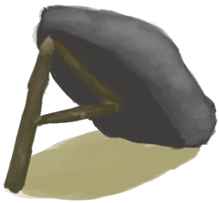

# 落石陷阱  
> 我需要在里面放上诱饵，然后过段时间再来看看。<b>（更换诱饵会重置陷阱）</b>  
   
> 所有陷阱中最简单的一种，由<b>大石块</b>和一些<b>树枝</b>制成。  它可以捕捉小动物，如<b>老鼠、蜥蜴、螃蟹、灰山鹑和海鸥</b>。  这些陷阱需要<b>诱饵</b>才能用，并且每次触发后必须<b>重置</b>。 除非真的有必要，否则不要更换诱饵，不然会重置陷阱的计时器。  
  
<table class="table table-bordered" data-toggle="table" ><tbody><tr ><td  style="width:80%;text-align:left;vertical-align:top;"  >** 不可删除 **  ** 不可堆叠 **  **槽位：**1</td><td  style="width:20%;text-align:left;vertical-align:top;"  >

</td></tr></tbody></tbody></table>  
  
## 获取来源  
<table class="table table-bordered" data-toggle="table" ><thead><tr ><th  style="text-align:left;vertical-align:top;"  >来源</th><th  style="text-align:left;vertical-align:top;"  >操作</th></tr></thead><tr ><td  style="text-align:left;vertical-align:top;"  >[

[落石陷阱(未重置)](DeadfallTrapTriggered.md)](DeadfallTrapTriggered.md)</td><td  style="text-align:left;vertical-align:top;"  >重置陷阱</td></tr><tr ><td  style="text-align:left;vertical-align:top;"  >[

[落石陷阱(蓝图)](Bp_DeadfallTrap.md)](Bp_DeadfallTrap.md)</td><td  style="text-align:left;vertical-align:top;"  >蓝图制造</td></tr></tbody></table>  
  
## 动作  
<table class="table table-bordered" data-toggle="table" ><thead><tr ><th  style="text-align:left;vertical-align:top;"  >动作</th><th  style="text-align:left;vertical-align:top;"  >耗时</th><th  style="text-align:left;vertical-align:top;"  >条件</th><th  style="text-align:left;vertical-align:top;"  >变化</th><th  style="text-align:left;vertical-align:top;"  data-sortable="true"  >状态</th></tr></thead><tr ><td  style="text-align:left;vertical-align:top;"  >拆除陷阱 [“手部动作(组)”](HandAction.md)</td><td  style="text-align:left;vertical-align:top;"  >1TP</td><td  style="text-align:left;vertical-align:top;"  >[

[光亮](Light.md)](Light.md): 10-100</td><td  style="text-align:left;vertical-align:top;"  >** 自身：** →消失  ** 获得： ** ** [Materials]  **   [

[小树枝](Sticks.md)](Sticks.md)(+1)   [

[大石块](StoneHeavy.md)](StoneHeavy.md)(+1) 基础权重：1</td><td  style="text-align:left;vertical-align:top;"  ></td></tr></tbody></table>  
  
## 转化  
<table class="table table-bordered" data-toggle="table" ><thead><tr ><th  style="text-align:left;vertical-align:top;"  >放入</th><th  style="text-align:left;vertical-align:top;"  >动作</th><th  style="text-align:left;vertical-align:top;"  >耗时</th><th  style="text-align:left;vertical-align:top;"  data-sortable="true"  >条件</th><th  style="text-align:left;vertical-align:top;"  >变化</th><th  style="text-align:left;vertical-align:top;"  >玩家状态</th></tr></thead><tr ><td  style="text-align:left;vertical-align:top;"  >[“诱饵”](tag_Bait.md) [“饲料”](tag_Feed.md)</td><td  style="text-align:left;vertical-align:top;"  >捕捉猎物</td><td  style="text-align:left;vertical-align:top;"  >75TP ～ 225TP</td><td  style="text-align:left;vertical-align:top;"  ></td><td  style="text-align:left;vertical-align:top;"  >** [Fail]  ** 基础权重：100<li>[

[陷阱(技能)](Skill_Trapping.md)](Skill_Trapping.md)为0～150时权重+0～-50</li><li>[

[陷阱栅栏](Imp_TrappingFences.md)](Imp_TrappingFences.md)存在于*手中/面板*，权重-20(可叠加)</li> ** [Crab]  **   [

[螃蟹](Crab.md)](Crab.md)(+1) [螃蟹种群数量](Pop_Crab.md)-1000 基础权重：0<li>[

[沙滩(环境)](Env_Beach.md)](Env_Beach.md)存在于*手中/面板*，[螃蟹种群数量](Pop_Crab.md)为1000～60000时权重限定为+1～+20</li><li>[

[海湾(环境)](Env_Bay.md)](Env_Bay.md)存在于*手中/面板*，[螃蟹种群数量](Pop_Crab.md)为1000～60000时权重限定为+1～+20</li><li>[

[荒芜沙滩(环境)](Env_DesolateBeach.md)](Env_DesolateBeach.md)存在于*手中/面板*，[螃蟹种群数量](Pop_Crab.md)为1000～60000时权重限定为+1～+20</li><li>[

[岩滩(环境)](Env_Rocks.md)](Env_Rocks.md)存在于*手中/面板*，[螃蟹种群数量](Pop_Crab.md)为1000～60000时权重限定为+1～+40</li><li>[

[鸟岩岛(环境)](Env_BirdRock.md)](Env_BirdRock.md)存在于*手中/面板*，[螃蟹种群数量](Pop_Crab.md)为1000～60000时权重限定为+1～+40</li><li>[

[红树林(环境)](Env_Mangroves.md)](Env_Mangroves.md)存在于*手中/面板*，[螃蟹种群数量](Pop_Crab.md)为1000～60000时权重限定为+1～+40</li> ** [Seagull]  **   [

[海鸥尸体](SeagullDead.md)](SeagullDead.md)(+1) [海鸥种群数量](Pop_Seagull.md)-1000 [海鸥之惧](SeagullFear.md)+100 基础权重：0<li>[

[沙滩(环境)](Env_Beach.md)](Env_Beach.md)存在于*手中/面板*，[海鸥种群数量](Pop_Seagull.md)为1000～45000时权重+1～+10</li><li>[

[海湾(环境)](Env_Bay.md)](Env_Bay.md)存在于*手中/面板*，[海鸥种群数量](Pop_Seagull.md)为1000～45000时权重+1～+10</li><li>[

[鸟岩岛(环境)](Env_BirdRock.md)](Env_BirdRock.md)存在于*手中/面板*，[海鸥种群数量](Pop_Seagull.md)为1000～45000时权重+1～+20</li><li>[

[岩滩(环境)](Env_Rocks.md)](Env_Rocks.md)存在于*手中/面板*，[海鸥种群数量](Pop_Seagull.md)为1000～45000时权重+1～+15</li><li>[

[荒芜沙滩(环境)](Env_DesolateBeach.md)](Env_DesolateBeach.md)存在于*手中/面板*，[海鸥种群数量](Pop_Seagull.md)为1000～45000时权重+1～+15</li> ** [Lizard]  **   [

[蜥蜴](Lizard.md)](Lizard.md)(+1) [蜥蜴种群数量](Pop_Lizard.md)-1000 基础权重：0<li>[

[丛林边缘(环境)](Env_Outskirts.md)](Env_Outskirts.md)存在于*手中/面板*，[蜥蜴种群数量](Pop_Lizard.md)为1000～60000时权重限定为+0～+20</li><li>[

[西部高地(环境)](Env_HighlandsWestern.md)](Env_HighlandsWestern.md)存在于*手中/面板*，[蜥蜴种群数量](Pop_Lizard.md)为1000～60000时权重限定为+0～+20</li><li>[

[沙滩(环境)](Env_Beach.md)](Env_Beach.md)存在于*手中/面板*，[蜥蜴种群数量](Pop_Lizard.md)为1000～60000时权重限定为+0～+10</li><li>[

[海湾(环境)](Env_Bay.md)](Env_Bay.md)存在于*手中/面板*，[蜥蜴种群数量](Pop_Lizard.md)为1000～60000时权重限定为+0～+10</li><li>[

[丛林(环境)](Env_Jungle.md)](Env_Jungle.md)存在于*手中/面板*，[蜥蜴种群数量](Pop_Lizard.md)为1000～60000时权重限定为+0～+5</li><li>[

[西部草原(环境)](Env_GrasslandsW.md)](Env_GrasslandsW.md)存在于*手中/面板*，[蜥蜴种群数量](Pop_Lizard.md)为1000～60000时权重限定为+0～+5</li><li>[

[东部草原(环境)](Env_GrasslandsE.md)](Env_GrasslandsE.md)存在于*手中/面板*，[蜥蜴种群数量](Pop_Lizard.md)为1000～60000时权重限定为+0～+5</li><li>[

[荒芜沙滩(环境)](Env_DesolateBeach.md)](Env_DesolateBeach.md)存在于*手中/面板*，[蜥蜴种群数量](Pop_Lizard.md)为1000～60000时权重限定为+0～+5</li> ** [Mudskipper]  **   [

[弹涂鱼](Mudskipper.md)](Mudskipper.md)(+1) [弹涂鱼种群数量](Pop_Mudskipper.md)-1000 基础权重：0<li>[

[红树林(环境)](Env_Mangroves.md)](Env_Mangroves.md)存在于*手中/面板*，[弹涂鱼种群数量](Pop_Mudskipper.md)为1000～15000时权重限定为+0～+20</li> ** [Mouse]  **   [

[老鼠尸体](Mouse.md)](Mouse.md)(+1) [老鼠种群数量](Pop_Mouse.md)-1000 基础权重：0<li>[

[沙滩(环境)](Env_Beach.md)](Env_Beach.md)存在于*手中/面板*，[老鼠种群数量](Pop_Mouse.md)为1000～100000时权重限定为+0～+5</li><li>[

[海湾(环境)](Env_Bay.md)](Env_Bay.md)存在于*手中/面板*，[老鼠种群数量](Pop_Mouse.md)为1000～100000时权重限定为+0～+5</li><li>[

[丛林边缘(环境)](Env_Outskirts.md)](Env_Outskirts.md)存在于*手中/面板*，[老鼠种群数量](Pop_Mouse.md)为1000～100000时权重限定为+0～+20</li><li>[

[西部草原(环境)](Env_GrasslandsW.md)](Env_GrasslandsW.md)存在于*手中/面板*，[老鼠种群数量](Pop_Mouse.md)为1000～100000时权重限定为+0～+20[巨蜥种群数量](Pop_Monitor.md)为1000～14000时权重限定为+0～-15</li><li>[

[东部草原(环境)](Env_GrasslandsE.md)](Env_GrasslandsE.md)存在于*手中/面板*，[老鼠种群数量](Pop_Mouse.md)为1000～100000时权重限定为+0～+20[巨蜥种群数量](Pop_Monitor.md)为1000～14000时权重限定为+0～-15</li><li>[

[神秘谷(环境)](Env_SecretValley.md)](Env_SecretValley.md)存在于*手中/面板*，[老鼠种群数量](Pop_Mouse.md)为1000～100000时权重限定为+0～+20[巨蜥种群数量](Pop_Monitor.md)为1000～14000时权重限定为+0～-15</li><li>[

[西部高地(环境)](Env_HighlandsWestern.md)](Env_HighlandsWestern.md)存在于*手中/面板*，[老鼠种群数量](Pop_Mouse.md)为1000～100000时权重限定为+0～+20</li><li>[

[丛林高地(环境)](Env_JungleHighlands.md)](Env_JungleHighlands.md)存在于*手中/面板*，[老鼠种群数量](Pop_Mouse.md)为1000～100000时权重限定为+0～+20</li><li>[

[丛林(环境)](Env_Jungle.md)](Env_Jungle.md)存在于*手中/面板*，[老鼠种群数量](Pop_Mouse.md)为1000～100000时权重限定为+0～+25</li><li>[

[丛林深处(环境)](Env_DeepJungle.md)](Env_DeepJungle.md)存在于*手中/面板*，[老鼠种群数量](Pop_Mouse.md)为1000～100000时权重限定为+0～+25</li><li>[

[湿地(环境)](Env_Wetlands.md)](Env_Wetlands.md)存在于*手中/面板*，[老鼠种群数量](Pop_Mouse.md)为1000～100000时权重限定为+0～+25</li><li>[

[红树林(环境)](Env_Mangroves.md)](Env_Mangroves.md)存在于*手中/面板*，[老鼠种群数量](Pop_Mouse.md)为1000～100000时权重限定为+0～+5</li> ** [Partridge]  **   [

[灰山鹑尸体](PartridgeDead.md)](PartridgeDead.md)(+1) [灰山鹑种群数量](Pop_Partridge.md)-1000 基础权重：0<li>[

[丛林(环境)](Env_Jungle.md)](Env_Jungle.md)存在于*手中/面板*，[灰山鹑种群数量](Pop_Partridge.md)为1000～40000时权重限定为+0～+15</li><li>[

[丛林深处(环境)](Env_DeepJungle.md)](Env_DeepJungle.md)存在于*手中/面板*，[灰山鹑种群数量](Pop_Partridge.md)为1000～40000时权重限定为+0～+15</li><li>[

[湿地(环境)](Env_Wetlands.md)](Env_Wetlands.md)存在于*手中/面板*，[灰山鹑种群数量](Pop_Partridge.md)为1000～40000时权重限定为+0～+15</li><li>[

[西部高地(环境)](Env_HighlandsWestern.md)](Env_HighlandsWestern.md)存在于*手中/面板*，[灰山鹑种群数量](Pop_Partridge.md)为1000～40000时权重限定为+0～+15</li><li>[

[丛林高地(环境)](Env_JungleHighlands.md)](Env_JungleHighlands.md)存在于*手中/面板*，[灰山鹑种群数量](Pop_Partridge.md)为1000～40000时权重限定为+0～+15</li><li>[

[西部草原(环境)](Env_GrasslandsW.md)](Env_GrasslandsW.md)存在于*手中/面板*，[灰山鹑种群数量](Pop_Partridge.md)为1000～40000时权重限定为+0～+15[巨蜥种群数量](Pop_Monitor.md)为1000～14000时权重限定为+0～-15</li><li>[

[东部草原(环境)](Env_GrasslandsE.md)](Env_GrasslandsE.md)存在于*手中/面板*，[灰山鹑种群数量](Pop_Partridge.md)为1000～40000时权重限定为+0～+15[巨蜥种群数量](Pop_Monitor.md)为1000～14000时权重限定为+0～-15</li><li>[

[神秘谷(环境)](Env_SecretValley.md)](Env_SecretValley.md)存在于*手中/面板*，[灰山鹑种群数量](Pop_Partridge.md)为1000～40000时权重限定为+0～+10[巨蜥种群数量](Pop_Monitor.md)为1000～14000时权重限定为+0～-15</li> ** [Cobra]  **   [

[眼镜蛇尸体](CobraDead.md)](CobraDead.md)(+1) [眼镜蛇种群数量](Pop_Cobra.md)-1000 基础权重：0<li>[

[西部高地(环境)](Env_HighlandsWestern.md)](Env_HighlandsWestern.md)存在于*手中/面板*，[眼镜蛇种群数量](Pop_Cobra.md)为1000～12000时权重限定为+0～+10</li><li>[

[东部高地(环境)](Env_HighlandsEastern.md)](Env_HighlandsEastern.md)存在于*手中/面板*，[眼镜蛇种群数量](Pop_Cobra.md)为1000～12000时权重限定为+0～+15</li><li>[

[西部草原(环境)](Env_GrasslandsW.md)](Env_GrasslandsW.md)存在于*手中/面板*，[眼镜蛇种群数量](Pop_Cobra.md)为1000～12000时权重限定为+0～+10[巨蜥种群数量](Pop_Monitor.md)为1000～14000时权重限定为+0～-15</li><li>[

[东部草原(环境)](Env_GrasslandsE.md)](Env_GrasslandsE.md)存在于*手中/面板*，[眼镜蛇种群数量](Pop_Cobra.md)为1000～12000时权重限定为+0～+10[巨蜥种群数量](Pop_Monitor.md)为1000～14000时权重限定为+0～-15</li>  → [

[落石陷阱(未重置)](DeadfallTrapTriggered.md)](DeadfallTrapTriggered.md)</td><td  style="text-align:left;vertical-align:top;"  >[

[陷阱(技能)](Skill_Trapping.md)](Skill_Trapping.md)+0.5</td></tr></tbody></table>  
  

