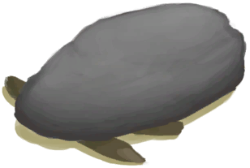

# 落石陷阱  
> 得先重置好才能再次使用。  
  
<table class="table table-bordered table1781" data-toggle="table"  data-show-header="false"><thead style="display:none"><tr ><th  style="width:50%;"  >title</th><th  style="width:50%;"  ></th></tr></thead><tr ><td  style="width:50%;"  >** 不可删除 **  ** 不可堆叠 **  **槽位：**1  **过滤器：**[“诱饵”](tag_Bait.md) , [“饲料”](tag_Feed.md)</td><td  style="width:50%;"  >

<a href="DeadfallTrapTriggered.md" style="color:black">落石陷阱</a>

所有陷阱中最简单的一种，由<b>大石块</b>和一些<b>树枝</b>制成。  它可以捕捉小动物，如<b>老鼠、蜥蜴、螃蟹、灰山鹑和海鸥</b>。  这些陷阱需要<b>诱饵</b>才能用，并且每次触发后必须<b>重置</b>。 除非真的有必要，否则不要更换诱饵，不然会重置陷阱的计时器。</td></tr></tbody></table>  
  
## 动作  

<table><tr><td rowspan="2" style="width:200px;text-align:center;font-size:1.3em;font-weight:bold">

重置陷阱

15分

</td><td>[“手部动作(组)”](HandAction.md)</td></tr><tr><td><b>自身：</b>→ [

[落石陷阱](DeadfallTrap.md)](DeadfallTrap.md)</td></tr><tr><td colspan="2"><b>需求：</b>[

[光亮](Light.md)](Light.md): <b>10-100</b></td></tr><tr><td colspan="2"><b>状态变化：</b>[

[陷阱(技能)](Skill_Trapping.md)](Skill_Trapping.md)<b>+0.5</b></td></tr></table>
  

<table><tr><td rowspan="2" style="width:200px;text-align:center;font-size:1.3em;font-weight:bold">

拆除陷阱

15分

</td><td>[“手部动作(组)”](HandAction.md)</td></tr><tr><td><b>自身：</b>→消失</td></tr><tr><td colspan="2"><b>需求：</b>[

[光亮](Light.md)](Light.md): <b>10-100</b></td></tr><tr><td colspan="2">[

[小树枝](Sticks.md)](Sticks.md)(<b>+1</b>), [

[大石块](StoneHeavy.md)](StoneHeavy.md)(<b>+1</b>)</td></tr></table>
  
  
  

