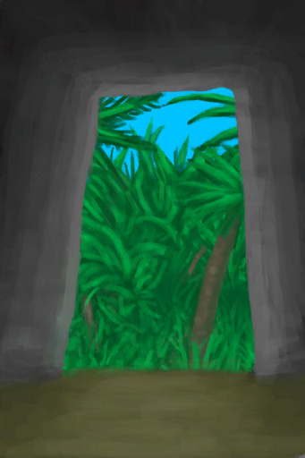

# 废墟  
> 得清理一下，这里可能有用的上的东西。  
  
<table class="table table-bordered" data-toggle="table"  data-show-header="false"><thead style="display:none"><tr ><th  style="width:50%;text-align:left;vertical-align:top;"  >title</th><th  style="width:50%;text-align:left;vertical-align:top;"  ></th></tr></thead><tr ><td  style="width:50%;text-align:left;vertical-align:top;"  >**环境：**[泥屋(损坏)(环境)](Env_MudHutRuins.md)  **重量：**5000  **可用次数：**10  ** 效果: ** [

[不适](Discomfort.md)](Discomfort.md)+500</td><td  style="width:50%;text-align:left;vertical-align:top;"  >

<a href="Debris.md" style="color:black">废墟</a>

</td></tr></tbody></table>  
  
## 获取来源  
<table class="table table-bordered" data-toggle="table"  ><thead style=""><tr ><th  style="text-align:left;vertical-align:top;"  >来源</th><th  style="text-align:left;vertical-align:top;"  >操作</th></tr></thead><tr ><td  style="text-align:left;vertical-align:top;"  >[

[离开(泥屋)](MudHutExitRuins.md)](MudHutExitRuins.md)</td><td  style="text-align:left;vertical-align:top;"  >离开</td></tr></tbody></table>  
  
## 动作  
<table class="table table-bordered" data-toggle="table"  ><thead style=""><tr ><th  style="text-align:left;vertical-align:top;"  >动作</th><th  style="text-align:left;vertical-align:top;"  >耗时</th><th  style="text-align:left;vertical-align:top;"  >条件</th><th  style="text-align:left;vertical-align:top;"  >变化</th><th  style="text-align:left;vertical-align:top;"  >状态</th></tr></thead><tr ><td  style="text-align:left;vertical-align:top;"  >清理 </td><td  style="text-align:left;vertical-align:top;"  >1小时</td><td  style="text-align:left;vertical-align:top;"  >[

[光亮](Light.md)](Light.md): 10-100</td><td  style="text-align:left;vertical-align:top;"  >** 自身：** 使用次数  -4  ** 获得： ** ** [Debris]  **   [

[干土堆](DirtPile.md)](DirtPile.md)(+0～+4)   [

[长木棍](StickLong.md)](StickLong.md)(+0～+2)   [

[小树枝](Sticks.md)](Sticks.md)(+0～+3)   [

[细线](CordFiber.md)](CordFiber.md)(+0～+3) 基础权重：1</td><td  style="text-align:left;vertical-align:top;"  >[

[耐力](Stamina.md)](Stamina.md)-8 [

[手掌损伤](HandDamage.md)](HandDamage.md)+50</td></tr></tbody></table>  
  
## 可拖入  
<table class="table table-bordered" data-toggle="table"  ><thead style=""><tr ><th  style="text-align:left;vertical-align:top;"  >使用</th><th  style="text-align:left;vertical-align:top;"  >动作</th><th  style="text-align:left;vertical-align:top;"  >耗时</th><th  style="text-align:left;vertical-align:top;"  >条件</th><th  style="text-align:left;vertical-align:top;"  >变化</th><th  style="text-align:left;vertical-align:top;"  >玩家状态</th></tr></thead><tr ><td  style="text-align:left;vertical-align:top;"  >[“铲子”](tag_Shovel.md)</td><td  style="text-align:left;vertical-align:top;"  >清理 </td><td  style="text-align:left;vertical-align:top;"  >30分</td><td  style="text-align:left;vertical-align:top;"  >[

[光亮](Light.md)](Light.md): 10-100</td><td  style="text-align:left;vertical-align:top;"  >** 自身: ** 使用次数  -4  ** 使用物: ** 可用次数  -1  ** 获得: ** ** [Debris]  **   [

[干土堆](DirtPile.md)](DirtPile.md)(+0～+3)   [

[长木棍](StickLong.md)](StickLong.md)(+0～+1)   [

[小树枝](Sticks.md)](Sticks.md)(+0～+3) 基础权重：1</td><td  style="text-align:left;vertical-align:top;"  >[

[耐力](Stamina.md)](Stamina.md)-4 [

[手掌损伤](HandDamage.md)](HandDamage.md)+25</td></tr></tbody></table>  
  
## 属性   
<table class="table table-bordered" data-toggle="table"  ><thead style=""><tr ><th  style="text-align:left;vertical-align:top;"  >属性</th><th  style="text-align:left;vertical-align:top;"  >值</th><th  style="text-align:left;vertical-align:top;"  data-sortable="true"  >耗时</th><th  style="text-align:left;vertical-align:top;"  >变化</th></tr></thead><tr ><td  style="text-align:left;vertical-align:top;"  >使用次数</td><td  style="text-align:left;vertical-align:top;"  >初始：10</td><td  style="text-align:left;vertical-align:top;"  >-</td><td  style="text-align:left;vertical-align:top;"  >** 到达0时： **  ** 自身 ** →消失</td></tr></tbody></table>  
  

