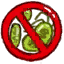
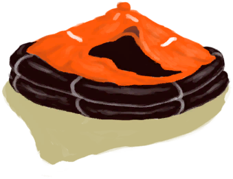
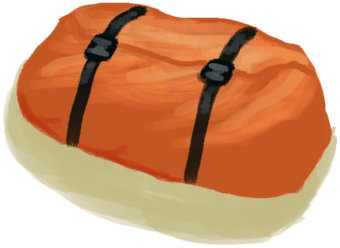
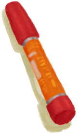

## 体验版人物  

<table style="margin-bottom:0px;"><tr><td rowspan=2 style="width:160px"></td><td style="font-size:1.8em"><b>体验版人物</b></td><td style="width:50%">解锁价格：免费</td></tr><tr><td  colspan=2 style=""><i>生存不下去了？试试这个角色。(^_^)

在完整游戏中，你可以通过选择特质来创建自定义角色。

这位有一艘救生筏和装满补给品的行李箱。</i></td><tr><td colspan=2><b>初始环境：</b>[

[沙滩](Beach.md)](Beach.md)<td colspan=1><b>初始天气：</b>[

[晴朗](TropicalIsland_ClearStart.md)](TropicalIsland_ClearStart.md)</tr></tr><tr><td colspan=3><b>初始状态：</b>[

[污垢](Filth.md)](Filth.md)<b>-250</b> [

[水分](Hydration.md)](Hydration.md)<b>+300</b> [

[饱食](Satiation.md)](Satiation.md)<b>+35</b></tr><tr><td colspan=3><b>初始特性：</b>

[救生筏](Pk_1_LifeRaft.md)

[超级生存箱 2000](Pk_2_SurvivalTrunk.md)

[乐观主义](Pk_4_Optimist.md)

[脚踏实地](Pk_4_DownToEarth.md)

[独来独往](Pk_4_Loner.md)

[攀岩者](Pk_5_Climber.md)

[游泳健将](Pk_5_Swimmer.md)

[钓鱼佬](Pk_5_Fisher.md)

[药草学者](Pk_5_Herbologist.md)

[陷阱能手](Pk_5_Trapper.md)

[天生免疫](Pk_4_Immunized.md)

[强免疫系统](Pk_4_ImmuneSystemStrong.md)

[抗虫体质](Pk_4_BugResistant.md)

[席地而睡](Pk_4_RoughSleeper.md)

[海湾](Pk_1_LocationBay.md)

  
  
</tr><tr><td colspan=3><b>初始衣物：</b> 

  
  
</tr><tr><td colspan=3><b>初始卡牌：</b> 

<a href="LifeRaftDeflated.md" style="color:black">没气的救生筏</a>

<a href="ContainerBagA.md" style="color:black">集装袋</a>

<a href="FirstAidKitLifeRaft.md" style="color:black">急救包</a>

<a href="AntiDiarrhoeaPills.md" style="color:black">泻立停x4</a>

<a href="Painkillers.md" style="color:black">止痛药x4</a>

<a href="Antibiotics.md" style="color:black">抗生素x4</a>

<a href="WoundDressing.md" style="color:black">伤口敷料x8</a>

<a href="FoodRationsPackage.md" style="color:black">压缩干粮包x3</a>

<a href="WaterRationsPackage.md" style="color:black">应急水袋x3</a>

<a href="FishingLine.md" style="color:black">钓鱼线x3</a>

<a href="PlasticBottleFull.md" style="color:black">塑料瓶x7</a>

<a href="ContainerBagB.md" style="color:black">集装袋</a>

<a href="SafetyKnife.md" style="color:black">安全刀</a>

<a href="SignalingMirror.md" style="color:black">信号镜</a>

<a href="FlareHand.md" style="color:black">信号弹x8</a>

<a href="TrunkPerk.md" style="color:black">超级生存箱 2000</a>

<a href="FirstAidKitTrunk.md" style="color:black">急救包</a>

<a href="WaterPurificationTablets.md" style="color:black">净水片x3</a>

<a href="PlasticSheet.md" style="color:black">塑料布x2</a>

  
  
</tr><tr><td colspan=3><b>初始蓝图：</b> 

<a href="Bp_FishingLine.md" style="color:black">钓鱼线</a>

<a href="Bp_FishingRod.md" style="color:black">钓鱼竿</a>

<a href="Bp_FishBait.md" style="color:black">鱼饵</a>

<a href="Bp_AloeGel.md" style="color:black">芦荟膏</a>

<a href="Bp_BugRepellent.md" style="color:black">驱虫膏</a>

<a href="Bp_CropPlot.md" style="color:black">农田</a>

<a href="Bp_PesticideChilli.md" style="color:black">辣椒农药</a>

<a href="Bp_CompostBin.md" style="color:black">堆肥箱</a>

<a href="Bp_DeadfallTrap.md" style="color:black">落石陷阱</a>

<a href="Bp_SnareTrap.md" style="color:black">套索陷阱</a>

<a href="Bp_FishTrap.md" style="color:black">捕鱼陷阱</a>

<a href="Bp_LogTrap.md" style="color:black">原木陷阱</a>

<a href="Bp_CageTrap.md" style="color:black">诱捕笼</a>

<a href="Bp_TrappingPit.md" style="color:black">陷坑</a>

  
  
</tr></table>
    
  
## 目标  

<b>准备工作</b>

<table style="margin-bottom:0px;"><tr><td rowSpan=3 style="width:50px;max-height:100px;text-align:center;vertical-align:top"></td><td colspan=2 >
<b>探索岛屿，发现自我！</b>
<i>完成这些<b>可选</b>目标能提高你的<b>决心</b>。</i></td></tr><tr style=""></tr><tr style=""><td ><b>达成奖励：</b>[

[压力](Stress.md)](Stress.md)<b>-48</b>&nbsp;&nbsp;&nbsp;&nbsp;[

[决心](Determination.md)](Determination.md)<b>+100</b></td></tr><tr style="border-bottom:2px solid #CCC;height:1px;"></tr><tr><td rowSpan=3 style="width:50px;max-height:100px;text-align:center;vertical-align:top"></td><td colspan=2 >
<b>探索</b>
</td></tr><tr style=""><td>
<table style="margin-bottom:0px;"><tr><td rowSpan=3 style="width:50px;max-height:100px;text-align:center;vertical-align:top"></td><td colspan=2 >
<b>探索岛屿</b>
</td></tr><tr style=""></tr><tr style=""><td ><b>达成奖励：</b>[

[压力](Stress.md)](Stress.md)<b>-48</b></td></tr><tr style="border-bottom:2px solid #CCC;height:1px;"></tr><tr><td rowSpan=3 style="width:50px;max-height:100px;text-align:center;vertical-align:top"></td><td colspan=2 >
<b>沙滩</b>
</td></tr><tr style=""><td><b>达成条件：</b>[

[地区探索完毕(事件)(沙滩)](Event_BeachExplored.md)](Event_BeachExplored.md)x1 </td></tr><tr style=""><td ><b>达成奖励：</b>[

[压力](Stress.md)](Stress.md)<b>-48</b>&nbsp;&nbsp;&nbsp;&nbsp;[

[决心](Determination.md)](Determination.md)<b>+100</b></td></tr><tr style="border-bottom:2px solid #CCC;height:1px;"></tr><tr><td rowSpan=3 style="width:50px;max-height:100px;text-align:center;vertical-align:top"></td><td colspan=2 >
<b>岩滩</b>
</td></tr><tr style=""><td><b>达成条件：</b>[

[地区探索完毕(事件)](Event_RocksExplored.md)](Event_RocksExplored.md)x1 </td></tr><tr style=""><td ><b>达成奖励：</b>[

[压力](Stress.md)](Stress.md)<b>-48</b>&nbsp;&nbsp;&nbsp;&nbsp;[

[决心](Determination.md)](Determination.md)<b>+100</b></td></tr><tr style="border-bottom:2px solid #CCC;height:1px;"></tr><tr><td rowSpan=3 style="width:50px;max-height:100px;text-align:center;vertical-align:top"></td><td colspan=2 >
<b>丛林边缘</b>
</td></tr><tr style=""><td><b>达成条件：</b>[

[地区探索完毕(事件)](Event_OutskirtsExplored.md)](Event_OutskirtsExplored.md)x1 </td></tr><tr style=""><td ><b>达成奖励：</b>[

[压力](Stress.md)](Stress.md)<b>-48</b>&nbsp;&nbsp;&nbsp;&nbsp;[

[决心](Determination.md)](Determination.md)<b>+100</b></td></tr><tr style="border-bottom:2px solid #CCC;height:1px;"></tr><tr><td rowSpan=3 style="width:50px;max-height:100px;text-align:center;vertical-align:top"></td><td colspan=2 >
<b>海湾</b>
</td></tr><tr style=""><td><b>达成条件：</b>[

[地区探索完毕(事件)(海湾)](Event_BayExplored.md)](Event_BayExplored.md)x1 </td></tr><tr style=""><td ><b>达成奖励：</b>[

[压力](Stress.md)](Stress.md)<b>-48</b>&nbsp;&nbsp;&nbsp;&nbsp;[

[决心](Determination.md)](Determination.md)<b>+100</b></td></tr><tr style="border-bottom:2px solid #CCC;height:1px;"></tr><tr><td rowSpan=3 style="width:50px;max-height:100px;text-align:center;vertical-align:top"></td><td colspan=2 >
<b>丛林</b>
</td></tr><tr style=""><td><b>达成条件：</b>[

[地区探索完毕(事件)](Event_JungleExplored.md)](Event_JungleExplored.md)x1 </td></tr><tr style=""><td ><b>达成奖励：</b>[

[压力](Stress.md)](Stress.md)<b>-48</b>&nbsp;&nbsp;&nbsp;&nbsp;[

[决心](Determination.md)](Determination.md)<b>+100</b></td></tr><tr style="border-bottom:2px solid #CCC;height:1px;"></tr><tr><td rowSpan=3 style="width:50px;max-height:100px;text-align:center;vertical-align:top"></td><td colspan=2 >
<b>湿地</b>
</td></tr><tr style=""><td><b>达成条件：</b>[

[地区探索完毕(事件)(湿地)](Event_WetlandsExplored.md)](Event_WetlandsExplored.md)x1 </td></tr><tr style=""><td ><b>达成奖励：</b>[

[压力](Stress.md)](Stress.md)<b>-48</b>&nbsp;&nbsp;&nbsp;&nbsp;[

[决心](Determination.md)](Determination.md)<b>+100</b></td></tr><tr style="border-bottom:2px solid #CCC;height:1px;"></tr><tr><td rowSpan=3 style="width:50px;max-height:100px;text-align:center;vertical-align:top"></td><td colspan=2 >
<b>红树林</b>
</td></tr><tr style=""><td><b>达成条件：</b>[

[地区探索完毕(事件)(红树林)](Event_MangrovesExplored.md)](Event_MangrovesExplored.md)x1 </td></tr><tr style=""><td ><b>达成奖励：</b>[

[压力](Stress.md)](Stress.md)<b>-48</b>&nbsp;&nbsp;&nbsp;&nbsp;[

[决心](Determination.md)](Determination.md)<b>+100</b></td></tr><tr style="border-bottom:2px solid #CCC;height:1px;"></tr><tr><td rowSpan=3 style="width:50px;max-height:100px;text-align:center;vertical-align:top"></td><td colspan=2 >
<b>西部草原</b>
</td></tr><tr style=""><td><b>达成条件：</b>[

[地区探索完毕(事件)(西部草原)](Event_GrasslandsWExplored.md)](Event_GrasslandsWExplored.md)x1 </td></tr><tr style=""><td ><b>达成奖励：</b>[

[压力](Stress.md)](Stress.md)<b>-48</b>&nbsp;&nbsp;&nbsp;&nbsp;[

[决心](Determination.md)](Determination.md)<b>+100</b></td></tr><tr style="border-bottom:2px solid #CCC;height:1px;"></tr><tr><td rowSpan=3 style="width:50px;max-height:100px;text-align:center;vertical-align:top"></td><td colspan=2 >
<b>西部高地</b>
</td></tr><tr style=""><td><b>达成条件：</b>[

[地区探索完毕(事件)(西部高地)](Event_HighlandsWExplored.md)](Event_HighlandsWExplored.md)x1 </td></tr><tr style=""><td ><b>达成奖励：</b>[

[压力](Stress.md)](Stress.md)<b>-48</b>&nbsp;&nbsp;&nbsp;&nbsp;[

[决心](Determination.md)](Determination.md)<b>+100</b></td></tr><tr style="border-bottom:2px solid #CCC;height:1px;"></tr></table>
  </td></tr><tr style=""><td ><b>达成奖励：</b>[

[压力](Stress.md)](Stress.md)<b>-48</b></td></tr><tr style="border-bottom:2px solid #CCC;height:1px;"></tr><tr><td rowSpan=3 style="width:50px;max-height:100px;text-align:center;vertical-align:top"></td><td colspan=2 >
<b>技能</b>
</td></tr><tr style=""><td>
<table style="margin-bottom:0px;"><tr><td rowSpan=3 style="width:50px;max-height:100px;text-align:center;vertical-align:top"></td><td colspan=2 >
<b>精通各项技能</b>
<i>这样你才能保住自己的性命。</i></td></tr><tr style=""></tr><tr style=""><td ><b>达成奖励：</b>[

[压力](Stress.md)](Stress.md)<b>-48</b>&nbsp;&nbsp;&nbsp;&nbsp;[

[决心](Determination.md)](Determination.md)<b>+100</b></td></tr><tr style="border-bottom:2px solid #CCC;height:1px;"></tr><tr><td rowSpan=3 style="width:50px;max-height:100px;text-align:center;vertical-align:top"></td><td colspan=2 >
<b>狩猎</b>
</td></tr><tr style=""></tr><tr style=""><td ><b>达成奖励：</b>[

[压力](Stress.md)](Stress.md)<b>-48</b></td></tr><tr style="border-bottom:2px solid #CCC;height:1px;"></tr><tr><td rowSpan=3 style="width:50px;max-height:100px;text-align:center;vertical-align:top"></td><td colspan=2 >
<b>捕鱼</b>
</td></tr><tr style=""></tr><tr style=""><td ><b>达成奖励：</b>[

[压力](Stress.md)](Stress.md)<b>-48</b></td></tr><tr style="border-bottom:2px solid #CCC;height:1px;"></tr><tr><td rowSpan=3 style="width:50px;max-height:100px;text-align:center;vertical-align:top"></td><td colspan=2 >
<b>烹饪</b>
</td></tr><tr style=""><td><b>达成条件：</b>[

[烹饪(技能)](Skill_Cooking.md)](Skill_Cooking.md): <b>150</b> </td></tr><tr style=""><td ><b>达成奖励：</b>[

[压力](Stress.md)](Stress.md)<b>-48</b>&nbsp;&nbsp;&nbsp;&nbsp;[

[决心](Determination.md)](Determination.md)<b>+250</b></td></tr><tr style="border-bottom:2px solid #CCC;height:1px;"></tr><tr><td rowSpan=3 style="width:50px;max-height:100px;text-align:center;vertical-align:top"></td><td colspan=2 >
<b>制作</b>
</td></tr><tr style=""><td><b>达成条件：</b>[

[制作(技能)](Skill_Crafting.md)](Skill_Crafting.md): <b>150</b> </td></tr><tr style=""><td ><b>达成奖励：</b>[

[压力](Stress.md)](Stress.md)<b>-48</b>&nbsp;&nbsp;&nbsp;&nbsp;[

[决心](Determination.md)](Determination.md)<b>+250</b></td></tr><tr style="border-bottom:2px solid #CCC;height:1px;"></tr><tr><td rowSpan=3 style="width:50px;max-height:100px;text-align:center;vertical-align:top"></td><td colspan=2 >
<b>纺织</b>
</td></tr><tr style=""><td><b>达成条件：</b>[

[纺织(技能)](Skill_Tailoring.md)](Skill_Tailoring.md): <b>150</b> </td></tr><tr style=""><td ><b>达成奖励：</b>[

[压力](Stress.md)](Stress.md)<b>-48</b>&nbsp;&nbsp;&nbsp;&nbsp;[

[决心](Determination.md)](Determination.md)<b>+250</b></td></tr><tr style="border-bottom:2px solid #CCC;height:1px;"></tr><tr><td rowSpan=3 style="width:50px;max-height:100px;text-align:center;vertical-align:top"></td><td colspan=2 >
<b>木工</b>
</td></tr><tr style=""><td><b>达成条件：</b>[

[木工(技能)](Skill_Woodworking.md)](Skill_Woodworking.md): <b>150</b> </td></tr><tr style=""><td ><b>达成奖励：</b>[

[压力](Stress.md)](Stress.md)<b>-48</b>&nbsp;&nbsp;&nbsp;&nbsp;[

[决心](Determination.md)](Determination.md)<b>+250</b></td></tr><tr style="border-bottom:2px solid #CCC;height:1px;"></tr><tr><td rowSpan=3 style="width:50px;max-height:100px;text-align:center;vertical-align:top"></td><td colspan=2 >
<b>药草学</b>
</td></tr><tr style=""><td><b>达成条件：</b>[

[药草学(技能)](Skill_Herbology.md)](Skill_Herbology.md): <b>150</b> </td></tr><tr style=""><td ><b>达成奖励：</b>[

[压力](Stress.md)](Stress.md)<b>-48</b>&nbsp;&nbsp;&nbsp;&nbsp;[

[决心](Determination.md)](Determination.md)<b>+250</b></td></tr><tr style="border-bottom:2px solid #CCC;height:1px;"></tr><tr><td rowSpan=3 style="width:50px;max-height:100px;text-align:center;vertical-align:top"></td><td colspan=2 >
<b>攀爬</b>
</td></tr><tr style=""><td><b>达成条件：</b>[

[攀爬(技能)](Skill_Climbing.md)](Skill_Climbing.md): <b>150</b> </td></tr><tr style=""><td ><b>达成奖励：</b>[

[压力](Stress.md)](Stress.md)<b>-48</b>&nbsp;&nbsp;&nbsp;&nbsp;[

[决心](Determination.md)](Determination.md)<b>+250</b></td></tr><tr style="border-bottom:2px solid #CCC;height:1px;"></tr><tr><td rowSpan=3 style="width:50px;max-height:100px;text-align:center;vertical-align:top"></td><td colspan=2 >
<b>游泳</b>
</td></tr><tr style=""><td><b>达成条件：</b>[

[游泳(技能)](Skill_Swimming.md)](Skill_Swimming.md): <b>150</b> </td></tr><tr style=""><td ><b>达成奖励：</b>[

[压力](Stress.md)](Stress.md)<b>-48</b>&nbsp;&nbsp;&nbsp;&nbsp;[

[决心](Determination.md)](Determination.md)<b>+250</b></td></tr><tr style="border-bottom:2px solid #CCC;height:1px;"></tr></table>
  </td></tr><tr style=""><td ><b>达成奖励：</b>[

[压力](Stress.md)](Stress.md)<b>-48</b>&nbsp;&nbsp;&nbsp;&nbsp;[

[决心](Determination.md)](Determination.md)<b>+100</b></td></tr><tr style="border-bottom:2px solid #CCC;height:1px;"></tr></table>
 
<b>直面命运</b>

<table style="margin-bottom:0px;"><tr><td rowSpan=3 style="width:50px;max-height:100px;text-align:center;vertical-align:top"></td><td colspan=2 >
<b>下定决心选择你的道路</b>
<i>在<b>时间</b>推移和完成<b>目标</b>时，决心会增加。</i></td></tr><tr style=""><td><b>达成条件：</b>[

[决心](Determination.md)](Determination.md): <b>4000</b> </td></tr><tr style="border-bottom:2px solid #CCC;height:1px;"></tr><tr><td rowSpan=3 style="width:50px;max-height:100px;text-align:center;vertical-align:top"></td><td colspan=2 >
<b>逃离海岛</b>
</td></tr><tr style=""><td>
<table style="margin-bottom:0px;"><tr><td rowSpan=3 style="width:50px;max-height:100px;text-align:center;vertical-align:top"></td><td colspan=2 >
<b>建造一艘木筏</b>
<i>以离开岛屿并重返文明世界。</i></td></tr><tr style=""><td><b>达成条件：</b>[

[木筏](RaftEntrance.md)](RaftEntrance.md)x1 </td></tr><tr style="border-bottom:2px solid #CCC;height:1px;"></tr><tr><td rowSpan=3 style="width:50px;max-height:100px;text-align:center;vertical-align:top"></td><td colspan=2 >
<b>重返文明世界</b>
<i>完成这次冒险。</i></td></tr><tr style=""><td><b>达成条件：</b>[

[距离](Distance.md)](Distance.md): <b>2016</b> </td></tr><tr style="border-bottom:2px solid #CCC;height:1px;"></tr></table>
  </td></tr><tr style="border-bottom:2px solid #CCC;height:1px;"></tr><tr><td rowSpan=3 style="width:50px;max-height:100px;text-align:center;vertical-align:top"></td><td colspan=2 >
<b>在岛上定居</b>
</td></tr><tr style=""><td>
<table style="margin-bottom:0px;"><tr><td rowSpan=3 style="width:50px;max-height:100px;text-align:center;vertical-align:top"></td><td colspan=2 >
<b>在岛上生存120天</b>
<i>来熟悉这座岛。</i></td></tr><tr style=""><td><b>达成条件：</b>[计数](Counter.md): <b>11520～999999</b> </td></tr><tr style="border-bottom:2px solid #CCC;height:1px;"></tr><tr><td rowSpan=3 style="width:50px;max-height:100px;text-align:center;vertical-align:top"></td><td colspan=2 >
<b>达到最高舒适度</b>
<i>把你的住所变成真正的家。</i></td></tr><tr style=""><td><b>达成条件：</b>[

[舒适度](Comfort.md)](Comfort.md): <b>1751～2500</b> </td></tr><tr style="border-bottom:2px solid #CCC;height:1px;"></tr></table>
  </td></tr><tr style="border-bottom:2px solid #CCC;height:1px;"></tr></table>
   

