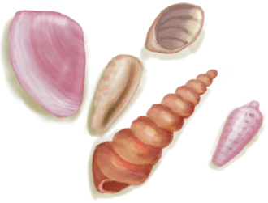

# 荒芜沙滩  
> 因靠近岛屿火山部分而有些贫瘠、荒凉的海岸。  
  

<a href="DesolateBeach.md" style="color:black">荒芜沙滩</a>

<a href="CaveTidal.md" style="color:black">潮汐洞</a>

<a href="BirdRock.md" style="color:black">鸟岩岛</a>

<a href="GrasslandsE.md" style="color:black">东部草原</a>

<a href="Mangroves.md" style="color:black">红树林</a>

<a href="Volcano.md" style="color:black">火山</a>

<a href="Sea_DesolateBeach.md" style="color:black">海</a>

<a href="SandSource.md" style="color:black">沙堆</a>

  
  
<table class="table table-bordered" data-toggle="table"  data-show-header="false"><thead style="display:none"><tr ><th  style="width:50%;text-align:left;vertical-align:top;"  >title</th><th  style="width:50%;text-align:left;vertical-align:top;"  ></th></tr></thead><tr ><td  style="width:50%;text-align:left;vertical-align:top;"  >** 区域唯一 **  **环境：**[荒芜沙滩(环境)](Env_DesolateBeach.md)  ** 环境效果: ** [

[体感温度](TemperaturePerceived.md)](TemperaturePerceived.md)-5 [

[内陆恐惧症](LandSickness.md)](LandSickness.md)加成-8</td><td  style="width:50%;text-align:left;vertical-align:top;"  >荒芜沙滩位于岛屿东侧。它连接着<b>红树林、东部草原和火山</b>。  在这里你可以找到<b>潮汐池，燧石，甚至一些黑曜石</b>，然而椰子树和其他植被的稀缺让它不适宜居住。</td></tr></tbody></table>  
  
## 探索  
<table class="table table-bordered" data-toggle="table"  ><thead style=""><tr ><th  style="text-align:left;vertical-align:top;"  >进度</th><th  style="text-align:left;vertical-align:top;"  >目的地</th></tr></thead><tr ><td  style="text-align:left;vertical-align:top;"  >15%</td><td  style="text-align:left;vertical-align:top;"  >[潮汐池(岩滩)](TidePool.md)</td></tr><tr ><td  style="text-align:left;vertical-align:top;"  >15%</td><td  style="text-align:left;vertical-align:top;"  >[被淹没的潮汐池(岩滩)](TidePoolFlooded.md)</td></tr><tr ><td  style="text-align:left;vertical-align:top;"  >30%</td><td  style="text-align:left;vertical-align:top;"  >[前往东部草原(荒芜沙滩)](Path_DesolateBeachToGrasslandsE.md)</td></tr><tr ><td  style="text-align:left;vertical-align:top;"  >45%</td><td  style="text-align:left;vertical-align:top;"  >[前往火山(荒芜沙滩)](Path_DesolateBeachToVolcano.md)</td></tr><tr ><td  style="text-align:left;vertical-align:top;"  >60%</td><td  style="text-align:left;vertical-align:top;"  >[潮汐洞(荒芜沙滩)](CaveTidalEntrance.md)</td></tr><tr ><td  style="text-align:left;vertical-align:top;"  >75%</td><td  style="text-align:left;vertical-align:top;"  >[前往红树林(荒芜沙滩)](Path_DesolateBeachToMangroves.md)</td></tr><tr ><td  style="text-align:left;vertical-align:top;"  >90%</td><td  style="text-align:left;vertical-align:top;"  >[鸟岩岛(荒芜沙滩)](Path_DesolateBeachToBirdRock.md)</td></tr><tr ><td  style="text-align:left;vertical-align:top;"  >100%</td><td  style="text-align:left;vertical-align:top;"  >[地区探索完毕(事件)(荒芜沙滩)](Event_DesolateBeachExplored.md)</td></tr></tbody></table>  
  
## 动作  
<table class="table table-bordered" data-toggle="table"  ><thead style=""><tr ><th  style="text-align:left;vertical-align:top;"  >动作</th><th  style="text-align:left;vertical-align:top;"  >耗时</th><th  style="text-align:left;vertical-align:top;"  >条件</th><th  style="text-align:left;vertical-align:top;"  >变化</th><th  style="text-align:left;vertical-align:top;"  >状态</th></tr></thead><tr ><td  style="text-align:left;vertical-align:top;"  >探索 [“腿部动作(组)”](LegAction.md) [“探索动作(组)”](SlipperyAction.md)</td><td  style="text-align:left;vertical-align:top;"  >15分</td><td  style="text-align:left;vertical-align:top;"  >[

[光亮](Light.md)](Light.md): 10-100</td><td  style="text-align:left;vertical-align:top;"  >** 获得： ** ** [Cocon First]  **❗限1次   [

[青椰子](CoconutHusked.md)](CoconutHusked.md)(+1) 基础权重：500 ** [Coconut]  **   [

[青椰子](CoconutHusked.md)](CoconutHusked.md)(+1) 基础权重：100 ** [Flint]  **   [

[燧石](Flint.md)](Flint.md)(+1) 基础权重：100 ** [Flint Slab]  **   [

[燧石板](FlintSlab.md)](FlintSlab.md)(+1) 基础权重：50 ** [Obsidian]  **   [

[黑曜石](Obsidian.md)](Obsidian.md)(+1) 基础权重：50 ** [Brimstone Stone]  **❗限12次   [

[硫磺石](StoneHeavyBrimstone.md)](StoneHeavyBrimstone.md)(+1) 基础权重：75 ** [Pretty Seashells]  **   [

[漂亮贝壳](SeashellsPretty.md)](SeashellsPretty.md)(+1) 基础权重：400 ** [Stone]  **   [

[石头](Stone.md)](Stone.md)(+1) 基础权重：1500 ** [Sticks First]  **❗限1次   [

[小树枝](Sticks.md)](Sticks.md)(+1) 基础权重：1000 ** [Sticks]  **   [

[小树枝](Sticks.md)](Sticks.md)(+1) 基础权重：300 ** [Wood First]  **❗限1次   [

[木材](Wood.md)](Wood.md)(+1) 基础权重：750 ** [Wood]  **   [

[木材](Wood.md)](Wood.md)(+1) 基础权重：200 ** [Aloe Vera]  **   [

[芦荟](AloeVera.md)](AloeVera.md)(+1) [沙滩芦荟种群数量](AloeVera_BeachPop.md)-1000 基础权重：0<li>[

[薬草学(技能)](Skill_Herbology.md)](Skill_Herbology.md)为0～150时权重-25～+0</li><li>[沙滩芦荟种群数量](AloeVera_BeachPop.md)为1000～4000时权重+50～+100</li> ** [Gastric Pellet]  **   [

[食丸](GastricPellet.md)](GastricPellet.md)(+1) 基础权重：0<li>[巨蜥种群数量](Pop_Monitor.md)为1000～14000时权重+25～+100，否则权重-1000000</li> ** [Supply Crate]  **   [

[补给胶囊](TV_SupplyCapsule.md)](TV_SupplyCapsule.md)(+1) 基础权重：0<li>[

[真人秀 - 岩滩](TV_Rocks.md)](TV_Rocks.md)为1时权重+200</li><li>[真人秀 石滩 - 探索](TV_RocksExplore.md)为0～9时权重-999</li> ** [Heavy Stone]  **   [

[大石块](StoneHeavy.md)](StoneHeavy.md)(+1) 基础权重：750 ** [Crab]  **   [

[螃蟹](Crab.md)](Crab.md)(+1) [螃蟹种群数量](Pop_Crab.md)-1000 基础权重：0<li>[螃蟹种群数量](Pop_Crab.md)为1000～60000时权重+100～+1200</li> ** [Seagull Carcass]  **   [

[海鸥遗骸](SeagullCarcass.md)](SeagullCarcass.md)(+1) [海鸥种群数量](Pop_Seagull.md)-1000 基础权重：0<li>[海鸥种群数量](Pop_Seagull.md)为1000～45000时权重+0～+100</li> ** [Seagull Spotted]  **   [

[一只海鸥！(事件)](Event_SeagullFight.md)](Event_SeagullFight.md)(+1) 基础权重：0<li>[海鸥种群数量](Pop_Seagull.md)为1000～45000时权重+0～+100</li><li>[

[视力](Myopia.md)](Myopia.md)为1～3时权重-100～-200</li> ** [Drone Encounter]  **   [

[攻击无人机！(事件)](Event_DroneFight.md)](Event_DroneFight.md)(+1) 基础权重：0<li>[杀手无人机种群数量](Pop_Drone.md)为1000～4000时权重+25～+100</li><li>[

[视力](Myopia.md)](Myopia.md)为1～3时权重+0</li><li>[“战斗事件”](tag_FightEvent.md)存在于*手中/面板*，权重-999999(可叠加)</li> ** [Monitor Encounter]  **   [

[一头巨蜥！(事件)(洞穴)](Event_MonitorFight.md)](Event_MonitorFight.md)(+1) 基础权重：0<li>[首月次数](FirstMonthCounter.md)为0～672时权重-1000</li><li>[巨蜥种群数量](Pop_Monitor.md)为1000～14000时权重+10～+50</li><li>[

[视力](Myopia.md)](Myopia.md)为1～3时权重+0</li><li>[“战斗事件”](tag_FightEvent.md)存在于*手中/面板*，权重-999999(可叠加)</li></td><td  style="text-align:left;vertical-align:top;"  >[

[足部损伤](FootDamage.md)](FootDamage.md)+20 [

[耐力](Stamina.md)](Stamina.md)-4 [

[压力](Stress.md)](Stress.md)-10 [探索岩滩](Exploration_Rocks.md)+1 [真人秀 石滩 - 探索](TV_RocksExplore.md)+1</td></tr></tbody></table>  
  

