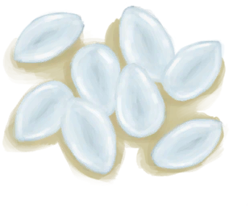
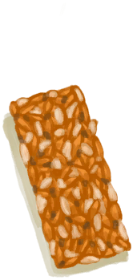
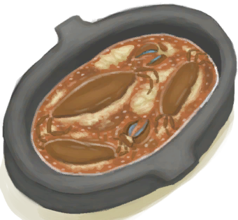

# 腹泻  
> 增加你脱水的速度。  
> 腹泻可能是由于过量食用某些特定的食物（如<b>椰子及某些蘑菇和蔬菜</b>），或由于吃<b>生食</b>以及处于<b>较低的卫生水平</b>导致细菌滋生引起的。  这种症状会降低你的情绪，使你脱水的速度比正常时快得多。要治疗它，首先需要处理相对应的疾病。要么停止食用<b>致病食物</b>一段时间，要么增强你的<b>免疫系统</b>直到你的身体摆脱致病细菌。  一些有效的治疗方法： 吃<b>木炭</b>对缓解腹泻非常有效。<b>姜茶、米饭和米汤</b>也可以在较小的程度上提供帮助。   
  

<b>基础值: </b> 0 
  

<b>变化范围: </b> 0 ~ 300 
  

<b>基础变化率: </b> -0.75 / 每15分钟 
  
## 阶段  

<table><tr style="height:2em;"><td style="background-color:#F0F0F0;text-align:center;width:180px;font-size:1.4em;font-weight:bold;vertical-align:middle;">
149 ～ 200

49% ～ 66%
</td><td colspan=2 style="font-size:1.1em;vertical-align:middle;background-color:#F9F9F9;">
<b>

大便稀软</b>

&nbsp;&nbsp;感觉不太好……
</td></tr><tr><td colspan=2><b>影响：</b>[

[肠道](Intestines.md)](Intestines.md)加成-0.5, [

[水分](Hydration.md)](Hydration.md)加成-1</td></tr><tr><td colspan=2></td></tr><tr style="height:2em;"><td style="background-color:#F0F0F0;text-align:center;width:180px;font-size:1.4em;font-weight:bold;vertical-align:middle;">
201 ～ 250

67% ～ 83%
</td><td colspan=2 style="font-size:1.1em;vertical-align:middle;background-color:#F9F9F9;">
<b>

腹泻</b>

&nbsp;&nbsp;我拉肚子了！
</td></tr><tr><td colspan=2><b>影响：</b>[

[肠道](Intestines.md)](Intestines.md)加成-1, [

[水分](Hydration.md)](Hydration.md)加成-2, [

[情绪](Morale.md)](Morale.md)加成-0.5</td></tr><tr><td colspan=2></td></tr><tr style="height:2em;"><td style="background-color:#F0F0F0;text-align:center;width:180px;font-size:1.4em;font-weight:bold;vertical-align:middle;">
251 ～ 300

83% ～ 100%
</td><td colspan=2 style="font-size:1.1em;vertical-align:middle;background-color:#F9F9F9;">
<b>

严重腹泻</b>

&nbsp;&nbsp;……
</td></tr><tr><td colspan=2><b>影响：</b>[

[肠道](Intestines.md)](Intestines.md)加成-2, [

[水分](Hydration.md)](Hydration.md)加成-3, [

[情绪](Morale.md)](Morale.md)加成-1</td></tr><tr><td colspan=2></td></tr></table>
  
## 相关卡牌  
[压力](Stress.md)  |  [细菌性腹泻](BacteriaDiarrhoea.md)  |  [野营热病](BacteriaTyphus.md)  |  [细菌性霍乱](BacteriaCholera.md)  |  [疟疾寄生虫](ParasiteMalaria.md)  |  [咖啡因](Caffeine.md)  |  [辣椒素](Capsaicin.md)  |  [食物中毒](FoodPoisoning.md)  |  [姜效果](GingerEffect.md)  |  [奎宁](Quinine.md)  |  [米饭效果](RiceEffect.md)  
## 可被以下操作改变  
<table class="table table-bordered" data-toggle="table"  ><thead style=""><tr ><th  style="text-align:left;vertical-align:top;"  >来源</th><th  style="text-align:left;vertical-align:top;"  >操作</th><th  style="text-align:left;vertical-align:top;"  >值</th></tr></thead><tr ><td  style="text-align:left;vertical-align:top;"  >[

[腐烂物](RottenRemains.md)](RottenRemains.md)</td><td  style="text-align:left;vertical-align:top;"  >食用</td><td  style="text-align:left;vertical-align:top;"  >300 ~ 600</td></tr><tr ><td  style="text-align:left;vertical-align:top;"  >[

[捣碎的蜘蛛兰](SpiderLilyGround.md)](SpiderLilyGround.md)</td><td  style="text-align:left;vertical-align:top;"  >食用</td><td  style="text-align:left;vertical-align:top;"  >150</td></tr><tr ><td  style="text-align:left;vertical-align:top;"  >[

[蜘蛛兰叶](SpiderLilyLeaves.md)](SpiderLilyLeaves.md)</td><td  style="text-align:left;vertical-align:top;"  >食用</td><td  style="text-align:left;vertical-align:top;"  >150</td></tr><tr ><td  style="text-align:left;vertical-align:top;"  >[

[干燥的蜘蛛兰叶](SpiderLilyLeavesDried.md)](SpiderLilyLeavesDried.md)</td><td  style="text-align:left;vertical-align:top;"  >食用</td><td  style="text-align:left;vertical-align:top;"  >150</td></tr><tr ><td  style="text-align:left;vertical-align:top;"  >[

[油](LQ_Oil.md)](LQ_Oil.md)</td><td  style="text-align:left;vertical-align:top;"  >饮用</td><td  style="text-align:left;vertical-align:top;"  >150</td></tr><tr ><td  style="text-align:left;vertical-align:top;"  >[

[香茅精油](LQ_OilCitronella.md)](LQ_OilCitronella.md)</td><td  style="text-align:left;vertical-align:top;"  >饮用</td><td  style="text-align:left;vertical-align:top;"  >150</td></tr><tr ><td  style="text-align:left;vertical-align:top;"  >[

[香茅油混合物](LQ_OilCitronellaMix.md)](LQ_OilCitronellaMix.md)</td><td  style="text-align:left;vertical-align:top;"  >饮用</td><td  style="text-align:left;vertical-align:top;"  >150</td></tr><tr ><td  style="text-align:left;vertical-align:top;"  >[

[茉莉精油](LQ_OilJasmine.md)](LQ_OilJasmine.md)</td><td  style="text-align:left;vertical-align:top;"  >饮用</td><td  style="text-align:left;vertical-align:top;"  >150</td></tr><tr ><td  style="text-align:left;vertical-align:top;"  >[

[茉莉油混合物](LQ_OilJasmineMix.md)](LQ_OilJasmineMix.md)</td><td  style="text-align:left;vertical-align:top;"  >饮用</td><td  style="text-align:left;vertical-align:top;"  >150</td></tr><tr ><td  style="text-align:left;vertical-align:top;"  >

[坚果过敏](Pk_4_NutAllergy.md)</td><td  style="text-align:left;vertical-align:top;"  >“食用坚果类动作(组)”</td><td  style="text-align:left;vertical-align:top;"  >100</td></tr><tr ><td  style="text-align:left;vertical-align:top;"  >

[贝类过敏](Pk_4_ShellfishAllergy.md)</td><td  style="text-align:left;vertical-align:top;"  >“食用海鲜动作(组)”</td><td  style="text-align:left;vertical-align:top;"  >100</td></tr><tr ><td  style="text-align:left;vertical-align:top;"  >[

[椰子水](LQ_CoconutWater.md)](LQ_CoconutWater.md)</td><td  style="text-align:left;vertical-align:top;"  >饮用</td><td  style="text-align:left;vertical-align:top;"  >45</td></tr><tr ><td  style="text-align:left;vertical-align:top;"  >[

[芦荟膏](AloeVeraGel.md)](AloeVeraGel.md)</td><td  style="text-align:left;vertical-align:top;"  >食用</td><td  style="text-align:left;vertical-align:top;"  >35</td></tr><tr ><td  style="text-align:left;vertical-align:top;"  >[

[丛林沙拉](JungleSalad.md)](JungleSalad.md)</td><td  style="text-align:left;vertical-align:top;"  >食用</td><td  style="text-align:left;vertical-align:top;"  >30</td></tr><tr ><td  style="text-align:left;vertical-align:top;"  >[

[椰奶](LQ_CoconutMilk.md)](LQ_CoconutMilk.md)</td><td  style="text-align:left;vertical-align:top;"  >饮用</td><td  style="text-align:left;vertical-align:top;"  >20</td></tr><tr ><td  style="text-align:left;vertical-align:top;"  >[

[椰肉](CoconutMeat.md)](CoconutMeat.md)</td><td  style="text-align:left;vertical-align:top;"  >食用</td><td  style="text-align:left;vertical-align:top;"  >15</td></tr><tr ><td  style="text-align:left;vertical-align:top;"  >[

[水椰籽](NipaSeeds.md)](NipaSeeds.md)</td><td  style="text-align:left;vertical-align:top;"  >食用</td><td  style="text-align:left;vertical-align:top;"  >15</td></tr><tr ><td  style="text-align:left;vertical-align:top;"  >[

[烤椰肉](CoconutMeatCooked.md)](CoconutMeatCooked.md)</td><td  style="text-align:left;vertical-align:top;"  >食用</td><td  style="text-align:left;vertical-align:top;"  >14</td></tr><tr ><td  style="text-align:left;vertical-align:top;"  >[

[捣碎的柠檬草](LemonGrassGround.md)](LemonGrassGround.md)</td><td  style="text-align:left;vertical-align:top;"  >食用</td><td  style="text-align:left;vertical-align:top;"  >10</td></tr><tr ><td  style="text-align:left;vertical-align:top;"  >[

[椰子鱼](CoconutFish.md)](CoconutFish.md)</td><td  style="text-align:left;vertical-align:top;"  >食用</td><td  style="text-align:left;vertical-align:top;"  >10</td></tr><tr ><td  style="text-align:left;vertical-align:top;"  >[

[捣碎的蛇草](SnakeGrassGround.md)](SnakeGrassGround.md)</td><td  style="text-align:left;vertical-align:top;"  >食用</td><td  style="text-align:left;vertical-align:top;"  >10</td></tr><tr ><td  style="text-align:left;vertical-align:top;"  >[

[水椰树汁](LQ_Sap.md)](LQ_Sap.md)</td><td  style="text-align:left;vertical-align:top;"  >饮用</td><td  style="text-align:left;vertical-align:top;"  >10</td></tr><tr ><td  style="text-align:left;vertical-align:top;"  >[

[蛋白棒](ProteinBar.md)](ProteinBar.md)</td><td  style="text-align:left;vertical-align:top;"  >食用</td><td  style="text-align:left;vertical-align:top;"  >6</td></tr><tr ><td  style="text-align:left;vertical-align:top;"  >[

[醉蟹](DrunkenCrab.md)](DrunkenCrab.md)</td><td  style="text-align:left;vertical-align:top;"  >食用</td><td  style="text-align:left;vertical-align:top;"  >5</td></tr><tr ><td  style="text-align:left;vertical-align:top;"  >[

[西米蛋糕](SagoCake.md)](SagoCake.md)</td><td  style="text-align:left;vertical-align:top;"  >食用</td><td  style="text-align:left;vertical-align:top;"  >5</td></tr><tr ><td  style="text-align:left;vertical-align:top;"  >[

[蜂蜜水](LQ_HoneyWater.md)](LQ_HoneyWater.md)</td><td  style="text-align:left;vertical-align:top;"  >饮用</td><td  style="text-align:left;vertical-align:top;"  >5</td></tr><tr ><td  style="text-align:left;vertical-align:top;"  >[

[蜂蜜酒](LQ_Mead.md)](LQ_Mead.md)</td><td  style="text-align:left;vertical-align:top;"  >饮用</td><td  style="text-align:left;vertical-align:top;"  >5</td></tr><tr ><td  style="text-align:left;vertical-align:top;"  >[

[棕榈酒](LQ_PalmWine.md)](LQ_PalmWine.md)</td><td  style="text-align:left;vertical-align:top;"  >饮用</td><td  style="text-align:left;vertical-align:top;"  >5</td></tr><tr ><td  style="text-align:left;vertical-align:top;"  >[

[糖水](LQ_SugarWater.md)](LQ_SugarWater.md)</td><td  style="text-align:left;vertical-align:top;"  >饮用</td><td  style="text-align:left;vertical-align:top;"  >5</td></tr><tr ><td  style="text-align:left;vertical-align:top;"  >[

[糖酒](LQ_SugarWine.md)](LQ_SugarWine.md)</td><td  style="text-align:left;vertical-align:top;"  >饮用</td><td  style="text-align:left;vertical-align:top;"  >5</td></tr><tr ><td  style="text-align:left;vertical-align:top;"  >[

[香蕉](Banana.md)](Banana.md)</td><td  style="text-align:left;vertical-align:top;"  >食用</td><td  style="text-align:left;vertical-align:top;"  >-5</td></tr><tr ><td  style="text-align:left;vertical-align:top;"  >[

[烧焦物](CharredRemains.md)](CharredRemains.md)</td><td  style="text-align:left;vertical-align:top;"  >吃烧焦物</td><td  style="text-align:left;vertical-align:top;"  >-7</td></tr><tr ><td  style="text-align:left;vertical-align:top;"  >[

[木炭](Charcoal.md)](Charcoal.md)</td><td  style="text-align:left;vertical-align:top;"  >食用</td><td  style="text-align:left;vertical-align:top;"  >-50</td></tr><tr ><td  style="text-align:left;vertical-align:top;"  >[

[泻立停](AntiDiarrhoeaPills.md)](AntiDiarrhoeaPills.md)</td><td  style="text-align:left;vertical-align:top;"  >吃薬</td><td  style="text-align:left;vertical-align:top;"  >-100</td></tr></tbody></table>  
  

