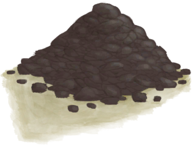

[返回首页](index.md)   |  [查看所有物品](object.md)
# 干土堆  
> 可以和水混合制成泥巴，或者碾碎和水制成粘土。  
  
  属性  |   图片   
 ----  |  ----:   
 **重量：**150  **标签：**	[“储水容器”](tag_WaterContainer.md), [“沉重的”](tag_Heavy.md)  |     
  
## 获取来源  
来源  |  操作  
----  |  ----  
[地窖(蓝图)](Bp_Cellar.md)  |  蓝图制造  
[水窖(蓝图)](Bp_Cistern.md)  |  蓝图制造  
[水井(蓝图)](Bp_Well.md)  |  蓝图制造  
[泥堆](MudPile.md) , [营火](Campfire.md)  |  烘干泥巴  
[泥堆](MudPile.md) , [粘土火盆](ClayFirePit.md)  |  烘干泥巴  
[废墟(泥屋)](Debris.md)  |  清理  
[废墟(泥屋)](Debris.md) , [“铲子”](tag_Shovel.md)  |  清理  
[泥堆](MudPile.md) , [火堆](Fire.md)  |  烘干泥巴  
[熔炉](ForgeExtinguished.md)  |  拆除  
[泥堆](MudPile.md) , [瓦斯炉](GasCookerOn.md)  |  烘干泥巴  
[东部草原](GrasslandsE.md) , [“铲子”](tag_Shovel.md)  |  挖土  
[西部草原](GrasslandsW.md) , [“铲子”](tag_Shovel.md)  |  挖土  
[高级窑炉](KilnAdvancedExtinguished.md)  |  拆除  
[窑炉](KilnExtinguished.md)  |  拆除  
[泥砖](MudBrick.md) , [“锤”](tag_Hammer.md)  |  破坏  
[干涸的小水塘(湿地丛林)](Puddle.md)  |  挖干土  
[干涸的小水塘(湿地丛林)](Puddle.md) , [“铲子”](tag_Shovel.md)  |  挖干土  
[神秘谷](SecretValley.md) , [“铲子”](tag_Shovel.md)  |  挖土  
[火炉](StoveExtinguished.md) , [“锤”](tag_Hammer.md)  |  拆除  
[滤水器](WaterFilter.md) , [“锤”](tag_Hammer.md)  |  拆除  
[水槽](WateringTrough.md) , [“锤”](tag_Hammer.md)  |  拆除  
## 动作  
动作  |  时间  |  条件  |  变化  |  状态  
----  |  ----  |  ----  |  ----  |  ----  
制作泥巴  |  -  |  [降水值](RainValue.md):1-5  |  → [泥堆](MudPile.md)   |  [污垢](Filth.md)+10  
碾碎干土  |  30分  |    |  → [细土](FineDirt.md)   |  [污垢](Filth.md)+15  
## 可拖入  
使用  |  动作  |  时间  |  条件  |  变化  |  状态  
----  |  ----  |  ----  |  ----  |  ----  |  ----  
[“水”](tag_WaterAny.md)  |  制作泥巴  |  -  |    |  自身: → [泥堆](MudPile.md)  使用物: → [陶碗](ClayBowl.md) 含水量  -300    |  [污垢](Filth.md)+10 [湿度](Wetness.md)+20  
[“锤”](tag_Hammer.md)  |  碾碎干土  |  15分  |  [光亮](Light.md):10-100  |  自身: → [细土](FineDirt.md)  使用物: → [椰子壳](CoconutShell.md)    |  [污垢](Filth.md)+10  
## 可拖至  
[蜂箱](BeeSkep.md), [繁殖中的蜂群](BeeSkepSwarming.md), [母猪](BoarEnclosureFemale.md), [公猪](BoarEnclosureMale.md), [小猪](BoarEnclosurePiglet.md), [母猪](BoarTiedFemale.md), [公猪](BoarTiedMale.md), [小猪](BoarTiedPiglet.md), [中陷阱的猕猴](CageTrapMacaque.md), [忠犬朋友](DogFriend.md), [母山羊](GoatEnclosureFemale.md), [小羊](GoatEnclosureKid.md), [哺乳期山羊](GoatEnclosureLactating.md), [哺乳期山羊](GoatEnclosureLactating.md), [公山羊](GoatEnclosureMale.md), [母山羊](GoatTiedFemale.md), [哺乳期山羊](GoatTiedFemaleLactating.md), [小羊](GoatTiedKid.md), [公山羊](GoatTiedMale.md), [祖父](Grandfather.md), [祖父](Grandfather.md), [祖父](GrandfatherHealthy.md), [猕猴朋友](MacaqueFriend.md), [受伤的猕猴](MacaqueWounded.md), [干涸的小水塘(湿地丛林)](Puddle.md), [西米饼](SagoFlatbread.md), [应急水包](WaterRation.md), [蓄水池](WaterReservoir.md), [蓄水池](WaterReservoirFull.md), [蓄水池（灌溉中）](WaterReservoirIrrigating.md)  
## 可用于蓝图  
- [地窖(蓝图)](Bp_Cellar.md)  
- [农田(蓝图)](Bp_CropPlot.md)  
- [水稻田(蓝图)](Bp_RicePaddy.md)  
  
  
