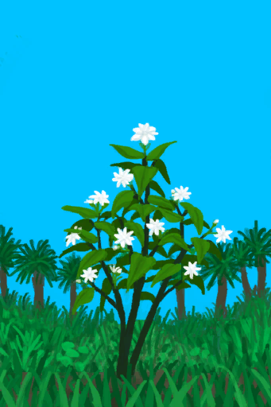

# 不适  
> 臭味、丑陋的物件和脏污都会降低你的舒适度，给你带来压力。  为了解决这个问题，你要先清除臭味的来源，比如<b>粪便、海鸟粪或腐烂物</b>。如果房子脏了，可以用<b>扫帚</b>打扫。  
  

<b>基础值: </b> 0 
  

<b>变化范围: </b> 0 ~ 2500 
  

<b>基础变化率: </b> 无 
  
## 阶段  

<table><tr style="height:2em;"><td style="background-color:#F0F0F0;text-align:center;width:180px;font-size:1.4em;font-weight:bold;vertical-align:middle;">
100 ～ 250

4% ～ 10%
</td><td colspan=2 style="font-size:1.1em;vertical-align:middle;background-color:#F9F9F9;">
<b>

略微不适</b>

</td></tr><tr><td colspan=2><b>影响：</b>[

[舒适度](Comfort.md)](Comfort.md)-100, [

[恶心](Nausea.md)](Nausea.md)加成+0.1</td></tr><tr><td colspan=2></td></tr><tr style="height:2em;"><td style="background-color:#F0F0F0;text-align:center;width:180px;font-size:1.4em;font-weight:bold;vertical-align:middle;">
251 ～ 500

10% ～ 20%
</td><td colspan=2 style="font-size:1.1em;vertical-align:middle;background-color:#F9F9F9;">
<b>

轻度不适</b>

</td></tr><tr><td colspan=2><b>影响：</b>[

[压力](Stress.md)](Stress.md)加成+0.25, [

[舒适度](Comfort.md)](Comfort.md)-250, [

[恶心](Nausea.md)](Nausea.md)加成+0.2</td></tr><tr><td colspan=2></td></tr><tr style="height:2em;"><td style="background-color:#F0F0F0;text-align:center;width:180px;font-size:1.4em;font-weight:bold;vertical-align:middle;">
501 ～ 1000

20% ～ 40%
</td><td colspan=2 style="font-size:1.1em;vertical-align:middle;background-color:#F9F9F9;">
<b>

中度不适</b>

</td></tr><tr><td colspan=2><b>影响：</b>[

[压力](Stress.md)](Stress.md)加成+0.5, [

[世界观](Structure.md)](Structure.md)加成-0.25, [

[舒适度](Comfort.md)](Comfort.md)-500, [

[恶心](Nausea.md)](Nausea.md)加成+0.3</td></tr><tr><td colspan=2></td></tr><tr style="height:2em;"><td style="background-color:#F0F0F0;text-align:center;width:180px;font-size:1.4em;font-weight:bold;vertical-align:middle;">
1001 ～ 1750

40% ～ 70%
</td><td colspan=2 style="font-size:1.1em;vertical-align:middle;background-color:#F9F9F9;">
<b>

重度不适</b>

</td></tr><tr><td colspan=2><b>影响：</b>[

[压力](Stress.md)](Stress.md)加成+0.75, [

[世界观](Structure.md)](Structure.md)加成-0.5, [

[舒适度](Comfort.md)](Comfort.md)-1000, [

[恶心](Nausea.md)](Nausea.md)加成+0.4</td></tr><tr><td colspan=2></td></tr><tr style="height:2em;"><td style="background-color:#F0F0F0;text-align:center;width:180px;font-size:1.4em;font-weight:bold;vertical-align:middle;">
1751 ～ 2500

70% ～ 100%
</td><td colspan=2 style="font-size:1.1em;vertical-align:middle;background-color:#F9F9F9;">
<b>

极度不适</b>

</td></tr><tr><td colspan=2><b>影响：</b>[

[压力](Stress.md)](Stress.md)加成+1, [

[世界观](Structure.md)](Structure.md)加成-1, [

[舒适度](Comfort.md)](Comfort.md)-2000, [

[恶心](Nausea.md)](Nausea.md)加成+0.5</td></tr><tr><td colspan=2></td></tr></table>
  
## 可被以下操作改变  
<table class="table table-bordered" data-toggle="table"  ><thead style=""><tr ><th  style="text-align:left;vertical-align:top;"  >来源</th><th  style="text-align:left;vertical-align:top;"  >操作</th><th  style="text-align:left;vertical-align:top;"  data-sortable="true"  >值</th></tr></thead><tr ><td  style="text-align:left;vertical-align:top;"  >[

[蝙蝠群(蝙蝠洞)](BatColony.md)](BatColony.md)</td><td  style="text-align:left;vertical-align:top;"  >被动</td><td  style="text-align:left;vertical-align:top;"  >2000</td></tr><tr ><td  style="text-align:left;vertical-align:top;"  >[

[蝙蝠洞](CaveBats.md)](CaveBats.md)</td><td  style="text-align:left;vertical-align:top;"  >条件被动</td><td  style="text-align:left;vertical-align:top;"  >875</td></tr><tr ><td  style="text-align:left;vertical-align:top;"  >[

[草原洞穴(洞穴)](CaveGrasslands.md)](CaveGrasslands.md)</td><td  style="text-align:left;vertical-align:top;"  >条件被动</td><td  style="text-align:left;vertical-align:top;"  >875</td></tr><tr ><td  style="text-align:left;vertical-align:top;"  >[

[海蚀洞(洞穴)](CaveSea.md)](CaveSea.md)</td><td  style="text-align:left;vertical-align:top;"  >条件被动</td><td  style="text-align:left;vertical-align:top;"  >875</td></tr><tr ><td  style="text-align:left;vertical-align:top;"  >[

[晶石洞穴(洞穴上层)](CrystalChamber.md)](CrystalChamber.md)</td><td  style="text-align:left;vertical-align:top;"  >条件被动</td><td  style="text-align:left;vertical-align:top;"  >875</td></tr><tr ><td  style="text-align:left;vertical-align:top;"  >[

[潮湿洞穴](DampChamber.md)](DampChamber.md)</td><td  style="text-align:left;vertical-align:top;"  >条件被动</td><td  style="text-align:left;vertical-align:top;"  >875</td></tr><tr ><td  style="text-align:left;vertical-align:top;"  >[

[黑暗(阴暗洞穴)](DarkChamber.md)](DarkChamber.md)</td><td  style="text-align:left;vertical-align:top;"  >条件被动</td><td  style="text-align:left;vertical-align:top;"  >875</td></tr><tr ><td  style="text-align:left;vertical-align:top;"  >[

[覆溺洞穴](FloodedChamber.md)](FloodedChamber.md)</td><td  style="text-align:left;vertical-align:top;"  >条件被动</td><td  style="text-align:left;vertical-align:top;"  >875</td></tr><tr ><td  style="text-align:left;vertical-align:top;"  >[

[洞穴上层](HighChamber.md)](HighChamber.md)</td><td  style="text-align:left;vertical-align:top;"  >条件被动</td><td  style="text-align:left;vertical-align:top;"  >875</td></tr><tr ><td  style="text-align:left;vertical-align:top;"  >[

[洞穴底层](LowChamber.md)](LowChamber.md)</td><td  style="text-align:left;vertical-align:top;"  >条件被动</td><td  style="text-align:left;vertical-align:top;"  >875</td></tr><tr ><td  style="text-align:left;vertical-align:top;"  >[

[洞穴中层](MidChamber.md)](MidChamber.md)</td><td  style="text-align:left;vertical-align:top;"  >条件被动</td><td  style="text-align:left;vertical-align:top;"  >875</td></tr><tr ><td  style="text-align:left;vertical-align:top;"  >[

[狭窄隧道(洞穴上层)](NarrowTunnel.md)](NarrowTunnel.md)</td><td  style="text-align:left;vertical-align:top;"  >条件被动</td><td  style="text-align:left;vertical-align:top;"  >875</td></tr><tr ><td  style="text-align:left;vertical-align:top;"  >[

[隧道](Tunnel.md)](Tunnel.md)</td><td  style="text-align:left;vertical-align:top;"  >条件被动</td><td  style="text-align:left;vertical-align:top;"  >875</td></tr><tr ><td  style="text-align:left;vertical-align:top;"  >[

[潮汐洞](CaveTidal.md)](CaveTidal.md)</td><td  style="text-align:left;vertical-align:top;"  >条件被动</td><td  style="text-align:left;vertical-align:top;"  >875</td></tr><tr ><td  style="text-align:left;vertical-align:top;"  >[

[地窖](Cellar.md)](Cellar.md)</td><td  style="text-align:left;vertical-align:top;"  >条件被动</td><td  style="text-align:left;vertical-align:top;"  >875</td></tr><tr ><td  style="text-align:left;vertical-align:top;"  >[

[幽暗洞穴](DarkCave.md)](DarkCave.md)</td><td  style="text-align:left;vertical-align:top;"  >条件被动</td><td  style="text-align:left;vertical-align:top;"  >875</td></tr><tr ><td  style="text-align:left;vertical-align:top;"  >[

[畜栏](Enclosure.md)](Enclosure.md)</td><td  style="text-align:left;vertical-align:top;"  >条件被动</td><td  style="text-align:left;vertical-align:top;"  >875</td></tr><tr ><td  style="text-align:left;vertical-align:top;"  >[

[猕猴窝](MacaqueDen.md)](MacaqueDen.md)</td><td  style="text-align:left;vertical-align:top;"  >条件被动</td><td  style="text-align:left;vertical-align:top;"  >875</td></tr><tr ><td  style="text-align:left;vertical-align:top;"  >[

[泥屋](MudHut.md)](MudHut.md)</td><td  style="text-align:left;vertical-align:top;"  >条件被动</td><td  style="text-align:left;vertical-align:top;"  >875</td></tr><tr ><td  style="text-align:left;vertical-align:top;"  >[

[泥屋(损坏)](MudHutRuins.md)](MudHutRuins.md)</td><td  style="text-align:left;vertical-align:top;"  >条件被动</td><td  style="text-align:left;vertical-align:top;"  >875</td></tr><tr ><td  style="text-align:left;vertical-align:top;"  >[

[飞机残骸(坠毁的飞机)](PlaneCrash.md)](PlaneCrash.md)</td><td  style="text-align:left;vertical-align:top;"  >条件被动</td><td  style="text-align:left;vertical-align:top;"  >875</td></tr><tr ><td  style="text-align:left;vertical-align:top;"  >[

[棚屋](Shed.md)](Shed.md)</td><td  style="text-align:left;vertical-align:top;"  >条件被动</td><td  style="text-align:left;vertical-align:top;"  >875</td></tr><tr ><td  style="text-align:left;vertical-align:top;"  >[

[石屋](StoneHut.md)](StoneHut.md)</td><td  style="text-align:left;vertical-align:top;"  >条件被动</td><td  style="text-align:left;vertical-align:top;"  >875</td></tr><tr ><td  style="text-align:left;vertical-align:top;"  >[

[粪池](Cesspool.md)](Cesspool.md)</td><td  style="text-align:left;vertical-align:top;"  >被动</td><td  style="text-align:left;vertical-align:top;"  >750</td></tr><tr ><td  style="text-align:left;vertical-align:top;"  >[

[硝石矿床](NiterBed.md)](NiterBed.md)</td><td  style="text-align:left;vertical-align:top;"  >被动</td><td  style="text-align:left;vertical-align:top;"  >750</td></tr><tr ><td  style="text-align:left;vertical-align:top;"  >[

[蝙蝠洞](CaveBats.md)](CaveBats.md)</td><td  style="text-align:left;vertical-align:top;"  >条件被动</td><td  style="text-align:left;vertical-align:top;"  >625</td></tr><tr ><td  style="text-align:left;vertical-align:top;"  >[

[草原洞穴(洞穴)](CaveGrasslands.md)](CaveGrasslands.md)</td><td  style="text-align:left;vertical-align:top;"  >条件被动</td><td  style="text-align:left;vertical-align:top;"  >625</td></tr><tr ><td  style="text-align:left;vertical-align:top;"  >[

[海蚀洞(洞穴)](CaveSea.md)](CaveSea.md)</td><td  style="text-align:left;vertical-align:top;"  >条件被动</td><td  style="text-align:left;vertical-align:top;"  >625</td></tr><tr ><td  style="text-align:left;vertical-align:top;"  >[

[晶石洞穴(洞穴上层)](CrystalChamber.md)](CrystalChamber.md)</td><td  style="text-align:left;vertical-align:top;"  >条件被动</td><td  style="text-align:left;vertical-align:top;"  >625</td></tr><tr ><td  style="text-align:left;vertical-align:top;"  >[

[潮湿洞穴](DampChamber.md)](DampChamber.md)</td><td  style="text-align:left;vertical-align:top;"  >条件被动</td><td  style="text-align:left;vertical-align:top;"  >625</td></tr><tr ><td  style="text-align:left;vertical-align:top;"  >[

[黑暗(阴暗洞穴)](DarkChamber.md)](DarkChamber.md)</td><td  style="text-align:left;vertical-align:top;"  >条件被动</td><td  style="text-align:left;vertical-align:top;"  >625</td></tr><tr ><td  style="text-align:left;vertical-align:top;"  >[

[覆溺洞穴](FloodedChamber.md)](FloodedChamber.md)</td><td  style="text-align:left;vertical-align:top;"  >条件被动</td><td  style="text-align:left;vertical-align:top;"  >625</td></tr><tr ><td  style="text-align:left;vertical-align:top;"  >[

[洞穴上层](HighChamber.md)](HighChamber.md)</td><td  style="text-align:left;vertical-align:top;"  >条件被动</td><td  style="text-align:left;vertical-align:top;"  >625</td></tr><tr ><td  style="text-align:left;vertical-align:top;"  >[

[洞穴底层](LowChamber.md)](LowChamber.md)</td><td  style="text-align:left;vertical-align:top;"  >条件被动</td><td  style="text-align:left;vertical-align:top;"  >625</td></tr><tr ><td  style="text-align:left;vertical-align:top;"  >[

[洞穴中层](MidChamber.md)](MidChamber.md)</td><td  style="text-align:left;vertical-align:top;"  >条件被动</td><td  style="text-align:left;vertical-align:top;"  >625</td></tr><tr ><td  style="text-align:left;vertical-align:top;"  >[

[狭窄隧道(洞穴上层)](NarrowTunnel.md)](NarrowTunnel.md)</td><td  style="text-align:left;vertical-align:top;"  >条件被动</td><td  style="text-align:left;vertical-align:top;"  >625</td></tr><tr ><td  style="text-align:left;vertical-align:top;"  >[

[隧道](Tunnel.md)](Tunnel.md)</td><td  style="text-align:left;vertical-align:top;"  >条件被动</td><td  style="text-align:left;vertical-align:top;"  >625</td></tr><tr ><td  style="text-align:left;vertical-align:top;"  >[

[潮汐洞](CaveTidal.md)](CaveTidal.md)</td><td  style="text-align:left;vertical-align:top;"  >条件被动</td><td  style="text-align:left;vertical-align:top;"  >625</td></tr><tr ><td  style="text-align:left;vertical-align:top;"  >[

[地窖](Cellar.md)](Cellar.md)</td><td  style="text-align:left;vertical-align:top;"  >条件被动</td><td  style="text-align:left;vertical-align:top;"  >625</td></tr><tr ><td  style="text-align:left;vertical-align:top;"  >[

[幽暗洞穴](DarkCave.md)](DarkCave.md)</td><td  style="text-align:left;vertical-align:top;"  >条件被动</td><td  style="text-align:left;vertical-align:top;"  >625</td></tr><tr ><td  style="text-align:left;vertical-align:top;"  >[

[畜栏](Enclosure.md)](Enclosure.md)</td><td  style="text-align:left;vertical-align:top;"  >条件被动</td><td  style="text-align:left;vertical-align:top;"  >625</td></tr><tr ><td  style="text-align:left;vertical-align:top;"  >[

[猕猴窝](MacaqueDen.md)](MacaqueDen.md)</td><td  style="text-align:left;vertical-align:top;"  >条件被动</td><td  style="text-align:left;vertical-align:top;"  >625</td></tr><tr ><td  style="text-align:left;vertical-align:top;"  >[

[泥屋](MudHut.md)](MudHut.md)</td><td  style="text-align:left;vertical-align:top;"  >条件被动</td><td  style="text-align:left;vertical-align:top;"  >625</td></tr><tr ><td  style="text-align:left;vertical-align:top;"  >[

[泥屋(损坏)](MudHutRuins.md)](MudHutRuins.md)</td><td  style="text-align:left;vertical-align:top;"  >条件被动</td><td  style="text-align:left;vertical-align:top;"  >625</td></tr><tr ><td  style="text-align:left;vertical-align:top;"  >[

[飞机残骸(坠毁的飞机)](PlaneCrash.md)](PlaneCrash.md)</td><td  style="text-align:left;vertical-align:top;"  >条件被动</td><td  style="text-align:left;vertical-align:top;"  >625</td></tr><tr ><td  style="text-align:left;vertical-align:top;"  >[

[棚屋](Shed.md)](Shed.md)</td><td  style="text-align:left;vertical-align:top;"  >条件被动</td><td  style="text-align:left;vertical-align:top;"  >625</td></tr><tr ><td  style="text-align:left;vertical-align:top;"  >[

[石屋](StoneHut.md)](StoneHut.md)</td><td  style="text-align:left;vertical-align:top;"  >条件被动</td><td  style="text-align:left;vertical-align:top;"  >625</td></tr><tr ><td  style="text-align:left;vertical-align:top;"  >[

[硫磺喷口(火山)](VentBrimstone.md)](VentBrimstone.md)</td><td  style="text-align:left;vertical-align:top;"  >被动</td><td  style="text-align:left;vertical-align:top;"  >500</td></tr><tr ><td  style="text-align:left;vertical-align:top;"  >[

[废墟(泥屋)](Debris.md)](Debris.md)</td><td  style="text-align:left;vertical-align:top;"  >被动</td><td  style="text-align:left;vertical-align:top;"  >500</td></tr><tr ><td  style="text-align:left;vertical-align:top;"  >[

[过路的船只](PassingShip.md)](PassingShip.md)</td><td  style="text-align:left;vertical-align:top;"  >被动</td><td  style="text-align:left;vertical-align:top;"  >500</td></tr><tr ><td  style="text-align:left;vertical-align:top;"  >[

[鲨鱼](SharkVisitor.md)](SharkVisitor.md)</td><td  style="text-align:left;vertical-align:top;"  >被动</td><td  style="text-align:left;vertical-align:top;"  >500</td></tr><tr ><td  style="text-align:left;vertical-align:top;"  >[

[蝙蝠洞](CaveBats.md)](CaveBats.md)</td><td  style="text-align:left;vertical-align:top;"  >条件被动</td><td  style="text-align:left;vertical-align:top;"  >375</td></tr><tr ><td  style="text-align:left;vertical-align:top;"  >[

[草原洞穴(洞穴)](CaveGrasslands.md)](CaveGrasslands.md)</td><td  style="text-align:left;vertical-align:top;"  >条件被动</td><td  style="text-align:left;vertical-align:top;"  >375</td></tr><tr ><td  style="text-align:left;vertical-align:top;"  >[

[海蚀洞(洞穴)](CaveSea.md)](CaveSea.md)</td><td  style="text-align:left;vertical-align:top;"  >条件被动</td><td  style="text-align:left;vertical-align:top;"  >375</td></tr><tr ><td  style="text-align:left;vertical-align:top;"  >[

[晶石洞穴(洞穴上层)](CrystalChamber.md)](CrystalChamber.md)</td><td  style="text-align:left;vertical-align:top;"  >条件被动</td><td  style="text-align:left;vertical-align:top;"  >375</td></tr><tr ><td  style="text-align:left;vertical-align:top;"  >[

[潮湿洞穴](DampChamber.md)](DampChamber.md)</td><td  style="text-align:left;vertical-align:top;"  >条件被动</td><td  style="text-align:left;vertical-align:top;"  >375</td></tr><tr ><td  style="text-align:left;vertical-align:top;"  >[

[黑暗(阴暗洞穴)](DarkChamber.md)](DarkChamber.md)</td><td  style="text-align:left;vertical-align:top;"  >条件被动</td><td  style="text-align:left;vertical-align:top;"  >375</td></tr><tr ><td  style="text-align:left;vertical-align:top;"  >[

[覆溺洞穴](FloodedChamber.md)](FloodedChamber.md)</td><td  style="text-align:left;vertical-align:top;"  >条件被动</td><td  style="text-align:left;vertical-align:top;"  >375</td></tr><tr ><td  style="text-align:left;vertical-align:top;"  >[

[洞穴上层](HighChamber.md)](HighChamber.md)</td><td  style="text-align:left;vertical-align:top;"  >条件被动</td><td  style="text-align:left;vertical-align:top;"  >375</td></tr><tr ><td  style="text-align:left;vertical-align:top;"  >[

[洞穴底层](LowChamber.md)](LowChamber.md)</td><td  style="text-align:left;vertical-align:top;"  >条件被动</td><td  style="text-align:left;vertical-align:top;"  >375</td></tr><tr ><td  style="text-align:left;vertical-align:top;"  >[

[洞穴中层](MidChamber.md)](MidChamber.md)</td><td  style="text-align:left;vertical-align:top;"  >条件被动</td><td  style="text-align:left;vertical-align:top;"  >375</td></tr><tr ><td  style="text-align:left;vertical-align:top;"  >[

[狭窄隧道(洞穴上层)](NarrowTunnel.md)](NarrowTunnel.md)</td><td  style="text-align:left;vertical-align:top;"  >条件被动</td><td  style="text-align:left;vertical-align:top;"  >375</td></tr><tr ><td  style="text-align:left;vertical-align:top;"  >[

[隧道](Tunnel.md)](Tunnel.md)</td><td  style="text-align:left;vertical-align:top;"  >条件被动</td><td  style="text-align:left;vertical-align:top;"  >375</td></tr><tr ><td  style="text-align:left;vertical-align:top;"  >[

[潮汐洞](CaveTidal.md)](CaveTidal.md)</td><td  style="text-align:left;vertical-align:top;"  >条件被动</td><td  style="text-align:left;vertical-align:top;"  >375</td></tr><tr ><td  style="text-align:left;vertical-align:top;"  >[

[地窖](Cellar.md)](Cellar.md)</td><td  style="text-align:left;vertical-align:top;"  >条件被动</td><td  style="text-align:left;vertical-align:top;"  >375</td></tr><tr ><td  style="text-align:left;vertical-align:top;"  >[

[幽暗洞穴](DarkCave.md)](DarkCave.md)</td><td  style="text-align:left;vertical-align:top;"  >条件被动</td><td  style="text-align:left;vertical-align:top;"  >375</td></tr><tr ><td  style="text-align:left;vertical-align:top;"  >[

[畜栏](Enclosure.md)](Enclosure.md)</td><td  style="text-align:left;vertical-align:top;"  >条件被动</td><td  style="text-align:left;vertical-align:top;"  >375</td></tr><tr ><td  style="text-align:left;vertical-align:top;"  >[

[猕猴窝](MacaqueDen.md)](MacaqueDen.md)</td><td  style="text-align:left;vertical-align:top;"  >条件被动</td><td  style="text-align:left;vertical-align:top;"  >375</td></tr><tr ><td  style="text-align:left;vertical-align:top;"  >[

[泥屋](MudHut.md)](MudHut.md)</td><td  style="text-align:left;vertical-align:top;"  >条件被动</td><td  style="text-align:left;vertical-align:top;"  >375</td></tr><tr ><td  style="text-align:left;vertical-align:top;"  >[

[泥屋(损坏)](MudHutRuins.md)](MudHutRuins.md)</td><td  style="text-align:left;vertical-align:top;"  >条件被动</td><td  style="text-align:left;vertical-align:top;"  >375</td></tr><tr ><td  style="text-align:left;vertical-align:top;"  >[

[飞机残骸(坠毁的飞机)](PlaneCrash.md)](PlaneCrash.md)</td><td  style="text-align:left;vertical-align:top;"  >条件被动</td><td  style="text-align:left;vertical-align:top;"  >375</td></tr><tr ><td  style="text-align:left;vertical-align:top;"  >[

[棚屋](Shed.md)](Shed.md)</td><td  style="text-align:left;vertical-align:top;"  >条件被动</td><td  style="text-align:left;vertical-align:top;"  >375</td></tr><tr ><td  style="text-align:left;vertical-align:top;"  >[

[石屋](StoneHut.md)](StoneHut.md)</td><td  style="text-align:left;vertical-align:top;"  >条件被动</td><td  style="text-align:left;vertical-align:top;"  >375</td></tr><tr ><td  style="text-align:left;vertical-align:top;"  >[

[杂菌菌床](MushroomBedAssorted.md)](MushroomBedAssorted.md)</td><td  style="text-align:left;vertical-align:top;"  >被动</td><td  style="text-align:left;vertical-align:top;"  >300</td></tr><tr ><td  style="text-align:left;vertical-align:top;"  >[

[未种植的菌床(空)](MushroomBedEmpty.md)](MushroomBedEmpty.md)</td><td  style="text-align:left;vertical-align:top;"  >被动</td><td  style="text-align:left;vertical-align:top;"  >300</td></tr><tr ><td  style="text-align:left;vertical-align:top;"  >[

[迷幻菇菌床](MushroomBedMagic.md)](MushroomBedMagic.md)</td><td  style="text-align:left;vertical-align:top;"  >被动</td><td  style="text-align:left;vertical-align:top;"  >300</td></tr><tr ><td  style="text-align:left;vertical-align:top;"  >[

[马勃菌菌床](MushroomBedPuffballs.md)](MushroomBedPuffballs.md)</td><td  style="text-align:left;vertical-align:top;"  >被动</td><td  style="text-align:left;vertical-align:top;"  >300</td></tr><tr ><td  style="text-align:left;vertical-align:top;"  >[

[潮汐池(岩滩)](TidePool.md)](TidePool.md)</td><td  style="text-align:left;vertical-align:top;"  >被动</td><td  style="text-align:left;vertical-align:top;"  >250</td></tr><tr ><td  style="text-align:left;vertical-align:top;"  >[

[漂浮的残骸](FloatingDebris.md)](FloatingDebris.md)</td><td  style="text-align:left;vertical-align:top;"  >被动</td><td  style="text-align:left;vertical-align:top;"  >250</td></tr><tr ><td  style="text-align:left;vertical-align:top;"  >[

[蝙蝠洞](CaveBats.md)](CaveBats.md)</td><td  style="text-align:left;vertical-align:top;"  >条件被动</td><td  style="text-align:left;vertical-align:top;"  >175</td></tr><tr ><td  style="text-align:left;vertical-align:top;"  >[

[草原洞穴(洞穴)](CaveGrasslands.md)](CaveGrasslands.md)</td><td  style="text-align:left;vertical-align:top;"  >条件被动</td><td  style="text-align:left;vertical-align:top;"  >175</td></tr><tr ><td  style="text-align:left;vertical-align:top;"  >[

[海蚀洞(洞穴)](CaveSea.md)](CaveSea.md)</td><td  style="text-align:left;vertical-align:top;"  >条件被动</td><td  style="text-align:left;vertical-align:top;"  >175</td></tr><tr ><td  style="text-align:left;vertical-align:top;"  >[

[晶石洞穴(洞穴上层)](CrystalChamber.md)](CrystalChamber.md)</td><td  style="text-align:left;vertical-align:top;"  >条件被动</td><td  style="text-align:left;vertical-align:top;"  >175</td></tr><tr ><td  style="text-align:left;vertical-align:top;"  >[

[潮湿洞穴](DampChamber.md)](DampChamber.md)</td><td  style="text-align:left;vertical-align:top;"  >条件被动</td><td  style="text-align:left;vertical-align:top;"  >175</td></tr><tr ><td  style="text-align:left;vertical-align:top;"  >[

[黑暗(阴暗洞穴)](DarkChamber.md)](DarkChamber.md)</td><td  style="text-align:left;vertical-align:top;"  >条件被动</td><td  style="text-align:left;vertical-align:top;"  >175</td></tr><tr ><td  style="text-align:left;vertical-align:top;"  >[

[覆溺洞穴](FloodedChamber.md)](FloodedChamber.md)</td><td  style="text-align:left;vertical-align:top;"  >条件被动</td><td  style="text-align:left;vertical-align:top;"  >175</td></tr><tr ><td  style="text-align:left;vertical-align:top;"  >[

[洞穴上层](HighChamber.md)](HighChamber.md)</td><td  style="text-align:left;vertical-align:top;"  >条件被动</td><td  style="text-align:left;vertical-align:top;"  >175</td></tr><tr ><td  style="text-align:left;vertical-align:top;"  >[

[洞穴底层](LowChamber.md)](LowChamber.md)</td><td  style="text-align:left;vertical-align:top;"  >条件被动</td><td  style="text-align:left;vertical-align:top;"  >175</td></tr><tr ><td  style="text-align:left;vertical-align:top;"  >[

[洞穴中层](MidChamber.md)](MidChamber.md)</td><td  style="text-align:left;vertical-align:top;"  >条件被动</td><td  style="text-align:left;vertical-align:top;"  >175</td></tr><tr ><td  style="text-align:left;vertical-align:top;"  >[

[狭窄隧道(洞穴上层)](NarrowTunnel.md)](NarrowTunnel.md)</td><td  style="text-align:left;vertical-align:top;"  >条件被动</td><td  style="text-align:left;vertical-align:top;"  >175</td></tr><tr ><td  style="text-align:left;vertical-align:top;"  >[

[隧道](Tunnel.md)](Tunnel.md)</td><td  style="text-align:left;vertical-align:top;"  >条件被动</td><td  style="text-align:left;vertical-align:top;"  >175</td></tr><tr ><td  style="text-align:left;vertical-align:top;"  >[

[潮汐洞](CaveTidal.md)](CaveTidal.md)</td><td  style="text-align:left;vertical-align:top;"  >条件被动</td><td  style="text-align:left;vertical-align:top;"  >175</td></tr><tr ><td  style="text-align:left;vertical-align:top;"  >[

[地窖](Cellar.md)](Cellar.md)</td><td  style="text-align:left;vertical-align:top;"  >条件被动</td><td  style="text-align:left;vertical-align:top;"  >175</td></tr><tr ><td  style="text-align:left;vertical-align:top;"  >[

[幽暗洞穴](DarkCave.md)](DarkCave.md)</td><td  style="text-align:left;vertical-align:top;"  >条件被动</td><td  style="text-align:left;vertical-align:top;"  >175</td></tr><tr ><td  style="text-align:left;vertical-align:top;"  >[

[畜栏](Enclosure.md)](Enclosure.md)</td><td  style="text-align:left;vertical-align:top;"  >条件被动</td><td  style="text-align:left;vertical-align:top;"  >175</td></tr><tr ><td  style="text-align:left;vertical-align:top;"  >[

[猕猴窝](MacaqueDen.md)](MacaqueDen.md)</td><td  style="text-align:left;vertical-align:top;"  >条件被动</td><td  style="text-align:left;vertical-align:top;"  >175</td></tr><tr ><td  style="text-align:left;vertical-align:top;"  >[

[泥屋](MudHut.md)](MudHut.md)</td><td  style="text-align:left;vertical-align:top;"  >条件被动</td><td  style="text-align:left;vertical-align:top;"  >175</td></tr><tr ><td  style="text-align:left;vertical-align:top;"  >[

[泥屋(损坏)](MudHutRuins.md)](MudHutRuins.md)</td><td  style="text-align:left;vertical-align:top;"  >条件被动</td><td  style="text-align:left;vertical-align:top;"  >175</td></tr><tr ><td  style="text-align:left;vertical-align:top;"  >[

[飞机残骸(坠毁的飞机)](PlaneCrash.md)](PlaneCrash.md)</td><td  style="text-align:left;vertical-align:top;"  >条件被动</td><td  style="text-align:left;vertical-align:top;"  >175</td></tr><tr ><td  style="text-align:left;vertical-align:top;"  >[

[棚屋](Shed.md)](Shed.md)</td><td  style="text-align:left;vertical-align:top;"  >条件被动</td><td  style="text-align:left;vertical-align:top;"  >175</td></tr><tr ><td  style="text-align:left;vertical-align:top;"  >[

[石屋](StoneHut.md)](StoneHut.md)</td><td  style="text-align:left;vertical-align:top;"  >条件被动</td><td  style="text-align:left;vertical-align:top;"  >175</td></tr><tr ><td  style="text-align:left;vertical-align:top;"  >[

[堆肥箱](CompostBin.md)](CompostBin.md)</td><td  style="text-align:left;vertical-align:top;"  >被动</td><td  style="text-align:left;vertical-align:top;"  >150</td></tr><tr ><td  style="text-align:left;vertical-align:top;"  >[

[未浇灌的菌床](MushroomBedDry.md)](MushroomBedDry.md)</td><td  style="text-align:left;vertical-align:top;"  >被动</td><td  style="text-align:left;vertical-align:top;"  >150</td></tr><tr ><td  style="text-align:left;vertical-align:top;"  >[

[硫磺](Brimstone.md)](Brimstone.md)</td><td  style="text-align:left;vertical-align:top;"  >被动</td><td  style="text-align:left;vertical-align:top;"  >100</td></tr><tr ><td  style="text-align:left;vertical-align:top;"  >[

[被淹没的潮汐池(岩滩)](TidePoolFlooded.md)](TidePoolFlooded.md)</td><td  style="text-align:left;vertical-align:top;"  >被动</td><td  style="text-align:left;vertical-align:top;"  >100</td></tr><tr ><td  style="text-align:left;vertical-align:top;"  >[

[海鸟粪](Guano.md)](Guano.md)</td><td  style="text-align:left;vertical-align:top;"  >被动</td><td  style="text-align:left;vertical-align:top;"  >50</td></tr><tr ><td  style="text-align:left;vertical-align:top;"  >[

[粪便](Manure.md)](Manure.md)</td><td  style="text-align:left;vertical-align:top;"  >被动</td><td  style="text-align:left;vertical-align:top;"  >50</td></tr><tr ><td  style="text-align:left;vertical-align:top;"  >[

[腐烂物](RottenRemains.md)](RottenRemains.md)</td><td  style="text-align:left;vertical-align:top;"  >被动</td><td  style="text-align:left;vertical-align:top;"  >50</td></tr><tr ><td  style="text-align:left;vertical-align:top;"  >[

[腐烂的皮](SkinRotten.md)](SkinRotten.md)</td><td  style="text-align:left;vertical-align:top;"  >被动</td><td  style="text-align:left;vertical-align:top;"  >50</td></tr><tr ><td  style="text-align:left;vertical-align:top;"  >[

[腐烂的椰子](CoconutRotten.md)](CoconutRotten.md)</td><td  style="text-align:left;vertical-align:top;"  >被动</td><td  style="text-align:left;vertical-align:top;"  >25</td></tr><tr ><td  style="text-align:left;vertical-align:top;"  >[

[月季丛](ChinaRosePlant.md)](ChinaRosePlant.md)</td><td  style="text-align:left;vertical-align:top;"  >被动</td><td  style="text-align:left;vertical-align:top;"  >-100</td></tr><tr ><td  style="text-align:left;vertical-align:top;"  >[

[茉莉花](JasminePlant.md)](JasminePlant.md)</td><td  style="text-align:left;vertical-align:top;"  >被动</td><td  style="text-align:left;vertical-align:top;"  >-100</td></tr><tr ><td  style="text-align:left;vertical-align:top;"  >[

[香茅蜡烛(开)](CandleCitronellaOn.md)](CandleCitronellaOn.md)</td><td  style="text-align:left;vertical-align:top;"  >被动</td><td  style="text-align:left;vertical-align:top;"  >-250</td></tr><tr ><td  style="text-align:left;vertical-align:top;"  >[

[茉莉蜡烛(开)](CandleJasmineOn.md)](CandleJasmineOn.md)</td><td  style="text-align:left;vertical-align:top;"  >被动</td><td  style="text-align:left;vertical-align:top;"  >-500</td></tr><tr ><td  style="text-align:left;vertical-align:top;"  >

[野人](Pk_4_Feral.md)</td><td  style="text-align:left;vertical-align:top;"  >特质影响</td><td  style="text-align:left;vertical-align:top;"  >-2500</td></tr></tbody></table>  
  

