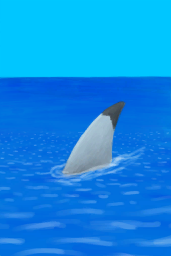

# 距离  
> 显示你离找到文明世界有多近。  
  

<b>基础值: </b> 0 
  

<b>变化范围: </b> 0 ~ 2016 
  

<b>基础变化率: </b> 无 
  

<b>变化率范围: </b> -10 ~ +10 / 每15分钟
                
  
  
## 阶段  

<table><tr style="height:2em;"><td style="background-color:#F0F0F0;text-align:center;width:180px;font-size:1.4em;font-weight:bold;vertical-align:middle;">
1 ～ 2016

0% ～ 100%
</td><td colspan=2 style="font-size:1.1em;vertical-align:middle;background-color:#F9F9F9;">
<b>

航行距离</b>

</td></tr><tr><td colspan=2></td></tr></table>
  
  
## 相关卡牌  
[航行](Sailed.md)  
  
## 加成值影响因素  
<table class="table table-bordered" data-toggle="table"  ><thead style=""><tr ><th  style="text-align:left;vertical-align:top;"  >来源</th><th  style="text-align:left;vertical-align:top;"  >操作</th><th  style="text-align:left;vertical-align:top;"  >值</th></tr></thead><tr ><td  style="text-align:left;vertical-align:top;"  >[扬起的帆](SailUp_Raft.md)</td><td  style="text-align:left;vertical-align:top;"  >条件被动</td><td  style="text-align:left;vertical-align:top;"  >加成+3</td></tr><tr ><td  style="text-align:left;vertical-align:top;"  >[扬起的帆](SailUp_Raft.md)</td><td  style="text-align:left;vertical-align:top;"  >条件被动</td><td  style="text-align:left;vertical-align:top;"  >加成+2</td></tr><tr ><td  style="text-align:left;vertical-align:top;"  >[木筏(环境)](Env_Raft.md)</td><td  style="text-align:left;vertical-align:top;"  >条件被动</td><td  style="text-align:left;vertical-align:top;"  >加成+1</td></tr><tr ><td  style="text-align:left;vertical-align:top;"  >[扬起的帆](SailUp_Raft.md)</td><td  style="text-align:left;vertical-align:top;"  >条件被动</td><td  style="text-align:left;vertical-align:top;"  >加成+1</td></tr><tr ><td  style="text-align:left;vertical-align:top;"  >[木筏(环礁)](RaftEntranceAtoll.md)</td><td  style="text-align:left;vertical-align:top;"  >被动效果</td><td  style="text-align:left;vertical-align:top;"  >加成-1</td></tr><tr ><td  style="text-align:left;vertical-align:top;"  >[离开木筏](RaftExitAtoll.md)</td><td  style="text-align:left;vertical-align:top;"  >被动效果</td><td  style="text-align:left;vertical-align:top;"  >加成-1</td></tr><tr ><td  style="text-align:left;vertical-align:top;"  >[扬起的帆](SailUp_Raft.md)</td><td  style="text-align:left;vertical-align:top;"  >条件被动</td><td  style="text-align:left;vertical-align:top;"  >加成-1.5</td></tr><tr ><td  style="text-align:left;vertical-align:top;"  >[扬起的帆](SailUp_Raft.md)</td><td  style="text-align:left;vertical-align:top;"  >条件被动</td><td  style="text-align:left;vertical-align:top;"  >加成-2.5</td></tr><tr ><td  style="text-align:left;vertical-align:top;"  >[扬起的帆](SailUp_Raft.md)</td><td  style="text-align:left;vertical-align:top;"  >条件被动</td><td  style="text-align:left;vertical-align:top;"  >加成-3.5</td></tr></tbody></table>  
  
  
## 可被以下操作改变  
<table class="table table-bordered" data-toggle="table"  ><thead style=""><tr ><th  style="text-align:left;vertical-align:top;"  >来源</th><th  style="text-align:left;vertical-align:top;"  >操作</th><th  style="text-align:left;vertical-align:top;"  data-sortable="true"  >值</th></tr></thead><tr ><td  style="text-align:left;vertical-align:top;"  >[

[开始冒险](Start_Raft.md)](Start_Raft.md)</td><td  style="text-align:left;vertical-align:top;"  >把木筏推下水</td><td  style="text-align:left;vertical-align:top;"  >1</td></tr></tbody></table>  
  
  
## 被以下操作需求  
<table class="table table-bordered" data-toggle="table"  ><thead style=""><tr ><th  style="text-align:left;vertical-align:top;"  >来源</th><th  style="text-align:left;vertical-align:top;"  >操作</th><th  style="text-align:left;vertical-align:top;"  data-sortable="true"  >值</th></tr></thead><tr ><td  style="text-align:left;vertical-align:top;"  >[有船来了！(事件)](Event_ShipRescueDistance.md)</td><td  style="text-align:left;vertical-align:top;"  >触发事件</td><td  style="text-align:left;vertical-align:top;"  >2016</td></tr><tr ><td  style="text-align:left;vertical-align:top;"  >[着陆预警！(事件)](Event_Raft_Atoll.md)</td><td  style="text-align:left;vertical-align:top;"  >触发事件</td><td  style="text-align:left;vertical-align:top;"  >1680 ~ 2016</td></tr><tr ><td  style="text-align:left;vertical-align:top;"  >[着陆预警！(事件)](Event_Raft_Atoll.md)</td><td  style="text-align:left;vertical-align:top;"  >触发事件</td><td  style="text-align:left;vertical-align:top;"  >1344 ~ 2016</td></tr><tr ><td  style="text-align:left;vertical-align:top;"  >[着陆预警！(事件)](Event_Raft_Atoll.md)</td><td  style="text-align:left;vertical-align:top;"  >触发事件</td><td  style="text-align:left;vertical-align:top;"  >1008 ~ 2016</td></tr><tr ><td  style="text-align:left;vertical-align:top;"  >[着陆预警！(事件)](Event_Raft_Atoll.md)</td><td  style="text-align:left;vertical-align:top;"  >触发事件</td><td  style="text-align:left;vertical-align:top;"  >672 ~ 2016</td></tr><tr ><td  style="text-align:left;vertical-align:top;"  >[着陆预警！(事件)](Event_Raft_Atoll.md)</td><td  style="text-align:left;vertical-align:top;"  >触发事件</td><td  style="text-align:left;vertical-align:top;"  >336 ~ 2016</td></tr></tbody></table>  
  
  
## 相关触发器  

<table><tr style="background-color:#F8F8F8"><td><b>到达目的地</b></td></tr><tr><td><b>触发条件：</b>[

[距离](Distance.md)](Distance.md): <b>2016-2016</b></td></tr><tr><td><b>触发后：</b>[睡眠中断](SleepInterrupt.md)<b>+1</b></td></tr><tr><td>[

[有船来了！(事件)](Event_ShipRescueDistance.md)](Event_ShipRescueDistance.md)(<b>+1</b>)</td></tr></table>
  

<table><tr style="background-color:#F8F8F8"><td><b>鼠害！</b></td></tr><tr><td><b>触发条件：</b>[老鼠袭击次数](MouseDamageCounter.md): <b>192-192</b>, [

[距离](Distance.md)](Distance.md): <b>0-0</b>, ~~[

[门](Imp_Door.md)](Imp_Door.md)存在于手中/面板~~, ~~位于[

[鸟岩岛(环境)](Env_BirdRock.md)](Env_BirdRock.md)~~, [“饲料”](tag_Feed.md)存在于面板/不在容器中</td></tr><tr><td><b>触发后：</b>[老鼠袭击次数](MouseDamageCounter.md)<b>-192</b></td></tr><tr><td>

<table style="margin-bottom:3px;"><tr><td rowspan=2 style="text-align:center" width="80px">
基础权重

50
</td><td style="font-size:0.6em;line-height:0.6em;font-weight:bold">Nothing</td></tr><tr><td></td></tr></table>

<table style="margin-bottom:3px;"><tr><td rowspan=2 style="text-align:center" width="80px">
基础权重

0
</td><td style="font-size:0.6em;line-height:0.6em;font-weight:bold">Mouse</td></tr><tr><td>[

[鼠害(事件)](Event_MouseDamage.md)](Event_MouseDamage.md)(<b>+1</b>)</td></tr><tr><td colspan=2><li>[首月次数](FirstMonthCounter.md)为<b>0～1344</b>时权重<b>-1000</b></li><li>[老鼠种群数量](Pop_Mouse.md)为<b>0</b>时权重<b>-1000</b>，否则权重-1000000</li><li>[老鼠种群数量](Pop_Mouse.md)为<b>0～100000</b>时权重限定为<b>-150～+0</b></li><li>[“饲料”](tag_Feed.md)存在于*面板/不在容器中*，权重<b>+10</b>(可叠加),</li><li>[“农作物”](tag_Crop.md)存在于*手中/面板*，权重<b>+10</b>(可叠加),</li><li>[

[忠犬朋友](DogFriend.md)](DogFriend.md)存在于*手中/面板*，权重<b>-100</b>(可叠加),</li></td></tr></table>

</td></tr></table>
  

<table><tr style="background-color:#F8F8F8"><td><b>木筏事件</b></td></tr><tr><td><b>触发条件：</b>[

[距离](Distance.md)](Distance.md): <b>336-2016</b></td></tr><tr><td>

<table style="margin-bottom:3px;"><tr><td rowspan=2 style="text-align:center" width="80px">
基础权重

5
</td><td style="font-size:0.6em;line-height:0.6em;font-weight:bold">Atoll</td></tr><tr><td>[

[着陆预警！(事件)](Event_Raft_Atoll.md)](Event_Raft_Atoll.md)(<b>+1</b>)</td></tr></table>

<table style="margin-bottom:3px;"><tr><td rowspan=2 style="text-align:center" width="80px">
基础权重

20
</td><td style="font-size:0.6em;line-height:0.6em;font-weight:bold">Shark</td></tr><tr><td>[

[一条鲨鱼！(事件)](Event_Raft_SharkVisitor.md)](Event_Raft_SharkVisitor.md)(<b>+1</b>)</td></tr></table>

<table style="margin-bottom:3px;"><tr><td rowspan=2 style="text-align:center" width="80px">
基础权重

20
</td><td style="font-size:0.6em;line-height:0.6em;font-weight:bold">Debris</td></tr><tr><td>[

[漂浮的残骸！(事件)](Event_Raft_FloatingDebris.md)](Event_Raft_FloatingDebris.md)(<b>+1</b>)</td></tr></table>

<table style="margin-bottom:3px;"><tr><td rowspan=2 style="text-align:center" width="80px">
基础权重

5
</td><td style="font-size:0.6em;line-height:0.6em;font-weight:bold">Ship</td></tr><tr><td>[

[一艘路过的船！(事件)](Event_Raft_PassingShip.md)](Event_Raft_PassingShip.md)(<b>+1</b>)</td></tr></table>

</td></tr></table>
  

<table><tr style="background-color:#F8F8F8"><td><b>木筏事件</b></td></tr><tr><td><b>触发条件：</b>[

[距离](Distance.md)](Distance.md): <b>672-2016</b></td></tr><tr><td>

<table style="margin-bottom:3px;"><tr><td rowspan=2 style="text-align:center" width="80px">
基础权重

10
</td><td style="font-size:0.6em;line-height:0.6em;font-weight:bold">Atoll</td></tr><tr><td>[

[着陆预警！(事件)](Event_Raft_Atoll.md)](Event_Raft_Atoll.md)(<b>+1</b>)</td></tr></table>

<table style="margin-bottom:3px;"><tr><td rowspan=2 style="text-align:center" width="80px">
基础权重

20
</td><td style="font-size:0.6em;line-height:0.6em;font-weight:bold">Shark</td></tr><tr><td>[

[一条鲨鱼！(事件)](Event_Raft_SharkVisitor.md)](Event_Raft_SharkVisitor.md)(<b>+1</b>)</td></tr></table>

<table style="margin-bottom:3px;"><tr><td rowspan=2 style="text-align:center" width="80px">
基础权重

20
</td><td style="font-size:0.6em;line-height:0.6em;font-weight:bold">Debris</td></tr><tr><td>[

[漂浮的残骸！(事件)](Event_Raft_FloatingDebris.md)](Event_Raft_FloatingDebris.md)(<b>+1</b>)</td></tr></table>

<table style="margin-bottom:3px;"><tr><td rowspan=2 style="text-align:center" width="80px">
基础权重

10
</td><td style="font-size:0.6em;line-height:0.6em;font-weight:bold">Ship</td></tr><tr><td>[

[一艘路过的船！(事件)](Event_Raft_PassingShip.md)](Event_Raft_PassingShip.md)(<b>+1</b>)</td></tr></table>

</td></tr></table>
  

<table><tr style="background-color:#F8F8F8"><td><b>木筏事件</b></td></tr><tr><td><b>触发条件：</b>[

[距离](Distance.md)](Distance.md): <b>1008-2016</b></td></tr><tr><td>

<table style="margin-bottom:3px;"><tr><td rowspan=2 style="text-align:center" width="80px">
基础权重

15
</td><td style="font-size:0.6em;line-height:0.6em;font-weight:bold">Atoll</td></tr><tr><td>[

[着陆预警！(事件)](Event_Raft_Atoll.md)](Event_Raft_Atoll.md)(<b>+1</b>)</td></tr></table>

<table style="margin-bottom:3px;"><tr><td rowspan=2 style="text-align:center" width="80px">
基础权重

20
</td><td style="font-size:0.6em;line-height:0.6em;font-weight:bold">Shark</td></tr><tr><td>[

[一条鲨鱼！(事件)](Event_Raft_SharkVisitor.md)](Event_Raft_SharkVisitor.md)(<b>+1</b>)</td></tr></table>

<table style="margin-bottom:3px;"><tr><td rowspan=2 style="text-align:center" width="80px">
基础权重

20
</td><td style="font-size:0.6em;line-height:0.6em;font-weight:bold">Debris</td></tr><tr><td>[

[漂浮的残骸！(事件)](Event_Raft_FloatingDebris.md)](Event_Raft_FloatingDebris.md)(<b>+1</b>)</td></tr></table>

<table style="margin-bottom:3px;"><tr><td rowspan=2 style="text-align:center" width="80px">
基础权重

15
</td><td style="font-size:0.6em;line-height:0.6em;font-weight:bold">Ship</td></tr><tr><td>[

[一艘路过的船！(事件)](Event_Raft_PassingShip.md)](Event_Raft_PassingShip.md)(<b>+1</b>)</td></tr></table>

</td></tr></table>
  

<table><tr style="background-color:#F8F8F8"><td><b>木筏事件</b></td></tr><tr><td><b>触发条件：</b>[

[距离](Distance.md)](Distance.md): <b>1344-2016</b></td></tr><tr><td>

<table style="margin-bottom:3px;"><tr><td rowspan=2 style="text-align:center" width="80px">
基础权重

15
</td><td style="font-size:0.6em;line-height:0.6em;font-weight:bold">Atoll</td></tr><tr><td>[

[着陆预警！(事件)](Event_Raft_Atoll.md)](Event_Raft_Atoll.md)(<b>+1</b>)</td></tr></table>

<table style="margin-bottom:3px;"><tr><td rowspan=2 style="text-align:center" width="80px">
基础权重

20
</td><td style="font-size:0.6em;line-height:0.6em;font-weight:bold">Shark</td></tr><tr><td>[

[一条鲨鱼！(事件)](Event_Raft_SharkVisitor.md)](Event_Raft_SharkVisitor.md)(<b>+1</b>)</td></tr></table>

<table style="margin-bottom:3px;"><tr><td rowspan=2 style="text-align:center" width="80px">
基础权重

20
</td><td style="font-size:0.6em;line-height:0.6em;font-weight:bold">Debris</td></tr><tr><td>[

[漂浮的残骸！(事件)](Event_Raft_FloatingDebris.md)](Event_Raft_FloatingDebris.md)(<b>+1</b>)</td></tr></table>

<table style="margin-bottom:3px;"><tr><td rowspan=2 style="text-align:center" width="80px">
基础权重

20
</td><td style="font-size:0.6em;line-height:0.6em;font-weight:bold">Ship</td></tr><tr><td>[

[一艘路过的船！(事件)](Event_Raft_PassingShip.md)](Event_Raft_PassingShip.md)(<b>+1</b>)</td></tr></table>

</td></tr></table>
  

<table><tr style="background-color:#F8F8F8"><td><b>木筏事件</b></td></tr><tr><td><b>触发条件：</b>[

[距离](Distance.md)](Distance.md): <b>1680-2016</b></td></tr><tr><td>

<table style="margin-bottom:3px;"><tr><td rowspan=2 style="text-align:center" width="80px">
基础权重

15
</td><td style="font-size:0.6em;line-height:0.6em;font-weight:bold">Atoll</td></tr><tr><td>[

[着陆预警！(事件)](Event_Raft_Atoll.md)](Event_Raft_Atoll.md)(<b>+1</b>)</td></tr></table>

<table style="margin-bottom:3px;"><tr><td rowspan=2 style="text-align:center" width="80px">
基础权重

20
</td><td style="font-size:0.6em;line-height:0.6em;font-weight:bold">Shark</td></tr><tr><td>[

[一条鲨鱼！(事件)](Event_Raft_SharkVisitor.md)](Event_Raft_SharkVisitor.md)(<b>+1</b>)</td></tr></table>

<table style="margin-bottom:3px;"><tr><td rowspan=2 style="text-align:center" width="80px">
基础权重

20
</td><td style="font-size:0.6em;line-height:0.6em;font-weight:bold">Debris</td></tr><tr><td>[

[漂浮的残骸！(事件)](Event_Raft_FloatingDebris.md)](Event_Raft_FloatingDebris.md)(<b>+1</b>)</td></tr></table>

<table style="margin-bottom:3px;"><tr><td rowspan=2 style="text-align:center" width="80px">
基础权重

20
</td><td style="font-size:0.6em;line-height:0.6em;font-weight:bold">Ship</td></tr><tr><td>[

[一艘路过的船！(事件)](Event_Raft_PassingShip.md)](Event_Raft_PassingShip.md)(<b>+1</b>)</td></tr></table>

</td></tr></table>
  

<table><tr style="background-color:#F8F8F8"><td><b>一只海鸥！</b></td></tr><tr><td><b>触发条件：</b>[海鸥入侵计数器](SeagullRaidCounter.md): <b>192-192</b>, [

[距离](Distance.md)](Distance.md): <b>0-500</b>, [

[遮蔽](Sheltered.md)](Sheltered.md): <b>0-0</b>, ~~[

[门](Imp_Door.md)](Imp_Door.md)存在于手中/面板~~, [“饲料”](tag_Feed.md)存在于面板/不在容器中, [“可能出现海鸥”](tag_Coastal.md)存在于手中/面板</td></tr><tr><td><b>触发后：</b>[海鸥入侵计数器](SeagullRaidCounter.md)<b>-192</b></td></tr><tr><td>

<table style="margin-bottom:3px;"><tr><td rowspan=2 style="text-align:center" width="80px">
基础权重

50
</td><td style="font-size:0.6em;line-height:0.6em;font-weight:bold">Nothing</td></tr><tr><td></td></tr></table>

<table style="margin-bottom:3px;"><tr><td rowspan=2 style="text-align:center" width="80px">
基础权重

0
</td><td style="font-size:0.6em;line-height:0.6em;font-weight:bold">Seagull Raid</td></tr><tr><td>[

[一只海鸥！(事件)](Event_SeagullRaid.md)](Event_SeagullRaid.md)(<b>+1</b>)</td></tr><tr><td colspan=2><li>[首月次数](FirstMonthCounter.md)为<b>0～48</b>时权重<b>-1000</b></li><li>[海鸥种群数量](Pop_Seagull.md)为<b>0</b>时权重<b>-1000</b></li><li>[海鸥种群数量](Pop_Seagull.md)为<b>0～45000</b>时权重<b>-100～+0</b></li><li>[海鸥之惧](SeagullFear.md)为<b>0～10000</b>时权重限定为<b>+0～-1000</b></li><li>[“饲料”](tag_Feed.md)存在于*面板/不在容器中*，权重<b>+50</b>(可叠加),</li></td></tr></table>

<table style="margin-bottom:3px;"><tr><td rowspan=2 style="text-align:center" width="80px">
基础权重

0
</td><td style="font-size:0.6em;line-height:0.6em;font-weight:bold">Seagull Crop Attack</td></tr><tr><td>[

[一只海鸥！(事件)](Event_SeagullRaid.md)](Event_SeagullRaid.md)(<b>+1</b>)</td></tr><tr><td colspan=2><li>[首月次数](FirstMonthCounter.md)为<b>0～48</b>时权重<b>-1000</b></li><li>[海鸥种群数量](Pop_Seagull.md)为<b>0</b>时权重<b>-1000</b></li><li>[海鸥种群数量](Pop_Seagull.md)为<b>1000～45000</b>时权重<b>-150～+0</b></li><li>[海鸥之惧](SeagullFear.md)为<b>0～2500</b>时权重限定为<b>+0～-200</b></li><li>[“农作物”](tag_Crop.md)存在于*手中/面板*，权重<b>+25</b>(可叠加),</li></td></tr></table>

</td></tr></table>
  

