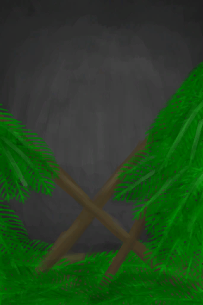

# 坍塌的屋顶  
> 一团糟……  
  
  坍塌的屋顶  |   图片   
 ----  |  ----:   
 ** 效果: ** [舒适度](Comfort.md)-2000 [雨水防护](RainProtection.md)-5 [阳光防护](SunProtection.md)-5 [绝热](InsulationHeat.md)-3 [遮蔽](Sheltered.md)-1  |     
  
## 制作  
步骤  |  耗时  |  需求  |  状态变化  |  成品  
----  |  ----  |  ----  |  ----  |  ----  
1. [长木棍](StickLong.md) x 4 + [细线](CordFiber.md) x 5 2. [棕榈叶](PalmFronds.md) x 30 + [细线](CordFiber.md) x 2  |  1小时/每步骤  |  ** 需要状态: ** [光亮](Light.md): 10-100  |    |    
## 其他效果  
名称  |  目标  |  条件  |  变化  |  玩家状态  
----  |  ----  |  ----  |  ----  |  ----  
filthiness  |  [泥屋](MudHut.md) [泥屋](MudHutRuins.md) [棚屋](Shed.md)  |    |  污秽+1  |    
