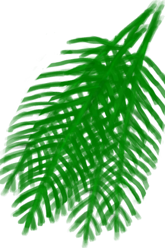

# 屋顶损坏  
> 我需要修复房顶  
   
> <b>棚屋和泥屋</b>的屋顶有时会出现破洞，特别是在<b>风暴</b>中。 当这种情况发生时，一定要尽快修复它们，否则你将面临整个屋顶<b>倒塌</b>的风险。  屋顶损坏通常会降低你的<b>不适</b>，并加快房屋<b>变脏</b>的速度。倒塌的屋顶影响更大，且不再为你遮挡<b>雨和太阳</b>。  
  
<table class="table table-bordered" data-toggle="table" ><tbody><tr ><td  style="width:80%;text-align:left;vertical-align:top;"  >** 效果: ** [

[舒适度](Comfort.md)](Comfort.md)-250</td><td  style="width:20%;text-align:left;vertical-align:top;"  >

</td></tr></tbody></tbody></table>  
  
## 获取来源  
<table class="table table-bordered" data-toggle="table" ><thead><tr ><th  style="text-align:left;vertical-align:top;"  >来源</th><th  style="text-align:left;vertical-align:top;"  >操作</th></tr></thead><tr ><td  style="text-align:left;vertical-align:top;"  >[

[泥屋](MudHut.md)](MudHut.md)</td><td  style="text-align:left;vertical-align:top;"  >转化</td></tr><tr ><td  style="text-align:left;vertical-align:top;"  >[

[泥屋(损坏)](MudHutRuins.md)](MudHutRuins.md)</td><td  style="text-align:left;vertical-align:top;"  >转化</td></tr><tr ><td  style="text-align:left;vertical-align:top;"  >[

[棚屋](Shed.md)](Shed.md)</td><td  style="text-align:left;vertical-align:top;"  >转化</td></tr></tbody></table>  
  
## 制作  
<table class="table table-bordered" data-toggle="table" ><thead><tr ><th  style="text-align:left;vertical-align:top;"  >步骤</th><th  style="text-align:left;vertical-align:top;"  >耗时</th><th  style="text-align:left;vertical-align:top;"  >需求</th><th  style="text-align:left;vertical-align:top;"  data-sortable="true"  >状态</th><th  style="text-align:left;vertical-align:top;"  data-sortable="true"  >成品</th></tr></thead><tr ><td  style="text-align:left;vertical-align:top;"  >1. [

[棕榈叶](PalmFronds.md)](PalmFronds.md) x 10</td><td  style="text-align:left;vertical-align:top;"  >4TP</td><td  style="text-align:left;vertical-align:top;"  >** 需要状态: ** [

[光亮](Light.md)](Light.md): 10-100</td><td  style="text-align:left;vertical-align:top;"  ></td><td  style="text-align:left;vertical-align:top;"  ></td></tr></tbody></table>  
  

