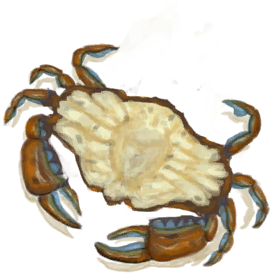
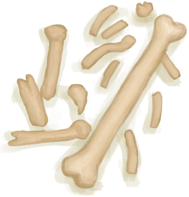

# 忠犬朋友  
> 汪汪！  
  
<table class="table table-bordered"><tbody><tr ><td  style="width:80%;text-align:left;vertical-align:top;" >** 可重命名 **  ** 不可删除 **  ** 不可堆叠 **  **重量：**0  **标签：**	[“大的”](tag_Large.md), [“大型动物”](tag_LargeAnimal.md)  **可使用次数：**288  ** 效果: ** [

[孤独感](Loneliness.md)](Loneliness.md)加成-2 [害怕猕猴](MacaqueFear.md)+500 [海鸥之惧](SeagullFear.md)+1000</td><td  style="width:20%;text-align:left;vertical-align:top;" >

</td></tr></tbody></tbody></table>  
  
## 动作  
<table class="table table-bordered"><thead><tr ><th  style="text-align:left;vertical-align:top;" >动作</th><th  style="text-align:left;vertical-align:top;" >耗时</th><th  style="text-align:left;vertical-align:top;" >条件</th><th  style="text-align:left;vertical-align:top;" >变化</th><th  style="text-align:left;vertical-align:top;" >状态</th></tr></thead><tr ><td  style="text-align:left;vertical-align:top;" >抚摸 </td><td  style="text-align:left;vertical-align:top;" >15分</td><td  style="text-align:left;vertical-align:top;" ></td><td  style="text-align:left;vertical-align:top;" >** 自身：** 情绪

  +25(2.5%)  ** 获得： ** ** [Success]  ** [

[孤独感](Loneliness.md)](Loneliness.md)-30 [

[压力](Stress.md)](Stress.md)-25 [

[娱乐](Entertainment.md)](Entertainment.md)+6 基础权重：800</td><td  style="text-align:left;vertical-align:top;" ></td></tr><tr ><td  style="text-align:left;vertical-align:top;" >一起玩耍 </td><td  style="text-align:left;vertical-align:top;" >30分</td><td  style="text-align:left;vertical-align:top;" ></td><td  style="text-align:left;vertical-align:top;" >** 自身：** 情绪

  +25(2.5%)</td><td  style="text-align:left;vertical-align:top;" >[

[娱乐](Entertainment.md)](Entertainment.md)+16 [

[耐力](Stamina.md)](Stamina.md)-10 [

[压力](Stress.md)](Stress.md)-25 [

[孤独感](Loneliness.md)](Loneliness.md)-30</td></tr></tbody></table>  
  
## 可拖入  
<table class="table table-bordered"><thead><tr ><th  style="text-align:left;vertical-align:top;" >使用</th><th  style="text-align:left;vertical-align:top;" >动作</th><th  style="text-align:left;vertical-align:top;" >耗时</th><th  style="text-align:left;vertical-align:top;" >条件</th><th  style="text-align:left;vertical-align:top;" >变化</th><th  style="text-align:left;vertical-align:top;" >玩家状态</th></tr></thead><tr ><td  style="text-align:left;vertical-align:top;" >[

[鱼片](FishSlices.md)](FishSlices.md) [

[烤鱼片](FishSlicesCooked.md)](FishSlicesCooked.md) [

[虾](Prawns.md)](Prawns.md) [

[烤虾](PrawnsCooked.md)](PrawnsCooked.md) [

[鱼杂](FishScraps.md)](FishScraps.md) [

[烤鱼杂](FishScrapsCooked.md)](FishScrapsCooked.md) [

[螃蟹](Crab.md)](Crab.md) [

[烤螃蟹](CrabCooked.md)](CrabCooked.md)</td><td  style="text-align:left;vertical-align:top;" >喂食 </td><td  style="text-align:left;vertical-align:top;" >-</td><td  style="text-align:left;vertical-align:top;" ></td><td  style="text-align:left;vertical-align:top;" >** 自身: ** 饥饿

  +288(50%) 情绪

  +50(5%)  ** 使用物: ** →消失 可用次数  -1  ** 获得: ** ** [Success]  ** [

[孤独感](Loneliness.md)](Loneliness.md)-20 [

[压力](Stress.md)](Stress.md)-10 基础权重：800</td><td  style="text-align:left;vertical-align:top;" >[

[孤独感](Loneliness.md)](Loneliness.md)-20～+0</td></tr><tr ><td  style="text-align:left;vertical-align:top;" >[“肉”](tag_Meat.md) [“鱼肉”](tag_Fish.md)</td><td  style="text-align:left;vertical-align:top;" >喂食 </td><td  style="text-align:left;vertical-align:top;" >-</td><td  style="text-align:left;vertical-align:top;" ></td><td  style="text-align:left;vertical-align:top;" >** 自身: ** 饥饿

  +288(50%) 情绪

  +250(25%)  ** 使用物: ** →消失  ** 获得: ** ** [Success]  ** [

[孤独感](Loneliness.md)](Loneliness.md)-20 [

[压力](Stress.md)](Stress.md)-10 基础权重：800</td><td  style="text-align:left;vertical-align:top;" ></td></tr><tr ><td  style="text-align:left;vertical-align:top;" >[

[骨头](Bones.md)](Bones.md)</td><td  style="text-align:left;vertical-align:top;" >Give Bones </td><td  style="text-align:left;vertical-align:top;" >-</td><td  style="text-align:left;vertical-align:top;" ></td><td  style="text-align:left;vertical-align:top;" >** 自身: ** 情绪

  +400(40%)  ** 使用物: ** →消失  ** 获得: ** ** [Success]  ** [

[孤独感](Loneliness.md)](Loneliness.md)-20 [

[压力](Stress.md)](Stress.md)-10 基础权重：800</td><td  style="text-align:left;vertical-align:top;" >[

[情绪](Morale.md)](Morale.md)+1</td></tr><tr ><td  style="text-align:left;vertical-align:top;" >[“储水容器”](tag_WaterContainer.md)</td><td  style="text-align:left;vertical-align:top;" >喂水 </td><td  style="text-align:left;vertical-align:top;" >-</td><td  style="text-align:left;vertical-align:top;" ></td><td  style="text-align:left;vertical-align:top;" >** 自身: ** 口渴

  +48(16.67%) 情绪

  +25(2.5%)  ** 使用物: ** 含水量  -300</td><td  style="text-align:left;vertical-align:top;" ></td></tr><tr ><td  style="text-align:left;vertical-align:top;" >[“切割工具”](tag_Cutter.md) [“一级矛”](tag_Spear.md)</td><td  style="text-align:left;vertical-align:top;" >杀害！ [手部动作(组)](HandAction.md)</td><td  style="text-align:left;vertical-align:top;" >15分</td><td  style="text-align:left;vertical-align:top;" >[

[光亮](Light.md)](Light.md): 10-100</td><td  style="text-align:left;vertical-align:top;" >** 自身: ** →消失  ** 使用物: ** 可用次数  -1</td><td  style="text-align:left;vertical-align:top;" >[

[污垢](Filth.md)](Filth.md)+20 [

[情绪](Morale.md)](Morale.md)-100 [

[哀悼](Mourning.md)](Mourning.md)+288</td></tr></tbody></table>  
  
## 属性   
<table class="table table-bordered"><thead><tr ><th  style="text-align:left;vertical-align:top;" >属性</th><th  style="text-align:left;vertical-align:top;" >值</th><th  style="text-align:left;vertical-align:top;" >耗时</th><th  style="text-align:left;vertical-align:top;" >变化</th></tr></thead><tr ><td  style="text-align:left;vertical-align:top;" >饥饿

</td><td  style="text-align:left;vertical-align:top;" >初始：576 最大：576</td><td  style="text-align:left;vertical-align:top;" >每15分钟-1 最多需要：6天</td><td  style="text-align:left;vertical-align:top;" >** 到达0时：饿死了 **  ** 自身 ** →消失</td></tr><tr ><td  style="text-align:left;vertical-align:top;" >口渴

</td><td  style="text-align:left;vertical-align:top;" >初始：288 最大：288</td><td  style="text-align:left;vertical-align:top;" >每15分钟-1 最多需要：3天</td><td  style="text-align:left;vertical-align:top;" >** 到达0时：渴死了 **  ** 自身 ** →消失</td></tr><tr ><td  style="text-align:left;vertical-align:top;" >情绪

</td><td  style="text-align:left;vertical-align:top;" >初始：1000 最大：1000</td><td  style="text-align:left;vertical-align:top;" >每15分钟-4 最多需要：2天14小时30分</td><td  style="text-align:left;vertical-align:top;" >** 到达0时： ** ** [Bite]  **   [

[┗｀O′┛ 嗷！！！！(事件)](Event_DogFriendAnger.md)](Event_DogFriendAnger.md)(+1)  ** 自身 ** 情绪

  +250～+500(25%～50%)</td></tr><tr ><td  style="text-align:left;vertical-align:top;" >独处时间</td><td  style="text-align:left;vertical-align:top;" >初始：96 最大：96</td><td  style="text-align:left;vertical-align:top;" >每15分钟-1 最多需要：1天</td><td  style="text-align:left;vertical-align:top;" >** 到达0时： ** ** [Gift]  **   [

[礼物！(事件)](Event_DogFriendGift.md)](Event_DogFriendGift.md)(+1)  ** 自身 ** 饥饿

  +24～+96(4.17%～16.67%) 口渴

  +24～+96(8.33%～33.33%) 独处时间  +96(100%)</td></tr><tr ><td  style="text-align:left;vertical-align:top;" >便便</td><td  style="text-align:left;vertical-align:top;" >初始：192 最大：192</td><td  style="text-align:left;vertical-align:top;" >每15分钟-1 最多需要：2天</td><td  style="text-align:left;vertical-align:top;" >** 到达0时： ** ** [Poop]  **   [

[粪便](Manure.md)](Manure.md)(+1)  ** 自身 ** 便便  +192(100%)</td></tr></tbody></table>  
  
## 被动效果  
<table class="table table-bordered"><thead><tr ><th  style="text-align:left;vertical-align:top;" >名称</th><th  style="text-align:left;vertical-align:top;" >条件</th><th  style="text-align:left;vertical-align:top;" >变化(每15分钟)</th><th  style="text-align:left;vertical-align:top;" >玩家状态</th></tr></thead><tr ><td  style="text-align:left;vertical-align:top;" >Cure Stress</td><td  style="text-align:left;vertical-align:top;" >** 需要属性：** 饥饿

: 432～576(75%～100%) 口渴

: 216～288(75%～100%)</td><td  style="text-align:left;vertical-align:top;" >饥饿

 -1(-0.18%) 情绪

+10(1%)</td><td  style="text-align:left;vertical-align:top;" ></td></tr><tr ><td  style="text-align:left;vertical-align:top;" >Overcrowding</td><td  style="text-align:left;vertical-align:top;" >** 需要属性：** 怀孕

: 1～1536(0.07%～114.29%) ** 需要存在卡牌：** [“山羊”](tag_Goat.md)</td><td  style="text-align:left;vertical-align:top;" >情绪

-0.66(-0.07%)</td><td  style="text-align:left;vertical-align:top;" ></td></tr></tbody></table>  
  

