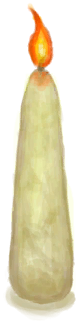

# 炸弹  
> 惊险刺激，点燃引线，去炸个爽。  
  
<table class="table table-bordered" data-toggle="table"  data-show-header="false"><thead style="display:none"><tr ><th  style="width:50%;text-align:left;vertical-align:top;"  >title</th><th  style="width:50%;text-align:left;vertical-align:top;"  ></th></tr></thead><tr ><td  style="width:50%;text-align:left;vertical-align:top;"  >**重量：**100</td><td  style="width:50%;text-align:left;vertical-align:top;"  >

<a href="DynamiteOff.md" style="color:black">炸弹</a>

能让东西<b>爆炸</b>的先进而危险的工具！  要制作它，你需要<b>木屑、脂肪、浓硝酸、细线和水</b>。  能被用于炸<b>坍塌的隧道、铜矿脉、鱼和更多东西</b>！</td></tr></tbody></table>  
  
## 获取来源  
<table class="table table-bordered" data-toggle="table"  ><thead style=""><tr ><th  style="text-align:left;vertical-align:top;"  >来源</th><th  style="text-align:left;vertical-align:top;"  >操作</th></tr></thead><tr ><td  style="text-align:left;vertical-align:top;"  >[

[炸弹(蓝图)](Bp_Dynamite.md)](Bp_Dynamite.md)</td><td  style="text-align:left;vertical-align:top;"  >蓝图制造</td></tr><tr ><td  style="text-align:left;vertical-align:top;"  >[

[炸弹(开)](DynamiteOn.md)](DynamiteOn.md)</td><td  style="text-align:left;vertical-align:top;"  >熄灭</td></tr><tr ><td  style="text-align:left;vertical-align:top;"  >[

[炸弹(开)](DynamiteOn.md)](DynamiteOn.md)</td><td  style="text-align:left;vertical-align:top;"  >转化</td></tr></tbody></table>  
  
## 可拖入  
<table class="table table-bordered" data-toggle="table"  ><thead style=""><tr ><th  style="text-align:left;vertical-align:top;"  >使用</th><th  style="text-align:left;vertical-align:top;"  >动作</th><th  style="text-align:left;vertical-align:top;"  data-sortable="true"  >耗时</th><th  style="text-align:left;vertical-align:top;"  data-sortable="true"  >条件</th><th  style="text-align:left;vertical-align:top;"  >变化</th><th  style="text-align:left;vertical-align:top;"  data-sortable="true"  >玩家状态</th></tr></thead><tr ><td  style="text-align:left;vertical-align:top;"  >[

[火种](TinderLit.md)](TinderLit.md) [

[营火](Campfire.md)](Campfire.md) [

[火炉](Stove.md)](Stove.md) [

[烟熏炉](Smoker.md)](Smoker.md) [

[瓦斯炉(开)](GasCookerOn.md)](GasCookerOn.md) [

[燃烧的信号弹(开)](FlareHandOn.md)](FlareHandOn.md) [

[蜡烛(开)](CandleOn.md)](CandleOn.md) [

[茉莉蜡烛(开)](CandleJasmineOn.md)](CandleJasmineOn.md) [

[香茅蜡烛(开)](CandleCitronellaOn.md)](CandleCitronellaOn.md)</td><td  style="text-align:left;vertical-align:top;"  >点燃 </td><td  style="text-align:left;vertical-align:top;"  >-</td><td  style="text-align:left;vertical-align:top;"  ></td><td  style="text-align:left;vertical-align:top;"  >** 自身: ** → [

[炸弹(开)](DynamiteOn.md)](DynamiteOn.md)</td><td  style="text-align:left;vertical-align:top;"  ></td></tr></tbody></table>  
  

