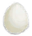

# 受精蛋  
> 可以吃，做熟后味道会更好。  
   
> 蛋可以在野外的<b>海鸥或灰山鹑巢</b>里找到，或者捕获并在<b>畜栏</b>中圈养自己的<b>灰山鹑</b>来获得。  它们是营养丰富且保质期长的食物来源，可用于多种<b>烹饪食谱</b>。  
  
<table class="table table-bordered"><tbody><tr ><td  style="width:80%;text-align:left;vertical-align:top;" >**重量：**25  **标签：**	[“可烹饪的”](tag_Cookable.md), [“饲料”](tag_Feed.md), [“肉”](tag_Meat.md)</td><td  style="width:20%;text-align:left;vertical-align:top;" >

</td></tr></tbody></tbody></table>  
  
## 获取来源  
<table class="table table-bordered"><thead><tr ><th  style="text-align:left;vertical-align:top;" >来源</th><th  style="text-align:left;vertical-align:top;" >操作</th></tr></thead><tr ><td  style="text-align:left;vertical-align:top;" >[

[一个灰山鹑巢！(事件)](Event_PartridgeNest.md)](Event_PartridgeNest.md)</td><td  style="text-align:left;vertical-align:top;" >继续</td></tr><tr ><td  style="text-align:left;vertical-align:top;" >[

[雌灰山鹑](PartridgeFemaleEnclosure.md)](PartridgeFemaleEnclosure.md)</td><td  style="text-align:left;vertical-align:top;" >下蛋</td></tr></tbody></table>  
  
## 动作  
<table class="table table-bordered"><thead><tr ><th  style="text-align:left;vertical-align:top;" >动作</th><th  style="text-align:left;vertical-align:top;" >耗时</th><th  style="text-align:left;vertical-align:top;" >条件</th><th  style="text-align:left;vertical-align:top;" >变化</th><th  style="text-align:left;vertical-align:top;" >状态</th></tr></thead><tr ><td  style="text-align:left;vertical-align:top;" >食用 [食用肉类动作(组)](CarnivorousAction.md) [进食动作(组)](EatingAction.md)</td><td  style="text-align:left;vertical-align:top;" >-</td><td  style="text-align:left;vertical-align:top;" ></td><td  style="text-align:left;vertical-align:top;" >** 自身：** →消失</td><td  style="text-align:left;vertical-align:top;" >[

[饱食](Satiation.md)](Satiation.md)+10 [

[胃](Stomach.md)](Stomach.md)+6 [

[水分](Hydration.md)](Hydration.md)+6 [

[蛋类<nobr>厌倦度</nobr>](SaturationEggs.md)](SaturationEggs.md)+35 [

[污垢](Filth.md)](Filth.md)+6 [

[细菌性发烧](BacteriaFever.md)](BacteriaFever.md)+0～+100 [

[情绪](Morale.md)](Morale.md)-1</td></tr></tbody></table>  
  
## 可拖至  

[猪食槽](BoarFeeder.md)

[猪食槽](BoarFeeder.md)

[猪食槽(空)](BoarFeederEmpty.md)

[猪食槽(空)](BoarFeederEmpty.md)

[堆肥箱](CompostBin.md)

[灰山鹑喂食器](PartridgeFeeder.md)

[灰山鹑喂食器](PartridgeFeeder.md)

[灰山鹑喂食器(空)](PartridgeFeederEmpty.md)

[中陷阱的猕猴](CageTrapMacaque.md)

[母猪](BoarEnclosureFemale.md)

[母猪](BoarEnclosureFemale.md)

[公猪](BoarEnclosureMale.md)

[公猪](BoarEnclosureMale.md)

[小猪](BoarEnclosurePiglet.md)

[小猪](BoarEnclosurePiglet.md)

[母猪](BoarTiedFemale.md)

[母猪](BoarTiedFemale.md)

[公猪](BoarTiedMale.md)

[公猪](BoarTiedMale.md)

[小猪](BoarTiedPiglet.md)

[小猪](BoarTiedPiglet.md)

[忠犬朋友](DogFriend.md)

[猕猴朋友](MacaqueFriend.md)

[受伤的猕猴](MacaqueWounded.md)

[小灰山鹑](PartridgeChick.md)

[雌灰山鹑](PartridgeFemaleEnclosure.md)

[雌灰山鹑](PartridgeFemaleLive.md)

[雄灰山鹑](PartridgeMaleEnclosure.md)

[雄灰山鹑](PartridgeMaleLive.md)

  
  
## 可用于蓝图  

[

[蛋炒饭(蓝图)](Bp_EggFriedRice.md)](Bp_EggFriedRice.md)

[

[鱼肉煎蛋饼(蓝图)](Bp_FishOmelette.md)](Bp_FishOmelette.md)

[

[肉食盛宴(蓝图)](Bp_HeartyFeast.md)](Bp_HeartyFeast.md)

[

[西米蛋糕(蓝图)](Bp_SagoCake.md)](Bp_SagoCake.md)

  
  
  
## 可用于转化  
<table class="table table-bordered"><thead><tr ><th  style="text-align:left;vertical-align:top;" >转化为</th><th  style="text-align:left;vertical-align:top;" >容器</th></tr></thead><tr ><td  style="text-align:left;vertical-align:top;" >[烤蛋](EggCooked.md)</td><td  style="text-align:left;vertical-align:top;" >[营火](Campfire.md)</td></tr><tr ><td  style="text-align:left;vertical-align:top;" >[烤蛋](EggCooked.md)</td><td  style="text-align:left;vertical-align:top;" >[粘土火盆](ClayFirePit.md)</td></tr><tr ><td  style="text-align:left;vertical-align:top;" >[烤蛋](EggCooked.md)</td><td  style="text-align:left;vertical-align:top;" >[火堆](Fire.md)</td></tr><tr ><td  style="text-align:left;vertical-align:top;" >[烤蛋](EggCooked.md)</td><td  style="text-align:left;vertical-align:top;" >[瓦斯炉(开)](GasCookerOn.md)</td></tr><tr ><td  style="text-align:left;vertical-align:top;" >[烤蛋](EggCooked.md)</td><td  style="text-align:left;vertical-align:top;" >[火炉](Stove.md)</td></tr></tbody></table>  
  
## 属性   
<table class="table table-bordered"><thead><tr ><th  style="text-align:left;vertical-align:top;" >属性</th><th  style="text-align:left;vertical-align:top;" >值</th><th  style="text-align:left;vertical-align:top;" >耗时</th><th  style="text-align:left;vertical-align:top;" >变化</th></tr></thead><tr ><td  style="text-align:left;vertical-align:top;" >耐久</td><td  style="text-align:left;vertical-align:top;" >初始：2016</td><td  style="text-align:left;vertical-align:top;" >每15分钟-1 最多需要：21天</td><td  style="text-align:left;vertical-align:top;" >** 到达0时： **  ** 自身 ** → [

[腐烂物](RottenRemains.md)](RottenRemains.md)</td></tr><tr ><td  style="text-align:left;vertical-align:top;" >进度</td><td  style="text-align:left;vertical-align:top;" >初始：0 最大：672</td><td  style="text-align:left;vertical-align:top;" >-</td><td  style="text-align:left;vertical-align:top;" >** 到达上限时： **  ** 自身 ** → [

[小灰山鹑](PartridgeChick.md)](PartridgeChick.md)</td></tr></tbody></table>  
  

