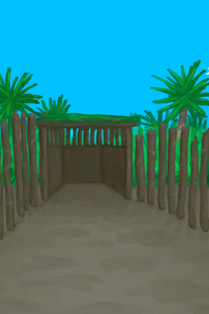
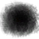

# 畜栏  
>   
  
  畜栏  |   图片   
 ----  |  ----:   
 ** 区域唯一 **  |     
  
## 获取来源  
来源  |  操作  
----  |  ----  
[畜栏](EnclosureEntrance.md)  |  进入  
## 可拖入  
使用  |  动作  |  耗时  |  条件  |  变化  |  玩家状态  
----  |  ----  |  ----  |  ----  |  ----  |  ----  
[扫帚](Broom.md)  |  打扫  |  30分  |  [光亮](Light.md): 5-100  |  自身: 污秽  -250  使用物: 可用次数  -1    |  [压力](Stress.md)-10 [情绪](Morale.md)+5  
## 属性   
属性  |  值  |  耗时  |  变化  
----  |  ----  |  ----  |  ----  
污秽  |  初始：0 最大：1000  |  每15分钟+2 最多需要：5天5小时  |    
## 被动效果  
名称  |  条件  |  变化(每15分钟)  |  玩家状态  
----  |  ----  |  ----  |  ----  
Minimal Filth  |  ** 需要属性：** 污秽: 100～250  |    |  [不适](Discomfort.md)+175  
Low Filth  |  ** 需要属性：** 污秽: 251～500  |    |  [不适](Discomfort.md)+375  
Moderate Filth  |  ** 需要属性：** 污秽: 501～750  |    |  [不适](Discomfort.md)+625  
Extreme Filth  |  ** 需要属性：** 污秽: 751～1000  |    |  [不适](Discomfort.md)+875  
