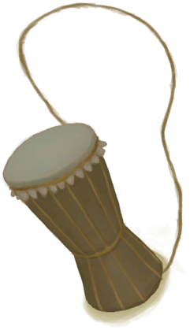

# 宿敌现身  
#### ** 基础值: ** 0   
#### ** 变化范围: ** 0 ~ 2  
#### ** 基础变化率: ** 无   
## 阶段  
<table class="table table-bordered"><thead><tr ><th  style="text-align:left;vertical-align:top;" >范围</th><th  style="text-align:left;vertical-align:top;" >名称</th><th  style="text-align:left;vertical-align:top;" >描述</th><th  style="text-align:left;vertical-align:top;" >影响状态</th><th  style="text-align:left;vertical-align:top;" >影响动作</th></tr></thead><tr ><td  style="text-align:left;vertical-align:top;" >1 ～ 1</td><td  style="text-align:left;vertical-align:top;" >

某个“存在”紧跟着我……</td><td  style="text-align:left;vertical-align:top;" ></td><td  style="text-align:left;vertical-align:top;" >[

[压力](Stress.md)](Stress.md)加成+1</td><td  style="text-align:left;vertical-align:top;" ></td></tr></tbody></table>  
  
## 可被以下操作改变  
<table class="table table-bordered"><thead><tr ><th  style="text-align:left;vertical-align:top;" >来源</th><th  style="text-align:left;vertical-align:top;" >操作</th><th  style="text-align:left;vertical-align:top;" >值</th></tr></thead><tr ><td  style="text-align:left;vertical-align:top;" >[

[宿敌来了！(事件)](Event_EnemyFight.md)](Event_EnemyFight.md)</td><td  style="text-align:left;vertical-align:top;" >用长矛攻击！</td><td  style="text-align:left;vertical-align:top;" >1</td></tr><tr ><td  style="text-align:left;vertical-align:top;" >[

[宿敌来了！(事件)](Event_EnemyFight.md)](Event_EnemyFight.md)</td><td  style="text-align:left;vertical-align:top;" >用弓箭攻击！</td><td  style="text-align:left;vertical-align:top;" >1</td></tr><tr ><td  style="text-align:left;vertical-align:top;" >[

[宿敌来了！(事件)](Event_EnemyFight.md)](Event_EnemyFight.md)</td><td  style="text-align:left;vertical-align:top;" >用枪攻击！</td><td  style="text-align:left;vertical-align:top;" >1</td></tr><tr ><td  style="text-align:left;vertical-align:top;" >[

[宿敌来了！(事件)](Event_EnemyFight.md)](Event_EnemyFight.md)</td><td  style="text-align:left;vertical-align:top;" >用投石索攻击！</td><td  style="text-align:left;vertical-align:top;" >1</td></tr><tr ><td  style="text-align:left;vertical-align:top;" >[

[宿敌被打败了！(事件)](Event_EnemyFightSuccess.md)](Event_EnemyFightSuccess.md)</td><td  style="text-align:left;vertical-align:top;" >胜利啦！</td><td  style="text-align:left;vertical-align:top;" >1</td></tr><tr ><td  style="text-align:left;vertical-align:top;" >[

[蜥蜴皮手鼓](LizardDrum.md)](LizardDrum.md)</td><td  style="text-align:left;vertical-align:top;" >唤灵的节奏</td><td  style="text-align:left;vertical-align:top;" >1</td></tr><tr ><td  style="text-align:left;vertical-align:top;" >[

[宿敌来了！(事件)](Event_EnemyFight.md)](Event_EnemyFight.md)</td><td  style="text-align:left;vertical-align:top;" >用长矛攻击！</td><td  style="text-align:left;vertical-align:top;" >-1</td></tr><tr ><td  style="text-align:left;vertical-align:top;" >[

[宿敌来了！(事件)](Event_EnemyFight.md)](Event_EnemyFight.md)</td><td  style="text-align:left;vertical-align:top;" >用弓箭攻击！</td><td  style="text-align:left;vertical-align:top;" >-1</td></tr><tr ><td  style="text-align:left;vertical-align:top;" >[

[宿敌来了！(事件)](Event_EnemyFight.md)](Event_EnemyFight.md)</td><td  style="text-align:left;vertical-align:top;" >用枪攻击！</td><td  style="text-align:left;vertical-align:top;" >-1</td></tr><tr ><td  style="text-align:left;vertical-align:top;" >[

[宿敌来了！(事件)](Event_EnemyFight.md)](Event_EnemyFight.md)</td><td  style="text-align:left;vertical-align:top;" >用投石索攻击！</td><td  style="text-align:left;vertical-align:top;" >-1</td></tr><tr ><td  style="text-align:left;vertical-align:top;" >[

[宿敌来了！(事件)](Event_EnemyFight.md)](Event_EnemyFight.md)</td><td  style="text-align:left;vertical-align:top;" >逃跑</td><td  style="text-align:left;vertical-align:top;" >-1</td></tr><tr ><td  style="text-align:left;vertical-align:top;" >[

[我没能逃掉！(事件)](Event_EnemyFightFailedRetreat.md)](Event_EnemyFightFailedRetreat.md)</td><td  style="text-align:left;vertical-align:top;" >闭眼</td><td  style="text-align:left;vertical-align:top;" >-1</td></tr><tr ><td  style="text-align:left;vertical-align:top;" >[

[我失败了！(事件)](Event_EnemyFightFailure.md)](Event_EnemyFightFailure.md)</td><td  style="text-align:left;vertical-align:top;" >闭眼</td><td  style="text-align:left;vertical-align:top;" >-1</td></tr><tr ><td  style="text-align:left;vertical-align:top;" >[

[我感觉到某种“存在”……(事件)](Event_EnemyPresence.md)](Event_EnemyPresence.md)</td><td  style="text-align:left;vertical-align:top;" >我还没准备好</td><td  style="text-align:left;vertical-align:top;" >-1</td></tr></tbody></table>  
  
## 被以下操作需求  
<table class="table table-bordered"><thead><tr ><th  style="text-align:left;vertical-align:top;" >来源</th><th  style="text-align:left;vertical-align:top;" >操作</th><th  style="text-align:left;vertical-align:top;" >值</th></tr></thead><tr ><td  style="text-align:left;vertical-align:top;" >[蜥蜴皮手鼓](LizardDrum.md)</td><td  style="text-align:left;vertical-align:top;" >唤灵的节奏</td><td  style="text-align:left;vertical-align:top;" >0</td></tr></tbody></table>  
  

