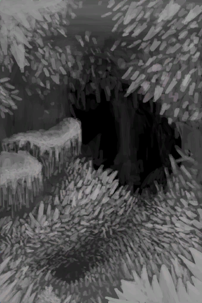

# 洞穴上层  
> 这里黑黢黢、静悄悄的。  
  
<table class="table table-bordered table5997" data-toggle="table"  data-show-header="false"><thead style="display:none"><tr ><th  style="width:50%;"  >title</th><th  style="width:50%;"  ></th></tr></thead><tr ><td  style="width:50%;"  >** 黑暗区域 **  **标签：**	[“洞穴”](tag_Cave.md)  **容量：**20000  **初始：**	[晶石洞穴(洞穴上层)](CrystalChamber.md)  ** 效果: ** [

[降水值](RainValue.md)](RainValue.md)<b>-5</b> [

[绝热](InsulationHeat.md)](InsulationHeat.md)<b>+6</b> [

[体感温度](TemperaturePerceived.md)](TemperaturePerceived.md)<b>-6</b> [

[阳光防护](SunProtection.md)](SunProtection.md)<b>+6</b> [

[遮蔽](Sheltered.md)](Sheltered.md)<b>+1</b> [夜晚](IsNight.md)<b>+1</b></td><td  style="width:50%;"  >

<a href="Env_CrystalChamber.md" style="color:black">洞穴上层</a>

</td></tr></tbody></table>  
  
## 获取来源  

进入

[晶石洞穴(洞穴底层)](CrystalChamberEntrance.md)

爬上去

[竖井](ShaftFloodedChamberToCrystalChamber.md)

  
  

