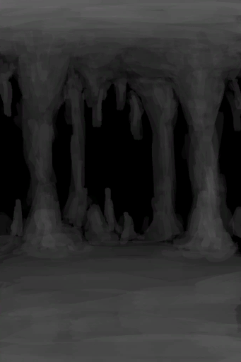

[返回首页](index.md)  
# 洞穴上层  
> 这里黑黢黢、静悄悄的。  
  
  属性  |   图片   
 ----  |  ----:   
 **标签：**	[“洞穴”](tag_Cave.md)  **容重量：**20000  **初始：**	[洞穴底层](LowChamber.md)  |     
  
## 获取来源  
来源  |  操作  
----  |  ----  
[洞穴底层](CrystalChamberExit.md)  |  离开  
[洞穴底层](NarrowTunnelExit.md)  |  进入  
[竖井(洞穴中层)](ShaftMidChamberToLowChamber.md)  |  爬下去  
[竖井(洞穴中层)](ShaftMidChamberToLowChamber.md)  |  爬下去  
[竖井(洞穴中层)](ShaftMidChamberToLowChamber.md)  |  爬下去  
[竖井(洞穴中层)](ShaftMidChamberToLowChamber.md)  |  爬下去  
