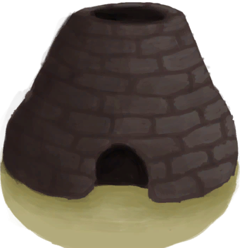

[返回首页](index.md)  
# 泥屋  
> 一个可以被称作家的地方。  
  
  属性  |   图片   
 ----  |  ----:   
 **标签：**	[“丛林”](tag_Jungle.md)  **容重量：**60000  **初始：**	[泥屋](MudHutRuins.md), [离开(泥屋)](MudHutExitRuins.md), [坍塌的屋顶](Dmg_RoofCollapsed.md), [废墟(泥屋)](Debris.md)  |     
  
## 获取来源  
来源  |  操作  
----  |  ----  
[泥屋\n](MudHutEntranceRuins.md)  |  进入  
