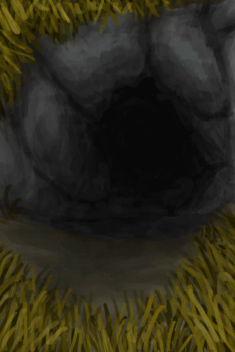

# 隧道  
>   
  
<table class="table table-bordered"><tbody><tr ><td  style="width:80%;text-align:left;vertical-align:top;" >**容量：**5000  **初始：**	[隧道](Tunnel.md), [铜矿脉(洞穴上层)](CopperVein.md), [狭窄通道(隧道)](HighChamberEntranceClosed.md)  ** 效果: ** [

[雨水防护](RainProtection.md)](RainProtection.md)+5 [

[绝热](InsulationHeat.md)](InsulationHeat.md)+3 [

[体感温度](TemperaturePerceived.md)](TemperaturePerceived.md)-4 [

[阳光防护](SunProtection.md)](SunProtection.md)+6 [

[遮蔽](Sheltered.md)](Sheltered.md)+1</td><td  style="width:20%;text-align:left;vertical-align:top;" >

</td></tr></tbody></tbody></table>  
  
## 获取来源  
<table class="table table-bordered"><thead><tr ><th  style="text-align:left;vertical-align:top;" >来源</th><th  style="text-align:left;vertical-align:top;" >操作</th></tr></thead><tr ><td  style="text-align:left;vertical-align:top;" >[

[离开(洞穴上层)](HighChamberExit.md)](HighChamberExit.md)</td><td  style="text-align:left;vertical-align:top;" >离开</td></tr><tr ><td  style="text-align:left;vertical-align:top;" >[

[隧道入口(东部高地)](TunnelEntrance.md)](TunnelEntrance.md)</td><td  style="text-align:left;vertical-align:top;" >进入</td></tr></tbody></table>  
  

