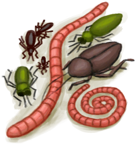
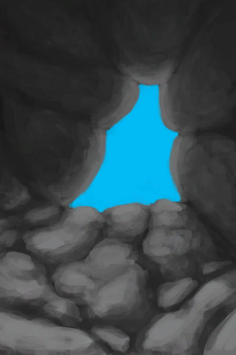
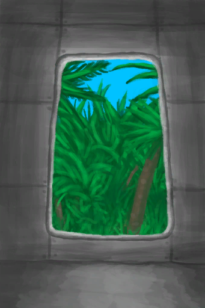
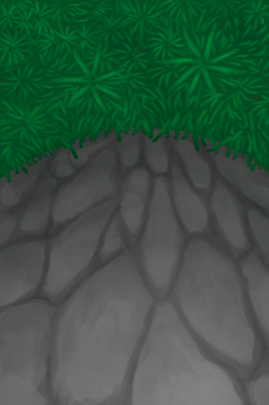

# 湿地  
> 丛林中更阴凉更潮湿的地区。  
  
<table class="table table-bordered"><tbody><tr ><td  style="width:80%;text-align:left;vertical-align:top;" >**标签：**	[“潮湿环境”](tag_EnvHumid.md), [“丛林”](tag_Jungle.md)  **初始：**	[湿地丛林(湿地)](Wetlands.md)  ** 效果: ** [

[雨水防护](RainProtection.md)](RainProtection.md)+2 [

[绝热](InsulationHeat.md)](InsulationHeat.md)+3 [

[阳光防护](SunProtection.md)](SunProtection.md)+4 [

[蚊虫数量](BugPopulation.md)](BugPopulation.md)+4 [

[猎手接近](HuntersProximity.md)](HuntersProximity.md)-0.5</td><td  style="width:20%;text-align:left;vertical-align:top;" >

</td></tr></tbody></tbody></table>  
  
## 获取来源  
<table class="table table-bordered"><thead><tr ><th  style="text-align:left;vertical-align:top;" >来源</th><th  style="text-align:left;vertical-align:top;" >操作</th></tr></thead><tr ><td  style="text-align:left;vertical-align:top;" >[

[离开(幽暗洞穴)](DarkCaveExit.md)](DarkCaveExit.md)</td><td  style="text-align:left;vertical-align:top;" >离开</td></tr><tr ><td  style="text-align:left;vertical-align:top;" >[

[离开(坠毁的飞机)](PlaneCrashExit.md)](PlaneCrashExit.md)</td><td  style="text-align:left;vertical-align:top;" >离开</td></tr><tr ><td  style="text-align:left;vertical-align:top;" >[

[前往湿地(丛林深处)](Path_DeepJungleToWetlands.md)](Path_DeepJungleToWetlands.md)</td><td  style="text-align:left;vertical-align:top;" >前往</td></tr><tr ><td  style="text-align:left;vertical-align:top;" >[

[前往山谷悬崖](Path_JungleHighlandsToValley.md)](Path_JungleHighlandsToValley.md)</td><td  style="text-align:left;vertical-align:top;" >爬下去</td></tr><tr ><td  style="text-align:left;vertical-align:top;" >[

[前往湿地悬崖](Path_JungleHighlandsToWetlands.md)](Path_JungleHighlandsToWetlands.md)</td><td  style="text-align:left;vertical-align:top;" >攀爬</td></tr><tr ><td  style="text-align:left;vertical-align:top;" >[

[前往湿地(丛林)](Path_JungleToWetlands.md)](Path_JungleToWetlands.md)</td><td  style="text-align:left;vertical-align:top;" >前往</td></tr></tbody></table>  
  

