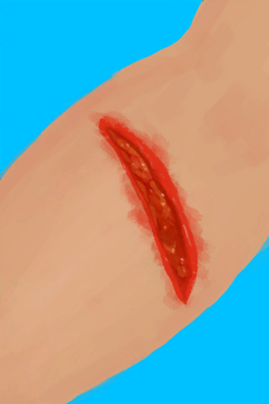
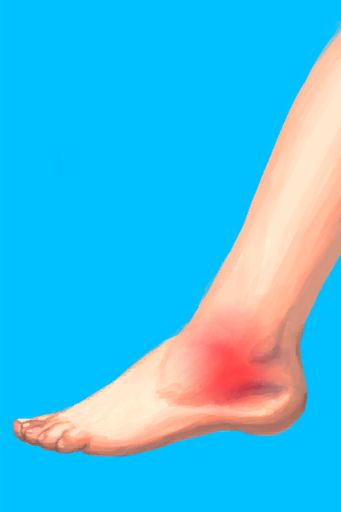
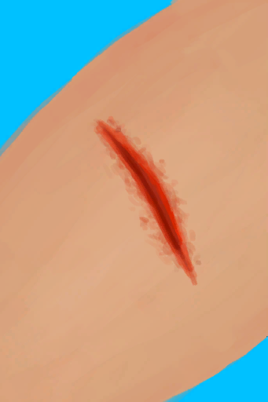
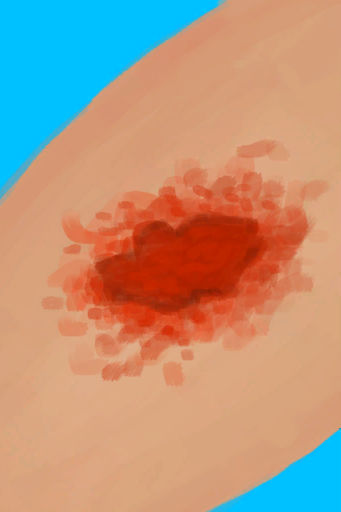

# 野猪伤到了我！  
> 我应该尽早处理伤口……  
  
<table class="table table-bordered table6718" data-toggle="table"  data-show-header="false"><thead style="display:none"><tr ><th  style="width:50%;"  data-sortable="true"  >title</th><th  style="width:50%;"  ></th></tr></thead><tr ><td  style="width:50%;"  ></td><td  style="width:50%;"  >

<a href="Event_BoarWoundMinor.md" style="color:black">野猪伤到了我！</a>

</td></tr></tbody></table>  
  
## 获取来源  

继续

[我拿下它了，但我受伤了。(事件)](Event_BoarFightMixedSuccess.md)

  
  
## 动作  

<table><tr><td rowspan="2" style="width:200px;text-align:center;font-size:1.3em;font-weight:bold">

真不错

</td><td></td></tr><tr><td><b>自身：</b>→消失</td></tr><tr><td colspan="2"><b>相关卡牌变化：</b>[眼镜](Glasses.md)可用次数  <b>-10</b></td></tr><tr><td colspan="2"><b>状态变化：</b>[

[污垢](Filth.md)](Filth.md)<b>+30</b></td></tr><tr><td colspan="2">

<table style="margin-bottom:3px;"><tr><td rowspan=2 style="text-align:center" width="80px">
基础权重

1
</td><td style="font-size:0.6em;line-height:0.6em;font-weight:bold">Arm Fracture R</td></tr><tr><td>[

[右臂骨折](W_ArmFractureR.md)](W_ArmFractureR.md)(<b>+1</b>)</td></tr></table>

<table style="margin-bottom:3px;"><tr><td rowspan=2 style="text-align:center" width="80px">
基础权重

1
</td><td style="font-size:0.6em;line-height:0.6em;font-weight:bold">Arm Sprain R</td></tr><tr><td>[

[右手腕扭伤](W_ArmSprainedR.md)](W_ArmSprainedR.md)(<b>+1</b>)</td></tr></table>

<table style="margin-bottom:3px;"><tr><td rowspan=2 style="text-align:center" width="80px">
基础权重

2
</td><td style="font-size:0.6em;line-height:0.6em;font-weight:bold">Arm Laceration R</td></tr><tr><td>[

[右臂撕裂伤](W_ArmLacerationR.md)](W_ArmLacerationR.md)(<b>+1</b>)</td></tr></table>

<table style="margin-bottom:3px;"><tr><td rowspan=2 style="text-align:center" width="80px">
基础权重

1
</td><td style="font-size:0.6em;line-height:0.6em;font-weight:bold">Arm Fracture L</td></tr><tr><td>[

[左臂骨折](W_ArmFractureL.md)](W_ArmFractureL.md)(<b>+1</b>)</td></tr></table>

<table style="margin-bottom:3px;"><tr><td rowspan=2 style="text-align:center" width="80px">
基础权重

1
</td><td style="font-size:0.6em;line-height:0.6em;font-weight:bold">Arm Sprain L</td></tr><tr><td>[

[左手腕扭伤](W_ArmSprainedL.md)](W_ArmSprainedL.md)(<b>+1</b>)</td></tr></table>

<table style="margin-bottom:3px;"><tr><td rowspan=2 style="text-align:center" width="80px">
基础权重

2
</td><td style="font-size:0.6em;line-height:0.6em;font-weight:bold">Arm Laceration L</td></tr><tr><td>[

[左臂撕裂伤](W_ArmLacerationL.md)](W_ArmLacerationL.md)(<b>+1</b>)</td></tr></table>

<table style="margin-bottom:3px;"><tr><td rowspan=2 style="text-align:center" width="80px">
基础权重

1
</td><td style="font-size:0.6em;line-height:0.6em;font-weight:bold">Leg Fracture R</td></tr><tr><td>[

[右腿骨折](W_LegFractureR.md)](W_LegFractureR.md)(<b>+1</b>)</td></tr></table>

<table style="margin-bottom:3px;"><tr><td rowspan=2 style="text-align:center" width="80px">
基础权重

1
</td><td style="font-size:0.6em;line-height:0.6em;font-weight:bold">Leg Sprain R</td></tr><tr><td>[

[右脚踝扭伤](W_LegSprainedR.md)](W_LegSprainedR.md)(<b>+1</b>)</td></tr></table>

<table style="margin-bottom:3px;"><tr><td rowspan=2 style="text-align:center" width="80px">
基础权重

2
</td><td style="font-size:0.6em;line-height:0.6em;font-weight:bold">Leg Laceration R</td></tr><tr><td>[

[右腿撕裂伤](W_LegLacerationR.md)](W_LegLacerationR.md)(<b>+1</b>)</td></tr></table>

<table style="margin-bottom:3px;"><tr><td rowspan=2 style="text-align:center" width="80px">
基础权重

1
</td><td style="font-size:0.6em;line-height:0.6em;font-weight:bold">Leg Fracture L</td></tr><tr><td>[

[左腿骨折](W_LegFractureL.md)](W_LegFractureL.md)(<b>+1</b>)</td></tr></table>

<table style="margin-bottom:3px;"><tr><td rowspan=2 style="text-align:center" width="80px">
基础权重

1
</td><td style="font-size:0.6em;line-height:0.6em;font-weight:bold">Leg Sprain L</td></tr><tr><td>[

[左脚踝扭伤](W_LegSprainedL.md)](W_LegSprainedL.md)(<b>+1</b>)</td></tr></table>

<table style="margin-bottom:3px;"><tr><td rowspan=2 style="text-align:center" width="80px">
基础权重

2
</td><td style="font-size:0.6em;line-height:0.6em;font-weight:bold">Leg Laceration L</td></tr><tr><td>[

[左腿撕裂伤](W_LegLacerationL.md)](W_LegLacerationL.md)(<b>+1</b>)</td></tr></table>

<table style="margin-bottom:3px;"><tr><td rowspan=2 style="text-align:center" width="80px">
基础权重

2
</td><td style="font-size:0.6em;line-height:0.6em;font-weight:bold">Minor Laceration</td></tr><tr><td>[

[轻微撕裂伤](W_MinorLaceration.md)](W_MinorLaceration.md)(<b>+1</b>)</td></tr></table>

<table style="margin-bottom:3px;"><tr><td rowspan=2 style="text-align:center" width="80px">
基础权重

2
</td><td style="font-size:0.6em;line-height:0.6em;font-weight:bold">Abrasion</td></tr><tr><td>[

[擦伤](W_Abrasion.md)](W_Abrasion.md)(<b>+1</b>)</td></tr></table>

</td></tr></table>
  
  
  

