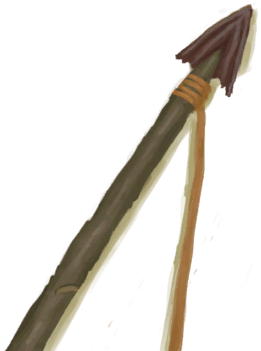

# 喷毒眼镜蛇！  
> 我应该攻击它还是不管它？  
  
<table class="table table-bordered" data-toggle="table"  data-show-header="false"><thead style="display:none"><tr ><th  style="width:50%;text-align:left;vertical-align:top;"  >title</th><th  style="width:50%;text-align:left;vertical-align:top;"  ></th></tr></thead><tr ><td  style="width:50%;text-align:left;vertical-align:top;"  >**标签：**	[“战斗事件”](tag_FightEvent.md)</td><td  style="width:50%;text-align:left;vertical-align:top;"  >

<a href="Event_CobraFight.md" style="color:black">喷毒眼镜蛇！</a>

</td></tr></tbody></table>  
  
## 获取来源  

探索

[东部草原](GrasslandsE.md)

探索

[西部草原](GrasslandsW.md)

探索

[东部高地](HighlandsEastern.md)

探索

[西部高地](HighlandsWestern.md)

  
  
## 动作  

<table><tr><td rowspan="2" style="width:200px;text-align:center;font-size:1.5em;font-weight:bold">

用长矛攻击！

30分

</td><td></td></tr><tr><td><b>自身：</b>→消失</td></tr><tr><td colspan="2"><b>需求：</b>[“一级矛”](tag_Spear.md)存在于手中/身上(部分)</td></tr><tr><td colspan="2"><b>相关卡牌变化：</b>[“一级矛”](tag_Spear.md)可用次数  -5</td></tr><tr><td colspan="2"><b>状态变化：</b>[

[矛战(技能)](Skill_SpearFighting.md)](Skill_SpearFighting.md)+1</td></tr><tr><td colspan="2">

<table style="margin-bottom:3px;"><tr><td rowspan=2 style="text-align:center" width="80px">
基础权重

10
</td><td style="font-size:0.6em;line-height:0.6em;font-weight:bold">Success</td></tr><tr><td>[

[成功！(事件)](Event_CobraFightSuccess.md)](Event_CobraFightSuccess.md)(+1)</td></tr><tr><td colspan=2><li>[

[矛战(技能)](Skill_SpearFighting.md)](Skill_SpearFighting.md)为0～150时权重限定为+0～+150</li><li>[攀爬动作受限](ModifierClimb.md)为0～3时权重限定为+0～-125</li><li>[

[燧石长矛](SpearFlint.md)](SpearFlint.md)存在于*手中/身上*，权重+10</li><li>[

[铜长矛](SpearCopper.md)](SpearCopper.md)存在于*手中/身上*，权重+20</li><li>[

[废金属长矛](SpearScrap.md)](SpearScrap.md)存在于*手中/身上*，权重+20</li><li>[

[黑曜石长矛](SpearObsidian.md)](SpearObsidian.md)存在于*手中/身上*，权重+25</li><li>[

[忠犬朋友](DogFriend.md)](DogFriend.md)存在于*手中/面板*，权重+25</li></td></tr></table>

<table style="margin-bottom:3px;"><tr><td rowspan=2 style="text-align:center" width="80px">
基础权重

20
</td><td style="font-size:0.6em;line-height:0.6em;font-weight:bold">Mixed Success</td></tr><tr><td>[

[胜负参半(事件)](Event_CobraFightMixedSuccess.md)](Event_CobraFightMixedSuccess.md)(+1)</td></tr><tr><td colspan=2><li>[

[矛战(技能)](Skill_SpearFighting.md)](Skill_SpearFighting.md)为0～100时权重限定为+0～+75</li><li>[攀爬动作受限](ModifierClimb.md)为0～3时权重限定为+0～-60</li><li>[

[燧石长矛](SpearFlint.md)](SpearFlint.md)存在于*手中/身上*，权重+10</li><li>[

[铜长矛](SpearCopper.md)](SpearCopper.md)存在于*手中/身上*，权重+20</li><li>[

[废金属长矛](SpearScrap.md)](SpearScrap.md)存在于*手中/身上*，权重+20</li><li>[

[黑曜石长矛](SpearObsidian.md)](SpearObsidian.md)存在于*手中/身上*，权重+25</li><li>[

[眼镜](Glasses.md)](Glasses.md)存在于*手中/面板*，权重-50</li><li>[

[盾牌](Shield.md)](Shield.md)存在于*手中/身上*，权重-10</li></td></tr></table>

<table style="margin-bottom:3px;"><tr><td rowspan=2 style="text-align:center" width="80px">
基础权重

20
</td><td style="font-size:0.6em;line-height:0.6em;font-weight:bold">Failure</td></tr><tr><td>[

[它逃跑了！(事件)](Event_CobraFightFailure.md)](Event_CobraFightFailure.md)(+1)</td></tr></table>

<table style="margin-bottom:3px;"><tr><td rowspan=2 style="text-align:center" width="80px">
基础权重

20
</td><td style="font-size:0.6em;line-height:0.6em;font-weight:bold">Bad Failure</td></tr><tr><td>[

[我被它伤到了……(事件)](Event_CobraFightBadFailure.md)](Event_CobraFightBadFailure.md)(+1)</td></tr><tr><td colspan=2><li>[

[眼镜](Glasses.md)](Glasses.md)存在于*手中/面板*，权重-15</li><li>[

[盾牌](Shield.md)](Shield.md)存在于*手中/身上*，权重-10</li></td></tr></table>

</td></tr></table>
  

<table><tr><td rowspan="2" style="width:200px;text-align:center;font-size:1.5em;font-weight:bold">

用弓箭攻击！

30分

</td><td></td></tr><tr><td><b>自身：</b>→消失</td></tr><tr><td colspan="2"><b>需求：</b>[

[简易的弓](BowRustic.md)](BowRustic.md)存在于手中/身上, [

[简易箭矢](ArrowSimple.md)](ArrowSimple.md)存在于手中</td></tr><tr><td colspan="2"><b>相关卡牌变化：</b>[简易的弓](BowRustic.md)可用次数  -1, [简易箭矢](ArrowSimple.md)可用次数  -3～-1</td></tr><tr><td colspan="2"><b>状态变化：</b>[

[箭术(技能)](Skill_Archery.md)](Skill_Archery.md)+1</td></tr><tr><td colspan="2">

<table style="margin-bottom:3px;"><tr><td rowspan=2 style="text-align:center" width="80px">
基础权重

15
</td><td style="font-size:0.6em;line-height:0.6em;font-weight:bold">Success</td></tr><tr><td>[

[成功！(事件)](Event_CobraFightSuccess.md)](Event_CobraFightSuccess.md)(+1)</td></tr><tr><td colspan=2><li>[

[箭术(技能)](Skill_Archery.md)](Skill_Archery.md)为0～150时权重限定为+0～+150</li><li>[攀爬动作受限](ModifierClimb.md)为0～3时权重限定为+0～-125</li><li>[

[视力](Myopia.md)](Myopia.md)为0～3时权重限定为+0～-100</li><li>[

[忠犬朋友](DogFriend.md)](DogFriend.md)存在于*手中/面板*，权重+25</li></td></tr></table>

<table style="margin-bottom:3px;"><tr><td rowspan=2 style="text-align:center" width="80px">
基础权重

15
</td><td style="font-size:0.6em;line-height:0.6em;font-weight:bold">Mixed Success</td></tr><tr><td>[

[胜负参半(事件)](Event_CobraFightMixedSuccess.md)](Event_CobraFightMixedSuccess.md)(+1)</td></tr><tr><td colspan=2><li>[

[箭术(技能)](Skill_Archery.md)](Skill_Archery.md)为0～100时权重限定为+0～+75</li><li>[攀爬动作受限](ModifierClimb.md)为0～3时权重限定为+0～-60</li><li>[

[眼镜](Glasses.md)](Glasses.md)存在于*手中/面板*，权重-50</li></td></tr></table>

<table style="margin-bottom:3px;"><tr><td rowspan=2 style="text-align:center" width="80px">
基础权重

40
</td><td style="font-size:0.6em;line-height:0.6em;font-weight:bold">Failure</td></tr><tr><td>[

[它逃跑了！(事件)](Event_CobraFightFailure.md)](Event_CobraFightFailure.md)(+1)</td></tr></table>

<table style="margin-bottom:3px;"><tr><td rowspan=2 style="text-align:center" width="80px">
基础权重

10
</td><td style="font-size:0.6em;line-height:0.6em;font-weight:bold">Bad Failure</td></tr><tr><td>[

[我被它伤到了……(事件)](Event_CobraFightBadFailure.md)](Event_CobraFightBadFailure.md)(+1)</td></tr><tr><td colspan=2><li>[

[眼镜](Glasses.md)](Glasses.md)存在于*手中/面板*，权重-7</li></td></tr></table>

</td></tr></table>
  

<table><tr><td rowspan="2" style="width:200px;text-align:center;font-size:1.5em;font-weight:bold">

用枪攻击！

30分

</td><td></td></tr><tr><td><b>自身：</b>→消失</td></tr><tr><td colspan="2"><b>需求：</b>[

[枪](Gun.md)](Gun.md)存在于手中</td></tr><tr><td colspan="2"><b>相关卡牌变化：</b>[枪](Gun.md)可用次数  -1</td></tr><tr><td colspan="2"><b>状态变化：</b>[

[手枪(技能)](Skill_Handguns.md)](Skill_Handguns.md)+1</td></tr><tr><td colspan="2">

<table style="margin-bottom:3px;"><tr><td rowspan=2 style="text-align:center" width="80px">
基础权重

50
</td><td style="font-size:0.6em;line-height:0.6em;font-weight:bold">Success</td></tr><tr><td>[

[成功！(事件)](Event_CobraFightSuccess.md)](Event_CobraFightSuccess.md)(+1)</td></tr><tr><td colspan=2><li>[

[手枪(技能)](Skill_Handguns.md)](Skill_Handguns.md)为0～150时权重限定为+0～+150</li><li>[手部动作受限](ModifierHand.md)为0～3时权重限定为+0～-125</li><li>[

[视力](Myopia.md)](Myopia.md)为0～3时权重限定为+0～-100</li><li>[

[忠犬朋友](DogFriend.md)](DogFriend.md)存在于*手中/面板*，权重+25</li></td></tr></table>

<table style="margin-bottom:3px;"><tr><td rowspan=2 style="text-align:center" width="80px">
基础权重

20
</td><td style="font-size:0.6em;line-height:0.6em;font-weight:bold">Mixed Success</td></tr><tr><td>[

[胜负参半(事件)](Event_CobraFightMixedSuccess.md)](Event_CobraFightMixedSuccess.md)(+1)</td></tr><tr><td colspan=2><li>[

[手枪(技能)](Skill_Handguns.md)](Skill_Handguns.md)为0～100时权重限定为+0～+75</li><li>[手部动作受限](ModifierHand.md)为0～3时权重限定为+0～-60</li><li>[

[眼镜](Glasses.md)](Glasses.md)存在于*手中/面板*，权重-15</li></td></tr></table>

<table style="margin-bottom:3px;"><tr><td rowspan=2 style="text-align:center" width="80px">
基础权重

40
</td><td style="font-size:0.6em;line-height:0.6em;font-weight:bold">Failure</td></tr><tr><td>[

[它逃跑了！(事件)](Event_MonitorFightFailure.md)](Event_MonitorFightFailure.md)(+1)</td></tr></table>

<table style="margin-bottom:3px;"><tr><td rowspan=2 style="text-align:center" width="80px">
基础权重

10
</td><td style="font-size:0.6em;line-height:0.6em;font-weight:bold">Bad Failure</td></tr><tr><td>[

[我被它伤到了……(事件)](Event_CobraFightBadFailure.md)](Event_CobraFightBadFailure.md)(+1)</td></tr><tr><td colspan=2><li>[

[眼镜](Glasses.md)](Glasses.md)存在于*手中/面板*，权重-7</li></td></tr></table>

</td></tr></table>
  

<table><tr><td rowspan="2" style="width:200px;text-align:center;font-size:1.5em;font-weight:bold">

用投石索攻击！

30分

</td><td></td></tr><tr><td><b>自身：</b>→消失</td></tr><tr><td colspan="2"><b>需求：</b>[

[投石索](Sling.md)](Sling.md)存在于手中</td></tr><tr><td colspan="2"><b>相关卡牌变化：</b>[投石索](Sling.md)可用次数  -1</td></tr><tr><td colspan="2"><b>状态变化：</b>[

[投石索(技能)](Skill_Sling.md)](Skill_Sling.md)+1</td></tr><tr><td colspan="2">

<table style="margin-bottom:3px;"><tr><td rowspan=2 style="text-align:center" width="80px">
基础权重

10
</td><td style="font-size:0.6em;line-height:0.6em;font-weight:bold">Success</td></tr><tr><td>[

[成功！(事件)](Event_CobraFightSuccess.md)](Event_CobraFightSuccess.md)(+1)</td></tr><tr><td colspan=2><li>[

[投石索(技能)](Skill_Sling.md)](Skill_Sling.md)为0～150时权重限定为+0～+150</li><li>[手部动作受限](ModifierHand.md)为0～3时权重限定为+0～-125</li><li>[

[视力](Myopia.md)](Myopia.md)为0～3时权重限定为+0～-100</li><li>[

[忠犬朋友](DogFriend.md)](DogFriend.md)存在于*手中/面板*，权重+25</li></td></tr></table>

<table style="margin-bottom:3px;"><tr><td rowspan=2 style="text-align:center" width="80px">
基础权重

20
</td><td style="font-size:0.6em;line-height:0.6em;font-weight:bold">Mixed Success</td></tr><tr><td>[

[胜负参半(事件)](Event_CobraFightMixedSuccess.md)](Event_CobraFightMixedSuccess.md)(+1)</td></tr><tr><td colspan=2><li>[

[手枪(技能)](Skill_Handguns.md)](Skill_Handguns.md)为0～100时权重限定为+0～+75</li><li>[手部动作受限](ModifierHand.md)为0～3时权重限定为+0～-60</li><li>[

[眼镜](Glasses.md)](Glasses.md)存在于*手中/面板*，权重-15</li></td></tr></table>

<table style="margin-bottom:3px;"><tr><td rowspan=2 style="text-align:center" width="80px">
基础权重

30
</td><td style="font-size:0.6em;line-height:0.6em;font-weight:bold">Failure</td></tr><tr><td>[

[它逃跑了！(事件)](Event_CobraFightFailure.md)](Event_CobraFightFailure.md)(+1)</td></tr></table>

<table style="margin-bottom:3px;"><tr><td rowspan=2 style="text-align:center" width="80px">
基础权重

30
</td><td style="font-size:0.6em;line-height:0.6em;font-weight:bold">Bad Failure</td></tr><tr><td>[

[我被它伤到了……(事件)](Event_CobraFightBadFailure.md)](Event_CobraFightBadFailure.md)(+1)</td></tr><tr><td colspan=2><li>[

[眼镜](Glasses.md)](Glasses.md)存在于*手中/面板*，权重-25</li></td></tr></table>

</td></tr></table>
  

<table><tr><td rowspan="2" style="width:200px;text-align:center;font-size:1.5em;font-weight:bold">

撤退

15分

</td><td></td></tr><tr><td><b>自身：</b>→消失</td></tr><tr><td colspan="2"><b>状态变化：</b>[

[潜行(技能)](Skill_Stealth.md)](Skill_Stealth.md)+1</td></tr><tr><td colspan="2">

<table style="margin-bottom:3px;"><tr><td rowspan=2 style="text-align:center" width="80px">
基础权重

50
</td><td style="font-size:0.6em;line-height:0.6em;font-weight:bold">Success</td></tr><tr><td></td></tr><tr><td colspan=2><li>[

[潜行(技能)](Skill_Stealth.md)](Skill_Stealth.md)为1～150时权重+1～+250</li><li>[

[盾牌](Shield.md)](Shield.md)存在于*手中/身上*，权重+100</li><li>[

[忠犬朋友](DogFriend.md)](DogFriend.md)存在于*手中/面板*，权重+100</li></td></tr></table>

<table style="margin-bottom:3px;"><tr><td rowspan=2 style="text-align:center" width="80px">
基础权重

50
</td><td style="font-size:0.6em;line-height:0.6em;font-weight:bold">Failure</td></tr><tr><td>[

[那条眼镜蛇喷射了毒液！(事件)](Event_CobraFightFailedRetreat.md)](Event_CobraFightFailedRetreat.md)(+1)</td></tr></table>

</td></tr></table>
  
  
  

