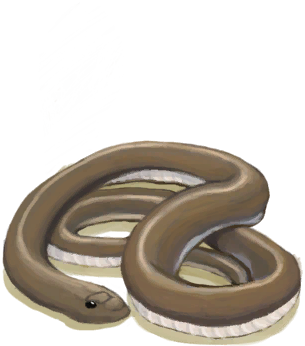

# 胜负参半  
> 我干掉了那条眼镜蛇，但它的毒液喷到了我的眼睛里。  
  
<table class="table table-bordered" data-toggle="table"  data-show-header="false"><thead style="display:none"><tr ><th  style="width:50%;text-align:left;vertical-align:top;"  data-sortable="true"  >title</th><th  style="width:50%;text-align:left;vertical-align:top;"  ></th></tr></thead><tr ><td  style="width:50%;text-align:left;vertical-align:top;"  ></td><td  style="width:50%;text-align:left;vertical-align:top;"  >

<a href="Event_CobraFightMixedSuccess.md" style="color:black">胜负参半</a>

</td></tr></tbody></table>  
  
## 获取来源  

用长矛攻击！

[喷毒眼镜蛇！(事件)](Event_CobraFight.md)

用弓箭攻击！

[喷毒眼镜蛇！(事件)](Event_CobraFight.md)

用枪攻击！

[喷毒眼镜蛇！(事件)](Event_CobraFight.md)

用投石索攻击！

[喷毒眼镜蛇！(事件)](Event_CobraFight.md)

  
  
## 动作  

<table><tr><td rowspan="2" style="width:200px;text-align:center;font-size:1.3em;font-weight:bold">

继续

</td><td></td></tr><tr><td><b>自身：</b>→消失</td></tr><tr><td colspan="2"><b>状态变化：</b>[眼镜蛇种群数量](Pop_Cobra.md)<b>-1000</b></td></tr><tr><td colspan="2">[

[眼镜蛇毒液](W_CobraSpit.md)](W_CobraSpit.md)(<b>+1</b>), [

[眼镜蛇尸体](CobraDead.md)](CobraDead.md)(<b>+1</b>)</td></tr></table>
  
  
  

