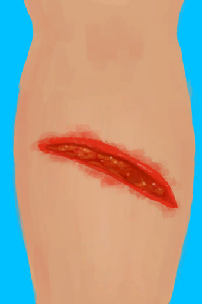

# 无人机伤到了我！  
> 我应该尽早处理伤口……  
  
<table class="table table-bordered" data-toggle="table"  data-show-header="false"><thead style="display:none"><tr ><th  style="width:50%;text-align:left;vertical-align:top;"  data-sortable="true"  >title</th><th  style="width:50%;text-align:left;vertical-align:top;"  ></th></tr></thead><tr ><td  style="width:50%;text-align:left;vertical-align:top;"  ></td><td  style="width:50%;text-align:left;vertical-align:top;"  >

<a href="Event_DroneWoundMajor.md" style="color:black">无人机伤到了我！</a>

</td></tr></tbody></table>  
  
## 获取来源  
<table class="table table-bordered" data-toggle="table"  ><thead style=""><tr ><th  style="text-align:left;vertical-align:top;"  >来源</th><th  style="text-align:left;vertical-align:top;"  >操作</th></tr></thead><tr ><td  style="text-align:left;vertical-align:top;"  >[

[我被它伤到了……(事件)](Event_DroneFightBadFailure.md)](Event_DroneFightBadFailure.md)</td><td  style="text-align:left;vertical-align:top;"  >继续</td></tr></tbody></table>  
  
## 动作  
<table class="table table-bordered" data-toggle="table"  ><thead style=""><tr ><th  style="text-align:left;vertical-align:top;"  >动作</th><th  style="text-align:left;vertical-align:top;"  data-sortable="true"  >耗时</th><th  style="text-align:left;vertical-align:top;"  data-sortable="true"  >条件</th><th  style="text-align:left;vertical-align:top;"  >变化</th><th  style="text-align:left;vertical-align:top;"  >状态</th></tr></thead><tr ><td  style="text-align:left;vertical-align:top;"  >真他妈不错 </td><td  style="text-align:left;vertical-align:top;"  >-</td><td  style="text-align:left;vertical-align:top;"  ></td><td  style="text-align:left;vertical-align:top;"  >** 自身：** →消失  ** 获得： ** ** [Arm Laceration R]  **   [

[右臂撕裂伤](W_ArmLacerationR.md)](W_ArmLacerationR.md)(+1) 基础权重：2 ** [Arm Laceration L]  **   [

[左臂撕裂伤](W_ArmLacerationL.md)](W_ArmLacerationL.md)(+1) 基础权重：2 ** [Leg Laceration R]  **   [

[右腿撕裂伤](W_LegLacerationR.md)](W_LegLacerationR.md)(+1) 基础权重：2 ** [Leg Laceration L]  **   [

[左腿撕裂伤](W_LegLacerationL.md)](W_LegLacerationL.md)(+1) 基础权重：2  ** 相关卡牌 ** [眼镜](Glasses.md)可用次数  -10</td><td  style="text-align:left;vertical-align:top;"  >[

[污垢](Filth.md)](Filth.md)+30</td></tr></tbody></table>  
  

