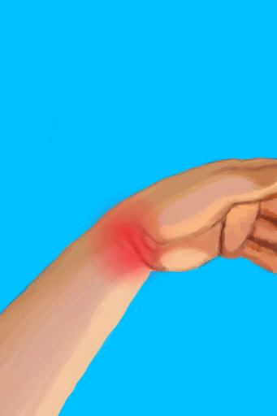

# 坠落！  
> 你摔了下去还扭伤了…真疼。  
  
<table class="table table-bordered"><tbody><tr ><td  style="width:80%;text-align:left;vertical-align:top;" ></td><td  style="width:20%;text-align:left;vertical-align:top;" >

</td></tr></tbody></tbody></table>  
  
## 获取来源  
<table class="table table-bordered"><thead><tr ><th  style="text-align:left;vertical-align:top;" >来源</th><th  style="text-align:left;vertical-align:top;" >操作</th></tr></thead><tr ><td  style="text-align:left;vertical-align:top;" >[

[滑倒了！(事件)](Event_SlipRocks.md)](Event_SlipRocks.md)</td><td  style="text-align:left;vertical-align:top;" >……</td></tr><tr ><td  style="text-align:left;vertical-align:top;" >[

[竖井(洞穴上层)](ShaftCrystalChamberToFloodedChamber.md)](ShaftCrystalChamberToFloodedChamber.md)</td><td  style="text-align:left;vertical-align:top;" >爬下去</td></tr><tr ><td  style="text-align:left;vertical-align:top;" >[

[竖井](ShaftFloodedChamberToCrystalChamber.md)](ShaftFloodedChamberToCrystalChamber.md)</td><td  style="text-align:left;vertical-align:top;" >爬上去</td></tr><tr ><td  style="text-align:left;vertical-align:top;" >[

[竖井(洞穴上层)](ShaftHighChamberToMidChamber.md)](ShaftHighChamberToMidChamber.md)</td><td  style="text-align:left;vertical-align:top;" >爬下去</td></tr><tr ><td  style="text-align:left;vertical-align:top;" >[

[竖井(洞穴中层)](ShaftLowChamberToMidChamber.md)](ShaftLowChamberToMidChamber.md)</td><td  style="text-align:left;vertical-align:top;" >爬上去</td></tr><tr ><td  style="text-align:left;vertical-align:top;" >[

[竖井](ShaftMidChamberToHighChamber.md)](ShaftMidChamberToHighChamber.md)</td><td  style="text-align:left;vertical-align:top;" >爬上去</td></tr><tr ><td  style="text-align:left;vertical-align:top;" >[

[竖井(洞穴中层)](ShaftMidChamberToLowChamber.md)](ShaftMidChamberToLowChamber.md)</td><td  style="text-align:left;vertical-align:top;" >爬下去</td></tr><tr ><td  style="text-align:left;vertical-align:top;" >[

[坑洞(西部高地)](HighlandHoleEntrance.md)](HighlandHoleEntrance.md)</td><td  style="text-align:left;vertical-align:top;" >爬下去</td></tr><tr ><td  style="text-align:left;vertical-align:top;" >[

[离开](HighlandHoleExit.md)](HighlandHoleExit.md)</td><td  style="text-align:left;vertical-align:top;" >爬上去</td></tr><tr ><td  style="text-align:left;vertical-align:top;" >[

[前往丛林高地(沙滩)](Path_CoveToJungleHighlands.md)](Path_CoveToJungleHighlands.md)</td><td  style="text-align:left;vertical-align:top;" >爬上去</td></tr><tr ><td  style="text-align:left;vertical-align:top;" >[

[前往隐秘港湾(丛林高地)](Path_JungleHighlandsToCove.md)](Path_JungleHighlandsToCove.md)</td><td  style="text-align:left;vertical-align:top;" >爬下去</td></tr><tr ><td  style="text-align:left;vertical-align:top;" >[

[前往山谷悬崖](Path_JungleHighlandsToValley.md)](Path_JungleHighlandsToValley.md)</td><td  style="text-align:left;vertical-align:top;" >爬下去</td></tr><tr ><td  style="text-align:left;vertical-align:top;" >[

[前往湿地悬崖](Path_JungleHighlandsToWetlands.md)](Path_JungleHighlandsToWetlands.md)</td><td  style="text-align:left;vertical-align:top;" >攀爬</td></tr><tr ><td  style="text-align:left;vertical-align:top;" >[

[前往丛林高地](Path_ValleyToJungleHighlands.md)](Path_ValleyToJungleHighlands.md)</td><td  style="text-align:left;vertical-align:top;" >爬上去</td></tr><tr ><td  style="text-align:left;vertical-align:top;" >[

[前往丛林高地(湿地)](Path_WetlandsToJungleHighlands.md)](Path_WetlandsToJungleHighlands.md)</td><td  style="text-align:left;vertical-align:top;" >爬上去</td></tr><tr ><td  style="text-align:left;vertical-align:top;" >[

[椰子树](PalmTreeNew.md)](PalmTreeNew.md)</td><td  style="text-align:left;vertical-align:top;" >爬树</td></tr><tr ><td  style="text-align:left;vertical-align:top;" >[

[椰子树(多事件旧)](PalmTreeNewMultiEventOld.md)](PalmTreeNewMultiEventOld.md)</td><td  style="text-align:left;vertical-align:top;" >爬树</td></tr><tr ><td  style="text-align:left;vertical-align:top;" >[

[椰子树(旧)](PalmTreeOld.md)](PalmTreeOld.md)</td><td  style="text-align:left;vertical-align:top;" >爬树</td></tr><tr ><td  style="text-align:left;vertical-align:top;" >[

[树液收集处](PalmTreeSapStation.md)](PalmTreeSapStation.md)</td><td  style="text-align:left;vertical-align:top;" >爬树</td></tr><tr ><td  style="text-align:left;vertical-align:top;" >[

[树液补给点(空)](PalmTreeSapStationEmpty.md)](PalmTreeSapStationEmpty.md)</td><td  style="text-align:left;vertical-align:top;" >爬树</td></tr></tbody></table>  
  
## 动作  
<table class="table table-bordered"><thead><tr ><th  style="text-align:left;vertical-align:top;" >动作</th><th  style="text-align:left;vertical-align:top;" >耗时</th><th  style="text-align:left;vertical-align:top;" >条件</th><th  style="text-align:left;vertical-align:top;" >变化</th><th  style="text-align:left;vertical-align:top;" >状态</th></tr></thead><tr ><td  style="text-align:left;vertical-align:top;" >真他妈不错 </td><td  style="text-align:left;vertical-align:top;" >-</td><td  style="text-align:left;vertical-align:top;" ></td><td  style="text-align:left;vertical-align:top;" >** 自身：** →消失  ** 获得： ** ** [Arm L]  **   [

[左手腕扭伤](W_ArmSprainedL.md)](W_ArmSprainedL.md)(+1) 基础权重：2 ** [Arm R]  **   [

[右手腕扭伤](W_ArmSprainedR.md)](W_ArmSprainedR.md)(+1) 基础权重：2 ** [Leg R]  **   [

[右脚踝扭伤](W_LegSprainedR.md)](W_LegSprainedR.md)(+1) 基础权重：1 ** [Leg L]  **   [

[左脚踝扭伤](W_LegSprainedL.md)](W_LegSprainedL.md)(+1) 基础权重：1  ** 相关卡牌 ** [眼镜](Glasses.md)可用次数  -10</td><td  style="text-align:left;vertical-align:top;" >[

[污垢](Filth.md)](Filth.md)+30</td></tr></tbody></table>  
  

