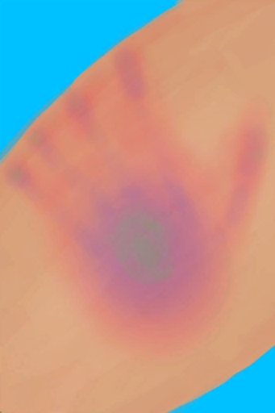

# 我没能逃掉！  
> 猎手将你逼入了绝境！祂伸出手攥住了你！  
  
<table class="table table-bordered" data-toggle="table"  data-show-header="false"><thead style="display:none"><tr ><th  style="width:50%;text-align:left;vertical-align:top;"  data-sortable="true"  >title</th><th  style="width:50%;text-align:left;vertical-align:top;"  ></th></tr></thead><tr ><td  style="width:50%;text-align:left;vertical-align:top;"  ></td><td  style="width:50%;text-align:left;vertical-align:top;"  >

<a href="Event_HunterFightFailedRetreat.md" style="color:black">我没能逃掉！</a>

</td></tr></tbody></table>  
  
## 获取来源  
<table class="table table-bordered" data-toggle="table"  ><thead style=""><tr ><th  style="text-align:left;vertical-align:top;"  >来源</th><th  style="text-align:left;vertical-align:top;"  >操作</th></tr></thead><tr ><td  style="text-align:left;vertical-align:top;"  >[

[猎手来了(事件)](Event_HunterFight.md)](Event_HunterFight.md)</td><td  style="text-align:left;vertical-align:top;"  >逃跑</td></tr></tbody></table>  
  
## 动作  
<table class="table table-bordered" data-toggle="table"  ><thead style=""><tr ><th  style="text-align:left;vertical-align:top;"  >动作</th><th  style="text-align:left;vertical-align:top;"  >耗时</th><th  style="text-align:left;vertical-align:top;"  data-sortable="true"  >条件</th><th  style="text-align:left;vertical-align:top;"  >变化</th><th  style="text-align:left;vertical-align:top;"  >状态</th></tr></thead><tr ><td  style="text-align:left;vertical-align:top;"  >闭眼 </td><td  style="text-align:left;vertical-align:top;"  >1小时</td><td  style="text-align:left;vertical-align:top;"  ></td><td  style="text-align:left;vertical-align:top;"  >** 自身：** →消失  ** 获得： ** ** [Mark]  **   [

[鬼掌印](W_HunterMark.md)](W_HunterMark.md)(+1)   ** 相关卡牌 ** [眼镜](Glasses.md)可用次数  -10</td><td  style="text-align:left;vertical-align:top;"  >[

[情绪](Morale.md)](Morale.md)-20 [

[猎手接近](HuntersProximity.md)](HuntersProximity.md)-9999</td></tr></tbody></table>  
  

