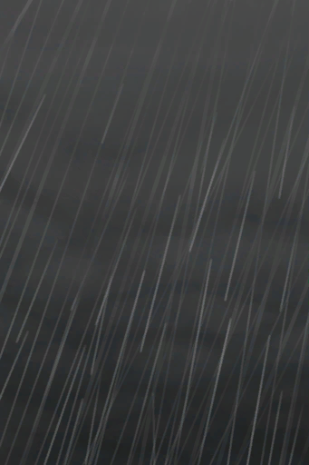

# 介绍  
> ……一场可怕的飓风摧毁了你祖父的农场，这个可怜的老人看起来不能更糟了。  一定要让他吃饱喝足，否则他可能撑不了多久了。  
  
<table class="table table-bordered table4723" data-toggle="table"  data-show-header="false"><thead style="display:none"><tr ><th  style="width:50%;"  data-sortable="true"  >title</th><th  style="width:50%;"  ></th></tr></thead><tr ><td  style="width:50%;"  ></td><td  style="width:50%;"  >

<a href="Event_IntroFarmer.md" style="color:black">介绍</a>

</td></tr></tbody></table>  
  
## 动作  

<table><tr><td rowspan="2" style="width:200px;text-align:center;font-size:1.3em;font-weight:bold">

让我们开始吧！

</td><td></td></tr><tr><td><b>自身：</b>→消失</td></tr></table>
  
  
  

