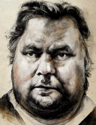

# 坠机  
> 当你慢慢睁开眼睛，你的大脑逐渐恢复了意识……飞机坠毁了！  你浑身疼痛，伤口在不停地流血！如果不想今天就直面死神的话，你需要立即采取措施。  
  
<table class="table table-bordered" data-toggle="table"  data-show-header="false"><thead style="display:none"><tr ><th  style="width:50%;text-align:left;vertical-align:top;"  data-sortable="true"  >title</th><th  style="width:50%;text-align:left;vertical-align:top;"  ></th></tr></thead><tr ><td  style="width:50%;text-align:left;vertical-align:top;"  ></td><td  style="width:50%;text-align:left;vertical-align:top;"  >

<a href="Event_IntroTourist1.md" style="color:black">坠机</a>

</td></tr></tbody></table>  
  
## 获取来源  

初始角色

[游客](Tourist.md)

  
  
## 动作  

<table><tr><td rowspan="2" style="width:200px;text-align:center;font-size:1.3em;font-weight:bold">

继续

</td><td></td></tr><tr><td><b>自身：</b>→消失</td></tr><tr><td colspan="2">[

[坠机(事件)](Event_IntroTourist2.md)](Event_IntroTourist2.md)(<b>+1</b>)</td></tr></table>
  
  
  

