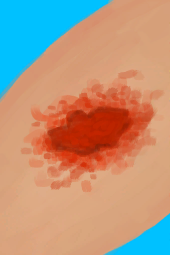

# 我进不去！  
> 猕猴们不让我进去，我没打赢它们！  
  
<table class="table table-bordered"><tbody><tr ><td  style="width:80%;text-align:left;vertical-align:top;" ></td><td  style="width:20%;text-align:left;vertical-align:top;" >

</td></tr></tbody></tbody></table>  
  
## 获取来源  
<table class="table table-bordered"><thead><tr ><th  style="text-align:left;vertical-align:top;" >来源</th><th  style="text-align:left;vertical-align:top;" >操作</th></tr></thead><tr ><td  style="text-align:left;vertical-align:top;" >[

[猕猴们攻击了你！(事件)](Event_MacaqueDenFight.md)](Event_MacaqueDenFight.md)</td><td  style="text-align:left;vertical-align:top;" >用长矛攻击！</td></tr><tr ><td  style="text-align:left;vertical-align:top;" >[

[猕猴们攻击了你！(事件)](Event_MacaqueDenFight.md)](Event_MacaqueDenFight.md)</td><td  style="text-align:left;vertical-align:top;" >用弓箭攻击！</td></tr><tr ><td  style="text-align:left;vertical-align:top;" >[

[猕猴们攻击了你！(事件)](Event_MacaqueDenFight.md)](Event_MacaqueDenFight.md)</td><td  style="text-align:left;vertical-align:top;" >用枪攻击！</td></tr><tr ><td  style="text-align:left;vertical-align:top;" >[

[猕猴们攻击了你！(事件)](Event_MacaqueDenFight.md)](Event_MacaqueDenFight.md)</td><td  style="text-align:left;vertical-align:top;" >用投石索攻击！</td></tr></tbody></table>  
  
## 动作  
<table class="table table-bordered"><thead><tr ><th  style="text-align:left;vertical-align:top;" >动作</th><th  style="text-align:left;vertical-align:top;" >耗时</th><th  style="text-align:left;vertical-align:top;" >条件</th><th  style="text-align:left;vertical-align:top;" >变化</th><th  style="text-align:left;vertical-align:top;" >状态</th></tr></thead><tr ><td  style="text-align:left;vertical-align:top;" >继续 </td><td  style="text-align:left;vertical-align:top;" >-</td><td  style="text-align:left;vertical-align:top;" ></td><td  style="text-align:left;vertical-align:top;" >** 自身：** →消失  ** 获得： ** ** [Wounds]  **   [

[猕猴咬伤](W_MacaqueBite.md)](W_MacaqueBite.md)(+0～+1)   [

[擦伤](W_Abrasion.md)](W_Abrasion.md)(+0～+2) </td><td  style="text-align:left;vertical-align:top;" >[

[情绪](Morale.md)](Morale.md)-10 [害怕猕猴](MacaqueFear.md)-500 [

[淤青](Bruising.md)](Bruising.md)+0～+200</td></tr></tbody></table>  
  

