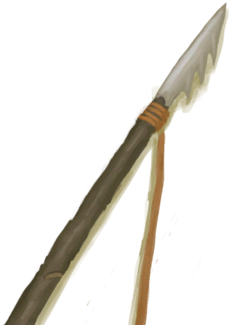
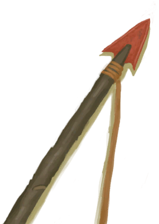
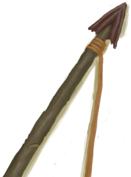
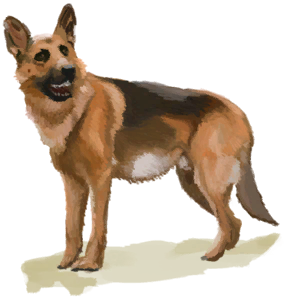
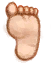
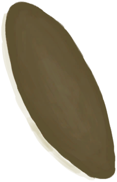
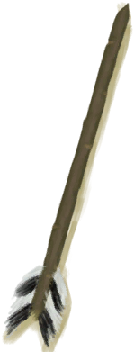
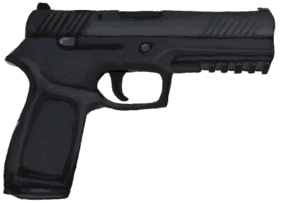

# 一只猕猴！  
> 我应该攻击它还是不管它？  
  
<table class="table table-bordered" data-toggle="table" ><tbody><tr ><td  style="width:80%;text-align:left;vertical-align:top;"  >**标签：**	[“战斗事件”](tag_FightEvent.md)</td><td  style="width:20%;text-align:left;vertical-align:top;"  >

</td></tr></tbody></tbody></table>  
  
## 获取来源  
<table class="table table-bordered" data-toggle="table" ><thead><tr ><th  style="text-align:left;vertical-align:top;"  >来源</th><th  style="text-align:left;vertical-align:top;"  >操作</th></tr></thead><tr ><td  style="text-align:left;vertical-align:top;"  >[

[丛林深处](DeepJungle.md)](DeepJungle.md)</td><td  style="text-align:left;vertical-align:top;"  >探索</td></tr><tr ><td  style="text-align:left;vertical-align:top;"  >[

[丛林](Jungle.md)](Jungle.md)</td><td  style="text-align:left;vertical-align:top;"  >探索</td></tr><tr ><td  style="text-align:left;vertical-align:top;"  >[

[丛林高地](JungleHighlands.md)](JungleHighlands.md)</td><td  style="text-align:left;vertical-align:top;"  >探索</td></tr><tr ><td  style="text-align:left;vertical-align:top;"  >[

[湿地丛林(湿地)](Wetlands.md)](Wetlands.md)</td><td  style="text-align:left;vertical-align:top;"  >探索</td></tr></tbody></table>  
  
## 动作  
<table class="table table-bordered" data-toggle="table" ><thead><tr ><th  style="text-align:left;vertical-align:top;"  >动作</th><th  style="text-align:left;vertical-align:top;"  >耗时</th><th  style="text-align:left;vertical-align:top;"  >条件</th><th  style="text-align:left;vertical-align:top;"  >变化</th><th  style="text-align:left;vertical-align:top;"  >状态</th></tr></thead><tr ><td  style="text-align:left;vertical-align:top;"  >用长矛攻击！ </td><td  style="text-align:left;vertical-align:top;"  >2TP</td><td  style="text-align:left;vertical-align:top;"  >[“一级矛”](tag_Spear.md)存在于手中/身上(部分)</td><td  style="text-align:left;vertical-align:top;"  >** 自身：** →消失  ** 获得： ** ** [Success]  **   [

[那只猕猴倒下了！(事件)](Event_MacaqueFightSuccess.md)](Event_MacaqueFightSuccess.md)(+1) 基础权重：10<li>[

[矛战(技能)](Skill_SpearFighting.md)](Skill_SpearFighting.md)为0～150时权重限定为+0～+150</li><li>[攀爬动作受限](ModifierClimb.md)为0～3时权重限定为+0～-125</li><li>[

[鱼镖](HarpoonBone.md)](HarpoonBone.md)存在于*手中/身上*，权重+10</li><li>[

[燧石长矛](SpearFlint.md)](SpearFlint.md)存在于*手中/身上*，权重+10</li><li>[

[铜长矛](SpearCopper.md)](SpearCopper.md)存在于*手中/身上*，权重+20</li><li>[

[废金属长矛](SpearScrap.md)](SpearScrap.md)存在于*手中/身上*，权重+20</li><li>[

[黑曜石长矛](SpearObsidian.md)](SpearObsidian.md)存在于*手中/身上*，权重+25</li><li>[

[忠犬朋友](DogFriend.md)](DogFriend.md)存在于*手中/面板*，权重+25</li> ** [Mixed Success]  **   [

[我拿下它了，但我受伤了。(事件)](Event_MacaqueFightMixedSuccess.md)](Event_MacaqueFightMixedSuccess.md)(+1) 基础权重：20<li>[

[矛战(技能)](Skill_SpearFighting.md)](Skill_SpearFighting.md)为0～150时权重限定为+0～+75</li><li>[攀爬动作受限](ModifierClimb.md)为0～3时权重限定为+0～-60</li><li>[

[腿部防护](LegProtection.md)](LegProtection.md)为1～10时权重-1～-15</li><li>[

[鱼镖](HarpoonBone.md)](HarpoonBone.md)存在于*手中/身上*，权重+10</li><li>[

[燧石长矛](SpearFlint.md)](SpearFlint.md)存在于*手中/身上*，权重+10</li><li>[

[铜长矛](SpearCopper.md)](SpearCopper.md)存在于*手中/身上*，权重+20</li><li>[

[废金属长矛](SpearScrap.md)](SpearScrap.md)存在于*手中/身上*，权重+20</li><li>[

[黑曜石长矛](SpearObsidian.md)](SpearObsidian.md)存在于*手中/身上*，权重+25</li><li>[

[盾牌](Shield.md)](Shield.md)存在于*手中/身上*，权重-10</li> ** [Failure]  **   [

[它逃跑了！(事件)](Event_MacaqueFightFailure.md)](Event_MacaqueFightFailure.md)(+1) 基础权重：60 ** [Bad Failure]  **   [

[啊！(事件)](Event_MacaqueFightBadFailure.md)](Event_MacaqueFightBadFailure.md)(+1) 基础权重：20<li>[

[腿部防护](LegProtection.md)](LegProtection.md)为1～10时权重-1～-15</li><li>[

[盾牌](Shield.md)](Shield.md)存在于*手中/身上*，权重-10</li>  ** 相关卡牌 ** [“一级矛”](tag_Spear.md)可用次数  -10～-5 ** 相关卡牌 ** [盾牌](Shield.md)可用次数  -5</td><td  style="text-align:left;vertical-align:top;"  >[

[矛战(技能)](Skill_SpearFighting.md)](Skill_SpearFighting.md)+1</td></tr><tr ><td  style="text-align:left;vertical-align:top;"  >用弓箭攻击！ </td><td  style="text-align:left;vertical-align:top;"  >2TP</td><td  style="text-align:left;vertical-align:top;"  >[

[简易的弓](BowRustic.md)](BowRustic.md)存在于手中/身上 [

[简易箭矢](ArrowSimple.md)](ArrowSimple.md)存在于手中</td><td  style="text-align:left;vertical-align:top;"  >** 自身：** →消失  ** 获得： ** ** [Success]  **   [

[那只猕猴倒下了！(事件)](Event_MacaqueFightSuccess.md)](Event_MacaqueFightSuccess.md)(+1) 基础权重：15<li>[

[箭术(技能)](Skill_Archery.md)](Skill_Archery.md)为0～150时权重限定为+0～+150</li><li>[攀爬动作受限](ModifierClimb.md)为0～3时权重限定为+0～-125</li><li>[

[视力](Myopia.md)](Myopia.md)为0～3时权重限定为+0～-100</li><li>[

[忠犬朋友](DogFriend.md)](DogFriend.md)存在于*手中/面板*，权重+25</li> ** [Mixed Success]  **   [

[我拿下它了，但我受伤了。(事件)](Event_MacaqueFightMixedSuccess.md)](Event_MacaqueFightMixedSuccess.md)(+1) 基础权重：10<li>[

[箭术(技能)](Skill_Archery.md)](Skill_Archery.md)为0～100时权重限定为+0～+75</li><li>[攀爬动作受限](ModifierClimb.md)为0～3时权重限定为+0～-60</li><li>[

[腿部防护](LegProtection.md)](LegProtection.md)为1～10时权重-1～-10</li> ** [Failure]  **   [

[它逃跑了！(事件)](Event_MacaqueFightFailure.md)](Event_MacaqueFightFailure.md)(+1) 基础权重：80 ** [Bad Failure]  **   [

[啊！(事件)](Event_MacaqueFightBadFailure.md)](Event_MacaqueFightBadFailure.md)(+1) 基础权重：5<li>[

[腿部防护](LegProtection.md)](LegProtection.md)为1～10时权重-1～-10</li>  ** 相关卡牌 ** [简易的弓](BowRustic.md)可用次数  -1 ** 相关卡牌 ** [简易箭矢](ArrowSimple.md)可用次数  -3～-1</td><td  style="text-align:left;vertical-align:top;"  >[

[箭术(技能)](Skill_Archery.md)](Skill_Archery.md)+1</td></tr><tr ><td  style="text-align:left;vertical-align:top;"  >用枪攻击！ </td><td  style="text-align:left;vertical-align:top;"  >2TP</td><td  style="text-align:left;vertical-align:top;"  >[

[枪](Gun.md)](Gun.md)存在于手中</td><td  style="text-align:left;vertical-align:top;"  >** 自身：** →消失  ** 获得： ** ** [Success]  **   [

[那只猕猴倒下了！(事件)](Event_MacaqueFightSuccess.md)](Event_MacaqueFightSuccess.md)(+1) 基础权重：50<li>[

[手枪(技能)](Skill_Handguns.md)](Skill_Handguns.md)为0～150时权重限定为+0～+150</li><li>[手部动作受限](ModifierHand.md)为0～3时权重限定为+0～-125</li><li>[

[视力](Myopia.md)](Myopia.md)为0～3时权重限定为+0～-100</li><li>[

[忠犬朋友](DogFriend.md)](DogFriend.md)存在于*手中/面板*，权重+25</li> ** [Mixed Success]  **   [

[我拿下它了，但我受伤了。(事件)](Event_MacaqueFightMixedSuccess.md)](Event_MacaqueFightMixedSuccess.md)(+1) 基础权重：20<li>[

[手枪(技能)](Skill_Handguns.md)](Skill_Handguns.md)为0～100时权重限定为+0～+75</li><li>[手部动作受限](ModifierHand.md)为0～3时权重限定为+0～-60</li><li>[

[腿部防护](LegProtection.md)](LegProtection.md)为1～10时权重-1～-15</li> ** [Failure]  **   [

[它逃跑了！(事件)](Event_MacaqueFightFailure.md)](Event_MacaqueFightFailure.md)(+1) 基础权重：60 ** [Bad Failure]  **   [

[啊！(事件)](Event_MacaqueFightBadFailure.md)](Event_MacaqueFightBadFailure.md)(+1) 基础权重：10<li>[

[腿部防护](LegProtection.md)](LegProtection.md)为1～10时权重-1～-10</li>  ** 相关卡牌 ** [枪](Gun.md)可用次数  -1</td><td  style="text-align:left;vertical-align:top;"  >[

[手枪(技能)](Skill_Handguns.md)](Skill_Handguns.md)+1</td></tr><tr ><td  style="text-align:left;vertical-align:top;"  >用投石索攻击！ </td><td  style="text-align:left;vertical-align:top;"  >2TP</td><td  style="text-align:left;vertical-align:top;"  >[

[投石索](Sling.md)](Sling.md)存在于手中</td><td  style="text-align:left;vertical-align:top;"  >** 自身：** →消失  ** 获得： ** ** [Success]  **   [

[那只猕猴倒下了！(事件)](Event_MacaqueFightSuccess.md)](Event_MacaqueFightSuccess.md)(+1) 基础权重：10<li>[

[投石索(技能)](Skill_Sling.md)](Skill_Sling.md)为0～150时权重限定为+0～+150</li><li>[手部动作受限](ModifierHand.md)为0～3时权重限定为+0～-125</li><li>[

[视力](Myopia.md)](Myopia.md)为0～3时权重限定为+0～-100</li><li>[

[忠犬朋友](DogFriend.md)](DogFriend.md)存在于*手中/面板*，权重+25</li> ** [Mixed Success]  **   [

[我拿下它了，但我受伤了。(事件)](Event_MacaqueFightMixedSuccess.md)](Event_MacaqueFightMixedSuccess.md)(+1) 基础权重：15<li>[

[手枪(技能)](Skill_Handguns.md)](Skill_Handguns.md)为0～100时权重限定为+0～+75</li><li>[手部动作受限](ModifierHand.md)为0～3时权重限定为+0～-60</li><li>[

[腿部防护](LegProtection.md)](LegProtection.md)为1～10时权重-1～-15</li> ** [Failure]  **   [

[它逃跑了！(事件)](Event_MacaqueFightFailure.md)](Event_MacaqueFightFailure.md)(+1) 基础权重：70 ** [Bad Failure]  **   [

[啊！(事件)](Event_MacaqueFightBadFailure.md)](Event_MacaqueFightBadFailure.md)(+1) 基础权重：15<li>[

[腿部防护](LegProtection.md)](LegProtection.md)为1～10时权重-1～-15</li>  ** 相关卡牌 ** [投石索](Sling.md)可用次数  -1</td><td  style="text-align:left;vertical-align:top;"  >[

[投石索(技能)](Skill_Sling.md)](Skill_Sling.md)+1</td></tr><tr ><td  style="text-align:left;vertical-align:top;"  >撤退 </td><td  style="text-align:left;vertical-align:top;"  >1TP</td><td  style="text-align:left;vertical-align:top;"  ></td><td  style="text-align:left;vertical-align:top;"  >** 自身：** →消失  ** 获得： ** ** [Success]  ** 基础权重：50<li>[

[腿部防护](LegProtection.md)](LegProtection.md)为1～10时权重+1～+100</li><li>[

[潜行(技能)](Skill_Stealth.md)](Skill_Stealth.md)为1～150时权重+1～+250</li><li>[

[盾牌](Shield.md)](Shield.md)存在于*手中/身上*，权重+100</li><li>[

[忠犬朋友](DogFriend.md)](DogFriend.md)存在于*手中/面板*，权重+50</li> ** [Failure]  **   [

[啊！(事件)](Event_MacaqueFightFailedRetreat.md)](Event_MacaqueFightFailedRetreat.md)(+1) 基础权重：5</td><td  style="text-align:left;vertical-align:top;"  >[

[潜行(技能)](Skill_Stealth.md)](Skill_Stealth.md)+1</td></tr></tbody></table>  
  

