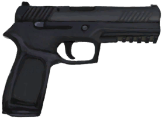

# 一只猕猴！  
> 我应该攻击它还是不管它？  
  
<table class="table table-bordered" data-toggle="table"  data-show-header="false"><thead style="display:none"><tr ><th  style="width:50%;text-align:left;vertical-align:top;"  >title</th><th  style="width:50%;text-align:left;vertical-align:top;"  ></th></tr></thead><tr ><td  style="width:50%;text-align:left;vertical-align:top;"  >**标签：**	[“战斗事件”](tag_FightEvent.md)</td><td  style="width:50%;text-align:left;vertical-align:top;"  >

<a href="Event_MacaqueFightRaid.md" style="color:black">一只猕猴！</a>

</td></tr></tbody></table>  
  
## 获取来源  

嘿！

[一只猕猴！(事件)](Event_MacaqueRaid.md)

  
  
## 动作  

<table><tr><td rowspan="2" style="width:200px;text-align:center;font-size:1.3em;font-weight:bold">

用长矛攻击！

30分

</td><td></td></tr><tr><td><b>自身：</b>→消失</td></tr><tr><td colspan="2"><b>需求：</b>[“一级矛”](tag_Spear.md)存在于手中/身上(部分)</td></tr><tr><td colspan="2"><b>相关卡牌变化：</b>[“一级矛”](tag_Spear.md)使用次数  <b>-10～-5</b>, [盾牌](Shield.md)可用次数  <b>-5</b></td></tr><tr><td colspan="2"><b>状态变化：</b>[

[矛战(技能)](Skill_SpearFighting.md)](Skill_SpearFighting.md)<b>+1</b></td></tr><tr><td colspan="2">

<table style="margin-bottom:3px;"><tr><td rowspan=2 style="text-align:center" width="80px">
基础权重

30
</td><td style="font-size:0.6em;line-height:0.6em;font-weight:bold">Escape</td></tr><tr><td>[

[我把猕猴吓跑了！(事件)](Event_MacaqueFightEscape.md)](Event_MacaqueFightEscape.md)(<b>+1</b>)[害怕猕猴](MacaqueFear.md)<b>+1000</b></td></tr><tr><td colspan=2><li>[

[矛战(技能)](Skill_SpearFighting.md)](Skill_SpearFighting.md)为<b>0～150</b>时权重限定为<b>+0～+150</b></li><li>[攀爬动作受限](ModifierClimb.md)为<b>0～3</b>时权重限定为<b>+0～-125</b></li>以下取最高1个：<li>[

[燧石长矛](SpearFlint.md)](SpearFlint.md)存在于*手中/身上*，权重<b>+10</b>,</li><li>[

[铜长矛](SpearCopper.md)](SpearCopper.md)存在于*手中/身上*，权重<b>+20</b>,</li><li>[

[废金属长矛](SpearScrap.md)](SpearScrap.md)存在于*手中/身上*，权重<b>+20</b>,</li><li>[

[黑曜石长矛](SpearObsidian.md)](SpearObsidian.md)存在于*手中/身上*，权重<b>+25</b>,</li></td></tr></table>

<table style="margin-bottom:3px;"><tr><td rowspan=2 style="text-align:center" width="80px">
基础权重

0
</td><td style="font-size:0.6em;line-height:0.6em;font-weight:bold">Success</td></tr><tr><td>[

[那只猕猴倒下了！(事件)](Event_MacaqueFightSuccess.md)](Event_MacaqueFightSuccess.md)(<b>+1</b>)[害怕猕猴](MacaqueFear.md)<b>+500</b></td></tr><tr><td colspan=2><li>[

[矛战(技能)](Skill_SpearFighting.md)](Skill_SpearFighting.md)为<b>0～150</b>时权重限定为<b>+0～+150</b></li><li>[攀爬动作受限](ModifierClimb.md)为<b>0～3</b>时权重限定为<b>+0～-125</b></li>以下取最高1个：<li>[

[燧石长矛](SpearFlint.md)](SpearFlint.md)存在于*手中/身上*，权重<b>+10</b>,</li><li>[

[铜长矛](SpearCopper.md)](SpearCopper.md)存在于*手中/身上*，权重<b>+20</b>,</li><li>[

[废金属长矛](SpearScrap.md)](SpearScrap.md)存在于*手中/身上*，权重<b>+20</b>,</li><li>[

[黑曜石长矛](SpearObsidian.md)](SpearObsidian.md)存在于*手中/身上*，权重<b>+25</b>,</li></td></tr></table>

<table style="margin-bottom:3px;"><tr><td rowspan=2 style="text-align:center" width="80px">
基础权重

15
</td><td style="font-size:0.6em;line-height:0.6em;font-weight:bold">Mixed Success</td></tr><tr><td>[

[我拿下它了，但我受伤了。(事件)](Event_MacaqueFightMixedSuccess.md)](Event_MacaqueFightMixedSuccess.md)(<b>+1</b>)[害怕猕猴](MacaqueFear.md)<b>+250</b></td></tr><tr><td colspan=2><li>[

[矛战(技能)](Skill_SpearFighting.md)](Skill_SpearFighting.md)为<b>0～150</b>时权重限定为<b>+0～+75</b></li><li>[攀爬动作受限](ModifierClimb.md)为<b>0～3</b>时权重限定为<b>+0～-60</b></li><li>[

[腿部防护](LegProtection.md)](LegProtection.md)为<b>1～10</b>时权重<b>-1～-15</b></li>以下取最高1个：<li>[

[燧石长矛](SpearFlint.md)](SpearFlint.md)存在于*手中/身上*，权重<b>+10</b>,</li><li>[

[铜长矛](SpearCopper.md)](SpearCopper.md)存在于*手中/身上*，权重<b>+20</b>,</li><li>[

[废金属长矛](SpearScrap.md)](SpearScrap.md)存在于*手中/身上*，权重<b>+20</b>,</li><li>[

[黑曜石长矛](SpearObsidian.md)](SpearObsidian.md)存在于*手中/身上*，权重<b>+25</b>,</li><li>[

[盾牌](Shield.md)](Shield.md)存在于*手中/身上*，权重<b>-10</b>,</li></td></tr></table>

<table style="margin-bottom:3px;"><tr><td rowspan=2 style="text-align:center" width="80px">
基础权重

80
</td><td style="font-size:0.6em;line-height:0.6em;font-weight:bold">Failure</td></tr><tr><td>[

[猕猴(事件)](Event_MacaqueRaidRummaging.md)](Event_MacaqueRaidRummaging.md)(<b>+1</b>), [

[它逃跑了！(事件)](Event_MacaqueFightFailure.md)](Event_MacaqueFightFailure.md)(<b>+1</b>)[害怕猕猴](MacaqueFear.md)<b>-500</b></td></tr></table>

<table style="margin-bottom:3px;"><tr><td rowspan=2 style="text-align:center" width="80px">
基础权重

30
</td><td style="font-size:0.6em;line-height:0.6em;font-weight:bold">Bad Failure</td></tr><tr><td>[

[猕猴(事件)](Event_MacaqueRaidRummaging.md)](Event_MacaqueRaidRummaging.md)(<b>+1</b>), [

[啊！(事件)](Event_MacaqueFightBadFailure.md)](Event_MacaqueFightBadFailure.md)(<b>+1</b>)[害怕猕猴](MacaqueFear.md)<b>-500</b></td></tr><tr><td colspan=2><li>[

[腿部防护](LegProtection.md)](LegProtection.md)为<b>1～10</b>时权重<b>-1～-15</b></li><li>[

[盾牌](Shield.md)](Shield.md)存在于*手中/身上*，权重<b>-10</b>,</li></td></tr></table>
<button class="btn btn-secondary btn-sm" style="" data-toggle="modal" onclick="setCollectionDataBase64('eyJ0aXRsZSI6IuamgueOh+aooeaLnzog55So6ZW/55+b5pS75Ye777yBICjkuIDlj6rnjJXnjLTvvIEpIiwiY29sbGVjdGlvbnMiOlt7ImRyb3AiOiI8ZGl2IHN0eWxlPVwid2lkdGg6MjVweDtkaXNwbGF5OmlubGluZS1ibG9jazt0ZXh0LWFsaWduOmNlbnRlclwiPjxpbWcgZGVjb2Rpbmc9XCJhc3luY1wiIHNyYz1cIi4uL3dpa2kvU3ByaXRlL01hY2FxdWVFdmVudC5wbmdcIiBocmVmPVwiYS5tZFwiIHN0eWxlPVwibWF4LXdpZHRoOjI1cHg7bWF4LWhlaWdodDoyNXB4O1wiPjwvZGl2PuaIkeaKiueMleeMtOWQk+i3keS6hu+8gSjkuovku7YpIiwiYmFzZSI6MzAsImNvbmRpdGlvbiI6W3sia2V5IjoiU2tpbGxfU3BlYXJGaWdodGluZyIsInRpdGxlIjoi55+b5oiYKOaKgOiDvSkiLCJ0eXBlIjoicmFuZ2UiLCJtYXgiOlswLDE1MF0sInJhbmdlIjpbMCwxNTBdLCJ3ZWlnaHQiOlswLDE1MF0sImRlZmF1bHRWYWx1ZSI6MCwid2hlbk91dE9mUmFuZ2UiOjF9LHsia2V5IjoiTW9kaWZpZXJDbGltYiIsInRpdGxlIjoi5pSA54is5Yqo5L2c5Y+X6ZmQIiwidHlwZSI6InJhbmdlIiwibWF4IjpbMCwzXSwicmFuZ2UiOlswLDNdLCJ3ZWlnaHQiOlswLC0xMjVdLCJkZWZhdWx0VmFsdWUiOjAsIndoZW5PdXRPZlJhbmdlIjoxfSx7ImtleSI6IlNwZWFyRmxpbnQiLCJ0aXRsZSI6IjxkaXYgc3R5bGU9XCJ3aWR0aDoyMHB4O2Rpc3BsYXk6aW5saW5lLWJsb2NrO3RleHQtYWxpZ246Y2VudGVyXCI+PGltZyBkZWNvZGluZz1cImFzeW5jXCIgc3JjPVwiLi4vd2lraS9TcHJpdGUvU3BlYXJGbGludC5wbmdcIiBocmVmPVwiYS5tZFwiIHN0eWxlPVwibWF4LXdpZHRoOjIwcHg7bWF4LWhlaWdodDoyMHB4O1wiPjwvZGl2PueHp+efs+mVv+efm+WtmOWcqOS6jirmiYvkuK0v6Lqr5LiKKu+8jCIsInR5cGUiOiJ0b2dnbGUiLCJyYW5nZSI6WzAsMV0sIm1heCI6WzAsMV0sIndlaWdodCI6WzAsMTBdLCJkZWZhdWx0VmFsdWUiOjAsIndoZW5PdXRPZlJhbmdlIjowfSx7ImtleSI6IlNwZWFyQ29wcGVyIiwidGl0bGUiOiI8ZGl2IHN0eWxlPVwid2lkdGg6MjBweDtkaXNwbGF5OmlubGluZS1ibG9jazt0ZXh0LWFsaWduOmNlbnRlclwiPjxpbWcgZGVjb2Rpbmc9XCJhc3luY1wiIHNyYz1cIi4uL3dpa2kvU3ByaXRlL1NwZWFyQ29wcGVyLnBuZ1wiIGhyZWY9XCJhLm1kXCIgc3R5bGU9XCJtYXgtd2lkdGg6MjBweDttYXgtaGVpZ2h0OjIwcHg7XCI+PC9kaXY+6ZOc6ZW/55+b5a2Y5Zyo5LqOKuaJi+S4rS/ouqvkuIoq77yMIiwidHlwZSI6InRvZ2dsZSIsInJhbmdlIjpbMCwxXSwibWF4IjpbMCwxXSwid2VpZ2h0IjpbMCwyMF0sImRlZmF1bHRWYWx1ZSI6MCwid2hlbk91dE9mUmFuZ2UiOjB9LHsia2V5IjoiU3BlYXJTY3JhcCIsInRpdGxlIjoiPGRpdiBzdHlsZT1cIndpZHRoOjIwcHg7ZGlzcGxheTppbmxpbmUtYmxvY2s7dGV4dC1hbGlnbjpjZW50ZXJcIj48aW1nIGRlY29kaW5nPVwiYXN5bmNcIiBzcmM9XCIuLi93aWtpL1Nwcml0ZS9TcGVhclNjcmFwLnBuZ1wiIGhyZWY9XCJhLm1kXCIgc3R5bGU9XCJtYXgtd2lkdGg6MjBweDttYXgtaGVpZ2h0OjIwcHg7XCI+PC9kaXY+5bqf6YeR5bGe6ZW/55+b5a2Y5Zyo5LqOKuaJi+S4rS/ouqvkuIoq77yMIiwidHlwZSI6InRvZ2dsZSIsInJhbmdlIjpbMCwxXSwibWF4IjpbMCwxXSwid2VpZ2h0IjpbMCwyMF0sImRlZmF1bHRWYWx1ZSI6MCwid2hlbk91dE9mUmFuZ2UiOjB9LHsia2V5IjoiU3BlYXJPYnNpZGlhbiIsInRpdGxlIjoiPGRpdiBzdHlsZT1cIndpZHRoOjIwcHg7ZGlzcGxheTppbmxpbmUtYmxvY2s7dGV4dC1hbGlnbjpjZW50ZXJcIj48aW1nIGRlY29kaW5nPVwiYXN5bmNcIiBzcmM9XCIuLi93aWtpL1Nwcml0ZS9TcGVhck9ic2lkaWFuLnBuZ1wiIGhyZWY9XCJhLm1kXCIgc3R5bGU9XCJtYXgtd2lkdGg6MjBweDttYXgtaGVpZ2h0OjIwcHg7XCI+PC9kaXY+6buR5puc55+z6ZW/55+b5a2Y5Zyo5LqOKuaJi+S4rS/ouqvkuIoq77yMIiwidHlwZSI6InRvZ2dsZSIsInJhbmdlIjpbMCwxXSwibWF4IjpbMCwxXSwid2VpZ2h0IjpbMCwyNV0sImRlZmF1bHRWYWx1ZSI6MCwid2hlbk91dE9mUmFuZ2UiOjB9XX0seyJkcm9wIjoiPGRpdiBzdHlsZT1cIndpZHRoOjI1cHg7ZGlzcGxheTppbmxpbmUtYmxvY2s7dGV4dC1hbGlnbjpjZW50ZXJcIj48aW1nIGRlY29kaW5nPVwiYXN5bmNcIiBzcmM9XCIuLi93aWtpL1Nwcml0ZS9NYWNhcXVlRXZlbnQucG5nXCIgaHJlZj1cImEubWRcIiBzdHlsZT1cIm1heC13aWR0aDoyNXB4O21heC1oZWlnaHQ6MjVweDtcIj48L2Rpdj7pgqPlj6rnjJXnjLTlgJLkuIvkuobvvIEo5LqL5Lu2KSIsImJhc2UiOjAsImNvbmRpdGlvbiI6W3sia2V5IjoiU2tpbGxfU3BlYXJGaWdodGluZyIsInRpdGxlIjoi55+b5oiYKOaKgOiDvSkiLCJ0eXBlIjoicmFuZ2UiLCJtYXgiOlswLDE1MF0sInJhbmdlIjpbMCwxNTBdLCJ3ZWlnaHQiOlswLDE1MF0sImRlZmF1bHRWYWx1ZSI6MCwid2hlbk91dE9mUmFuZ2UiOjF9LHsia2V5IjoiTW9kaWZpZXJDbGltYiIsInRpdGxlIjoi5pSA54is5Yqo5L2c5Y+X6ZmQIiwidHlwZSI6InJhbmdlIiwibWF4IjpbMCwzXSwicmFuZ2UiOlswLDNdLCJ3ZWlnaHQiOlswLC0xMjVdLCJkZWZhdWx0VmFsdWUiOjAsIndoZW5PdXRPZlJhbmdlIjoxfSx7ImtleSI6IlNwZWFyRmxpbnQiLCJ0aXRsZSI6IjxkaXYgc3R5bGU9XCJ3aWR0aDoyMHB4O2Rpc3BsYXk6aW5saW5lLWJsb2NrO3RleHQtYWxpZ246Y2VudGVyXCI+PGltZyBkZWNvZGluZz1cImFzeW5jXCIgc3JjPVwiLi4vd2lraS9TcHJpdGUvU3BlYXJGbGludC5wbmdcIiBocmVmPVwiYS5tZFwiIHN0eWxlPVwibWF4LXdpZHRoOjIwcHg7bWF4LWhlaWdodDoyMHB4O1wiPjwvZGl2PueHp+efs+mVv+efm+WtmOWcqOS6jirmiYvkuK0v6Lqr5LiKKu+8jCIsInR5cGUiOiJ0b2dnbGUiLCJyYW5nZSI6WzAsMV0sIm1heCI6WzAsMV0sIndlaWdodCI6WzAsMTBdLCJkZWZhdWx0VmFsdWUiOjAsIndoZW5PdXRPZlJhbmdlIjowfSx7ImtleSI6IlNwZWFyQ29wcGVyIiwidGl0bGUiOiI8ZGl2IHN0eWxlPVwid2lkdGg6MjBweDtkaXNwbGF5OmlubGluZS1ibG9jazt0ZXh0LWFsaWduOmNlbnRlclwiPjxpbWcgZGVjb2Rpbmc9XCJhc3luY1wiIHNyYz1cIi4uL3dpa2kvU3ByaXRlL1NwZWFyQ29wcGVyLnBuZ1wiIGhyZWY9XCJhLm1kXCIgc3R5bGU9XCJtYXgtd2lkdGg6MjBweDttYXgtaGVpZ2h0OjIwcHg7XCI+PC9kaXY+6ZOc6ZW/55+b5a2Y5Zyo5LqOKuaJi+S4rS/ouqvkuIoq77yMIiwidHlwZSI6InRvZ2dsZSIsInJhbmdlIjpbMCwxXSwibWF4IjpbMCwxXSwid2VpZ2h0IjpbMCwyMF0sImRlZmF1bHRWYWx1ZSI6MCwid2hlbk91dE9mUmFuZ2UiOjB9LHsia2V5IjoiU3BlYXJTY3JhcCIsInRpdGxlIjoiPGRpdiBzdHlsZT1cIndpZHRoOjIwcHg7ZGlzcGxheTppbmxpbmUtYmxvY2s7dGV4dC1hbGlnbjpjZW50ZXJcIj48aW1nIGRlY29kaW5nPVwiYXN5bmNcIiBzcmM9XCIuLi93aWtpL1Nwcml0ZS9TcGVhclNjcmFwLnBuZ1wiIGhyZWY9XCJhLm1kXCIgc3R5bGU9XCJtYXgtd2lkdGg6MjBweDttYXgtaGVpZ2h0OjIwcHg7XCI+PC9kaXY+5bqf6YeR5bGe6ZW/55+b5a2Y5Zyo5LqOKuaJi+S4rS/ouqvkuIoq77yMIiwidHlwZSI6InRvZ2dsZSIsInJhbmdlIjpbMCwxXSwibWF4IjpbMCwxXSwid2VpZ2h0IjpbMCwyMF0sImRlZmF1bHRWYWx1ZSI6MCwid2hlbk91dE9mUmFuZ2UiOjB9LHsia2V5IjoiU3BlYXJPYnNpZGlhbiIsInRpdGxlIjoiPGRpdiBzdHlsZT1cIndpZHRoOjIwcHg7ZGlzcGxheTppbmxpbmUtYmxvY2s7dGV4dC1hbGlnbjpjZW50ZXJcIj48aW1nIGRlY29kaW5nPVwiYXN5bmNcIiBzcmM9XCIuLi93aWtpL1Nwcml0ZS9TcGVhck9ic2lkaWFuLnBuZ1wiIGhyZWY9XCJhLm1kXCIgc3R5bGU9XCJtYXgtd2lkdGg6MjBweDttYXgtaGVpZ2h0OjIwcHg7XCI+PC9kaXY+6buR5puc55+z6ZW/55+b5a2Y5Zyo5LqOKuaJi+S4rS/ouqvkuIoq77yMIiwidHlwZSI6InRvZ2dsZSIsInJhbmdlIjpbMCwxXSwibWF4IjpbMCwxXSwid2VpZ2h0IjpbMCwyNV0sImRlZmF1bHRWYWx1ZSI6MCwid2hlbk91dE9mUmFuZ2UiOjB9XX0seyJkcm9wIjoiPGRpdiBzdHlsZT1cIndpZHRoOjI1cHg7ZGlzcGxheTppbmxpbmUtYmxvY2s7dGV4dC1hbGlnbjpjZW50ZXJcIj48aW1nIGRlY29kaW5nPVwiYXN5bmNcIiBzcmM9XCIuLi93aWtpL1Nwcml0ZS9NYWNhcXVlRXZlbnQucG5nXCIgaHJlZj1cImEubWRcIiBzdHlsZT1cIm1heC13aWR0aDoyNXB4O21heC1oZWlnaHQ6MjVweDtcIj48L2Rpdj7miJHmi7/kuIvlroPkuobvvIzkvYbmiJHlj5fkvKTkuobjgIIo5LqL5Lu2KSIsImJhc2UiOjE1LCJjb25kaXRpb24iOlt7ImtleSI6IlNraWxsX1NwZWFyRmlnaHRpbmciLCJ0aXRsZSI6Iuefm+aImCjmioDog70pIiwidHlwZSI6InJhbmdlIiwibWF4IjpbMCwxNTBdLCJyYW5nZSI6WzAsMTUwXSwid2VpZ2h0IjpbMCw3NV0sImRlZmF1bHRWYWx1ZSI6MCwid2hlbk91dE9mUmFuZ2UiOjF9LHsia2V5IjoiTW9kaWZpZXJDbGltYiIsInRpdGxlIjoi5pSA54is5Yqo5L2c5Y+X6ZmQIiwidHlwZSI6InJhbmdlIiwibWF4IjpbMCwzXSwicmFuZ2UiOlswLDNdLCJ3ZWlnaHQiOlswLC02MF0sImRlZmF1bHRWYWx1ZSI6MCwid2hlbk91dE9mUmFuZ2UiOjF9LHsia2V5IjoiTGVnUHJvdGVjdGlvbiIsInRpdGxlIjoi6IW/6YOo6Ziy5oqkIiwidHlwZSI6InJhbmdlIiwibWF4IjpbMCwxMF0sInJhbmdlIjpbMSwxMF0sIndlaWdodCI6Wy0xLC0xNV0sImRlZmF1bHRWYWx1ZSI6MSwid2hlbk91dE9mUmFuZ2UiOjB9LHsia2V5IjoiU3BlYXJGbGludCIsInRpdGxlIjoiPGRpdiBzdHlsZT1cIndpZHRoOjIwcHg7ZGlzcGxheTppbmxpbmUtYmxvY2s7dGV4dC1hbGlnbjpjZW50ZXJcIj48aW1nIGRlY29kaW5nPVwiYXN5bmNcIiBzcmM9XCIuLi93aWtpL1Nwcml0ZS9TcGVhckZsaW50LnBuZ1wiIGhyZWY9XCJhLm1kXCIgc3R5bGU9XCJtYXgtd2lkdGg6MjBweDttYXgtaGVpZ2h0OjIwcHg7XCI+PC9kaXY+54en55+z6ZW/55+b5a2Y5Zyo5LqOKuaJi+S4rS/ouqvkuIoq77yMIiwidHlwZSI6InRvZ2dsZSIsInJhbmdlIjpbMCwxXSwibWF4IjpbMCwxXSwid2VpZ2h0IjpbMCwxMF0sImRlZmF1bHRWYWx1ZSI6MCwid2hlbk91dE9mUmFuZ2UiOjB9LHsia2V5IjoiU3BlYXJDb3BwZXIiLCJ0aXRsZSI6IjxkaXYgc3R5bGU9XCJ3aWR0aDoyMHB4O2Rpc3BsYXk6aW5saW5lLWJsb2NrO3RleHQtYWxpZ246Y2VudGVyXCI+PGltZyBkZWNvZGluZz1cImFzeW5jXCIgc3JjPVwiLi4vd2lraS9TcHJpdGUvU3BlYXJDb3BwZXIucG5nXCIgaHJlZj1cImEubWRcIiBzdHlsZT1cIm1heC13aWR0aDoyMHB4O21heC1oZWlnaHQ6MjBweDtcIj48L2Rpdj7pk5zplb/nn5vlrZjlnKjkuo4q5omL5LitL+i6q+S4iirvvIwiLCJ0eXBlIjoidG9nZ2xlIiwicmFuZ2UiOlswLDFdLCJtYXgiOlswLDFdLCJ3ZWlnaHQiOlswLDIwXSwiZGVmYXVsdFZhbHVlIjowLCJ3aGVuT3V0T2ZSYW5nZSI6MH0seyJrZXkiOiJTcGVhclNjcmFwIiwidGl0bGUiOiI8ZGl2IHN0eWxlPVwid2lkdGg6MjBweDtkaXNwbGF5OmlubGluZS1ibG9jazt0ZXh0LWFsaWduOmNlbnRlclwiPjxpbWcgZGVjb2Rpbmc9XCJhc3luY1wiIHNyYz1cIi4uL3dpa2kvU3ByaXRlL1NwZWFyU2NyYXAucG5nXCIgaHJlZj1cImEubWRcIiBzdHlsZT1cIm1heC13aWR0aDoyMHB4O21heC1oZWlnaHQ6MjBweDtcIj48L2Rpdj7lup/ph5HlsZ7plb/nn5vlrZjlnKjkuo4q5omL5LitL+i6q+S4iirvvIwiLCJ0eXBlIjoidG9nZ2xlIiwicmFuZ2UiOlswLDFdLCJtYXgiOlswLDFdLCJ3ZWlnaHQiOlswLDIwXSwiZGVmYXVsdFZhbHVlIjowLCJ3aGVuT3V0T2ZSYW5nZSI6MH0seyJrZXkiOiJTcGVhck9ic2lkaWFuIiwidGl0bGUiOiI8ZGl2IHN0eWxlPVwid2lkdGg6MjBweDtkaXNwbGF5OmlubGluZS1ibG9jazt0ZXh0LWFsaWduOmNlbnRlclwiPjxpbWcgZGVjb2Rpbmc9XCJhc3luY1wiIHNyYz1cIi4uL3dpa2kvU3ByaXRlL1NwZWFyT2JzaWRpYW4ucG5nXCIgaHJlZj1cImEubWRcIiBzdHlsZT1cIm1heC13aWR0aDoyMHB4O21heC1oZWlnaHQ6MjBweDtcIj48L2Rpdj7pu5Hmm5znn7Pplb/nn5vlrZjlnKjkuo4q5omL5LitL+i6q+S4iirvvIwiLCJ0eXBlIjoidG9nZ2xlIiwicmFuZ2UiOlswLDFdLCJtYXgiOlswLDFdLCJ3ZWlnaHQiOlswLDI1XSwiZGVmYXVsdFZhbHVlIjowLCJ3aGVuT3V0T2ZSYW5nZSI6MH0seyJrZXkiOiJTaGllbGQiLCJ0aXRsZSI6IjxkaXYgc3R5bGU9XCJ3aWR0aDoyMHB4O2Rpc3BsYXk6aW5saW5lLWJsb2NrO3RleHQtYWxpZ246Y2VudGVyXCI+PGltZyBkZWNvZGluZz1cImFzeW5jXCIgc3JjPVwiLi4vd2lraS9TcHJpdGUvU2hpZWxkLnBuZ1wiIGhyZWY9XCJhLm1kXCIgc3R5bGU9XCJtYXgtd2lkdGg6MjBweDttYXgtaGVpZ2h0OjIwcHg7XCI+PC9kaXY+55u+54mM5a2Y5Zyo5LqOKuaJi+S4rS/ouqvkuIoq77yMIiwidHlwZSI6InRvZ2dsZSIsInJhbmdlIjpbMCwxXSwibWF4IjpbMCwxXSwid2VpZ2h0IjpbMCwtMTBdLCJkZWZhdWx0VmFsdWUiOjAsIndoZW5PdXRPZlJhbmdlIjowfV19LHsiZHJvcCI6IjxkaXYgc3R5bGU9XCJ3aWR0aDoyNXB4O2Rpc3BsYXk6aW5saW5lLWJsb2NrO3RleHQtYWxpZ246Y2VudGVyXCI+PGltZyBkZWNvZGluZz1cImFzeW5jXCIgc3JjPVwiLi4vd2lraS9TcHJpdGUvTWFjYXF1ZUV2ZW50LnBuZ1wiIGhyZWY9XCJhLm1kXCIgc3R5bGU9XCJtYXgtd2lkdGg6MjVweDttYXgtaGVpZ2h0OjI1cHg7XCI+PC9kaXY+54yV54y0KOS6i+S7tik8ZGl2IHN0eWxlPVwid2lkdGg6MjVweDtkaXNwbGF5OmlubGluZS1ibG9jazt0ZXh0LWFsaWduOmNlbnRlclwiPjxpbWcgZGVjb2Rpbmc9XCJhc3luY1wiIHNyYz1cIi4uL3dpa2kvU3ByaXRlL01hY2FxdWVFdmVudC5wbmdcIiBocmVmPVwiYS5tZFwiIHN0eWxlPVwibWF4LXdpZHRoOjI1cHg7bWF4LWhlaWdodDoyNXB4O1wiPjwvZGl2PuWug+mAg+i3keS6hu+8gSjkuovku7YpIiwiYmFzZSI6ODAsImNvbmRpdGlvbiI6W119LHsiZHJvcCI6IjxkaXYgc3R5bGU9XCJ3aWR0aDoyNXB4O2Rpc3BsYXk6aW5saW5lLWJsb2NrO3RleHQtYWxpZ246Y2VudGVyXCI+PGltZyBkZWNvZGluZz1cImFzeW5jXCIgc3JjPVwiLi4vd2lraS9TcHJpdGUvTWFjYXF1ZUV2ZW50LnBuZ1wiIGhyZWY9XCJhLm1kXCIgc3R5bGU9XCJtYXgtd2lkdGg6MjVweDttYXgtaGVpZ2h0OjI1cHg7XCI+PC9kaXY+54yV54y0KOS6i+S7tik8ZGl2IHN0eWxlPVwid2lkdGg6MjVweDtkaXNwbGF5OmlubGluZS1ibG9jazt0ZXh0LWFsaWduOmNlbnRlclwiPjxpbWcgZGVjb2Rpbmc9XCJhc3luY1wiIHNyYz1cIi4uL3dpa2kvU3ByaXRlL01hY2FxdWVFdmVudC5wbmdcIiBocmVmPVwiYS5tZFwiIHN0eWxlPVwibWF4LXdpZHRoOjI1cHg7bWF4LWhlaWdodDoyNXB4O1wiPjwvZGl2PuWViu+8gSjkuovku7YpIiwiYmFzZSI6MzAsImNvbmRpdGlvbiI6W3sia2V5IjoiTGVnUHJvdGVjdGlvbiIsInRpdGxlIjoi6IW/6YOo6Ziy5oqkIiwidHlwZSI6InJhbmdlIiwibWF4IjpbMCwxMF0sInJhbmdlIjpbMSwxMF0sIndlaWdodCI6Wy0xLC0xNV0sImRlZmF1bHRWYWx1ZSI6MSwid2hlbk91dE9mUmFuZ2UiOjB9LHsia2V5IjoiU2hpZWxkIiwidGl0bGUiOiI8ZGl2IHN0eWxlPVwid2lkdGg6MjBweDtkaXNwbGF5OmlubGluZS1ibG9jazt0ZXh0LWFsaWduOmNlbnRlclwiPjxpbWcgZGVjb2Rpbmc9XCJhc3luY1wiIHNyYz1cIi4uL3dpa2kvU3ByaXRlL1NoaWVsZC5wbmdcIiBocmVmPVwiYS5tZFwiIHN0eWxlPVwibWF4LXdpZHRoOjIwcHg7bWF4LWhlaWdodDoyMHB4O1wiPjwvZGl2PuebvueJjOWtmOWcqOS6jirmiYvkuK0v6Lqr5LiKKu+8jCIsInR5cGUiOiJ0b2dnbGUiLCJyYW5nZSI6WzAsMV0sIm1heCI6WzAsMV0sIndlaWdodCI6WzAsLTEwXSwiZGVmYXVsdFZhbHVlIjowLCJ3aGVuT3V0T2ZSYW5nZSI6MH1dfV19')" data-target="#modelCollectionSimulator">概率模拟</button>
</td></tr></table>
  

<table><tr><td rowspan="2" style="width:200px;text-align:center;font-size:1.3em;font-weight:bold">

用弓箭攻击！

30分

</td><td></td></tr><tr><td><b>自身：</b>→消失</td></tr><tr><td colspan="2"><b>需求：</b>[

[简易的弓](BowRustic.md)](BowRustic.md)存在于手中/身上, [

[简易箭矢](ArrowSimple.md)](ArrowSimple.md)存在于手中</td></tr><tr><td colspan="2"><b>相关卡牌变化：</b>[简易的弓](BowRustic.md)可用次数  <b>-1</b>, [简易箭矢](ArrowSimple.md)可用次数  <b>-3～-1</b></td></tr><tr><td colspan="2"><b>状态变化：</b>[

[箭术(技能)](Skill_Archery.md)](Skill_Archery.md)<b>+1</b></td></tr><tr><td colspan="2">

<table style="margin-bottom:3px;"><tr><td rowspan=2 style="text-align:center" width="80px">
基础权重

30
</td><td style="font-size:0.6em;line-height:0.6em;font-weight:bold">Escape</td></tr><tr><td>[

[我把猕猴吓跑了！(事件)](Event_MacaqueFightEscape.md)](Event_MacaqueFightEscape.md)(<b>+1</b>)[害怕猕猴](MacaqueFear.md)<b>+1000</b></td></tr><tr><td colspan=2><li>[

[箭术(技能)](Skill_Archery.md)](Skill_Archery.md)为<b>0～150</b>时权重限定为<b>+0～+150</b></li><li>[攀爬动作受限](ModifierClimb.md)为<b>0～3</b>时权重限定为<b>+0～-125</b></li><li>[

[视力](Myopia.md)](Myopia.md)为<b>0～3</b>时权重限定为<b>+0～-100</b></li></td></tr></table>

<table style="margin-bottom:3px;"><tr><td rowspan=2 style="text-align:center" width="80px">
基础权重

0
</td><td style="font-size:0.6em;line-height:0.6em;font-weight:bold">Success</td></tr><tr><td>[

[那只猕猴倒下了！(事件)](Event_MacaqueFightSuccess.md)](Event_MacaqueFightSuccess.md)(<b>+1</b>)[害怕猕猴](MacaqueFear.md)<b>+500</b></td></tr><tr><td colspan=2><li>[

[箭术(技能)](Skill_Archery.md)](Skill_Archery.md)为<b>0～150</b>时权重限定为<b>+0～+150</b></li><li>[攀爬动作受限](ModifierClimb.md)为<b>0～3</b>时权重限定为<b>+0～-125</b></li><li>[

[视力](Myopia.md)](Myopia.md)为<b>0～3</b>时权重限定为<b>+0～-100</b></li></td></tr></table>

<table style="margin-bottom:3px;"><tr><td rowspan=2 style="text-align:center" width="80px">
基础权重

100
</td><td style="font-size:0.6em;line-height:0.6em;font-weight:bold">Failure</td></tr><tr><td>[

[猕猴(事件)](Event_MacaqueRaidRummaging.md)](Event_MacaqueRaidRummaging.md)(<b>+1</b>), [

[它逃跑了！(事件)](Event_MacaqueFightFailure.md)](Event_MacaqueFightFailure.md)(<b>+1</b>)[害怕猕猴](MacaqueFear.md)<b>-500</b></td></tr></table>

<table style="margin-bottom:3px;"><tr><td rowspan=2 style="text-align:center" width="80px">
基础权重

5
</td><td style="font-size:0.6em;line-height:0.6em;font-weight:bold">Bad Failure</td></tr><tr><td>[

[猕猴(事件)](Event_MacaqueRaidRummaging.md)](Event_MacaqueRaidRummaging.md)(<b>+1</b>), [

[啊！(事件)](Event_MacaqueFightBadFailure.md)](Event_MacaqueFightBadFailure.md)(<b>+1</b>)[害怕猕猴](MacaqueFear.md)<b>-500</b></td></tr><tr><td colspan=2><li>[

[腿部防护](LegProtection.md)](LegProtection.md)为<b>1～10</b>时权重<b>-1～-10</b></li></td></tr></table>
<button class="btn btn-secondary btn-sm" style="" data-toggle="modal" onclick="setCollectionDataBase64('eyJ0aXRsZSI6IuamgueOh+aooeaLnzog55So5byT566t5pS75Ye777yBICjkuIDlj6rnjJXnjLTvvIEpIiwiY29sbGVjdGlvbnMiOlt7ImRyb3AiOiI8ZGl2IHN0eWxlPVwid2lkdGg6MjVweDtkaXNwbGF5OmlubGluZS1ibG9jazt0ZXh0LWFsaWduOmNlbnRlclwiPjxpbWcgZGVjb2Rpbmc9XCJhc3luY1wiIHNyYz1cIi4uL3dpa2kvU3ByaXRlL01hY2FxdWVFdmVudC5wbmdcIiBocmVmPVwiYS5tZFwiIHN0eWxlPVwibWF4LXdpZHRoOjI1cHg7bWF4LWhlaWdodDoyNXB4O1wiPjwvZGl2PuaIkeaKiueMleeMtOWQk+i3keS6hu+8gSjkuovku7YpIiwiYmFzZSI6MzAsImNvbmRpdGlvbiI6W3sia2V5IjoiU2tpbGxfQXJjaGVyeSIsInRpdGxlIjoi566t5pyvKOaKgOiDvSkiLCJ0eXBlIjoicmFuZ2UiLCJtYXgiOlswLDE1MF0sInJhbmdlIjpbMCwxNTBdLCJ3ZWlnaHQiOlswLDE1MF0sImRlZmF1bHRWYWx1ZSI6MCwid2hlbk91dE9mUmFuZ2UiOjF9LHsia2V5IjoiTW9kaWZpZXJDbGltYiIsInRpdGxlIjoi5pSA54is5Yqo5L2c5Y+X6ZmQIiwidHlwZSI6InJhbmdlIiwibWF4IjpbMCwzXSwicmFuZ2UiOlswLDNdLCJ3ZWlnaHQiOlswLC0xMjVdLCJkZWZhdWx0VmFsdWUiOjAsIndoZW5PdXRPZlJhbmdlIjoxfSx7ImtleSI6Ik15b3BpYSIsInRpdGxlIjoi6KeG5YqbIiwidHlwZSI6InJhbmdlIiwibWF4IjpbMCwzXSwicmFuZ2UiOlswLDNdLCJ3ZWlnaHQiOlswLC0xMDBdLCJkZWZhdWx0VmFsdWUiOjAsIndoZW5PdXRPZlJhbmdlIjoxfV19LHsiZHJvcCI6IjxkaXYgc3R5bGU9XCJ3aWR0aDoyNXB4O2Rpc3BsYXk6aW5saW5lLWJsb2NrO3RleHQtYWxpZ246Y2VudGVyXCI+PGltZyBkZWNvZGluZz1cImFzeW5jXCIgc3JjPVwiLi4vd2lraS9TcHJpdGUvTWFjYXF1ZUV2ZW50LnBuZ1wiIGhyZWY9XCJhLm1kXCIgc3R5bGU9XCJtYXgtd2lkdGg6MjVweDttYXgtaGVpZ2h0OjI1cHg7XCI+PC9kaXY+6YKj5Y+q54yV54y05YCS5LiL5LqG77yBKOS6i+S7tikiLCJiYXNlIjowLCJjb25kaXRpb24iOlt7ImtleSI6IlNraWxsX0FyY2hlcnkiLCJ0aXRsZSI6IueureacryjmioDog70pIiwidHlwZSI6InJhbmdlIiwibWF4IjpbMCwxNTBdLCJyYW5nZSI6WzAsMTUwXSwid2VpZ2h0IjpbMCwxNTBdLCJkZWZhdWx0VmFsdWUiOjAsIndoZW5PdXRPZlJhbmdlIjoxfSx7ImtleSI6Ik1vZGlmaWVyQ2xpbWIiLCJ0aXRsZSI6IuaUgOeIrOWKqOS9nOWPl+mZkCIsInR5cGUiOiJyYW5nZSIsIm1heCI6WzAsM10sInJhbmdlIjpbMCwzXSwid2VpZ2h0IjpbMCwtMTI1XSwiZGVmYXVsdFZhbHVlIjowLCJ3aGVuT3V0T2ZSYW5nZSI6MX0seyJrZXkiOiJNeW9waWEiLCJ0aXRsZSI6IuinhuWKmyIsInR5cGUiOiJyYW5nZSIsIm1heCI6WzAsM10sInJhbmdlIjpbMCwzXSwid2VpZ2h0IjpbMCwtMTAwXSwiZGVmYXVsdFZhbHVlIjowLCJ3aGVuT3V0T2ZSYW5nZSI6MX1dfSx7ImRyb3AiOiI8ZGl2IHN0eWxlPVwid2lkdGg6MjVweDtkaXNwbGF5OmlubGluZS1ibG9jazt0ZXh0LWFsaWduOmNlbnRlclwiPjxpbWcgZGVjb2Rpbmc9XCJhc3luY1wiIHNyYz1cIi4uL3dpa2kvU3ByaXRlL01hY2FxdWVFdmVudC5wbmdcIiBocmVmPVwiYS5tZFwiIHN0eWxlPVwibWF4LXdpZHRoOjI1cHg7bWF4LWhlaWdodDoyNXB4O1wiPjwvZGl2PueMleeMtCjkuovku7YpPGRpdiBzdHlsZT1cIndpZHRoOjI1cHg7ZGlzcGxheTppbmxpbmUtYmxvY2s7dGV4dC1hbGlnbjpjZW50ZXJcIj48aW1nIGRlY29kaW5nPVwiYXN5bmNcIiBzcmM9XCIuLi93aWtpL1Nwcml0ZS9NYWNhcXVlRXZlbnQucG5nXCIgaHJlZj1cImEubWRcIiBzdHlsZT1cIm1heC13aWR0aDoyNXB4O21heC1oZWlnaHQ6MjVweDtcIj48L2Rpdj7lroPpgIPot5HkuobvvIEo5LqL5Lu2KSIsImJhc2UiOjEwMCwiY29uZGl0aW9uIjpbXX0seyJkcm9wIjoiPGRpdiBzdHlsZT1cIndpZHRoOjI1cHg7ZGlzcGxheTppbmxpbmUtYmxvY2s7dGV4dC1hbGlnbjpjZW50ZXJcIj48aW1nIGRlY29kaW5nPVwiYXN5bmNcIiBzcmM9XCIuLi93aWtpL1Nwcml0ZS9NYWNhcXVlRXZlbnQucG5nXCIgaHJlZj1cImEubWRcIiBzdHlsZT1cIm1heC13aWR0aDoyNXB4O21heC1oZWlnaHQ6MjVweDtcIj48L2Rpdj7njJXnjLQo5LqL5Lu2KTxkaXYgc3R5bGU9XCJ3aWR0aDoyNXB4O2Rpc3BsYXk6aW5saW5lLWJsb2NrO3RleHQtYWxpZ246Y2VudGVyXCI+PGltZyBkZWNvZGluZz1cImFzeW5jXCIgc3JjPVwiLi4vd2lraS9TcHJpdGUvTWFjYXF1ZUV2ZW50LnBuZ1wiIGhyZWY9XCJhLm1kXCIgc3R5bGU9XCJtYXgtd2lkdGg6MjVweDttYXgtaGVpZ2h0OjI1cHg7XCI+PC9kaXY+5ZWK77yBKOS6i+S7tikiLCJiYXNlIjo1LCJjb25kaXRpb24iOlt7ImtleSI6IkxlZ1Byb3RlY3Rpb24iLCJ0aXRsZSI6IuiFv+mDqOmYsuaKpCIsInR5cGUiOiJyYW5nZSIsIm1heCI6WzAsMTBdLCJyYW5nZSI6WzEsMTBdLCJ3ZWlnaHQiOlstMSwtMTBdLCJkZWZhdWx0VmFsdWUiOjEsIndoZW5PdXRPZlJhbmdlIjowfV19XX0=')" data-target="#modelCollectionSimulator">概率模拟</button>
</td></tr></table>
  

<table><tr><td rowspan="2" style="width:200px;text-align:center;font-size:1.3em;font-weight:bold">

用枪攻击！

30分

</td><td></td></tr><tr><td><b>自身：</b>→消失</td></tr><tr><td colspan="2"><b>需求：</b>[

[枪](Gun.md)](Gun.md)存在于手中</td></tr><tr><td colspan="2"><b>相关卡牌变化：</b>[枪](Gun.md)可用次数  <b>-1</b></td></tr><tr><td colspan="2"><b>状态变化：</b>[

[手枪(技能)](Skill_Handguns.md)](Skill_Handguns.md)<b>+1</b></td></tr><tr><td colspan="2">

<table style="margin-bottom:3px;"><tr><td rowspan=2 style="text-align:center" width="80px">
基础权重

60
</td><td style="font-size:0.6em;line-height:0.6em;font-weight:bold">Escape</td></tr><tr><td>[

[我把猕猴吓跑了！(事件)](Event_MacaqueFightEscape.md)](Event_MacaqueFightEscape.md)(<b>+1</b>)</td></tr><tr><td colspan=2><li>[

[手枪(技能)](Skill_Handguns.md)](Skill_Handguns.md)为<b>0～150</b>时权重限定为<b>+0～+150</b></li><li>[手部动作受限](ModifierHand.md)为<b>0～3</b>时权重限定为<b>+0～-125</b></li><li>[

[视力](Myopia.md)](Myopia.md)为<b>0～3</b>时权重限定为<b>+0～-100</b></li></td></tr></table>

<table style="margin-bottom:3px;"><tr><td rowspan=2 style="text-align:center" width="80px">
基础权重

30
</td><td style="font-size:0.6em;line-height:0.6em;font-weight:bold">Success</td></tr><tr><td>[

[那只猕猴倒下了！(事件)](Event_MacaqueFightSuccess.md)](Event_MacaqueFightSuccess.md)(<b>+1</b>)</td></tr><tr><td colspan=2><li>[

[手枪(技能)](Skill_Handguns.md)](Skill_Handguns.md)为<b>0～150</b>时权重限定为<b>+0～+75</b></li><li>[手部动作受限](ModifierHand.md)为<b>0～3</b>时权重限定为<b>+0～-125</b></li><li>[

[视力](Myopia.md)](Myopia.md)为<b>0～3</b>时权重限定为<b>+0～-100</b></li></td></tr></table>

<table style="margin-bottom:3px;"><tr><td rowspan=2 style="text-align:center" width="80px">
基础权重

20
</td><td style="font-size:0.6em;line-height:0.6em;font-weight:bold">Mixed Success</td></tr><tr><td>[

[我拿下它了，但我受伤了。(事件)](Event_MacaqueFightMixedSuccess.md)](Event_MacaqueFightMixedSuccess.md)(<b>+1</b>)</td></tr><tr><td colspan=2><li>[

[手枪(技能)](Skill_Handguns.md)](Skill_Handguns.md)为<b>0～100</b>时权重限定为<b>+0～+75</b></li><li>[手部动作受限](ModifierHand.md)为<b>0～3</b>时权重限定为<b>+0～-60</b></li><li>[

[腿部防护](LegProtection.md)](LegProtection.md)为<b>1～10</b>时权重<b>-1～-15</b></li></td></tr></table>

<table style="margin-bottom:3px;"><tr><td rowspan=2 style="text-align:center" width="80px">
基础权重

80
</td><td style="font-size:0.6em;line-height:0.6em;font-weight:bold">Failure</td></tr><tr><td>[

[猕猴(事件)](Event_MacaqueRaidRummaging.md)](Event_MacaqueRaidRummaging.md)(<b>+1</b>), [

[它逃跑了！(事件)](Event_MacaqueFightFailure.md)](Event_MacaqueFightFailure.md)(<b>+1</b>)[害怕猕猴](MacaqueFear.md)<b>-500</b></td></tr></table>

<table style="margin-bottom:3px;"><tr><td rowspan=2 style="text-align:center" width="80px">
基础权重

20
</td><td style="font-size:0.6em;line-height:0.6em;font-weight:bold">Bad Failure</td></tr><tr><td>[

[猕猴(事件)](Event_MacaqueRaidRummaging.md)](Event_MacaqueRaidRummaging.md)(<b>+1</b>), [

[啊！(事件)](Event_MacaqueFightBadFailure.md)](Event_MacaqueFightBadFailure.md)(<b>+1</b>)[害怕猕猴](MacaqueFear.md)<b>-500</b></td></tr><tr><td colspan=2><li>[

[腿部防护](LegProtection.md)](LegProtection.md)为<b>1～10</b>时权重<b>-1～-10</b></li></td></tr></table>
<button class="btn btn-secondary btn-sm" style="" data-toggle="modal" onclick="setCollectionDataBase64('eyJ0aXRsZSI6IuamgueOh+aooeaLnzog55So5p6q5pS75Ye777yBICjkuIDlj6rnjJXnjLTvvIEpIiwiY29sbGVjdGlvbnMiOlt7ImRyb3AiOiI8ZGl2IHN0eWxlPVwid2lkdGg6MjVweDtkaXNwbGF5OmlubGluZS1ibG9jazt0ZXh0LWFsaWduOmNlbnRlclwiPjxpbWcgZGVjb2Rpbmc9XCJhc3luY1wiIHNyYz1cIi4uL3dpa2kvU3ByaXRlL01hY2FxdWVFdmVudC5wbmdcIiBocmVmPVwiYS5tZFwiIHN0eWxlPVwibWF4LXdpZHRoOjI1cHg7bWF4LWhlaWdodDoyNXB4O1wiPjwvZGl2PuaIkeaKiueMleeMtOWQk+i3keS6hu+8gSjkuovku7YpIiwiYmFzZSI6NjAsImNvbmRpdGlvbiI6W3sia2V5IjoiU2tpbGxfSGFuZGd1bnMiLCJ0aXRsZSI6IuaJi+aeqijmioDog70pIiwidHlwZSI6InJhbmdlIiwibWF4IjpbMCwxNTBdLCJyYW5nZSI6WzAsMTUwXSwid2VpZ2h0IjpbMCwxNTBdLCJkZWZhdWx0VmFsdWUiOjAsIndoZW5PdXRPZlJhbmdlIjoxfSx7ImtleSI6Ik1vZGlmaWVySGFuZCIsInRpdGxlIjoi5omL6YOo5Yqo5L2c5Y+X6ZmQIiwidHlwZSI6InJhbmdlIiwibWF4IjpbMCwzXSwicmFuZ2UiOlswLDNdLCJ3ZWlnaHQiOlswLC0xMjVdLCJkZWZhdWx0VmFsdWUiOjAsIndoZW5PdXRPZlJhbmdlIjoxfSx7ImtleSI6Ik15b3BpYSIsInRpdGxlIjoi6KeG5YqbIiwidHlwZSI6InJhbmdlIiwibWF4IjpbMCwzXSwicmFuZ2UiOlswLDNdLCJ3ZWlnaHQiOlswLC0xMDBdLCJkZWZhdWx0VmFsdWUiOjAsIndoZW5PdXRPZlJhbmdlIjoxfV19LHsiZHJvcCI6IjxkaXYgc3R5bGU9XCJ3aWR0aDoyNXB4O2Rpc3BsYXk6aW5saW5lLWJsb2NrO3RleHQtYWxpZ246Y2VudGVyXCI+PGltZyBkZWNvZGluZz1cImFzeW5jXCIgc3JjPVwiLi4vd2lraS9TcHJpdGUvTWFjYXF1ZUV2ZW50LnBuZ1wiIGhyZWY9XCJhLm1kXCIgc3R5bGU9XCJtYXgtd2lkdGg6MjVweDttYXgtaGVpZ2h0OjI1cHg7XCI+PC9kaXY+6YKj5Y+q54yV54y05YCS5LiL5LqG77yBKOS6i+S7tikiLCJiYXNlIjozMCwiY29uZGl0aW9uIjpbeyJrZXkiOiJTa2lsbF9IYW5kZ3VucyIsInRpdGxlIjoi5omL5p6qKOaKgOiDvSkiLCJ0eXBlIjoicmFuZ2UiLCJtYXgiOlswLDE1MF0sInJhbmdlIjpbMCwxNTBdLCJ3ZWlnaHQiOlswLDc1XSwiZGVmYXVsdFZhbHVlIjowLCJ3aGVuT3V0T2ZSYW5nZSI6MX0seyJrZXkiOiJNb2RpZmllckhhbmQiLCJ0aXRsZSI6IuaJi+mDqOWKqOS9nOWPl+mZkCIsInR5cGUiOiJyYW5nZSIsIm1heCI6WzAsM10sInJhbmdlIjpbMCwzXSwid2VpZ2h0IjpbMCwtMTI1XSwiZGVmYXVsdFZhbHVlIjowLCJ3aGVuT3V0T2ZSYW5nZSI6MX0seyJrZXkiOiJNeW9waWEiLCJ0aXRsZSI6IuinhuWKmyIsInR5cGUiOiJyYW5nZSIsIm1heCI6WzAsM10sInJhbmdlIjpbMCwzXSwid2VpZ2h0IjpbMCwtMTAwXSwiZGVmYXVsdFZhbHVlIjowLCJ3aGVuT3V0T2ZSYW5nZSI6MX1dfSx7ImRyb3AiOiI8ZGl2IHN0eWxlPVwid2lkdGg6MjVweDtkaXNwbGF5OmlubGluZS1ibG9jazt0ZXh0LWFsaWduOmNlbnRlclwiPjxpbWcgZGVjb2Rpbmc9XCJhc3luY1wiIHNyYz1cIi4uL3dpa2kvU3ByaXRlL01hY2FxdWVFdmVudC5wbmdcIiBocmVmPVwiYS5tZFwiIHN0eWxlPVwibWF4LXdpZHRoOjI1cHg7bWF4LWhlaWdodDoyNXB4O1wiPjwvZGl2PuaIkeaLv+S4i+Wug+S6hu+8jOS9huaIkeWPl+S8pOS6huOAgijkuovku7YpIiwiYmFzZSI6MjAsImNvbmRpdGlvbiI6W3sia2V5IjoiU2tpbGxfSGFuZGd1bnMiLCJ0aXRsZSI6IuaJi+aeqijmioDog70pIiwidHlwZSI6InJhbmdlIiwibWF4IjpbMCwxNTBdLCJyYW5nZSI6WzAsMTAwXSwid2VpZ2h0IjpbMCw3NV0sImRlZmF1bHRWYWx1ZSI6MCwid2hlbk91dE9mUmFuZ2UiOjF9LHsia2V5IjoiTW9kaWZpZXJIYW5kIiwidGl0bGUiOiLmiYvpg6jliqjkvZzlj5fpmZAiLCJ0eXBlIjoicmFuZ2UiLCJtYXgiOlswLDNdLCJyYW5nZSI6WzAsM10sIndlaWdodCI6WzAsLTYwXSwiZGVmYXVsdFZhbHVlIjowLCJ3aGVuT3V0T2ZSYW5nZSI6MX0seyJrZXkiOiJMZWdQcm90ZWN0aW9uIiwidGl0bGUiOiLohb/pg6jpmLLmiqQiLCJ0eXBlIjoicmFuZ2UiLCJtYXgiOlswLDEwXSwicmFuZ2UiOlsxLDEwXSwid2VpZ2h0IjpbLTEsLTE1XSwiZGVmYXVsdFZhbHVlIjoxLCJ3aGVuT3V0T2ZSYW5nZSI6MH1dfSx7ImRyb3AiOiI8ZGl2IHN0eWxlPVwid2lkdGg6MjVweDtkaXNwbGF5OmlubGluZS1ibG9jazt0ZXh0LWFsaWduOmNlbnRlclwiPjxpbWcgZGVjb2Rpbmc9XCJhc3luY1wiIHNyYz1cIi4uL3dpa2kvU3ByaXRlL01hY2FxdWVFdmVudC5wbmdcIiBocmVmPVwiYS5tZFwiIHN0eWxlPVwibWF4LXdpZHRoOjI1cHg7bWF4LWhlaWdodDoyNXB4O1wiPjwvZGl2PueMleeMtCjkuovku7YpPGRpdiBzdHlsZT1cIndpZHRoOjI1cHg7ZGlzcGxheTppbmxpbmUtYmxvY2s7dGV4dC1hbGlnbjpjZW50ZXJcIj48aW1nIGRlY29kaW5nPVwiYXN5bmNcIiBzcmM9XCIuLi93aWtpL1Nwcml0ZS9NYWNhcXVlRXZlbnQucG5nXCIgaHJlZj1cImEubWRcIiBzdHlsZT1cIm1heC13aWR0aDoyNXB4O21heC1oZWlnaHQ6MjVweDtcIj48L2Rpdj7lroPpgIPot5HkuobvvIEo5LqL5Lu2KSIsImJhc2UiOjgwLCJjb25kaXRpb24iOltdfSx7ImRyb3AiOiI8ZGl2IHN0eWxlPVwid2lkdGg6MjVweDtkaXNwbGF5OmlubGluZS1ibG9jazt0ZXh0LWFsaWduOmNlbnRlclwiPjxpbWcgZGVjb2Rpbmc9XCJhc3luY1wiIHNyYz1cIi4uL3dpa2kvU3ByaXRlL01hY2FxdWVFdmVudC5wbmdcIiBocmVmPVwiYS5tZFwiIHN0eWxlPVwibWF4LXdpZHRoOjI1cHg7bWF4LWhlaWdodDoyNXB4O1wiPjwvZGl2PueMleeMtCjkuovku7YpPGRpdiBzdHlsZT1cIndpZHRoOjI1cHg7ZGlzcGxheTppbmxpbmUtYmxvY2s7dGV4dC1hbGlnbjpjZW50ZXJcIj48aW1nIGRlY29kaW5nPVwiYXN5bmNcIiBzcmM9XCIuLi93aWtpL1Nwcml0ZS9NYWNhcXVlRXZlbnQucG5nXCIgaHJlZj1cImEubWRcIiBzdHlsZT1cIm1heC13aWR0aDoyNXB4O21heC1oZWlnaHQ6MjVweDtcIj48L2Rpdj7llYrvvIEo5LqL5Lu2KSIsImJhc2UiOjIwLCJjb25kaXRpb24iOlt7ImtleSI6IkxlZ1Byb3RlY3Rpb24iLCJ0aXRsZSI6IuiFv+mDqOmYsuaKpCIsInR5cGUiOiJyYW5nZSIsIm1heCI6WzAsMTBdLCJyYW5nZSI6WzEsMTBdLCJ3ZWlnaHQiOlstMSwtMTBdLCJkZWZhdWx0VmFsdWUiOjEsIndoZW5PdXRPZlJhbmdlIjowfV19XX0=')" data-target="#modelCollectionSimulator">概率模拟</button>
</td></tr></table>
  

<table><tr><td rowspan="2" style="width:200px;text-align:center;font-size:1.3em;font-weight:bold">

用投石索攻击！

30分

</td><td></td></tr><tr><td><b>自身：</b>→消失</td></tr><tr><td colspan="2"><b>需求：</b>[

[投石索](Sling.md)](Sling.md)存在于手中</td></tr><tr><td colspan="2"><b>相关卡牌变化：</b>[投石索](Sling.md)可用次数  <b>-1</b></td></tr><tr><td colspan="2"><b>状态变化：</b>[

[投石索(技能)](Skill_Sling.md)](Skill_Sling.md)<b>+1</b></td></tr><tr><td colspan="2">

<table style="margin-bottom:3px;"><tr><td rowspan=2 style="text-align:center" width="80px">
基础权重

40
</td><td style="font-size:0.6em;line-height:0.6em;font-weight:bold">Escape</td></tr><tr><td>[

[我把猕猴吓跑了！(事件)](Event_MacaqueFightEscape.md)](Event_MacaqueFightEscape.md)(<b>+1</b>)</td></tr><tr><td colspan=2><li>[

[投石索(技能)](Skill_Sling.md)](Skill_Sling.md)为<b>0～150</b>时权重限定为<b>+0～+150</b></li><li>[手部动作受限](ModifierHand.md)为<b>0～3</b>时权重限定为<b>+0～-125</b></li><li>[

[视力](Myopia.md)](Myopia.md)为<b>0～3</b>时权重限定为<b>+0～-100</b></li></td></tr></table>

<table style="margin-bottom:3px;"><tr><td rowspan=2 style="text-align:center" width="80px">
基础权重

0
</td><td style="font-size:0.6em;line-height:0.6em;font-weight:bold">Success</td></tr><tr><td>[

[那只猕猴倒下了！(事件)](Event_MacaqueFightSuccess.md)](Event_MacaqueFightSuccess.md)(<b>+1</b>)</td></tr><tr><td colspan=2><li>[

[投石索(技能)](Skill_Sling.md)](Skill_Sling.md)为<b>0～150</b>时权重限定为<b>+0～+150</b></li><li>[手部动作受限](ModifierHand.md)为<b>0～3</b>时权重限定为<b>+0～-125</b></li><li>[

[视力](Myopia.md)](Myopia.md)为<b>0～3</b>时权重限定为<b>+0～-100</b></li></td></tr></table>

<table style="margin-bottom:3px;"><tr><td rowspan=2 style="text-align:center" width="80px">
基础权重

15
</td><td style="font-size:0.6em;line-height:0.6em;font-weight:bold">Mixed Success</td></tr><tr><td>[

[我拿下它了，但我受伤了。(事件)](Event_MacaqueFightMixedSuccess.md)](Event_MacaqueFightMixedSuccess.md)(<b>+1</b>)</td></tr><tr><td colspan=2><li>[

[手枪(技能)](Skill_Handguns.md)](Skill_Handguns.md)为<b>0～100</b>时权重限定为<b>+0～+75</b></li><li>[手部动作受限](ModifierHand.md)为<b>0～3</b>时权重限定为<b>+0～-60</b></li><li>[

[腿部防护](LegProtection.md)](LegProtection.md)为<b>1～10</b>时权重<b>-1～-15</b></li></td></tr></table>

<table style="margin-bottom:3px;"><tr><td rowspan=2 style="text-align:center" width="80px">
基础权重

90
</td><td style="font-size:0.6em;line-height:0.6em;font-weight:bold">Failure</td></tr><tr><td>[

[猕猴(事件)](Event_MacaqueRaidRummaging.md)](Event_MacaqueRaidRummaging.md)(<b>+1</b>), [

[它逃跑了！(事件)](Event_MacaqueFightFailure.md)](Event_MacaqueFightFailure.md)(<b>+1</b>)[害怕猕猴](MacaqueFear.md)<b>-500</b></td></tr></table>

<table style="margin-bottom:3px;"><tr><td rowspan=2 style="text-align:center" width="80px">
基础权重

25
</td><td style="font-size:0.6em;line-height:0.6em;font-weight:bold">Bad Failure</td></tr><tr><td>[

[猕猴(事件)](Event_MacaqueRaidRummaging.md)](Event_MacaqueRaidRummaging.md)(<b>+1</b>), [

[啊！(事件)](Event_MacaqueFightBadFailure.md)](Event_MacaqueFightBadFailure.md)(<b>+1</b>)[害怕猕猴](MacaqueFear.md)<b>-500</b></td></tr><tr><td colspan=2><li>[

[腿部防护](LegProtection.md)](LegProtection.md)为<b>1～10</b>时权重<b>-1～-15</b></li></td></tr></table>
<button class="btn btn-secondary btn-sm" style="" data-toggle="modal" onclick="setCollectionDataBase64('eyJ0aXRsZSI6IuamgueOh+aooeaLnzog55So5oqV55+z57Si5pS75Ye777yBICjkuIDlj6rnjJXnjLTvvIEpIiwiY29sbGVjdGlvbnMiOlt7ImRyb3AiOiI8ZGl2IHN0eWxlPVwid2lkdGg6MjVweDtkaXNwbGF5OmlubGluZS1ibG9jazt0ZXh0LWFsaWduOmNlbnRlclwiPjxpbWcgZGVjb2Rpbmc9XCJhc3luY1wiIHNyYz1cIi4uL3dpa2kvU3ByaXRlL01hY2FxdWVFdmVudC5wbmdcIiBocmVmPVwiYS5tZFwiIHN0eWxlPVwibWF4LXdpZHRoOjI1cHg7bWF4LWhlaWdodDoyNXB4O1wiPjwvZGl2PuaIkeaKiueMleeMtOWQk+i3keS6hu+8gSjkuovku7YpIiwiYmFzZSI6NDAsImNvbmRpdGlvbiI6W3sia2V5IjoiU2tpbGxfU2xpbmciLCJ0aXRsZSI6IuaKleefs+e0oijmioDog70pIiwidHlwZSI6InJhbmdlIiwibWF4IjpbMCwxNTBdLCJyYW5nZSI6WzAsMTUwXSwid2VpZ2h0IjpbMCwxNTBdLCJkZWZhdWx0VmFsdWUiOjAsIndoZW5PdXRPZlJhbmdlIjoxfSx7ImtleSI6Ik1vZGlmaWVySGFuZCIsInRpdGxlIjoi5omL6YOo5Yqo5L2c5Y+X6ZmQIiwidHlwZSI6InJhbmdlIiwibWF4IjpbMCwzXSwicmFuZ2UiOlswLDNdLCJ3ZWlnaHQiOlswLC0xMjVdLCJkZWZhdWx0VmFsdWUiOjAsIndoZW5PdXRPZlJhbmdlIjoxfSx7ImtleSI6Ik15b3BpYSIsInRpdGxlIjoi6KeG5YqbIiwidHlwZSI6InJhbmdlIiwibWF4IjpbMCwzXSwicmFuZ2UiOlswLDNdLCJ3ZWlnaHQiOlswLC0xMDBdLCJkZWZhdWx0VmFsdWUiOjAsIndoZW5PdXRPZlJhbmdlIjoxfV19LHsiZHJvcCI6IjxkaXYgc3R5bGU9XCJ3aWR0aDoyNXB4O2Rpc3BsYXk6aW5saW5lLWJsb2NrO3RleHQtYWxpZ246Y2VudGVyXCI+PGltZyBkZWNvZGluZz1cImFzeW5jXCIgc3JjPVwiLi4vd2lraS9TcHJpdGUvTWFjYXF1ZUV2ZW50LnBuZ1wiIGhyZWY9XCJhLm1kXCIgc3R5bGU9XCJtYXgtd2lkdGg6MjVweDttYXgtaGVpZ2h0OjI1cHg7XCI+PC9kaXY+6YKj5Y+q54yV54y05YCS5LiL5LqG77yBKOS6i+S7tikiLCJiYXNlIjowLCJjb25kaXRpb24iOlt7ImtleSI6IlNraWxsX1NsaW5nIiwidGl0bGUiOiLmipXnn7PntKIo5oqA6IO9KSIsInR5cGUiOiJyYW5nZSIsIm1heCI6WzAsMTUwXSwicmFuZ2UiOlswLDE1MF0sIndlaWdodCI6WzAsMTUwXSwiZGVmYXVsdFZhbHVlIjowLCJ3aGVuT3V0T2ZSYW5nZSI6MX0seyJrZXkiOiJNb2RpZmllckhhbmQiLCJ0aXRsZSI6IuaJi+mDqOWKqOS9nOWPl+mZkCIsInR5cGUiOiJyYW5nZSIsIm1heCI6WzAsM10sInJhbmdlIjpbMCwzXSwid2VpZ2h0IjpbMCwtMTI1XSwiZGVmYXVsdFZhbHVlIjowLCJ3aGVuT3V0T2ZSYW5nZSI6MX0seyJrZXkiOiJNeW9waWEiLCJ0aXRsZSI6IuinhuWKmyIsInR5cGUiOiJyYW5nZSIsIm1heCI6WzAsM10sInJhbmdlIjpbMCwzXSwid2VpZ2h0IjpbMCwtMTAwXSwiZGVmYXVsdFZhbHVlIjowLCJ3aGVuT3V0T2ZSYW5nZSI6MX1dfSx7ImRyb3AiOiI8ZGl2IHN0eWxlPVwid2lkdGg6MjVweDtkaXNwbGF5OmlubGluZS1ibG9jazt0ZXh0LWFsaWduOmNlbnRlclwiPjxpbWcgZGVjb2Rpbmc9XCJhc3luY1wiIHNyYz1cIi4uL3dpa2kvU3ByaXRlL01hY2FxdWVFdmVudC5wbmdcIiBocmVmPVwiYS5tZFwiIHN0eWxlPVwibWF4LXdpZHRoOjI1cHg7bWF4LWhlaWdodDoyNXB4O1wiPjwvZGl2PuaIkeaLv+S4i+Wug+S6hu+8jOS9huaIkeWPl+S8pOS6huOAgijkuovku7YpIiwiYmFzZSI6MTUsImNvbmRpdGlvbiI6W3sia2V5IjoiU2tpbGxfSGFuZGd1bnMiLCJ0aXRsZSI6IuaJi+aeqijmioDog70pIiwidHlwZSI6InJhbmdlIiwibWF4IjpbMCwxNTBdLCJyYW5nZSI6WzAsMTAwXSwid2VpZ2h0IjpbMCw3NV0sImRlZmF1bHRWYWx1ZSI6MCwid2hlbk91dE9mUmFuZ2UiOjF9LHsia2V5IjoiTW9kaWZpZXJIYW5kIiwidGl0bGUiOiLmiYvpg6jliqjkvZzlj5fpmZAiLCJ0eXBlIjoicmFuZ2UiLCJtYXgiOlswLDNdLCJyYW5nZSI6WzAsM10sIndlaWdodCI6WzAsLTYwXSwiZGVmYXVsdFZhbHVlIjowLCJ3aGVuT3V0T2ZSYW5nZSI6MX0seyJrZXkiOiJMZWdQcm90ZWN0aW9uIiwidGl0bGUiOiLohb/pg6jpmLLmiqQiLCJ0eXBlIjoicmFuZ2UiLCJtYXgiOlswLDEwXSwicmFuZ2UiOlsxLDEwXSwid2VpZ2h0IjpbLTEsLTE1XSwiZGVmYXVsdFZhbHVlIjoxLCJ3aGVuT3V0T2ZSYW5nZSI6MH1dfSx7ImRyb3AiOiI8ZGl2IHN0eWxlPVwid2lkdGg6MjVweDtkaXNwbGF5OmlubGluZS1ibG9jazt0ZXh0LWFsaWduOmNlbnRlclwiPjxpbWcgZGVjb2Rpbmc9XCJhc3luY1wiIHNyYz1cIi4uL3dpa2kvU3ByaXRlL01hY2FxdWVFdmVudC5wbmdcIiBocmVmPVwiYS5tZFwiIHN0eWxlPVwibWF4LXdpZHRoOjI1cHg7bWF4LWhlaWdodDoyNXB4O1wiPjwvZGl2PueMleeMtCjkuovku7YpPGRpdiBzdHlsZT1cIndpZHRoOjI1cHg7ZGlzcGxheTppbmxpbmUtYmxvY2s7dGV4dC1hbGlnbjpjZW50ZXJcIj48aW1nIGRlY29kaW5nPVwiYXN5bmNcIiBzcmM9XCIuLi93aWtpL1Nwcml0ZS9NYWNhcXVlRXZlbnQucG5nXCIgaHJlZj1cImEubWRcIiBzdHlsZT1cIm1heC13aWR0aDoyNXB4O21heC1oZWlnaHQ6MjVweDtcIj48L2Rpdj7lroPpgIPot5HkuobvvIEo5LqL5Lu2KSIsImJhc2UiOjkwLCJjb25kaXRpb24iOltdfSx7ImRyb3AiOiI8ZGl2IHN0eWxlPVwid2lkdGg6MjVweDtkaXNwbGF5OmlubGluZS1ibG9jazt0ZXh0LWFsaWduOmNlbnRlclwiPjxpbWcgZGVjb2Rpbmc9XCJhc3luY1wiIHNyYz1cIi4uL3dpa2kvU3ByaXRlL01hY2FxdWVFdmVudC5wbmdcIiBocmVmPVwiYS5tZFwiIHN0eWxlPVwibWF4LXdpZHRoOjI1cHg7bWF4LWhlaWdodDoyNXB4O1wiPjwvZGl2PueMleeMtCjkuovku7YpPGRpdiBzdHlsZT1cIndpZHRoOjI1cHg7ZGlzcGxheTppbmxpbmUtYmxvY2s7dGV4dC1hbGlnbjpjZW50ZXJcIj48aW1nIGRlY29kaW5nPVwiYXN5bmNcIiBzcmM9XCIuLi93aWtpL1Nwcml0ZS9NYWNhcXVlRXZlbnQucG5nXCIgaHJlZj1cImEubWRcIiBzdHlsZT1cIm1heC13aWR0aDoyNXB4O21heC1oZWlnaHQ6MjVweDtcIj48L2Rpdj7llYrvvIEo5LqL5Lu2KSIsImJhc2UiOjI1LCJjb25kaXRpb24iOlt7ImtleSI6IkxlZ1Byb3RlY3Rpb24iLCJ0aXRsZSI6IuiFv+mDqOmYsuaKpCIsInR5cGUiOiJyYW5nZSIsIm1heCI6WzAsMTBdLCJyYW5nZSI6WzEsMTBdLCJ3ZWlnaHQiOlstMSwtMTVdLCJkZWZhdWx0VmFsdWUiOjEsIndoZW5PdXRPZlJhbmdlIjowfV19XX0=')" data-target="#modelCollectionSimulator">概率模拟</button>
</td></tr></table>
  

<table><tr><td rowspan="2" style="width:200px;text-align:center;font-size:1.3em;font-weight:bold">

撤退

15分

</td><td></td></tr><tr><td><b>自身：</b>→消失</td></tr><tr><td colspan="2"><b>状态变化：</b>[

[潜行(技能)](Skill_Stealth.md)](Skill_Stealth.md)<b>+1</b></td></tr><tr><td colspan="2">

<table style="margin-bottom:3px;"><tr><td rowspan=2 style="text-align:center" width="80px">
基础权重

50
</td><td style="font-size:0.6em;line-height:0.6em;font-weight:bold">Success</td></tr><tr><td>[

[猕猴(事件)](Event_MacaqueRaidRummaging.md)](Event_MacaqueRaidRummaging.md)(<b>+1</b>)</td></tr><tr><td colspan=2><li>[

[腿部防护](LegProtection.md)](LegProtection.md)为<b>1～10</b>时权重<b>+1～+100</b></li><li>[

[潜行(技能)](Skill_Stealth.md)](Skill_Stealth.md)为<b>1～150</b>时权重<b>+1～+250</b></li><li>[

[盾牌](Shield.md)](Shield.md)存在于*手中/身上*，权重<b>+100</b>,</li></td></tr></table>

<table style="margin-bottom:3px;"><tr><td rowspan=2 style="text-align:center" width="80px">
基础权重

5
</td><td style="font-size:0.6em;line-height:0.6em;font-weight:bold">Failure</td></tr><tr><td>[

[猕猴(事件)](Event_MacaqueRaidRummaging.md)](Event_MacaqueRaidRummaging.md)(<b>+1</b>), [

[啊！(事件)](Event_MacaqueFightFailedRetreat.md)](Event_MacaqueFightFailedRetreat.md)(<b>+1</b>)</td></tr></table>
<button class="btn btn-secondary btn-sm" style="" data-toggle="modal" onclick="setCollectionDataBase64('eyJ0aXRsZSI6IuamgueOh+aooeaLnzog5pKk6YCAICjkuIDlj6rnjJXnjLTvvIEpIiwiY29sbGVjdGlvbnMiOlt7ImRyb3AiOiI8ZGl2IHN0eWxlPVwid2lkdGg6MjVweDtkaXNwbGF5OmlubGluZS1ibG9jazt0ZXh0LWFsaWduOmNlbnRlclwiPjxpbWcgZGVjb2Rpbmc9XCJhc3luY1wiIHNyYz1cIi4uL3dpa2kvU3ByaXRlL01hY2FxdWVFdmVudC5wbmdcIiBocmVmPVwiYS5tZFwiIHN0eWxlPVwibWF4LXdpZHRoOjI1cHg7bWF4LWhlaWdodDoyNXB4O1wiPjwvZGl2PueMleeMtCjkuovku7YpIiwiYmFzZSI6NTAsImNvbmRpdGlvbiI6W3sia2V5IjoiTGVnUHJvdGVjdGlvbiIsInRpdGxlIjoi6IW/6YOo6Ziy5oqkIiwidHlwZSI6InJhbmdlIiwibWF4IjpbMCwxMF0sInJhbmdlIjpbMSwxMF0sIndlaWdodCI6WzEsMTAwXSwiZGVmYXVsdFZhbHVlIjoxLCJ3aGVuT3V0T2ZSYW5nZSI6MH0seyJrZXkiOiJTa2lsbF9TdGVhbHRoIiwidGl0bGUiOiLmvZzooYwo5oqA6IO9KSIsInR5cGUiOiJyYW5nZSIsIm1heCI6WzAsMTUwXSwicmFuZ2UiOlsxLDE1MF0sIndlaWdodCI6WzEsMjUwXSwiZGVmYXVsdFZhbHVlIjoxLCJ3aGVuT3V0T2ZSYW5nZSI6MH0seyJrZXkiOiJTaGllbGQiLCJ0aXRsZSI6IjxkaXYgc3R5bGU9XCJ3aWR0aDoyMHB4O2Rpc3BsYXk6aW5saW5lLWJsb2NrO3RleHQtYWxpZ246Y2VudGVyXCI+PGltZyBkZWNvZGluZz1cImFzeW5jXCIgc3JjPVwiLi4vd2lraS9TcHJpdGUvU2hpZWxkLnBuZ1wiIGhyZWY9XCJhLm1kXCIgc3R5bGU9XCJtYXgtd2lkdGg6MjBweDttYXgtaGVpZ2h0OjIwcHg7XCI+PC9kaXY+55u+54mM5a2Y5Zyo5LqOKuaJi+S4rS/ouqvkuIoq77yMIiwidHlwZSI6InRvZ2dsZSIsInJhbmdlIjpbMCwxXSwibWF4IjpbMCwxXSwid2VpZ2h0IjpbMCwxMDBdLCJkZWZhdWx0VmFsdWUiOjAsIndoZW5PdXRPZlJhbmdlIjowfV19LHsiZHJvcCI6IjxkaXYgc3R5bGU9XCJ3aWR0aDoyNXB4O2Rpc3BsYXk6aW5saW5lLWJsb2NrO3RleHQtYWxpZ246Y2VudGVyXCI+PGltZyBkZWNvZGluZz1cImFzeW5jXCIgc3JjPVwiLi4vd2lraS9TcHJpdGUvTWFjYXF1ZUV2ZW50LnBuZ1wiIGhyZWY9XCJhLm1kXCIgc3R5bGU9XCJtYXgtd2lkdGg6MjVweDttYXgtaGVpZ2h0OjI1cHg7XCI+PC9kaXY+54yV54y0KOS6i+S7tik8ZGl2IHN0eWxlPVwid2lkdGg6MjVweDtkaXNwbGF5OmlubGluZS1ibG9jazt0ZXh0LWFsaWduOmNlbnRlclwiPjxpbWcgZGVjb2Rpbmc9XCJhc3luY1wiIHNyYz1cIi4uL3dpa2kvU3ByaXRlL01hY2FxdWVFdmVudC5wbmdcIiBocmVmPVwiYS5tZFwiIHN0eWxlPVwibWF4LXdpZHRoOjI1cHg7bWF4LWhlaWdodDoyNXB4O1wiPjwvZGl2PuWViu+8gSjkuovku7YpIiwiYmFzZSI6NSwiY29uZGl0aW9uIjpbXX1dfQ==')" data-target="#modelCollectionSimulator">概率模拟</button>
</td></tr></table>
  
  
  

