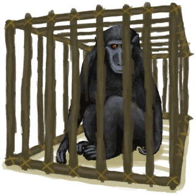

# 啊！！！！  
> 你的猕猴咬了你！它可能压力太大了！  
  
<table class="table table-bordered"><tbody><tr ><td  style="width:80%;text-align:left;vertical-align:top;" ></td><td  style="width:20%;text-align:left;vertical-align:top;" >

</td></tr></tbody></tbody></table>  
  
## 获取来源  
<table class="table table-bordered"><thead><tr ><th  style="text-align:left;vertical-align:top;" >来源</th><th  style="text-align:left;vertical-align:top;" >操作</th></tr></thead><tr ><td  style="text-align:left;vertical-align:top;" >[

[中陷阱的猕猴](CageTrapMacaque.md)](CageTrapMacaque.md)</td><td  style="text-align:left;vertical-align:top;" >抚摸</td></tr><tr ><td  style="text-align:left;vertical-align:top;" >[

[中陷阱的猕猴](CageTrapMacaque.md)](CageTrapMacaque.md)</td><td  style="text-align:left;vertical-align:top;" >喂食 ** 拖入：**[鱼片](FishSlices.md) , [烤鱼片](FishSlicesCooked.md) , [虾](Prawns.md) , [烤虾](PrawnsCooked.md) , [鱼杂](FishScraps.md) , [烤鱼杂](FishScrapsCooked.md)</td></tr><tr ><td  style="text-align:left;vertical-align:top;" >[

[中陷阱的猕猴](CageTrapMacaque.md)](CageTrapMacaque.md)</td><td  style="text-align:left;vertical-align:top;" >喂食 ** 拖入：**[“饲料”](tag_Feed.md)</td></tr><tr ><td  style="text-align:left;vertical-align:top;" >[

[猕猴朋友](MacaqueFriend.md)](MacaqueFriend.md)</td><td  style="text-align:left;vertical-align:top;" >抚摸</td></tr><tr ><td  style="text-align:left;vertical-align:top;" >[

[猕猴朋友](MacaqueFriend.md)](MacaqueFriend.md)</td><td  style="text-align:left;vertical-align:top;" >喂食 ** 拖入：**[鱼片](FishSlices.md) , [烤鱼片](FishSlicesCooked.md) , [虾](Prawns.md) , [烤虾](PrawnsCooked.md) , [鱼杂](FishScraps.md) , [烤鱼杂](FishScrapsCooked.md)</td></tr><tr ><td  style="text-align:left;vertical-align:top;" >[

[猕猴朋友](MacaqueFriend.md)](MacaqueFriend.md)</td><td  style="text-align:left;vertical-align:top;" >喂食 ** 拖入：**[“饲料”](tag_Feed.md)</td></tr><tr ><td  style="text-align:left;vertical-align:top;" >[

[猕猴朋友](MacaqueFriend.md)](MacaqueFriend.md)</td><td  style="text-align:left;vertical-align:top;" >转化</td></tr><tr ><td  style="text-align:left;vertical-align:top;" >[

[受伤的猕猴](MacaqueWounded.md)](MacaqueWounded.md)</td><td  style="text-align:left;vertical-align:top;" >抚摸</td></tr><tr ><td  style="text-align:left;vertical-align:top;" >[

[受伤的猕猴](MacaqueWounded.md)](MacaqueWounded.md)</td><td  style="text-align:left;vertical-align:top;" >喂食 ** 拖入：**[鱼片](FishSlices.md) , [烤鱼片](FishSlicesCooked.md) , [虾](Prawns.md) , [烤虾](PrawnsCooked.md) , [鱼杂](FishScraps.md) , [烤鱼杂](FishScrapsCooked.md)</td></tr><tr ><td  style="text-align:left;vertical-align:top;" >[

[受伤的猕猴](MacaqueWounded.md)](MacaqueWounded.md)</td><td  style="text-align:left;vertical-align:top;" >喂食 ** 拖入：**[“饲料”](tag_Feed.md)</td></tr></tbody></table>  
  
## 动作  
<table class="table table-bordered"><thead><tr ><th  style="text-align:left;vertical-align:top;" >动作</th><th  style="text-align:left;vertical-align:top;" >耗时</th><th  style="text-align:left;vertical-align:top;" >条件</th><th  style="text-align:left;vertical-align:top;" >变化</th><th  style="text-align:left;vertical-align:top;" >状态</th></tr></thead><tr ><td  style="text-align:left;vertical-align:top;" >继续 </td><td  style="text-align:left;vertical-align:top;" >15分</td><td  style="text-align:left;vertical-align:top;" ></td><td  style="text-align:left;vertical-align:top;" >** 自身：** →消失  ** 获得： ** ** [Bite]  **   [

[猕猴咬伤](W_MacaqueBite.md)](W_MacaqueBite.md)(+1) </td><td  style="text-align:left;vertical-align:top;" >[

[情绪](Morale.md)](Morale.md)-15</td></tr></tbody></table>  
  

