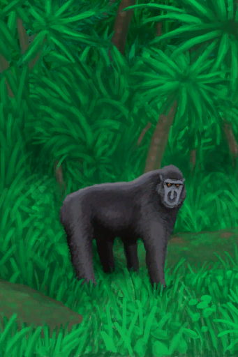

# 猕猴  
> 它带着我的一些东西逃走了……  
  
<table class="table table-bordered"><tbody><tr ><td  style="width:80%;text-align:left;vertical-align:top;" ></td><td  style="width:20%;text-align:left;vertical-align:top;" >

</td></tr></tbody></tbody></table>  
  
## 获取来源  
<table class="table table-bordered"><thead><tr ><th  style="text-align:left;vertical-align:top;" >来源</th><th  style="text-align:left;vertical-align:top;" >操作</th></tr></thead><tr ><td  style="text-align:left;vertical-align:top;" >[

[一只猕猴！(事件)](Event_MacaqueFightRaid.md)](Event_MacaqueFightRaid.md)</td><td  style="text-align:left;vertical-align:top;" >用长矛攻击！</td></tr><tr ><td  style="text-align:left;vertical-align:top;" >[

[一只猕猴！(事件)](Event_MacaqueFightRaid.md)](Event_MacaqueFightRaid.md)</td><td  style="text-align:left;vertical-align:top;" >用弓箭攻击！</td></tr><tr ><td  style="text-align:left;vertical-align:top;" >[

[一只猕猴！(事件)](Event_MacaqueFightRaid.md)](Event_MacaqueFightRaid.md)</td><td  style="text-align:left;vertical-align:top;" >用枪攻击！</td></tr><tr ><td  style="text-align:left;vertical-align:top;" >[

[一只猕猴！(事件)](Event_MacaqueFightRaid.md)](Event_MacaqueFightRaid.md)</td><td  style="text-align:left;vertical-align:top;" >用投石索攻击！</td></tr><tr ><td  style="text-align:left;vertical-align:top;" >[

[一只猕猴！(事件)](Event_MacaqueFightRaid.md)](Event_MacaqueFightRaid.md)</td><td  style="text-align:left;vertical-align:top;" >撤退</td></tr><tr ><td  style="text-align:left;vertical-align:top;" >[

[一只猕猴！(事件)](Event_MacaqueRaid.md)](Event_MacaqueRaid.md)</td><td  style="text-align:left;vertical-align:top;" >随它吧</td></tr></tbody></table>  
  
## 动作  
<table class="table table-bordered"><thead><tr ><th  style="text-align:left;vertical-align:top;" >动作</th><th  style="text-align:left;vertical-align:top;" >耗时</th><th  style="text-align:left;vertical-align:top;" >条件</th><th  style="text-align:left;vertical-align:top;" >变化</th><th  style="text-align:left;vertical-align:top;" >状态</th></tr></thead><tr ><td  style="text-align:left;vertical-align:top;" >无能为力地看着…… </td><td  style="text-align:left;vertical-align:top;" >15分</td><td  style="text-align:left;vertical-align:top;" ></td><td  style="text-align:left;vertical-align:top;" >** 自身：** →消失  ** 相关卡牌 ** [“饲料”](tag_Feed.md) ** 相关卡牌 ** [简易箭矢](ArrowSimple.md) [背包](BackpackTourist.md) [香蕉](Banana.md) [军用皮带](BeltMilitary.md) [扫帚](Broom.md) [蜡烛(关)](CandleOff.md) [水壶](Canteen.md) [椰子凉鞋](CoconutSandals.md) [布](Cloth.md) [大块的布](ClothLarge.md) [布片](ClothSmall.md) [钓鱼线](FishingLineRustic.md) [钓鱼线（已添加诱饵）](FishingLineRusticBait.md) [钓鱼线](FishingLine.md) [钓鱼线（已添加诱饵）](FishingLineBait.md) [人字拖](Flipflops.md) [鲜花项链](FlowerNecklace.md) [抗生素](Antibiotics.md) [泻立停](AntiDiarrhoeaPills.md) [眼镜](Glasses.md) [枪](Gun.md) [空的手枪](GunEmpty.md) [手钻](HandDrill.md) [弓钻](BowDrill.md) [骨刀](KnifeBone.md) [铜刀](KnifeCopper.md) [钝刀](KnifeCopperBlunt.md) [军刀](KnifeMilitary.md) [钝刀](KnifeMilitaryBlunt.md) [废金属刀](KnifeScrap.md) [金属废料](MetalScrap.md) [止痛药](Painkillers.md) [手机(关)](PhoneOff.md) [手机(开)](PhoneOn.md) [手机](PhoneOnLight.md) [塑料瓶](PlasticBottle.md) [塑料瓶(满)](PlasticBottleFull.md) [茉莉花(塑料瓶)](PlasticBottleJasmine.md) [箭筒](Quiver.md) [安全刀](SafetyKnife.md) [挎包](Satchel.md) [投石索](Sling.md) [矛头](SpearHead.md) [钝矛头](SpearHeadBlunt.md) [纺锤](Spindle.md) [缠好的纺锤](SpindleFiber.md) [净水片](WaterPurificationTablets.md) [水袋](Waterskin.md) [线团](YarnFiber.md) [珍珠](Pearl.md) [珍珠项链](PearlNecklace.md) ** 相关卡牌 ** [“腿部（内层）”](tag_Clothing.md) [“装饰品”](tag_Decoration.md) [“美丽的/好看的”](tag_Pretty.md)</td><td  style="text-align:left;vertical-align:top;" >[猕猴种群数量](Pop_Macaque.md)+250 [害怕猕猴](MacaqueFear.md)-250</td></tr></tbody></table>  
  

